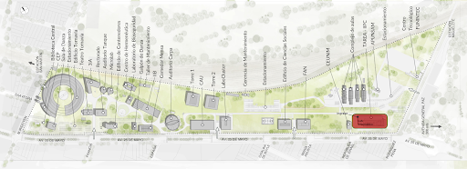
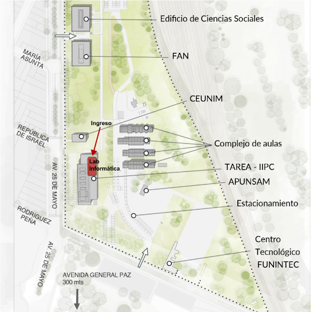

* Visiten el siguiente enlace para saber como llegar: [UNSAM: Como llegar](https://www.unsam.edu.ar/home/como_llegar.php)

## Lugar

* La materia se dicta de manera presencial en el Laboratorio 2 de Informática del Aula TAREA - IIPC.

{ data-description="Campus Migueletes", width="600" } 

## Como ingresar

El ingreso es por donde se marca, al final del camino interno del campus, frente del complejo de aulas (Aulario). 

{ data-description="Aula", width="600" } 
