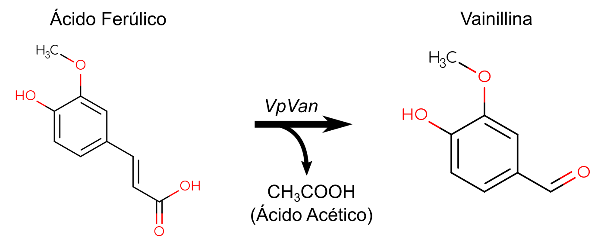

{ width="250", align="left" }

# **TP 2**. EMBOSS { markdown data-toc-label='TP 2' }

<br>

[:fontawesome-solid-download: Materiales](https://drive.google.com/file/d/15-HiP0T4f1VLRJyqKi3hkoxT3VUXh9Fs/view?usp=sharing){ .md-button .md-button--primary }
<!--
Este es el botón para decargar materiales, en (#) hay que agregar el link correspondiente.
-->

### Slides mostrados en la clase

* :fontawesome-regular-file-pdf: [Cierre TP](https://drive.google.com/file/d/1-9Yxt8fzUcKjwVFqeLa7aYE4_siGU6vU/view?usp=sharing)

### Videos de la clase grabada

* :octicons-video-16: [Introducción al TP](https://www.youtube.com/watch?v=Kx1LzcTHCpw)
* :octicons-video-16: [Cierre TP](https://www.youtube.com/watch?v=bULActJNfWU)

### Software a usar
* EMBOSS (ya instalado en la VM).

<!--
### Recursos Online
-->

### Objetivos

* Familiarizarse con el uso de herramientas bioinformáticas por línea de comandos.
* Familiarizarse con los formatos característicos de datos biológicos.
* Practicar conceptos aprendidos en el TP 1.

## **Introduccion al Tema**

[EMBOSS](http://emboss.sourceforge.net/) es una suite bioinformática creada y mantenida por [EMBnet](https://www.embnet.org/) que incluye una multitud de herramientas elementales en biología molecular y genética. Algunas ventajas de EMBOSS son:

* Maneja información biológica en varios formatos para realizar distintos tipos de tareas.
* Es muy rápida, lo cual significa que es computacionalmente escalable.
* Si bien cada uno de sus programas individuales podrían ser reemplazados por otros softwares o un script propio, EMBOSS agrupa todos estos programas en un solo paquete y le provee al usuario una interfaz unificada para todas las aplicaciones.

A continuación se encuentra una lista de 256 programas que contiene EMBOSS y un resumen corto de lo que hace cada uno:

??? info "Programas de EMBOSS"

    | Program name { data-sort-method='none' } | Description { data-sort-method='none' } |
    | :--- | :--- |
    | aaindexextract | Extract amino acid property data from AAINDEX |
    | abiview | Display the trace in an ABI sequencer file |
    | acdc | Test an application ACD file |
    | acdpretty | Correctly reformat an application ACD file |
    | acdtable | Generate an HTML table of parameters from an application ACD file |
    | acdtrace | Trace processing of an application ACD file (for testing) |
    | acdvalid | Validate an application ACD file |
    | aligncopy | Read and write alignments |
    | aligncopypair | Read and write pairs from alignments |
    | antigenic | Find antigenic sites in proteins |
    | assemblyget | Get assembly of sequence reads |
    | backtranambig | Back-translate a protein sequence to ambiguous nucleotide sequence |
    | backtranseq | Back-translate a protein sequence to a nucleotide sequence |
    | banana | Plot bending and curvature data for B-DNA |
    | biosed | Replace or delete sequence sections |
    | btwisted | Calculate the twisting in a B-DNA sequence |
    | cachedas | Generate server cache file for DAS servers or for the DAS registry |
    | cachedbfetch | Generate server cache file for Dbfetch/WSDbfetch data sources |
    | cacheebeyesearch | Generate server cache file for EB-eye search domains |
    | cacheensembl | Generate server cache file for an Ensembl server |
    | cai | Calculate codon adaptation index |
    | chaos | Draw a chaos game representation plot for a nucleotide sequence |
    | charge | Draw a protein charge plot |
    | checktrans | Report STOP codons and ORF statistics of a protein |
    | chips | Calculate Nc codon usage statistic |
    | cirdna | Draw circular map of DNA constructs |
    | codcmp | Codon usage table comparison |
    | codcopy | Copy and reformat a codon usage table |
    | coderet | Extract CDS, mRNA and translations from feature tables |
    | compseq | Calculate the composition of unique words in sequences |
    | cons | Create a consensus sequence from a multiple alignment |
    | consambig | Create an ambiguous consensus sequence from a multiple alignment |
    | cpgplot | Identify and plot CpG islands in nucleotide sequence(s) |
    | cpgreport | Identify and report CpG-rich regions in nucleotide sequence(s) |
    | cusp | Create a codon usage table from nucleotide sequence(s) |
    | cutgextract | Extract codon usage tables from CUTG database |
    | cutseq | Remove a section from a sequence |
    | dan | Calculate nucleic acid melting temperature |
    | dbiblast | Index a BLAST database |
    | dbifasta | Index a fasta file database |
    | dbiflat | Index a flat file database |
    | dbigcg | Index a GCG formatted database |
    | dbtell | Display information about a public database |
    | dbxcompress | Compress an uncompressed dbx index |
    | dbxedam | Index the EDAM ontology using b+tree indices |
    | dbxfasta | Index a fasta file database using b+tree indices |
    | dbxflat | Index a flat file database using b+tree indices |
    | dbxgcg | Index a GCG formatted database using b+tree indices |
    | dbxobo | Index an obo ontology using b+tree indices |
    | dbxreport | Validate index and report internals for dbx databases |
    | dbxresource | Index a data resource catalogue using b+tree indices |
    | dbxstat | Dump statistics for dbx databases |
    | dbxtax | Index NCBI taxonomy using b+tree indices |
    | dbxuncompress | Uncompress a compressed dbx index |
    | degapseq | Remove non-alphabetic (e.g. gap) characters from sequences |
    | density | Draw a nucleic acid density plot |
    | descseq | Alter the name or description of a sequence |
    | diffseq | Compare and report features of two similar sequences |
    | distmat | Create a distance matrix from a multiple sequence alignment |
    | dotmatcher | Draw a threshold dotplot of two sequences |
    | dotpath | Draw a non-overlapping wordmatch dotplot of two sequences |
    | dottup | Display a wordmatch dotplot of two sequences |
    | dreg | Regular expression search of nucleotide sequence(s) |
    | drfinddata | Find public databases by data type |
    | drfindformat | Find public databases by format |
    | drfindid | Find public databases by identifier |
    | drfindresource | Find public databases by resource |
    | drget | Get data resource entries |
    | drtext | Get data resource entries complete text |
    | edamdef | Find EDAM ontology terms by definition |
    | edamhasinput | Find EDAM ontology terms by has_input relation |
    | edamhasoutput | Find EDAM ontology terms by has_output relation |
    | edamisformat | Find EDAM ontology terms by is_format_of relation |
    | edamisid | Find EDAM ontology terms by is_identifier_of relation |
    | edamname | Find EDAM ontology terms by name |
    | edialign | Local multiple alignment of sequences |
    | einverted | Find inverted repeats in nucleotide sequences |
    | embossdata | Find and retrieve EMBOSS data files |
    | embossupdate | Checks for more recent updates to EMBOSS |
    | embossversion | Report the current EMBOSS version number |
    | emma | Multiple sequence alignment (ClustalW wrapper) |
    | emowse | Search protein sequences by digest fragment molecular weight |
    | entret | Retrieve sequence entries from flatfile databases and files |
    | epestfind | Find PEST motifs as potential proteolytic cleavage sites |
    | eprimer3 | Pick PCR primers and hybridization oligos |
    | eprimer32 | Pick PCR primers and hybridization oligos |
    | equicktandem | Find tandem repeats in nucleotide sequences |
    | est2genome | Align EST sequences to genomic DNA sequence |
    | etandem | Find tandem repeats in a nucleotide sequence |
    | extractalign | Extract regions from a sequence alignment |
    | extractfeat | Extract features from sequence(s) |
    | extractseq | Extract regions from a sequence |
    | featcopy | Read and write a feature table |
    | featmerge | Merge two overlapping feature tables |
    | featreport | Read and write a feature table |
    | feattext | Return a feature table original text |
    | findkm | Calculate and plot enzyme reaction data |
    | freak | Generate residue/base frequency table or plot |
    | fuzznuc | Search for patterns in nucleotide sequences |
    | fuzzpro | Search for patterns in protein sequences |
    | fuzztran | Search for patterns in protein sequences (translated) |
    | garnier | Predict protein secondary structure using GOR method |
    | geecee | Calculate fractional GC content of nucleic acid sequences |
    | getorf | Find and extract open reading frames (ORFs) |
    | godef | Find GO ontology terms by definition |
    | goname | Find GO ontology terms by name |
    | helixturnhelix | Identify nucleic acid-binding motifs in protein sequences |
    | hmoment | Calculate and plot hydrophobic moment for protein sequence(s) |
    | iep | Calculate the isoelectric point of proteins |
    | infoalign | Display basic information about a multiple sequence alignment |
    | infoassembly | Display information about assemblies |
    | infobase | Return information on a given nucleotide base |
    | inforesidue | Return information on a given amino acid residue |
    | infoseq | Display basic information about sequences |
    | isochore | Plot isochores in DNA sequences |
    | jaspextract | Extract data from JASPAR |
    | jaspscan | Scan DNA sequences for transcription factors |
    | lindna | Draw linear maps of DNA constructs |
    | listor | Write a list file of the logical OR of two sets of sequences |
    | makenucseq | Create random nucleotide sequences |
    | makeprotseq | Create random protein sequences |
    | marscan | Find matrix/scaffold recognition (MRS) signatures in DNA sequences |
    | maskambignuc | Mask all ambiguity characters in nucleotide sequences with N |
    | maskambigprot | Mask all ambiguity characters in protein sequences with X |
    | maskfeat | Write a sequence with masked features |
    | maskseq | Write a sequence with masked regions |
    | matcher | Waterman-Eggert local alignment of two sequences |
    | megamerger | Merge two large overlapping DNA sequences |
    | merger | Merge two overlapping sequences |
    | msbar | Mutate a sequence |
    | mwcontam | Find weights common to multiple molecular weights files |
    | mwfilter | Filter noisy data from molecular weights file |
    | needle | Needleman-Wunsch global alignment of two sequences |
    | needleall | Many-to-many pairwise alignments of two sequence sets |
    | newcpgreport | Identify CpG islands in nucleotide sequence(s) |
    | newcpgseek | Identify and report CpG-rich regions in nucleotide sequence(s) |
    | newseq | Create a sequence file from a typed-in sequence |
    | nohtml | Remove mark-up (e.g. HTML tags) from an ASCII text file |
    | noreturn | Remove carriage return from ASCII files |
    | nospace | Remove whitespace from an ASCII text file |
    | notab | Replace tabs with spaces in an ASCII text file |
    | notseq | Write to file a subset of an input stream of sequences |
    | nthseq | Write to file a single sequence from an input stream of sequences |
    | nthseqset | Read and write (return) one set of sequences from many |
    | octanol | Draw a White-Wimley protein hydropathy plot |
    | oddcomp | Identify proteins with specified sequence word composition |
    | ontocount | Count ontology term(s) |
    | ontoget | Get ontology term(s) |
    | ontogetcommon | Get common ancestor for terms |
    | ontogetdown | Get ontology term(s) by parent id |
    | ontogetobsolete | Get ontology ontology terms |
    | ontogetroot | Get ontology root terms by child identifier |
    | ontogetsibs | Get ontology term(s) by id with common parent |
    | ontogetup | Get ontology term(s) by id of child |
    | ontoisobsolete | Report whether an ontology term id is obsolete |
    | ontotext | Get ontology term(s) original full text |
    | palindrome | Find inverted repeats in nucleotide sequence(s) |
    | pasteseq | Insert one sequence into another |
    | patmatdb | Search protein sequences with a sequence motif |
    | patmatmotifs | Scan a protein sequence with motifs from the PROSITE database |
    | pepcoil | Predict coiled coil regions in protein sequences |
    | pepdigest | Report on protein proteolytic enzyme or reagent cleavage sites |
    | pepinfo | Plot amino acid properties of a protein sequence in parallel |
    | pepnet | Draw a helical net for a protein sequence |
    | pepstats | Calculate statistics of protein properties |
    | pepwheel | Draw a helical wheel diagram for a protein sequence |
    | pepwindow | Draw a hydropathy plot for a protein sequence |
    | pepwindowall | Draw Kyte-Doolittle hydropathy plot for a protein alignment |
    | plotcon | Plot conservation of a sequence alignment |
    | plotorf | Plot potential open reading frames in a nucleotide sequence |
    | polydot | Draw dotplots for all-against-all comparison of a sequence set |
    | preg | Regular expression search of protein sequence(s) |
    | prettyplot | Draw a sequence alignment with pretty formatting |
    | prettyseq | Write a nucleotide sequence and its translation to file |
    | primersearch | Search DNA sequences for matches with primer pairs |
    | printsextract | Extract data from PRINTS database for use by pscan |
    | profit | Scan one or more sequences with a simple frequency matrix |
    | prophecy | Create frequency matrix or profile from a multiple alignment |
    | prophet | Scan one or more sequences with a Gribskov or Henikoff profile |
    | prosextract | Process the PROSITE motif database for use by patmatmotifs |
    | pscan | Scan protein sequence(s) with fingerprints from the PRINTS database |
    | psiphi | Calculates phi and psi torsion angles from protein coordinates |
    | rebaseextract | Process the REBASE database for use by restriction enzyme applications |
    | recoder | Find restriction sites to remove (mutate) with no translation change |
    | redata | Retrieve information from REBASE restriction enzyme database |
    | refseqget | Get reference sequence |
    | remap | Display restriction enzyme binding sites in a nucleotide sequence |
    | restover | Find restriction enzymes producing a specific overhang |
    | restrict | Report restriction enzyme cleavage sites in a nucleotide sequence |
    | revseq | Reverse and complement a nucleotide sequence |
    | seealso | Find programs with similar function to a specified program |
    | seqcount | Read and count sequences |
    | seqmatchall | All-against-all word comparison of a sequence set |
    | seqret | Read and write (return) sequences |
    | seqretsetall | Read and write (return) many sets of sequences |
    | seqretsplit | Read sequences and write them to individual files |
    | seqxref | Retrieve all database cross-references for a sequence entry |
    | seqxrefget | Retrieve all cross-referenced data for a sequence entry |
    | servertell | Display information about a public server |
    | showalign | Display a multiple sequence alignment in pretty format |
    | showdb | Display information on configured databases |
    | showfeat | Display features of a sequence in pretty format |
    | showorf | Display a nucleotide sequence and translation in pretty format |
    | showpep | Display protein sequences with features in pretty format |
    | showseq | Display sequences with features in pretty format |
    | showserver | Display information on configured servers |
    | shuffleseq | Shuffle a set of sequences maintaining composition |
    | sigcleave | Report on signal cleavage sites in a protein sequence |
    | silent | Find restriction sites to insert (mutate) with no translation change |
    | sirna | Find siRNA duplexes in mRNA |
    | sixpack | Display a DNA sequence with 6-frame translation and ORFs |
    | sizeseq | Sort sequences by size |
    | skipredundant | Remove redundant sequences from an input set |
    | skipseq | Read and write (return) sequences, skipping first few |
    | splitsource | Split sequence(s) into original source sequences |
    | splitter | Split sequence(s) into smaller sequences |
    | stretcher | Needleman-Wunsch rapid global alignment of two sequences |
    | stssearch | Search a DNA database for matches with a set of STS primers |
    | supermatcher | Calculate approximate local pair-wise alignments of larger sequences |
    | syco | Draw synonymous codon usage statistic plot for a nucleotide sequence |
    | taxget | Get taxon(s) |
    | taxgetdown | Get descendants of taxon(s) |
    | taxgetrank | Get parents of taxon(s) |
    | taxgetspecies | Get all species under taxon(s) |
    | taxgetup | Get parents of taxon(s) |
    | tcode | Identify protein-coding regions using Fickett TESTCODE statistic |
    | textget | Get text data entries |
    | textsearch | Search the textual description of sequence(s) |
    | tfextract | Process TRANSFAC transcription factor database for use by tfscan |
    | tfm | Display full documentation for an application |
    | tfscan | Identify transcription factor binding sites in DNA sequences |
    | tmap | Predict and plot transmembrane segments in protein sequences |
    | tranalign | Generate an alignment of nucleic coding regions from aligned proteins |
    | transeq | Translate nucleic acid sequences |
    | trimest | Remove poly-A tails from nucleotide sequences |
    | trimseq | Remove unwanted characters from start and end of sequence(s) |
    | trimspace | Remove extra whitespace from an ASCII text file |
    | twofeat | Find neighbouring pairs of features in sequence(s) |
    | union | Concatenate multiple sequences into a single sequence |
    | urlget | Get URLs of data resources |
    | variationget | Get sequence variations |
    | vectorstrip | Remove vectors from the ends of nucleotide sequence(s) |
    | water | Smith-Waterman local alignment of sequences |
    | whichdb | Search all sequence databases for an entry and retrieve it |
    | wobble | Plot third base position variability in a nucleotide sequence |
    | wordcount | Count and extract unique words in molecular sequence(s) |
    | wordfinder | Match large sequences against one or more other sequences |
    | wordmatch | Find regions of identity (exact matches) of two sequences |
    | wossdata | Find programs by EDAM data |
    | wossinput | Find programs by EDAM input data |
    | wossname | Find programs by keywords in their short description |
    | wossoperation | Find programs by EDAM operation |
    | wossoutput | Find programs by EDAM output data |
    | wossparam | Find programs by EDAM parameter |
    | wosstopic | Find programs by EDAM topic |
    | yank | Add a sequence reference (a full USA) to a list file |

Como obviamente es imposible acordarse de todos estos programas, EMBOSS tiene un comando llamado `wossname` que permite listar comandos que tengan cierta palabra en su descripción (en inglés). Abran la consola y prueben correr:

```bash
wossname dna
```

Por otro lado, una vez que encuentran un programa que les interesa pueden leer detalladamente como funciona usando el comando `tfm` (*The Funny? Full? Manual*). Por ejemplo pueden ejecutar:

```bash
tfm jaspscan
```

El texto que aparece funciona similar al comando `less` que vimos en el TP 1, donde ++space++ pasa a la próxima página y apretando ++q++ deja de leerlo.

Como mencionamos antes es posible hacer bioinformática sin usar EMBOSS, ya sea porque queremos controlar hasta el último detalle que hace nuestro programa, porque queremos agregar alguna opción que EMBOSS no tiene, o simplemente porque era una tarea simple y no queríamos aprender a usar un programa de EMBOSS para hacerla. Son todas razones válidas. Lo que queremos que se lleven hoy es que EMBOSS existe y que puede hacer algunas tareas que les van a resultar útiles en el día a día de hacer bioinformática.

??? warning "Si no estan usando la Maquina Virtual de Introducción a la Bioinformática lean esto:"

    EMBOSS y su documentación está ya instalado en la máquina virtual que les pasamos. Si no estas usando la máquina virtual tenes que instalarlo usando:

    ```bash
    sudo apt-get install emboss emboss-data emboss-doc 
    ```

## **Aplicaciones en Biotecnología**

En el TP de hoy vamos a familiarizarnos con EMBOSS y algunas herramientas del paquete, aplicándolas al diseño de una estrategia de clonado, puntualmente para diseñar/optimizar proteínas para expresión recombinante heteróloga.

En los últimos años se ha simplificado considerablemente la ejecución del proceso de clonado/expresión. Esto se debe a la aparición de múltiples herramientas de Ingenieria Genética y a la posibilidad de sintetizar largas secuencias de ácidos nucleicos *in vitro*, lo que quita el peso de levantar un gen de interés o el riesgo de meter errores durante la PCR que ejecutamos para hacerlo.

Una de las industrias biotecnológicas más antigua es la industria alimenticia. Centenares de microorganismos distintos y decenas de enzimas son utilizados en esta industria para distintos procesos. Algunos de estos procesos son muy complejos, como la fermentación de un vino, mientras que otros son simples y puntuales, como la degradación de lactosa en productos lácteos para personas intolerantes a este azúcar. Los procesos enzimáticos simples pueden resolverse fácilmente mediante la producción de la enzima de interés en forma heteróloga.

Con el fin de dar rienda suelta a nuestro emprendedor interior, montaremos las bases de una empresa biotecnológica: vamos a producir enzimas. La primera enzima que queremos producir es la **VpVan**, la cual es la encargada de convertir el ácido ferúlico en **vanillina**. La **vainillina** es un compuesto de alto interés económico debido a su uso como saborizante (a que no adivinan que sabor tiene).

<figure markdown>
{ width="800" }
</figure>

### Archivos FASTA

Esta enzima ha sido aislada (y secuenciada) a partir de *Vanilla planifolia*. Encontrarán la secuencia correspondiente entre sus materiales de trabajo (**VpVAN.fasta**) y más información sobre el descubrimiento en este [paper](https://www.ncbi.nlm.nih.gov/pmc/articles/PMC4083428/).

Por si no lo saben o no lo recuerdan, el formato **FASTA** es la forma más usada para trabajar secuencias biológicas (ADN, ARN, aminoácidos) en forma digital. Son archivos de texto plano, donde se asume un formato muy sencillo de interpretar para el ojo humano:


Un archivo FASTA tiene dos elementos importantes:

* **Header**: Está indicado con un **>** . Es la línea con el nombre o identificador de la secuencia. Puede contener información adicional como alguna descripción extra sobre la secuencia, tal como las condiciones en que fue obtenida u otra descripción opcional.
* **Secuencia**: El resto de las líneas que continúan contienen la secuencia propiamente dicha. El largo de cada fila de la secuencia no significa nada; una secuencia de 800 aminoácidos puede ser escrita en una sola línea de 800 aminoácidos o en 10 líneas de 80 aminoácidos cada una. La secuencia sigue hasta el próximo **>** o hasta el final del archivo, lo que pase primero.

!!! info
    
    Cuando un FASTA tiene más de una secuencia se lo denomina **multiFASTA**. En los archivos multiFASTA cada secuencia tiene su header y su secuencia propiamente dicha.

### Repaso biológico

Nuestro objetivo en esta guía va a ser diseñar una secuencia de ADN sintético que:

* Exprese *VpVan*
* Tenga sitios de corte para enzimas de restricción para que pueda ser insertado en un plásmido o vector de expresión de un organismo huésped. En este caso, dichos sitios de corte van a pertenecer a diferentes enzimas de restricción para facilitar la inserción del gen en el sentido correcto
* Marque a *VpVan* de alguna forma para facilitar su posterior purificación

A continuación vamos a dar una versión **super** resumida de los conceptos anteriores. Si ya saben como funciona todo lo mencionado pueden ir a la próxima sección (**Bases del experimento**).

??? info "Repaso biológico - Plásmidos"

    #### Plásmidos

    Los plásmidos son moléculas de ADN de forma circular presentes principalmente en bacterias, arqueas y levaduras. Estas moléculas se encuentran fuera de los cromosomas y se replican de manera autónoma. 

    Debido a estas características, es posible generar plásmidos artificiales con el objetivo de amplificar (*vector de clonación*) o de expresar (*vector de expresión*) un gen de interés. Esto generalmente se realiza cuando la expresión de dicho gen en su organismo original no es factible, ya sea por problemas de volumen, logística o ética.

    <figure markdown>
    
    </figure>

    Los principales componentes de vector de expresión son:

    * **Origen de la replicación:** punto inicial para la replicación del plásmido
    * **Gen de resistencia a antibióticos:** gen que se expresa y da resistencia al organismo huésped, permite quedarnos solo con los organismos que tienen el plásmido dentro de ellos
    * **Promotor:** controla la transcripción de una determinada secuencia (en este caso el gen insertado)
    * **Sitio de restricción:** secuencia que es cortada por una enzima de restricción y donde será insertado el gen de interés (más de esto a continuación)

??? info "Repaso biológico - Enzimas de Restricción"

    #### Enzimas de Restricción

    Las enzimas de restricción son proteínas que reconocen una secuencia específica de nucleótidos dentro de una molécula de ADN y cortan el ADN en ese punto en concreto o en un punto cercano. A esas secuencias de ADN se las denomina sitios de restricción y tienen entre cuatro a seis pares de bases.

    Hay dos grandes grupos de enzimas de restricción, aquellas que dejan extremos cohesivos y aquellas que dejan extremos romos:

    <figure markdown>
    { width="600" }
    </figure>

    Al momento de insertar genes en plásmidos se usan generalmente enzimas de restricción que dejan extremos cohesivos ya que facilitan la inserción del gen debido a su especificidad y a que pueden volverse a unir espontaneamente.

    La idea detrás de su uso es colocar un sitio de restricción en el plásmido y colocar el mismo sitio de restricción a cada lado del gen de interés (en el ADN que uno sintetiza). Luego los plásmidos vacios se colocan en una solución con el ADN sintético y se les agrega la enzima de restricción correspondiente que va a cortar el ADN dejando los extremos cohesivos en cada sitio de restricción. 

    <figure markdown>
    { width="600" }
    </figure>

    Como el sitio de restricción es el mismo en el plástido y en la secuencia de ADN, es posible entonces que el ADN sintético se inserté en el plásmido, ya sea espontaneamente o ayudado por una ligasa. [Esta página](https://www.khanacademy.org/science/biology/biotech-dna-technology/dna-cloning-tutorial/a/restriction-enzymes-dna-ligase) tiene muy buenos esquemas sobre el proceso.

    En el experimento anterior, luego de cortar el sitio de restricción con la enzima, pueden pasar tres cosas: 

    * El plásmido se vuelve a cerrar sin ningun inserto :fontawesome-solid-xmark:{ .red_text }
    * Se inserta el gen de interés en la dirección correcta (respecto al promotor en el plásmido) :fontawesome-solid-check:{ .green_text }
    * Se inserta el gen de interés en la dirección contraria (respecto al promotor en el plásmido) :fontawesome-solid-xmark:{ .red_text }

     Es posible evitar el caso donde el gen se inserta en la dirección contraria combinando 2 enzimas de restricción diferentes, donde ahora va a haber 2 sitios de restricción en el plásmido (uno para cada enzima) y los dos sitios de restricción en el ADN sintético van a ser diferentes (uno para cada enzima, en el mismo orden que en el plásmido). Si bien en esta versión no es posible que el gen sea insertado en la dirección contraria, sí es posible que se vuelva a insertar el fragmento de plásmido entre los sitios de restricción, pero hay formas de controlar estos casos. Cuando usamos 2 enzimas de reestricción en esta forma decimos que estamos "clonando en forma direccional".

    !!! danger

        Es importante cuando se usan enzimas de restricción asegurarse que no haya ningún sitio de corte para las enzimas elegidas en el plásmido ni en el ADN sintético fuera de los sitios involucrados en el proceso de inserción (ya que de existir también serán cortados y la inserción fracasará).

??? info "Repaso biológico - Purificación y Tags"

    #### Purificación y Tags

    Una vez que nuestros organismos huésped tienen el vector de expresión con el gen de interés, se los deja crecer, reproducirse y expresar la proteína de interés en grandes cantidades. Una vez hecho esto, es necesario extraer esa proteína de la solución, lo que no es trivial.

    Hay varias formas de purificar proteínas y una de ellas es la cromatografía por afinidad, la cual se basa en la unión reversible entre el analito de interés (en nuestro caso la *VpVan*) y un ligando específico, inmovilizado en un soporte sólido inerte. Cuando la muestra pasa por la columna, sólo son retenidas las moléculas que se unen de manera selectiva al ligando por afinidad y las que no se unen avanzan con la fase móvil. La figura a continuación muestra un ejemplo donde se usan anticuerpos inmovilizados en una columna para purificar a la proteína roja del resto de la solución:

    <figure markdown>
    { width="400" }
    </figure>

    Uno podría asumir entonces que para poder construir estas columnas es necesario conseguir un ligando que reconozca a nuestra proteína de interés. Si bien esto es teóricamente cierto, como nosotros estamos sintetizando el ADN desde cero podemos pensar lateralmente y agregarle a nuestra proteína una secuencía aminoacídica en uno de sus extremos para la cual ya conozcamos ligandos. Estas secuencias pueden ser desde pocos aminoácidos hasta a proteínas pequeñas y son denominadas **tags**.

### Bases del experimento

Volviendo a nuestro experimento, queremos insertar el gen de *VpVan* en un vector de expresión. Nuestro **organismo huésped** es:

* *E. coli* BL21

Como queremos clonar en forma direccional tenemos que usar dos **enzimas de restricción**. Ellas son:

* BamHI
* HindIII

Al momento de purificar necesitamos agregarle un **tag** a la proteína. Vamos a probar 3 tags diferentes:

* FLAG-tag
* His-tag
* MBP-tag

Por cuestiones de practicidad, todos los tags van a estar en el C-terminal.

En los siguientes ejercicios vamos a:

* **Ejercicio 1:** Generar secuencias quiméricas *VpVan-Tag* agregando diferentes *tags* de interés a la secuencia proteíca de *VpVan*
* **Ejercicio 2:** Obtener el genoma del organismo huésped *E. coli* BL21 (necesario para el **Ejercicio 3**)
* **Ejercicio 3:** Generar una tabla de frecuencia de uso de codones del organismo huésped
* **Ejercicio 4:** Generar la secuencia nucleotídica *VpVan-Tag* con los codones optimizados para el organismo huésped
* **Ejercicio 5:** Verificar que no hayan quedado sitios de corte para nuestras enzimas de restricción dentro de la secuencia *VpVan-Tag* optimizada y luego agregar los sitios de restricción en los bordes de la secuencia

## **Ejercicio 1. Secuencias aminoacídicas VpVan-Tag** { markdown data-toc-label='Ejercicio 1 - Tags' }  

Vamos a generar las secuencias de aminoácidos quiméricas VpVan-Tag (donde Tag = FLAG/His/MBP). Para esto van a necesitar los siguientes archivos que se encuentras en sus materiales de trabajo:

* **VpVan.fasta**
* **FLAG-tag.fasta**
* **His-tag.fasta**
* **MBP-tag.fasta**

Es altamente recomendado que creen diferentes carpetas para los diferentes TPs y en algunos casos para los diferentes ejercicios (especialemente en este). El nombre y la ubicación lo pueden decidir ustedes, pero un ejemplo para este ejercicio sería **\~/Documentos/TP_02/EJ_1**. Una vez creada la carpeta para este ejercicio, muevan los cuatro archivos anteriores a dicha carpeta.

!!! tip

    Recuerden que es preferible no usar espacios al crear directorios o archivos

Nuestro objetivo ahora es crear 3 nuevos archivos FASTA que contengan las diferentes construcciones (*VpVan* + cada uno de los tags). Vamos a llamarlos **VpVan-FLAG-tag.fasta** y similar (reemplazando el nombre del tag en cada caso).

Ahora bien, como son solo 3 tags esto se podría hacer a mano copiando y pegando, pero es un buen momento para profundizar en dos conceptos que aprendimos la clase pasada: *scripts* y *ciclos*.

Creen un archivo vacio de texto en esa carpeta y llamenló **agregar_tags.sh**. Dentró del archivo pongan lo siguiente:

=== "Código"

    ``` bash
    vpvan_sequence=`cat VpVAN.fasta | grep -v ">"`
    lista_de_archivos_tags=`ls *-tag.fasta`

    for archivo_tag in $lista_de_archivos_tags
    do 
        tag_sequence=`cat $archivo_tag | grep -v ">"`

        new_header=">VpVAN-$archivo_tag"
        combined_sequence="$vpvan_sequence$tag_sequence"

        echo "$new_header" > VpVAN-$archivo_tag
        echo "$combined_sequence" >> VpVAN-$archivo_tag
    done
    ```

=== "Código con comentarios"

    ``` bash
    # Aca estamos ejecutando comandos de Linux y guardando su output en una variable
    # En estos casos hay que rodear a los comandos con ` (acento grave o comilla invertida)

    # Leemos el FASTA de VpVAN y nos quedamos solo con la secuencia
    # (estamos removiendo con grep cualquier linea que tenga >, que aca es solo el header)
    vpvan_sequence=`cat VpVAN.fasta | grep -v ">"` 

    # Creamos una lista que contiene a todos los archivos que terminan con -tag.fasta
    # (esto va a mirar solo archivos que estén en la carpeta donde se corre el script)
    lista_de_archivos_tags=`ls *-tag.fasta`

    # Este es una estructura a la que llamamos *for each* en el TP 1. Es un *for*, pero en vez de tener 
    # una cantidad determinada de ciclos, recorre cada uno de los elementos de una lista
    for archivo_tag in $lista_de_archivos_tags
    do 
        # Leemos el FASTA del tag y nos quedamos solo con la secuencia
        tag_sequence=`cat $archivo_tag | grep -v ">"`

        # Creamos una variable que almacene el nuevo header para la secuencia de VpVAN + tag
        new_header=">VpVAN-$archivo_tag"

        # Calculamos la nueva secuencia VpVAN + tag
        combined_sequence="$vpvan_sequence$tag_sequence"

        # Escribimos el nuevo header y la nueva secuencia en un nuevo archivo
        echo "$new_header" > VpVAN-$archivo_tag
        echo "$combined_sequence" >> VpVAN-$archivo_tag
    done
    ```

Como recordatorio del TP 1:

* `cat` lee archivos de texto y los escribe en la consola
* `|` desvia la salida de un programa para que funcione como entrada del siguiente
* `grep` filtra texto, quedandosé solo con aquellas líneas que contengan un texto dado (y de usar la opción `-v` se queda solo con aquellas que no lo contengan)
* `ls` lista los archivos y carpetas dentro del directorio actual
* `echo` escribe un texto por consola
* `>` desvia la salida que íria a consola hacia un archivo de texto, sobrescribiendolo
* `>>` desvia la salida que íria a consola hacia un archivo de texto, sin sobreescribirlo (agrega lineas al final)
* `for`, `in`, `do` y `done` son todas partes del ciclo *for each*. El código entre `do` y `done` se va a repetir por cada elemento en `$lista_de_archivos_tags`, donde en cada iteración la variable `$archivo_tag` toma el valor de uno de esos elementos

Hay dos cosas en este script que no vimos en el TP 1. La primera es que estamos ejecutando comandos de Bash y guardando su salida en variables. En estos casos es necesario rodear el comando con `` ` ``, llamado acento grave o comilla invertida. Por ejemplo:

```bash
variable=`comando -opciones parametro1 parametro2`
```

La segunda novedad es el uso de `*` con el comando `ls`. En todo lo que es Linux el caracter `*` funciona como comodín, tomando cualquier valor. Esto quiere decir que `ls *-tag.fasta` va a listar todos los archivos cuyos nombres terminen con **"-tag.fasta"**, sin importar como empiecen (pueden probar correr el comando `ls *-tag.fasta` a mano en la consola y ver que devuelve).
 
¿Entienden ahora lo que hace el script? Lean la pestaña **Código con comentarios** para aclarar cualquier duda que tengan sobre él (y si todavía no se entiende no duden en preguntar).

Ahora abran la consola y corran el script que acabamos de crear, generando así los nuevos 3 archivos.

!!! tip

    Recuerden que los *script* se corren con `bash ARCHIVO_SCRIPT`

¡Ya tenemos nuestras secuencias quiméricas!

!!! tip

    Este script va a dar problemas si se lo corre multiples veces. Esto se debe a que al correrlo la primera vez estamos creando más archivos que terminan con "-tag.fasta", que en una segunda corrida van a ser detectados por el `ls`. Si no quieren tener problemas con esto pueden agregar el siguiente código luego de dicho comando: `| grep -v "VpVAN"`

## **Ejercicio 2. Genoma de *E. coli*** { markdown data-toc-label='Ejercicio 2 - Genoma de E. coli' }

Nosotros queremos expresar el gen de un organismo en otro organismo. Si bien el código genético es practicamente universal, diferentes organismos pueden tener preferencia para diferentes codones que generan un mismo aminoácido. Por esta razón, al hacer expresión recombinante heteróloga es una buena idea cambiar los codones del gen de interés para que matcheen mejor con los codones que prefiere el organismo huésped (se modifica el ADN pero se sigue produciendo la misma proteína). El primer paso para realizar esta modificación es conocer cuales son los codones preferidos por dicho organismo.

* Busquen usando el comando `wossname` que programas de EMBOSS trabajan con codones (recuerden que está en inglés, asi que tienen que buscar "codon"). Lean la descripción de dichos programas, ¿cual les parece que vamos a usar para calcular la tabla de uso de codones?

    ??? info "Respuesta"

        `cusp`, cuya descripción es "Create a codon usage table from nucleotide sequence(s)"

Si leen la descripción del programa, verán que pide una secuencia de nucleótidos, es decir, que necesitamos un FASTA del genoma completo de *E. coli* (ya que éste es nuestro organismo huésped).

Un buen lugar para obtener información de genomas, genes, y proteínas es **RefSeq**, que es una colección curada de secuencias nucleotídicas y sus productos. En su FAQ (*Frequently Asked Questions*, o *preguntas frecuentes*) hay una pregunta que es básicamente lo que queremos hacer nosotros:

[How can I download RefSeq data for all complete bacterial genomes?](https://www.ncbi.nlm.nih.gov/genome/doc/ftpfaq/#allcomplete)

Si bien los comandos que ellos sugieren son un poco complejos, vamos a utilizarlos y tratar de explicarlos lo mejor posible.

!!! tip

    Antes de seguir les recomendamos crear una carpeta nueva para este ejercicio, por ejemplo **\~/Documentos/TP_02/EJ_2**.

### RefSeq - Paso 1 - Bajar y filtrar la tabla con los genomas { markdown data-toc-label='RefSeq - Paso 1' }

El primer paso indicado en el FAQ es descargar el archivo **assembly_summary.txt** y ponerlo en la carpeta de este ejercicio. Esto lo pueden hacer desde la página de **RefSeq** a mano o abriendo la consola en la carpeta de este ejercicio y corriendo:

```bash
wget ftp://ftp.ncbi.nlm.nih.gov/genomes/refseq/bacteria/assembly_summary.txt
```

!!! question

    ¿Qué piensan que hace `wget`? ¿Cómo pueden averiguarlo si no lo saben?

!!! warning

    Si el comando `wget` tarda mucho o ven que tiene errores bajensé este archivo desde [este link](https://drive.google.com/file/d/1Z96oCHg7iyHZEtbVHuvfMY0XbnSj2maJ/view?usp=sharing)

Una vez descargado ese archivo (que pesa bastante) queremos ver sus contenidos. Sabiendo que es un archivo que tiene más de 250.000 lineas:

* ¿Qué comando usarían para ver que tipo de datos tiene adentro? Pruebenlo.

Dado que es un archivo con muchas columnas, probablemente les cueste entender lo que están viendo aunque hayan usado el comando correcto.

Para entender la estructura de nuestro archivo vamos a crear un archivo temporal que tenga solo las primeras 20 filas de este archivo:

```bash
head -20 assembly_summary.txt > assembly_summary_temporal.tsv
```

Lo único que les debería llamar la atención del comando anterior es que el nuevo archivo tiene la extensión **tsv**. Esto lo mencionamos por arriba en el TP 1, pero los archivos **TSV** o "Tab-Separated Values" son archivos de texto que contienen una tabla donde sus columnas están separadas entre ellas por un ++tab++, lo cual es exactamente el caso de la tabla actual.

Hagan doble click sobre el archivo **assembly_summary_temporal.tsv**. La extensión **tsv** en nuestra máquina virtual está asociada al programa **Gnumeric** (similar a Excell o a Google Sheets). Gnumeric va a detectar automáticamente que las columnas están separadas por ++tab++.

* Identifiquen la columna correspondiente a la especie (son solo las primeras 20 filas, no van a encontrar a *E. coli*), la cepa y el link a la ubicación del genoma.

Ahora que conocen la estructura de la tabla, y sabiendo que tiene muchos mas organismos que *E. coli*, tenemos que filtrar el archivo y quedarnos solo con nuestro organismo y cepa de interés. Para esto, corran los siguientes comandos uno a la vez:

=== "Código"

    ```bash
    head -2 assembly_summary.txt > assembly_summary_coli.tsv
    grep "Escherichia coli" assembly_summary.txt | grep "BL21" >> assembly_summary_coli.tsv
    ```

=== "Código con comentarios"

    ```bash
    # Generamos un nuevo archivo con el header de la tabla (que en este caso son 2 filas)
    head -2 assembly_summary.txt > assembly_summary_coli.tsv

    # Buscamos dentro del archivo las filas que contengan "Escherichia coli" y "BL21" y 
    # las agregamos a la nuevo archivo
    grep "Escherichia coli" assembly_summary.txt | grep "BL21" >> assembly_summary_coli.tsv
    ```

### RefSeq - Paso 2 - Crear un archivo con links a las carpetas de los genomas { markdown data-toc-label='RefSeq - Paso 2' }

Ahora que tenemos y entendemos la tabla con nuestros datos de *E. coli* la podemos abrir en **Gnumeric** haciendo doble click. Van a ver que no hay solo un genoma de *E. coli* BL21, sino varios, por lo cual nuestro objetivo de crear una tabla de codones acaba de volverse un poco más complicado. Lo que vamos a hacer entonces es bajar todos los genomas de *E. coli* BL21 que vemos en la tabla, así que continuamos al segundo paso en el FAQ de **RefSeq**:

```bash
awk -F "\t" '{if ($12=="Complete Genome" && $11=="latest") {print $20}}' assembly_summary_coli.tsv > ftpdirpaths
```

Al comando `awk` lo vimos brevemente al final del TP 1 y sirve para trabajar con tablas en Bash (entre otras cosas). Las diferentes partes de este comando son:

* `-F "\t"` indica que el separador de columnas es `\t`, o sea, ++tab++
* `$12=="Complete Genome"` es una condición que filtra las filas, quedándose solo con aquellas donde la columna 12 (**assembly_level**) es "Complete Genome"
* `$11=="latest"` es una condición que filtra las filas, quedándose solo con aquellas donde la columna 11 (**version_status**) es "latest"
* `&&` se denomina *and* y une ambas condiciones, pidiendo que ambas se cumplan para que la condición total se cumpla
* `{print $20}` indica que se va a devolver la columna 20 (**ftp_path**, contiene el *path* del genoma, o sea, la carpeta)

Este comando va a crear el archivo **ftpdirpaths**, que contiene links a las carpetas que contienen los genomas.

* Investiguen cuantos links quedaron en **ftpdirpaths**. ¿Entienden por qué? Sino consulten.

### RefSeq - Paso 3 - Crear un archivo con links a los genomas { markdown data-toc-label='RefSeq - Paso 3' }

Los links que tenemos de momento tienen el formato:

!!! info ""

    ftp://ftp.ncbi.nlm.nih.gov/genomes/all/GCF/000/833/145/GCF_000833145.1_ASM83314v1

Sin embargo, estos son links a las carpetas que contienen los genomas. Siguiendo las instrucciones del FAQ de **RefSeq** podemos crear el link de los genomas, que para el ejemplo anterior sería:

!!! info ""

    ftp://ftp.ncbi.nlm.nih.gov/genomes/all/GCF/000/833/145/GCF_000833145.1_ASM83314v1/GCF_000833145.1_ASM83314v1_cds_from_genomic.fna.gz

Donde el nombre del archivo es el nombre de la última carpeta + **"\_cds_from_genomic.fna.gz"**

Los archivos terminados en **.fna.gz** son secuencias en formato FASTA (*f*) de nucleótidos (*na*) comprimidas (*gz*).

Hay varias formas de crear estos nuevos links. Nosotros lo vamos a hacer de la siguiente manera:

```bash
awk -F "/" '{print $0 "/" $10 "_cds_from_genomic.fna.gz"}' ftpdirpaths > ftpfilepaths
```

Donde:

* `-F "/"` indica que el separador de columnas es `/`. Lo que está haciendo este código es leer nuestros *paths* como si fueran tablas de varias columnas, haciendo que cada carpeta quede en su propia columna.
* `$0` parecería indicar la columna 0, pero las columnas en `awk` van de 1 en adelante (`$1`, `$2`, etc). El índice `$0` es un índice especial que devuelve toda la fila (que en este caso es todo el *path* a la carpeta del genoma).
* `$10` es la columna 10, la cual contiene el nombre del genoma (es el nombre de la última carpeta en el *path*).
* `print` va a concatenar `$0` (el *path* a la carpeta del genoma), `"/"` (una barra para separar los directorios), `$10` (la primera parte del nombre del archivo a descargar) y `"_cds_from_genomic.fna.gz"` (la segunda parte del nombre del archivo a descargar). `awk` va a hacer esto por cada fila del archivo **ftpdirpaths**.

Una vez que entienden lo que hace este comando abran la terminal y corranló.

??? info "Por si se quedaron con curiosidad de el comando que proponía el FAQ de **RefSeq**"

    El comando `awk` que sugeria el FAQ de **RefSeq** es un poco más complejo, pero llegaba al mismo resultado. Noten que en este comando el archivo tiene la extensión **.gbff.gz** que hace referencia al formato de **GenBank**, que no es el con el que vamos a trabajar. Hay que cambiarlo por **"cds_from_genomic.fna.gz"**
		
    ```bash
    awk 'BEGIN{FS=OFS="/";filesuffix="genomic.gbff.gz"}{ftpdir=$0;asm=$10;file=asm"_"filesuffix;print ftpdir,file}' ftpdirpaths > ftpfilepaths
    ```

    No es necesario que lo entiendan 100%, pero vamos a aclarar algunas cosas:

    * `BEGIN` significa que las cosas entre las primeras llaves se van a ejecutar solo una vez, y no una vez por fila (como el resto).
    * `FS` es una variable interna de `awk` que indica como se separan las columnas en la tabla a leer (es equivalente a usar `-F`). La variable `OFS` indica lo mismo, pero para la salida de `awk`. Con `FS=OFS="/"` estamos indicando que ambos serán la barra `/`. Lo que está haciendo este código es leer nuestros *paths* como si fueran tablas de varias columnas, haciendo que cada carpeta quede en su propia columna.
    * En `filesuffix="cds_from_genomic.fna.gz"` está definiendo una variable en la que va a almacenar la cadena de texto que queremos agregar al final de cada link.
    * En `ftpdir=$0` está definiendo una variable en la que parece almacenar la columna 0. Ahora bien, las columnas en `awk` van de 1 en adelante (`$1`, `$2`, etc), pero el índice `$0` es un índice especial que devuelve toda la fila (que en este caso es todo el *path* a la carpeta del genoma).
    * En `asm=$10` está definiendo una variable en la que va a almacenar la columna 10, la cual contiene el nombre del genoma (es el nombre de la última carpeta en el *path*).
    * En `file=asm"_"filesuffix` está definiendo una nueva variable como la concatenación de `asm`, un guión bajo y `filesuffix`. Este va a ser el nombre del archivo a descargar (pero todavía le falta el *path*).
    * `print ftpdir,file` va a imprimir el valor de `ftpdir` (el *path* a la carpeta del genoma) seguido por el valor de *file* (el nombre del archivo a descargar) por cada fila del archivo **ftpdirpaths**. La barra entre ambos (`/`) es agregada automaticamente debido a que declaramos `OFS="/"` al principio.

### RefSeq - Paso 4 - Descargar genomas de *E. coli* { markdown data-toc-label='RefSeq - Paso 4' }

Ya falta poco para tener nuestros genomas, solo hay que descargar todos los links que tenemos adentro del archivo **ftpfilepaths**.

Esto se puede hacer usando el comando `wget`. Ahora bien, por defecto a `wget` hay que pasarle un link de descarga como hicimos arriba, pero por suerte existe una opción que permite pasarle un archivo de entrada y que descargue todos los links que se encuentran en él.

* Usen `wget -h` (mas conciso) o `man wget` (mas extenso) para ver las diferentes opciones de `wget`, encuentren la que se usa para pasarle un archivo de entrada (o *fichero* o *input file*) con links (o *URLs*) y usen `wget` con **ftpfilepaths** para bajar todos los genomas que seleccionamos.

    !!! tip

        `wget` tiene bastantes opciones, asi que para hacerla un poco más fácil sepan que la opción que necesitan es una de las 15 primeras y está en la sección **Ficheros de registro y de entrada** (o **Logging and input file**)

Este comando puede tardar un rato en descargar todo y va a bajar 11 archivos con extensión **.fna.gz** donde **.fna** es una extensión que hace referencia a que el archivo contiene información de secuencia (similar a FASTA) y **.gz** es la extensión de los archivos comprimidos de Linux.

## **Ejercicio 3. Construir tabla de frecuencias de uso de codones** { markdown data-toc-label='Ejercicio 3 - Tablas de codones' }

Tras lo que parece una eternidad por fin tenemos nuestros genomas. Ahora es momento de usar el comando `cusp` del que hablamos al principio del ejercicio anterior para transformar nuestros genomas en tablas con frecuencias de uso de codones.

Como tenemos varios archivos **.fna.gz** vamos a tener que correr el comando `cusp` varias veces, y la mejor forma de hacer esto es creando un script con un ciclo *for each* que lo haga por nosotros. Este ciclo va a recorrer todos los archivos **.fna.gz** que acabamos de descargar, los va a descomprimir y va a ejecutar el comando `cusp` para cada uno.

* Reemplacen los **REEMPLAZAR** en el próximo código por lo que sea adecuado para conseguir nuestro objetivo:

    ```bash
    REEMPLAZAR

    for REEMPLAZAR in REEMPLAZAR
    do 
        REEMPLAZAR
    done

    ```
    Sabiendo que un **REEMPLAZAR** es:

    ```bash
    # Creamos una lista que contiene a todos los archivos que empiezan con "GCF" y terminan con ".gz"
    lista_de_archivos_genomas=`ls GCF*.gz`
    ``` 
    y otro es:

    ```bash
    # Descomprimimos el archivo ".gz" y corremos el comando *cusp* para cada $archivo_genoma de la lista
    zcat $archivo_genoma | cusp -auto -sequence "stdin" -outfile "${archivo_genoma}.cusp"
    ``` 

    * `zcat` es un comando que descomprime archivos **.gz** y devuelve su contenido por consola (similar a `cat`).
    * `-auto` hace que `cusp` use los parámetros por defecto y no nos consulte cuales usar.
    * `-sequence "stdin"` le esta diciendo a `cusp` que el genoma se lo estamos dando por la consola (mediante el pipe o `|`).
    * `-outfile "${archivo_genoma}.cusp"` define el nombre del archivo de salida de `cusp`, que en este caso es el nombre del genoma seguido de **.cusp**. Si bien las llaves no son necesarias en este caso, ayudan a entender donde termina la variable y empieza el *string*. Idealmente habria que sacarle la extensión anterior al archivo (ya que ahora va a quedar **.fna.gz.cusp**), pero ya tenemos bastante que hacer.

    !!! tip

        Si no les sale pueden ver el *for each* del **Ejercicio 1** para usarlo como base (si bien ese es más complicado)

Una vez creado el script, corranló.

??? warning "Si ven que este script tarda mucho tiempo en correr (varios minutos sin indicar que avanza) lean esto:"

    * Cancelen la corrida apretando ++ctrl+c++ en la terminal
    * Usen para la próxima seccion los archivos **ecoli_BL21_codon_table_1.cusp** y **ecoli_BL21_codon_table_2.cusp** que se encuentra en sus materiales de trabajo

### Comparar tablas de codones

Recordando nuestro objetivo, nosotros queríamos una tabla de codones de *E. coli* para saber como modificar el ADN de nuestra proteína de interés (*VpVan*) para que use aquellos codones preferidos por el organismo huésped. En este momento tenemos varias tablas de codones, asi que tenemos que elegir alguna.

Abran uno de los archivos **.cusp** que acabamos de crear y vean que información tiene:

??? tip "Si en la tabla dentro del archivo **.cusp** las columnas no están alineadas lean esto:"

    Por defecto **Leafpad** usa una fuente llamada **"Ubuntu"**, que si bien sirve para escribir cuentos, nos va a dar problemas al momento de ver ciertos archivos que vamos a usar en esta materia.

    En **Leafpad** vayan a **Opciones** :material-arrow-right: **Tipografía...**, seleccionen la fuente **"Ubuntu Mono"** y aprieten **Aceptar**.

    Las fuentes que tienen **Mono** en su nombre estan indicando que son monoespaciadas, o sea, que todos sus caracteres tienen el mismo ancho. Esto es ideal para cuando se quieren ver tablas o alineamientos con **Leafpad**, cosa que vamos a hacer bastante en esta materia.

??? info "Ayuda-memoria con aminoácidos y sus abreviaturas"

    | Full Name | Abbreviation (3 Letter) | Abbreviation (1 Letter) |
    | :--- | :--- | :--- |
    | Alanine | Ala | A |
    | Arginine | Arg | R |
    | Asparagine | Asn | N |
    | Aspartate | Asp | D |
    | Aspartate or Asparagine | Asx | B |
    | Cysteine | Cys | C |
    | Glutamate | Glu | E |
    | Glutamine | Gln | Q |
    | Glutamate or Glutamine | Glx | Z |
    | Glycine | Gly | G |
    | Histidine | His | H |
    | Isoleucine | Ile | I |
    | Leucine | Leu | L |
    | Lysine | Lys | K |
    | Methionine | Met | M |
    | Phenylalanine | Phe | F |
    | Proline | Pro | P |
    | Serine | Ser | S |
    | Threonine | Thr | T |
    | Tryptophans | Trp | W |
    | Tyrosine | Tyr | Y |
    | Valine | Val | V |

1. ¿Por qué hay más de un codón para cada aminoácido?
1. ¿Qué indica la columna **Fraction**?
1. ¿Qué indica la columna **Frequency**? (pueden encontra la respuesta usando `tfm cusp`, pero está mas claro en la [ayuda online](http://emboss.toulouse.inra.fr/cgi-bin/emboss/help/cusp))
1. Ahora abran otro archivo **.cusp**, ¿notan diferencias entre las frecuencias de uso de codones de los distintos proyectos genoma de *E.Coli* BL21?

En un principio pareceria que ambos archivos **.cusp** son bastante parecidos, pero queremos estar seguros. **EMBOSS** tiene un programa llamado `codcmp` que permite comparar tablas de codones, calculando ciertos estadísticos. El programa se usa:

```bash
codcmp ARCHIVO_CUSP_1 ARCHIVO_CUSP_2 ARCHIVO_SALIDA
```

Usen este comando para comparar los dos archivos **.cusp** que miraron previamente y guarden la comparación en un archivo llamado **cusp_comparison.out**.

Abran **cusp_comparison.out** y vean los estadísticos calculados. ¿Son compatibles estos resultados con nuestras observaciones previas de que ambos archivos **.cusp** son muy parecidos?

Hay entoces una noticia buena y una mala:

??? success "Noticia Buena"

    Todos las tablas de frecuencias de codones son casi idénticas, asi que podemos usar cualquiera de ellas y va a funcionar bien.

    * **Aclaración 1:** Los resultados de `codcmp` no alcanzan para decir que las diferencias no son "estadisticamente signficativas" (aunque en este caso es bastante obvio). En el [manual de `codcmp`](http://emboss.toulouse.inra.fr/cgi-bin/emboss/help/codcmp) dan algunas ideas para calcular esto.

    * **Aclaración 2:** Otra forma de resolver el "problema" de tener muchas tablas de codones podría haber sido calcular una nueva tabla de frecuencias de codones que sea un promedio de todas las anteriores, pero esto es un trabajo complejo y no se amerita hacerlo para este caso debido a los similar que son las diferentes tablas entre sí.

??? failure "Noticia Mala"

    Todos las tablas de frecuencias de codones son casi idénticas, asi que podríamos haber bajado solo una de ellas y ahorrarnos bastante trabajo (aunque no teníamos forma de saber esto previamente).

## **Ejercicio 4. Optimizar secuencia a insertar en base a la tabla de codones** { markdown data-toc-label='Ejercicio 4 - Optimizar ADN' }

Ya casi estamos. En este momento tenemos la tabla de frecuencia de uso de codones para *E. coli* BL21 y queremos aplicar dichos codones a las 3 secuencias quiméricas que creamos en el **Ejercicio 1**, es decir, codificar una secuencia amionacídica de planta en la forma más óptima para su traducción en *E. coli*.

Para organizar un poco los archivos volvemos a recomendar crear una carpeta para este ejercicio, por ejemplo **\~/Documentos/TP_02/EJ_4**. Dentro de la carpeta **copien** los siguientes archivos:

* **VpVAN-FLAG-tag.fasta** (creado en el Ejercicio 1)
* **VpVAN-His-tag.fasta** (creado en el Ejercicio 1)
* **VpVAN-MBP-tag.fasta** (creado en el Ejercicio 1)
* Elijan alguno de los archivos **.cusp** creados en el Ejercicio 3, copienlo a la nueva carpeta y cambienlé el nombre a **ecoli_BL21_codon_table.cusp**.

Ahora bien, para hacer esta optimización de secuencias podemos usar otro de los programas de **EMBOSS** llamado `backtranseq`. Este programa toma una secuencia de aminoácidos correspondiente a una proteína de interés y una tabla de frecuencia de uso de codones y usa ambos para hacer una traducción inversa desde la secuencia proteíca hacia la secuencia de ADN que, con mayor probabilidad, le dio origen. Es decir, `backtranseq` devuelve una secuencia de ADN a partir de una secuencia de aminoácidos. Este comando se usa:

```bash
backtranseq -auto -sequence ARCHIVO_PROTEINA_FASTA -cfile ARCHIVO_CUSP -outfile ARCHIVO_SALIDA_ADN_FASTA
```

Corran este comando 3 veces pasándole los archivos correctos y creen los siguientes archivos (si quieren pueden hacer script con un *for each*, pero no hace falta):

* **Ecoli-DNA-VpVAN-FLAG-tag.fasta**
* **Ecoli-DNA-VpVAN-His-tag.fasta**
* **Ecoli-DNA-VpVAN-MBP-tag.fasta**

!!! tip

    De hacerlo a mano, aca van a tener que ejecutar tres comandos muy similares. Recuerden que pueden usar ++arrow-up++ y ++arrow-down++ en su terminal para navegar por los ultimos comandos utilizados y modificar lo necesario, así como ++tab++ para autocompletar nombres de archivos. También puede serles útiles la tecla ++home++ (***Inicio***) y ++end++ (***Fin***) para moverse al principio o al final del comando que están editando.

## **Ejercicio 5. Agregar enzimas de restricción** { markdown data-toc-label='Ejercicio 5 - Enzimas' }

El último paso es agregar los sitios de corte de enzimas de restricción a los costados de mi secuencia quimérica, pero antes de eso tengo que asegurarme que dichas enzimas no tengan sitios de corte dentro de mi secuencia. Probablemente ya no les sorprenda que existe un programa de **EMBOSS** para hacer esto llamado `remap`; sin embargo, dicho programa necesita que previamente le hayamos pasado a **EMBOSS** una base de datos de enzimas de restricción.

En los materiales de trabajo van a encontrar dos archivos llamados **proto.207** y **withrefm.207** que contienen la información para crear la base de datos de enzimas de restricción. Copienlos a la carpeta donde estan trabajando y corran el comando:

```bash
rebaseextract -infile withrefm.207 -protofile proto.207
```

Este comando les va a tirar un error, pero no porque esté mal escrito. El problema es que este comando quiere editar archivos que no son del usuario *ibioinfo*, por lo que en un principio no tenemos permisos para editarlos. En estos casos hay que agregar el prefijo `sudo` y puede ser que Lubuntu les pida la contraseña (parece que no escribe nada, pero eso es por seguridad, si se las pide escriban "unsam" y aprieten ++enter++). Asi que corran:

```bash
sudo rebaseextract -infile withrefm.207 -protofile proto.207
```

!!! info

    Solo para que sepan, los archivos **proto.207** y **withrefm.207** se pueden descargar de [aca](ftp://ftp.neb.com/pub/rebase/) o [aca](ftp://ftp.ebi.ac.uk/pub/databases/rebase) usando `wget` (con los links anteriores van a bajar un índice general y luego tienen que pasarle a `wget` el link de los archivos que quieran). Dependiendo de cuando vayan a esa página puede ser que encuentren versiones incluso mas recientes.

Ahora que ya tenemos la base de datos configurada podemos usar `remap`, pero antes veamos un poco mas información sobre nuestras enzimas de restricción. Usando `grep` busquen dentro del archivo **proto.207** a nuestras enzimas de restricción de interés (**BamHI** y **HindIII**).

1. ¿Qué longitud tienen los sitios de restricción de **BamHI** y **HindIII**?
1. ¿Qué piensan que significa el símbolo **^** en el sitio de restricción? (pueden buscar información sobre dichas enzimas online y se van a dar cuenta enseguida)

Ahora que sabemos un poco más sobre nuestras enzimas vamos a usar el comando `remap` con las siguientes opciones:

```bash
remap -auto -sequence ARCHIVO_ADN_FASTA -width 80 -commercial -sitelen 6 -frame 1 -enzymes all -outfile ARCHIVO_SALIDA_REMAP
```

Donde:

* `-auto` hace que `remap` use los parámetros por defecto y no nos consulte cuales usar.
* `-width` indica el ancho de secuencia a mostrar en el archivo de salida.
* `-commercial` analiza solo las enzimas de restricción de uso comercial (entre las que se encuentran nuestras enzimas de interés).
* `-sitelen` indica el mínimo de longitud del sitio de restricción (como sabemos que los sitios de restricción de nuestras enzimas de interés tienen 6 aminoácidos ponemos ese número).
* `frame` indica el marco de lectura a traducir (ya que el output tambien va a dar información a nivel proteína). En nuestro caso el `frame` es 1 (estamos en la hebra codificante y hay que traducir a partir del primer nucleótido).
* `enzymes` indica los nombres de las enzimas a probar. Si bien podríamos haber puesto nuestras enzimas de interés, ponemos `all` para ver más información del output.

Corran este comando 3 veces pasándole los archivos correctos y creen los siguientes archivos:

* **enzimas_FLAG.out**
* **enzimas_His.out**
* **enzimas_MBP.out**

Una vez creados, abran los archivos con **Leafpad**. 

1. ¿Entienden lo que simboliza el archivo? (es necesario que esten usando la fuente **Ubuntu Mono** en **Leafpad** para verlo bien)
1. Busquen nuestras enzimas de restricción de interés. ¿Las encuentran? ¿En que categoría están? ¿Se pueden usar entonces estas enzimas de restricción para insertar nuestra secuencia en un plásmido?
1. ¿Hay algún tag de los tres que estabamos considerando que no se pueda usar debido a las enzimas de restricción que elegimos?
1. Elijan el tag que quieren usar, copien su construcción **Ecoli-DNA-VpVAN-???-tag.fasta** a un nuevo archivo y luego cambienlé el nombre a **secuencia_final.fasta**.
1. Abran **secuencia_final.fasta** en **Leafpad** y agreguen a mano el sitio de restricción de **BamHI** al principio y el de **HindIII** al final.

**¡Felicitaciones, tenemos nuestra secuencia lista para mandar a secuenciar!**

## Bibliografía

### :material-web: Online
* [Insertar secuencias de ADN en plásmidos](https://www.khanacademy.org/science/biology/biotech-dna-technology/dna-cloning-tutorial/a/restriction-enzymes-dna-ligase)
* [Cromatografía de afinidad](https://cienciadelux.com/2015/08/16/cromatografia-por-afinidad/)
