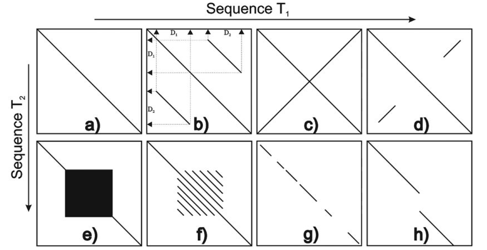
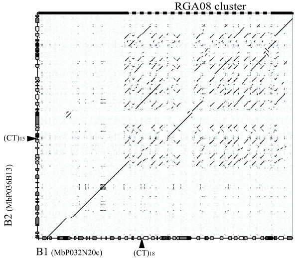
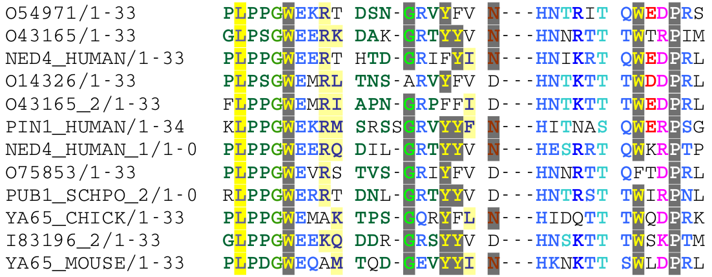
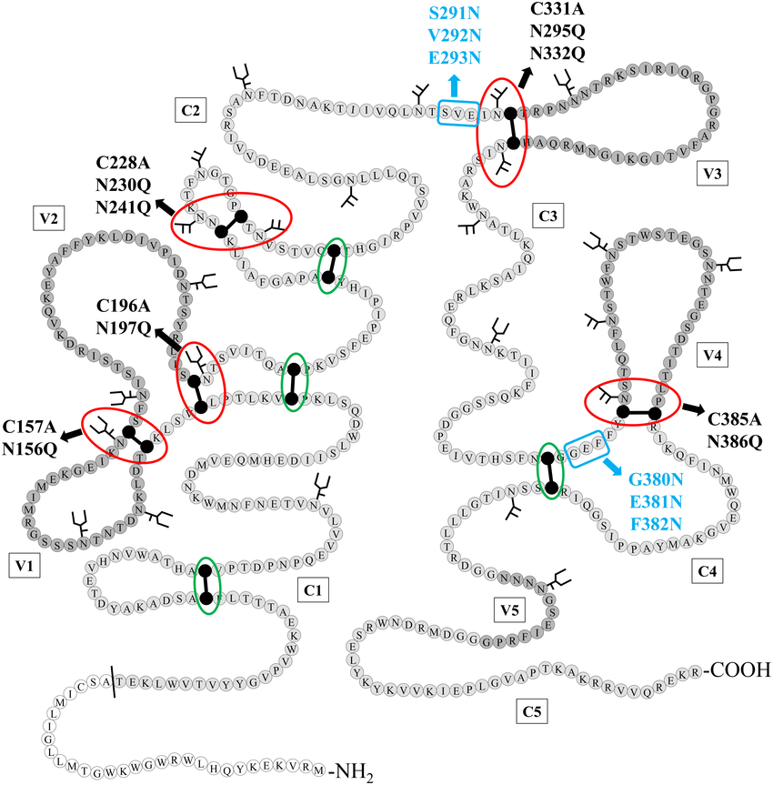

{ width="250", align="left" }

# **TP 3**. Alineamientos de secuencias de a pares { markdown data-toc-label = 'TP 3' }

<br>
<br>
<br>

<!--
[:fontawesome-solid-download: Materiales](data/Data-TP2.zip){ .md-button .md-button--primary }

[:fontawesome-solid-computer: Google Colab](https://colab.research.google.com/drive/1-i_1TJFytoeeFhPGqrrZnmb_-ZMN03Zi?usp=sharing){ .md-button .md-button--primary }            [:fontawesome-solid-file-powerpoint: Slides](https://docs.google.com/presentation/d/1hHh-vYtGggyeMPEpObJb18lTYwiSvxXC7MDcTsuuCKQ/edit?usp=drive_link){ .md-button .md-button--primary }

<br>
-->

!!! abstract "Atención: Este TP tiene informe."

!!! warning "Atención: Este TP tiene parcialito."

<!---
### Videos de la clase grabada
* :octicons-video-16: [Cierre TP](https://youtu.be/nXBOrHCMRZQ)
-->

## **Objetivos**

* Entender el funcionamiento básico del algoritmo de alineamiento de pares de secuencias de Needleman-Wunsch.
* Aprender a interpretar un Dot-Plot, pudiendo identificar las regiones relevantes que contienen patrones.
* Comprender los conceptos de identidad, similitud y homología de secuencias, y establecer una clara diferencia entre los mismos. 

## **Introducción**

El alineamiento de secuencias de a pares comprende la asignación uno-a-uno de correspondencias entre los elementos que componen dichas secuencias sin alterar su orden. En dicho proceso tres eventos principales pueden tener lugar:

* **Match (M)**: Cuando los elementos enfrentados son equivalentes.
* **Mismatch (m)**: Cuando los elementos correspondientes son diferentes.
* **Gap (g):** Cuando un elemento de una secuencia no tiene par en la otra y se enfrenta a un espacio, caracterizado por un guión (-).
    * **Gap open:** Cuando se abre un gap.
    * **Gap extend:** Cuando se agregan gaps a continuación de otro gap.

Por ejemplo, si alineamos las secuencias AFGIVHKLIVS y AFGIHKIVS un posible resultado sería:

<blockquote style="font-family:monospace">
A F G I V H K L I V S
<br>
A F G I - H K - I V S
</blockquote>

!!! info ""

    Los **gaps** no existen en la realidad. NO son un aminoácido o nucleótido más, sino una **herramienta** que utilizamos para poder alinear.

La principal función de los alineamientos es establecer una medida de **similitud** entre las secuencias que participan en el mismo. Para ello es necesario definir un **sistema de puntuación** que pese cada uno de los eventos que tienen lugar en la construcción del alineamiento. Asimismo, este esquema de puntajes o *scoring* nos permitirá optimizar el alineamiento de forma tal que los algoritmos empleados elijan la correspondencia entre secuencias que maximice el puntaje o *score* global.

Existen varios algoritmos de alineamiento:

* Los **alineamientos globales** (o de Needleman-Wunsch por sus creadores), se realizan apareando todos los elementos de una secuencia con todos los elementos de la otra. Este tipo de alineamientos se utiliza principalmente para comparar dos secuencias que son similares en longitud.

* Los **alineamientos locales** (o de Smith-Waterman), parean únicamente parte de las secuencias y son útiles para identificar, por ejemplo, dominios en común.

* Los **alineamientos mixtos**, que combinan los dos anteriores.

## **Dynamic programming**

Dado un par de secuencias y un sistema de puntuación o *scoring* se pueden aplicar diversos algoritmos para encontrar el alineamiento que dé el mejor puntaje.

El algoritmo más popular utiliza un método matemático llamado ***dynamic programming***. El mismo consiste en comparar ambas secuencias construyendo una matriz del alineamiento. Brevemente:

!!! info ""

    1. Se comienza en el extremo superior izquierdo de la matriz, con un puntaje inicial de 0. 
    2. En cada paso, se calcula el costo que tiene aparejado desplazarse de una celda a la otra, dado el sistema de puntajes pre-establecido, y se elige la opción más favorable, es decir aquella que **maximice** el puntaje global del alineamiento. 
    3. En cada iteración se guarda el puntaje con el que se llegó a una celda dada y el movimiento que originó dicho camino o *path*, indicado típicamente con una flecha. Una vez que la matriz está completa en su totalidad se puede recorrer hacia atrás o realizar un *traceback*, desde el extremo inferior derecho al superior izquierdo, para reconstruir el alineamiento.


La principal ventaja de este método es que **siempre encuentra el alineamiento óptimo** entre las secuencias dadas. 
<br>
<br>
Sin embargo, una desventaja es que pueden existir **varios** alineamientos que satisfagan esta condición. 
<br>
<br>
Otra desventaja es de origen técnica: la exhaustividad con la que el algoritmo realiza la búsqueda hace que su velocidad dependa de la longitud de las secuencias implicadas, haciendo poco eficiente la búsqueda de similitud de una secuencia contra una base de datos. Para esto existen diferentes adaptaciones del algoritmo que se verán más adelante.

### Ejemplo

Imaginen que queremos alinear las secuencias **TCGCA** y **TCCA** utilizando un esquema de *scoring* de:

* **Match:** M=1
* **Mismatch:** m=-1
* **Gap:** g=-2

Para eso ubicamos las secuencias en una matriz, donde cada una de sus dimensiones corresponda a una de las secuencias, tal como se muestra en la siguiente figura. 


Si observamos los *paths* **1** y **2** dibujados en las matrices de la figura podemos ver que se emplearon distintas estrategias para alinear este par de secuencias. 

* En **1** se eligió alinear los dos primeros nucleótidos **TC** por la diagonal, luego colocar un **gap** en la secuencia vertical **TCCA** y para finalizar se alinearon los nucleótidos **CA** restantes por la diagonal.      

* En **2** el primer nucleótido **T** de ambas secuencias se alineó por la diagonal, luego se colocó un **gap** en la secuencia vertical **TCCA** y finalmente se alinearon los 3 nucleótidos **GCA** y **CCA** restantes por la diagonal.      

Si computamos los puntajes de ambos alineamientos, obtenemos que:

* La **opción 1** tiene un puntaje de 2. Se propone colocar un único **gap** permitiendo alinear al resto de los nucleótidos en ambas secuencias con eventos de **match**.
* La **opción 2** tiene un puntaje de 0. Las secuencias estudiadas se alinean con 1 **gap**, 1 **mismatch** y 3 **matches**. La estrategia es subóptima en relación a **1**.

!!! question "Pregunta"

    Si hubiésemos aplicado la metodología de *dynamic programming* para realizar un alineamiento global de estas secuencias, ¿cuál sería el *path* óptimo resultante?

!!! done ""
    
    A *priori* uno pensaría que es el *path* **1**, pero hagamos el ejercicio para corroborar si esto es efectivamente así. 

Para comenzar, refresquemos cómo funcionaba el método de *dynamic programming*.


Para llegar desde el extremo superior izquierdo (= inicio) de la matriz del alineamiento a la posición marcada con una <span style="color:red;font-family:monospace"><b>x</b></span> podríamos, hipotéticamente, tomar cualquiera de los caminos dibujados en la figura de más arriba. Estos *paths* darían alinemientos diferentes de las secuencias **TC** con **TC**. 

!!! question "Pregunta"
     
     Pero... ¿cuál es el procedimiento iterativo empleado por el método de *dynamic programming* para obtener el alineamiento óptimo entre dos secuencias?

!!! done ""

      Para llegar a cualquier celda de la matriz, uno puede acceder por, como máximo, 3 direcciones. La idea es siempre moverse en la dirección que maximice el *score* o puntaje. 


Veamos que :

* un movimiento en la dirección <span style="color:blue;"><b>horizontal</b></span>, de la posición **(i, j-1)** a la posición **(i, j)**, supone introducir un **gap** en la secuencia del eje vertical i
* un movimiento en la dirección <span style="color:green;"><b>diagonal</b></span>, de la posición **(i-1, j-1)** a la posición **(i, j)**, supone un **match** o un **mismatch** entre los nucleótidos enfrentados
* un movimiento en la dirección <span style="color:purple;"><b>vertical</b></span>, de la posición **(i-1, j)** a la posición **(i, j)**, supone introducir un **gap** en la secuencia del eje horizontal j

Teniendo en cuenta la fórmula para obtener el *score* enunciada más arriba, podemos comenzar con nuestro ejercicio!

Recordemos que la matriz se llenará iterativamente, comenzando por la celda del extremo superior izquierdo, que tiene un puntaje de 0. 


Para moverse del (0, 0) al (0, 1), hay una sóla opción, moverse en forma **horizontal**. Esto significa alinear **T** con un **gap**, lo cual da un score de 0 + (-2) = -2. 

```
eje j: T
eje i: -
```
Lo mismo pasa al moverse del (0, 0) al (1, 0), hay una sóla opción, moverse en forma **vertical**. Esto significa alinear **T** con un **gap**, lo cual también da un score de 0 + (-2) = -2. 

```
eje j: -
eje i: T
```

Para moverse del (0, 0) al (1, 1) hay 3 maneras: 


**1.** Hacer un movimiento **vertical**, lo cual da un score de -2 + (-2) = -4

* **-2** es el puntaje de la celda inicial (0, 1)
* El movimiento vertical implica colocar un **gap**: -2

!!! note "Resultado:"

   ```
   eje j: T -
   eje i: - T
   ```

**2.** Hacer un movimiento **horizontal**, lo cual da un score de -2 + (-2) = -4. Similar al caso anterior:

* **-2** es el puntaje de la celda inicial (1, 0)
* El movimiento horizontal implica colocar un **gap**: -2
    
!!! note "Resultado:"

   ```
   eje j: - T
   eje i: T -
   ```

**3.** Hacer un movimiento **diagonal**, lo cual da un score de 0 + (+1). Implica alinear ambos nucléotidos!

* **0** es el puntaje de la celda inicial (0, 0)
* Hay **T** en las ambas secuencias. Es un **match**: +1

!!! note "Resultado:"

   ```
   eje j: T 
   eje i: T
   ```

Para decidir qué valor ubicamos en la celda simplemente optamos por el que nos dé el **mayor score**, en este caso 1, y se marca el movimiento que lo produjo: un movimiento diagonal.

De esta manera podemos seguir completando la matriz, 


Obsevando la última celda computada, podemos ver que hay nuevamente 3 maneras de llegar a la misma, 

* Hacer un movimiento **vertical**, de (1, 3) a (2, 3): Es decir, introducir un **gap** en la secuencia horizontal j. Si (1, 3) tiene un *score* de -3, el nuevo *score* es: -3 + gap penalty = -3 + (-2) = -5 (flecha en dirección vertical).

* Hacer un movimiento **horizontal**, de (2, 2) a (2, 3). Es decir, introducir un gap en la secuencia vertical i. Si (2, 2) tiene un *score* de 2, el nuevo *score* es: 2 + gap penalty = 2 + (-2) = 0 (flecha en dirección horizontal).

* Hacer un movimiento **diagonal**, de (1, 2) a (2, 3). Es decir, alinear los nucleótidos G y C. Si (1, 2) tiene un *score* de -1, el nuevo *score* es: -1 + mismatch = -1 + (-1) = -2 (flecha en dirección diagonal).

El máximo de los 3 scores calculados es: max(-5, 0, -2) = 0, que corresponde al puntaje del **movimiento horizontal**. Entonces colocamos 0 en la celda (2, 3) y una flecha horizontal que indique el movimiento de (2, 2) a (2, 3).

Al completar todas las celdas de la matriz, podemos saber cuál es el puntaje de la celda ubicada en extremo inferior derecho, que en este caso resultó ser +2. Este también es el puntaje final del alineamiento.


Para reconstruir el mismo, se parte de la celda ubicada en extremo inferior derecho y se siguen las flechas hasta llegar a la celda de inicio, en el extremo superior izquierdo. 


Las flechas en <span style="color:red;font-weight:bold;"> rojo </span> resaltan el *path* del alineamiento, 

<blockquote style="font-family:monospace"> 
eje j: T C G C A
<br>
eje i: T C - C A 
</blockquote>

que podemos corroborar que es idéntico al *path* **1** del ejemplo que se planteó inicialmente. 

### Ejercicio 1

#### ✏️ Paso 1
En grupo, realizá el alineamiento de las secuencias **ATTGG** con **AGATGG**, usando el esquema de puntajes: M=1, m=-1, g=-2. 


<!---
Para esto, abrí el siguiente [Google Jamboard](https://jamboard.google.com/d/1MGSgTaSSm7bAoHsfw1HCg7CHxuVOfKWVORQmL2vyymw/edit?usp=sharing), guardá una copia local del mismo en tu Google Drive y compartí el GJamboard a tus compañeros de equipo. 

!!! attention "Atención"
      
      Para guardar una copia local del GJamboard en tu GDrive, cliqueá en el ícono con 3 puntitos, en el extremo superior derecho (Más acciones). Luego seleccioná la opción "Hacer una copia". Elegí la carpeta adonde deseas guardarlo dentro de tu unidad y cliqueá aceptar. 

¡Ahora estás listo para empezar! Recordá rellenar la matriz con todos los puntajes y flechas faltantes. Cuando termines, reconstruí el *path* del alineamiento.
--->

#### ✏️ Paso 2
Cuando termines el ejercicio anterior podés corrobar la solución que hallaste ingresando en [UniFreiburg-FreiburgRNATools](http://rna.informatik.uni-freiburg.de/Teaching/index.jsp?toolName=Needleman-Wunsch).

Seguí las siguientes instrucciones para usar este recurso web:

**a.** Ingresá las dos secuencias que querés alinear en los recuadros de **Input** **Sequence a** y **Sequence b**. 
Recordá que la secuencia que figura en tu matriz en sentido horizontal debe ser ingresada como **Sequence b** y la que figura en sentido vertical debe ser ingresada como **Sequence a**.

**b.** Seleccioná optimización de Similarity. 

**c.** Completá los valores de tu esquema de *scoring*.

En el output podrás apreciar dos salidas:

* A la izquierda, los valores de la matriz de alineamiento. Si cliqueas sobre los valores de la matriz, vas a observar que el valor sobre el que te paraste se colorea en verde, mientras que las celdas que dieron origen a ese valor se colorean en rosa. 

* A la derecha, se observa el alineamiento final, donde un match se esquematiza en con \*, un mismatch con \| y un gap con \_.

#### ✏️ Preguntas guía:

#### ✏️ Pregunta 1
Reproducí el alineamiento que vimos como ejemplo al inicio (**TCGCA** con **TCCA**, esquema de puntajes: M=1, m=-1, g=-2) en la web de la [UniFreiburg-FreiburgRNATools](http://rna.informatik.uni-freiburg.de/Teaching/index.jsp?toolName=Needleman-Wunsch)

¿Cuántas soluciones óptimas hay para este alineamiento? ¿Sucede lo mismo para el alineamiento que realizaste en el ✏️ Paso 1? ¿Por qué?

#### ✏️ Pregunta 2
Observá con detenimiento el output del panel de la izquierda (la matriz) 

Seleccioná una celda. ¿Qué sucede cuando cliqueás en una celda y se colorea en <span style="color:green;font-weight:bold">verde</span> y la celda aledaña a la misma en <span style="color:pink;font-weight:bold">rosa</span>?
¿A qué corresponde este coloreado o resaltado de las celdas?
<br>

Observá nuevamente la matriz del alineamiento que obtuviste en **1.2**. Cliquéa en la celda con puntaje -2 en la posición (A3, T2). Observá que se colorea en <span style="color:green;font-weight:bold">verde</span> y **dos** celdas aledañas a la misma en <span style="color:pink;font-weight:bold">rosa</span>. 
<br>
¿Entendés qué significa esto? ¿Podés relacionarlo con los dos caminos óptimos posibles que existen para este alineamiento?
<br>

<!--
**1.3.3** Finalmente te propongo que realices el siguiente alineamiento: 

* Sequence a: **AGATGG** y Sequence b: **ATTGGG**. 
* Seleccioná optimización de Similarity. 
* Esquema de puntajes: **M:1, m:-1, g:-5**. 

Registrá con atención el resultado. Ahora cambiemos el esquema de *scoring*, dejando el mismo valor para match, pero intercambiando los puntajes de gap y mismatch. 
¿Cómo cambió el output? ¿Qué observás ahora en las secuencias halladas como solución óptima en comparación a lo que arrojaba el algoritmo con los parámetros anteriores?
-->

## Dot-Plots

# Dot Plots

Un **Dot Plot** (o gráfico de puntos) es una herramienta visual para comparar dos secuencias biológicas (ADN, ARN o proteínas). 

### ¿Cómo funciona?
- Se colocan **dos secuencias** en los ejes **X** e **Y**.
- Se dibuja un **punto (dot)** en cada coordenada donde los caracteres (bases o aminoácidos) coinciden y tienen un puntaje mayor al Criterio de stringencia.
- Las **diagonales** en el gráfico indican regiones de similitud o alineamiento entre las secuencias.

### Parámetros principales:

| Parámetro | ¿Qué hace? |
|-----------|------------|
| **Ventana (window)** | Número de caracteres consecutivos que se comparan a la vez. |
| **Criterio de stringencia (stringency)** | Número mínimo de coincidencias dentro de la ventana para dibujar un punto. |

---

### Ejercicio 2

Vamos a comparar **dos secuencias de hemoglobina** usando la herramienta online [Dotlet](https://dotlet.vital-it.ch/).

#### ✏️ Paso 1: 

Dentro del superior de secuencias pegar las siguientes secuencias:

**Secuencia 1:**

MVLSPADKTNVKAAWGKVGAHAGEYGAEALERMFLSFPTTKTYFPHFDLSHGSAQVKGHGKKVADALTNAVAHVDDMPNALSALSDLHAHKLRVDPVNFK

**Secuencia 2:**

MVLSPADKTNVKAAWGKVGAHAGEYGAEALERMFLSFPTTKTYFPHFDLSHGSAQVKGHGKKVADALTNAVAHVDDMPNALSALSDLHAHKLRVDPVNFK

**Qué hacer:**
- Configurá **Window = 10** .
- Hacé clic en **"Draw"**.

**Qué observar:** Diagonal principal perfecta (100% identidad). No hay diagonales secundarias.

<div style="border-left: 6px solid  #555; background-color: #f5f5f5; padding: 12px 16px; margin: 16px 0; border-radius: 4px;">
<strong>La matriz BLOSUM (BLOcks SUbstitution Matrix)</strong><br>
Es el estándar de facto para alinear proteínas. Fue creada por Henikoff y Henikoff en 1992.

**Cómo funciona:**
- Tiene un valor **específico para cada par de aminoácidos**
- No es binaria: cada una de las 190 sustituciones posibles tiene su propia puntuación
- Los valores se basan en la **probabilidad evolutiva** de que ocurra cada cambio

**¿Cómo se calculan los valores?**
- Se analizan bloques de alineamientos de proteínas reales
- Se comparan dos frecuencias:
  1. **Frecuencia observada**: con qué frecuencia ocurre esa sustitución en la naturaleza
  2. **Frecuencia esperada al azar**: con qué frecuencia ocurriría si los aminoácidos se alinearan al azar
- El resultado se expresa como un **log-odds score**: log2 (observado / esperado)
</div>

#### ✏️ Paso 2: 

Dentro del superior de secuencias pegar las siguientes secuencias:

**Secuencia 1:**

MVLSPADKTNVKAAWGKVGAHAGEYGAEALERMFLSFPTTKTYFPHFDLSHGSAQVKGHGKKVADALTNAVAHVDDMPNALSALSDLHAHKLRVDPVNFK

**Secuencia 2:**

MVLSPADKTNMVLSPADKTNGAHAGEYGAEALERMFLSFPTTKTYFPHFDLSHGSAQVKGHGKKVADALTNAVAHVDDMPNALSALSDLHAHKLRVDPVNFK

**Explicación:** La Secuencia 2 tiene el motivo "MVLSPADKTN" repetido al principio (20 aa), mientras que la Secuencia 1 lo tiene solo una vez. El resto de la secuencia (80 aa) es idéntico.

#### ✏️ Paso 3:

Dentro del superior de secuencias pegar las siguientes secuencias:

**Secuencia 1:**

MVLSPADKTNVKAAWGKVGAHAGEYGAEALEEEEEEEEEEEEEEPHFDLSHGSAQVKGHGKKVADALTNAVAHVDDMPNALSALSDLHAHKLRVDPVNFK

**Secuencia 2:**

MVLSPADKTNVKAAWGKVGAHAGEYGAEALEEEEEEEEEEEEEEPHFDLSHGSAQVKGHGKKVADALTNAVAHVDDMPNALSALSDLHAHKLRVDPVNFK

**Explicación:** La Secuencias están compuestas por bloques de aminoácidos repetidos (E), lo que la hace de baja complejidad.

**Qué observar:** En la zona de baja complejidad , el dotplot se vuelve extremadamente denso, con múltiples diagonales paralelas y manchas de puntos que reflejan las repeticiones. La región de baja complejidad produce un patrón característico de "ruido" estructurado.

<div style="border-left: 6px solid  #555; background-color: #f5f5f5; padding: 12px 16px; margin: 16px 0; border-radius: 4px;">
<strong>¿Cómo elegir los parámetros ideales?</strong><br>

**No hay una combinación única y perfecta.**

La elección de los parámetros (window y stringency) depende de varios factores:

- **Tipo de secuencia:** ADN (4 letras) vs. Proteínas (20 aminoácidos). El ADN tiene más coincidencias aleatorias, por lo que necesita filtros más estrictos.
- **Similitud esperada:** Secuencias muy similares vs. secuencias divergentes. Cuanto más divergentes sean, más ruido tendrás que filtrar.
- **Longitud de las secuencias:** Secuencias más largas generan más ruido estadístico.
- **Pregunta biológica:** ¿Buscas dominios conservados? ¿Repeticiones? ¿Reordenamientos?

**La mejor estrategia es siempre experimentar con diferentes valores y observar cómo cambia el gráfico.** No existe una combinación mágica; los parámetros óptimos son aquellos que mejor revelan la información biológica que te interesa visualizar.

Si aumentás estos parámetros podés ir eliminando fragmentos que corresponden a secciones compartidas más cortas, sin embargo existe una relación de compromiso, utilizar tamaño de ventana y umbral muy grandes nos llevan a perder información por lo que hay que seleccionarlos con cuidado. Aqui hay algunos patrones con los que te podés encontrar en este tipo de plots:



**a)** Match perfecto.  
**b)** Repeticiones.  
**c)** Palíndromo.  
**d)** Repeticiones invertidas.  
**e)** Zonas de baja complejidad (microsatelites).  
**f)** Zonas altamente repetitivas (minisatelites).  
**g)** Secuencias con alta conservación.  
**h)** Inserción o deleción.  
</div>

Los dot-plots son representaciones gráficas que dan un pantallazo sobre la similitud entre dos secuencias. En ellos se pueden identificar patrones que aporten información sobre la relación entre ambas secuencias.
La forma de obtener uno es muy sencilla: se establece una matriz donde cada elemento de una de las secuencias se corresponde con una fila y los de la otra con una columna. Acto seguido se procede a colorear cada celda donde los caracteres correspondientes a fila y columna sean equivalentes.
Por ejemplo:



# Dot Plots

Un **Dot Plot** (o gráfico de puntos) es una herramienta visual para comparar dos secuencias biológicas (ADN, ARN o proteínas). 

### ¿Cómo funciona?
- Se colocan **dos secuencias** en los ejes **X** e **Y**.
- Se dibuja un **punto (dot)** en cada coordenada donde los caracteres (bases o aminoácidos) coinciden y tienen un puntaje mayor al Criterio de stringencia.
- Las **diagonales** en el gráfico indican regiones de similitud o alineamiento entre las secuencias.

### Parámetros principales:

| Parámetro | ¿Qué hace? |
|-----------|------------|
| **Ventana (window)** | Número de caracteres consecutivos que se comparan a la vez. |
| **Criterio de stringencia (stringency)** | Número mínimo de coincidencias dentro de la ventana para dibujar un punto. |

---

### Ejercicio 2

Vamos a comparar **dos secuencias de hemoglobina** usando la herramienta online [Dotlet](https://dotlet.vital-it.ch/).

#### ✏️ Paso 1: 

Dentro del superior de secuencias pegar las siguientes secuencias:

**Secuencia 1:**

MVLSPADKTNVKAAWGKVGAHAGEYGAEALERMFLSFPTTKTYFPHFDLSHGSAQVKGHGKKVADALTNAVAHVDDMPNALSALSDLHAHKLRVDPVNFK

**Secuencia 2:**

MVLSPADKTNVKAAWGKVGAHAGEYGAEALERMFLSFPTTKTYFPHFDLSHGSAQVKGHGKKVADALTNAVAHVDDMPNALSALSDLHAHKLRVDPVNFK

**Qué hacer:**
- Configurá **Window = 10** .
- Hacé clic en **"Draw"**.

**Qué observar:** Diagonal principal perfecta (100% identidad). No hay diagonales secundarias.

<div style="border-left: 6px solid  #555; background-color: #f5f5f5; padding: 12px 16px; margin: 16px 0; border-radius: 4px;">
<strong>La matriz BLOSUM (BLOcks SUbstitution Matrix)</strong><br>
Es el estándar de facto para alinear proteínas. Fue creada por Henikoff y Henikoff en 1992.

**Cómo funciona:**
- Tiene un valor **específico para cada par de aminoácidos**
- No es binaria: cada una de las 190 sustituciones posibles tiene su propia puntuación
- Los valores se basan en la **probabilidad evolutiva** de que ocurra cada cambio

**¿Cómo se calculan los valores?**
- Se analizan bloques de alineamientos de proteínas reales
- Se comparan dos frecuencias:
  1. **Frecuencia observada**: con qué frecuencia ocurre esa sustitución en la naturaleza
  2. **Frecuencia esperada al azar**: con qué frecuencia ocurriría si los aminoácidos se alinearan al azar
- El resultado se expresa como un **log-odds score**: log2 (observado / esperado)
</div>

#### ✏️ Paso 2: 

Dentro del superior de secuencias pegar las siguientes secuencias:

**Secuencia 1:**

MVLSPADKTNVKAAWGKVGAHAGEYGAEALERMFLSFPTTKTYFPHFDLSHGSAQVKGHGKKVADALTNAVAHVDDMPNALSALSDLHAHKLRVDPVNFK

**Secuencia 2:**

MVLSPADKTNMVLSPADKTNGAHAGEYGAEALERMFLSFPTTKTYFPHFDLSHGSAQVKGHGKKVADALTNAVAHVDDMPNALSALSDLHAHKLRVDPVNFK

**Explicación:** La Secuencia 2 tiene el motivo "MVLSPADKTN" repetido al principio (20 aa), mientras que la Secuencia 1 lo tiene solo una vez. El resto de la secuencia (80 aa) es idéntico.

#### ✏️ Paso 3:

Dentro del superior de secuencias pegar las siguientes secuencias:

**Secuencia 1:**

MVLSPADKTNVKAAWGKVGAHAGEYGAEALEEEEEEEEEEEEEEPHFDLSHGSAQVKGHGKKVADALTNAVAHVDDMPNALSALSDLHAHKLRVDPVNFK

**Secuencia 2:**

MVLSPADKTNVKAAWGKVGAHAGEYGAEALEEEEEEEEEEEEEEPHFDLSHGSAQVKGHGKKVADALTNAVAHVDDMPNALSALSDLHAHKLRVDPVNFK

**Explicación:** La Secuencias están compuestas por bloques de aminoácidos repetidos (E), lo que la hace de baja complejidad.

**Qué observar:** En la zona de baja complejidad , el dotplot se vuelve extremadamente denso, con múltiples diagonales paralelas y manchas de puntos que reflejan las repeticiones. La región de baja complejidad produce un patrón característico de "ruido" estructurado.

<div style="border-left: 6px solid  #555; background-color: #f5f5f5; padding: 12px 16px; margin: 16px 0; border-radius: 4px;">
<strong>¿Cómo elegir los parámetros ideales?</strong><br>

**No hay una combinación única y perfecta.**

La elección de los parámetros (window y stringency) depende de varios factores:

- **Tipo de secuencia:** ADN (4 letras) vs. Proteínas (20 aminoácidos). El ADN tiene más coincidencias aleatorias, por lo que necesita filtros más estrictos.
- **Similitud esperada:** Secuencias muy similares vs. secuencias divergentes. Cuanto más divergentes sean, más ruido tendrás que filtrar.
- **Longitud de las secuencias:** Secuencias más largas generan más ruido estadístico.
- **Pregunta biológica:** ¿Buscas dominios conservados? ¿Repeticiones? ¿Reordenamientos?

**La mejor estrategia es siempre experimentar con diferentes valores y observar cómo cambia el gráfico.** No existe una combinación mágica; los parámetros óptimos son aquellos que mejor revelan la información biológica que te interesa visualizar.

Si aumentás estos parámetros podés ir eliminando fragmentos que corresponden a secciones compartidas más cortas, sin embargo existe una relación de compromiso, utilizar tamaño de ventana y umbral muy grandes nos llevan a perder información por lo que hay que seleccionarlos con cuidado. Aqui hay algunos patrones con los que te podés encontrar en este tipo de plots:


**a)** Match perfecto.  
**b)** Repeticiones.  
**c)** Palíndromo.  
**d)** Repeticiones invertidas.  
**e)** Zonas de baja complejidad (microsatelites).  
**f)** Zonas altamente repetitivas (minisatelites).  
**g)** Secuencias con alta conservación.  
**h)** Inserción o deleción.  
</div>

!!! info "Identidad, Similitud y Homología"

    Los términos identidad, similitud y homología se suelen utilizar como sinónimos por muchos investigadores, sin embargo no lo son.

    * La **identidad** es una es una característica cuantitativa de un par de secuencias, donde se cuenta cuántos elementos (residuos, nucleótidos, aminoácidos etc) son idénticos entre ambas secuencias después de alinearlas. 

    * La **similitud** es una característica cuantitativa de un par de secuencias, donde se establece en qué grado estas se parecen (por ejemplo aplicando los algoritmos antes vistos, utilizando un sistema de puntaje) después de alinearlas. 

    * La **homología**, por otro lado, es una característica cualitativa, dos secuencias SON o NO SON homólogas. Homología implica específicamente que el par de secuencias estudiadas *provienen de un mismo ancestro común*. Esta afirmación es completamente hipotética, ya que, salvo en contados casos, no se puede corroborar. Uno puede inferir que este es el caso dado la similitud observada en las secuencias actuales, sin tener acceso a las secuencias ancestrales.

!!! attention "Atención"

    Decir que un par de secuencias tiene N% de homología es TOTALMENTE incorrecto.

A partir de esta relación entre similitud y homología se pueden inferir relaciones entre diferentes especies, buscar posibles funciones de una secuencia desconocida, etc.

### Ejercicio 3

Determinar qué especies están más relacionadas utilizando la ribonucleasa pancreática de caballo (*Equus caballus*), ballena enana (*Balaenoptera acutorostrata*) y canguro rojo (*Macropus rufus*).

## **Google Colab - Empezamos con el TP**

**Google Colab** es un entorno de desarrollo basado en la nube que permite escribir y ejecutar código en *Python* directamente desde el navegador, sin necesidad de instalar programas en la computadora. Al igual que otros **IDEs** (Integrated Development Environments), ofrece un espacio para escribir código, ejecutarlo, detectar errores (debuguear) y visualizar los resultados en un mismo lugar.

Una de las principales ventajas de **Google Colab** es que ya incluye instaladas muchas de las bibliotecas más utilizadas para el análisis de datos, como *NumPy, Pandas, Matplotlib y Seaborn*, además de permitir el uso gratuito de recursos de cómputo como GPU y TPU cuando es necesario. Asimismo, los cuadernos (notebooks) pueden compartirse fácilmente mediante un enlace, facilitando el trabajo colaborativo y la reproducción de análisis por parte de otros usuarios.

✏️**1)** Abran Google Colab desde el navegador ([Google Colab](https://colab.research.google.com/)) 

✏️**2)** Creen un nuevo *notebook* haciendo click en Nuevo notebook en la parte superior

Ahora sí, deberían ver lo siguiente:

<figure markdown>

</figure>

✏️**3)** Verificar que estemos utilizando Python. Para ejecutar código, Google Colab debe estar conectado a un entorno de ejecución. Para comprobar el lenguaje seleccionado, vayan a **Entorno de ejecución** :material-arrow-right: **Cambiar tipo de entorno de ejecución**. En la ventana que se abre, en **Tipo de entorno de ejecución** debería aparecer Python 3. Google Colab también permite ejecutar código en otros lenguajes, como por ejemplo, R. Si el entorno aún no está iniciado, hagan clic en Conectar (esquina superior derecha) para iniciar la sesión.

✏️**4)** Durante este trabajo práctico les pedimos que desactiven temporalmente la asistencia de IA de Google Colab. El objetivo de este TP es aprender los fundamentos de **Python**, por lo que es importante que escriban el código y resuelvan los ejercicios por sus propios medios. Una vez adquiridas estas bases, la asistencia de IA puede convertirse en una herramienta muy útil para programar de manera más eficiente.
Para hacerlo vayan a:
**Herramientas** :material-arrow-right: **Configuración** :material-arrow-right: **Asistencia de IA** :material-arrow-right: **Destildar todas las casillas**

* **Elementos principales de Google Colab**

??? important "Celdas de código (zona central del notebook)"

    Las celdas de código contienen instrucciones en **Python**. Para ejecutarlas pueden hacer clic en el botón **▶** ubicado a la izquierda de la celda o presionar ++shift+enter++, lo que además ejecuta la celda y selecciona la siguiente.

??? important "Celdas de texto (zona central del notebook)"

    Las celdas de texto permiten escribir explicaciones, títulos o consignas usando **Markdown**. En este trabajo práctico las utilizaremos para organizar el contenido y describir los ejercicios.

??? important "Panel de variables (zona inferior del notebook)"

    En el panel **Variables** pueden ver las variables que fueron creadas durante la ejecución del notebook. Esto resulta útil para inspeccionar datos y comprobar que el código está funcionando como esperan. A veces, este panel puede no actualizarse correctamente o no mostrar todas las variables creadas. Si esto ocurre, prueben a actualizar la página (f5). Sino pueden ejecutar el siguiente comando para listar todas las variables definidas en la sesión:

    ```python
    %whos
    ```

??? important "Archivos (barra lateral izquierda)"

    En la pestaña **Archivos** pueden explorar los archivos disponibles en la sesión de Colab y subir nuevos archivos desde su computadora. Más adelante utilizaremos esta pestaña para cargar los datos que analizaremos.

??? important "Terminal (zona inferior del notebook)"

    Google Colab también dispone de una **terminal** (Bash), desde la cual es posible ejecutar comandos del sistema operativo, de forma similar a la terminal que utilizamos en los trabajos prácticos anteriores. En este trabajo práctico utilizaremos las **celdas de código** para ejecutar programas en **Python**.

!!! tip "Guardar el notebook"

    Si modifican el notebook y desean conservar los cambios, pueden guardarlo en su cuenta de Google Drive usando **Archivo → Guardar una copia en Drive**.    

!!! tip "Reiniciar el entorno"

    Las variables creadas en una sesión permanecen en memoria hasta que el entorno se reinicia. Si obtienen resultados inesperados, una buena práctica es ejecutar **Entorno de ejecución → Reiniciar sesión** y volver a correr las celdas desde el comienzo.
 

Hasta ahora trabajamos con los algoritmos de alineamiento de forma **casi manual**, entendiendo cómo funcionan por dentro los algoritmos.

Ahora vamos a dar un paso más: vamos a utilizar los algoritmos de alineamiento por **línea de comandos**.

Para eso vamos a usar **EMBOSS** (European Molecular Biology Open Software Suite), un paquete de software que diseña programas específicos para poder ejecutar desde la terminal y analizar secuencias biológicas de forma automatizada. Esto es lo que se usa en la práctica real cuando tenemos que procesar muchas secuencias o queremos integrar los análisis en flujos de trabajo (pipelines).

Consigna: 
Determinar qué especies están más relacionadas utilizando la ribonucleasa pancreática de caballo (*Equus caballus*), ballena enana (*Balaenoptera acutorostrata*) y canguro rojo (*Macropus rufus*).


#### ✏️ Paso 1
Descargá los materiales de este TP ejecutando el siguiente comando: 

```bash
wget "https://bioinformatica-iib.github.io/introduccion_bioinformatica/practicos/TP02_Alineamientos/data/Balaenoptera_acutorostrata.fasta"
```

```bash
wget "https://bioinformatica-iib.github.io/introduccion_bioinformatica/practicos/TP02_Alineamientos/data/Elephas_maximus.fasta"
```

```bash
wget "https://bioinformatica-iib.github.io/introduccion_bioinformatica/practicos/TP02_Alineamientos/data/Equus_caballus.fasta"
```

#### ✏️ Paso 2
Visualizá las secuencias usando el comando `head`

#### ✏️ Paso 3
Utilizá la herramienta de alineamiento global de EMBOSS ```needle``` (pueden leer el manual para ver que opciones admite ejecutnado el comando ```man needle```) para comparar las tres secuencias de a pares.   

```Bash
needle -gapopen 10 -gapextend 1 -asequence *secuencia_1* -bsequence *secuencia_2* -outfile *salida*
```
#### ✏️ Paso 4
Observá e interpretá las salidas obtenidas.

La salida contiene la siguiente información

| Concepto | Definición |
|----------|------------|
| Identidad | Porcentaje de aminoácidos exactamente iguales |
| Similitud | Porcentaje de aminoácidos idénticos o similares (cambios conservados) |
| Gap | Hueco introducido para optimizar el alineamiento (indica inserción/deleción) |
| Score | Puntuación total (matches - penalizaciones por gaps) |
| Alineamiento global | Alinea las secuencias de principio a fin (Needleman-Wunsch) |

* ¿Qué secuencias son más similares? 


#### ✏️ Paso 5
Analizá árbol filogenético de la Fig. 1 del [paper](https://raw.githubusercontent.com/mercedesgarnham/Tutoriales/refs/heads/main/TP2/data/OLeary_2013_Science.pdf) de O'Leary *et al.*, 2013. 
Sabiendo que los caballos y las ballenas pertenecen al clado *Euungulata* y los canguros al clado *Marsupialia*, ubicá estos clado en el árbol.

* ¿Esta información coincide con los resultados que obtuviste en el anterior?


<div style="border-left: 6px solid  #555; background-color: #f5f5f5; padding: 12px 16px; margin: 16px 0; border-radius: 4px;">
<strong>Identidad, Similitud y Homología</strong><br>

Los términos identidad, similitud y homología se suelen utilizar como sinónimos por muchos investigadores, sin embargo no lo son.

* La **identidad** es una es una característica cuantitativa de un par de secuencias, donde se cuenta cuántos elementos (residuos, nucleótidos, aminoácidos etc) son idénticos entre ambas secuencias después de alinearlas. 

* La **similitud** es una característica cuantitativa de un par de secuencias, donde se establece en qué grado estas se parecen (por ejemplo aplicando los algoritmos antes vistos, utilizando un sistema de puntaje) después de alinearlas. 

* La **homología**, por otro lado, es una característica cualitativa, dos secuencias SON o NO SON homólogas. Homología implica específicamente que el par de secuencias estudiadas *provienen de un mismo ancestro común*. Esta afirmación es completamente hipotética, ya que, salvo en contados casos, no se puede corroborar. Uno puede inferir que este es el caso dado la similitud observada en las secuencias actuales, sin tener acceso a las secuencias ancestrales.

**Importante:** Decir que un par de secuencias tiene N% de homología es TOTALMENTE incorrecto.

A partir de esta relación entre similitud y homología se pueden inferir relaciones entre diferentes especies, buscar posibles funciones de una secuencia desconocida, etc.
</div>


<!--
**3.2** Realizá el mismo procedimiento pero esta vez para determinar si los mamuts (*Mammuthus primigenius*) son más cercanos a los elefantes africanos (*Loxodonta africana*) o asiáticos (*Elephas maximus*) utilizando la secuencia de la cadena alfa de la hemoglobina.  

**3.2.1** ¿Qué te sugieren los resultados obtenidos?

**3.2.2** ¿Es relevante la diferencia hallada?

**3.2.3** ¿Cómo harías para sacar conclusiones más fuertes sobre las relaciones filogenéticas entre los organismos estudiados en los ejercicios 3.1 y 3.2?


## Alineamientos múltiples

Un alineamiento múltiple (MSA) involucra tres o más secuencias biológicas. Debido a que la tarea de alinear múltiples secuencias de largos biológicamente significativos suele ser muy demandante en términos de recursos computacionales y tiempos de ejecución estos requieren metodologías más sofisticadas para llevarse a cabo. Por ello la mayoría de los programas disponibles para realizar MSA utiliza heurísticas en vez de algoritmos de optimización global.

!!! note "Heurística"
   
      Es una estrategia que busca resolver un problema más simple cuya solución se interseca con la solución de un problema más complejo. Generalmente esto implica que no es seguro encontrar el mejor resultado pero sí una solución que sea aceptable. Las heurísticas se aplican con frecuencia en computación para poder resolver problemas que, por su complejidad, serían imposibles de abordar dados los limitados recursos con los que se cuentan.

Dadas las secuencias de aminoácidos de un set de proteínas que se quieren comparar, el MSA muestra los residuos de cada proteína en una fila junto con los gaps que le correspondan de tal manera que todos los residuos "equivalentes" se encuentren en la misma columna. La utilidad de esta equivalencia depende de quien mire el alineamiento:

* Alguien que hace una filogenia puede enfocarse en que comparten un ancestro común;
* Alguien que hace biología estructural puede enfocarse en que son residuos en posiciones análogas de una estructura proteica;
* Alguien que hace biología molecular puede enfocarse en el rol funcional de esos residuos en la proteína.

En cada caso un MSA provee un pantallazo sobre las restricciones evolutivas, estructurales o funcionales que caracterizan un set de proteínas de una manera visual e intuitiva.



Un pipeline típico para realizar un MSA sería:

1. Formular la pregunta que se quiere contestar. Por ejemplo,  "¿Qué estructura secundaria adopta X región de mi proteína de interés?"
2. Obtener secuencias que puedan contestar a mi pregunta. Por ejemplo, secuencias que estén relacionadas a mi proteína de interés.
3. Utilizar alguno de los programas disponibles para llevar a cabo el MSA. Por ej. EMBOSS
4. Realizar ajustes manuales para corregir posibles errores de los algoritmos de alineamiento.

### Ejercicio 4 (Adicional)

La gp120 es una proteína que recubre al virus del HIV y facilita su unión e ingreso a la célula que infecta (linfocitos CD4+)
Entre nuestros archivos contamos con un multifasta (gp120.fasta) que contiene 27 secuencias de gp120 de HIV-1, HIV-2 y SIV.
Estas proteínas contienen 9 puentes disulfuro conservados. También es de interés el loop V3, una porción expuesta de la proteína, conocido target de anticuerpos el cual constituye una región hipervariable dada la presión selectiva a la que se ve sometido. 

<br>
Pueden ver la disposición de las distintas regiones de la gp120 en el siguiente esquema:
<br>
<br>


 **Figure 1. Glicoproteína gp120 de HIV**
 
<span style="font-size: 0.8em;"> Mathys L, Balzarini J. *Several N-Glycans on the HIV Envelope Glycoprotein gp120 Preferentially Locate Near Disulphide Bridges and Are Required for Efficient Infectivity and Virus Transmission.* PLoS One. 2015 Jun 29;10(6):e0130621. doi: [10.1371/journal.pone.0130621](https://journals.plos.org/plosone/article?id=10.1371/journal.pone.0130621). PMID: 26121645; PMCID: PMC4488071.</span>

<br>

**4.1** Utilizá las herramientas de EMBOSS para realizar un alineamiento múltiple con las secuencias de gp120 (recuerden que para buscar herramientas pueden usar ```wossname```)  

??? note "Pista"
   
    El comando a utilizar es ```emma```. Para ver la ayuda, tipeá ```emma -help``` en la terminal.

**4.2** Utilizá el comando ```showalign``` de EMBOSS para obtener una mejor visualización del alineamiento.  

**4.3** Observá el alineamiento, como primer control podemos corroborar que las 18 Cisteínas (**C**) estén bien alineadas.  

**4.4** Utilizá el esquema de gp120 para identificar diversas regiones ya sea conservadas o muy variables (Estructuras, loops, etc.) 

!!! tip "Tip"

      Notá que las posiciones en el alineamiento cuentan gaps por lo que no se corresponden exactamente con el esquema. Utilizá las posiciones de las cisteínas conservadas para identificar diferentes regiones.

<div style="border-bottom: 3px solid black;">

</div>

## Ejercicio a informar

!!! info 

    <span style="font-weight:bold;">Fecha límite de entrega:</span> Viernes, 5 de septiembre 2025, 23:59hs.

[:fontawesome-solid-download: Materiales](https://drive.google.com/drive/folders/14Qbd5QwI4INiWdyC1HsiKkoU7MIImkn2?usp=sharing){ .md-button .md-button--primary }

### Enunciado

Usted trabaja en un laboratorio que estudia distintos aspectos del virus del papiloma humano (HPV). Como parte de su colaboración con Servicio Virus Oncogénicos del Instituto Nacional de Enfermedades Infecciosas ANLIS “Dr. Carlos G. Malbrán”, todos los días se obtienen nuevas secuencias de aislamientos de HPV. Recientemente, el servicio compartió con su jefe un nuevo aislamiento del virus, y su jefe le ha encomendado a usted la tarea de analizar dicho aislamiento para extraer toda la información bioinformática posible de su colección de datos.

#### Breve descripción del virus del papiloma humano

El virus del papiloma humano (VPH o HPV, del inglés human papillomavirus) es el virus responsable de una de las infecciones de transmisión sexual más frecuentes en todo el mundo. Se estima que 4 de cada 5 personas van a contraer uno o varios de los tipos de VPH en algún momento de sus vidas.  Existen alrededor de 100 tipos de HPV, de los cuales 40 afectan la zona genital y anal. Los distintos tipos de HPV se clasifican en dos grandes grupos, denominados de alto y bajo riesgo oncogénico. Los HPV de bajo riesgo suelen estar asociados con lesiones benignas o de bajo grado, mientras que las infecciones con HPV de alto riesgo oncogénico pueden evolucionar a cáncer, siendo el cáncer de cuello de útero el más frecuente. Los tipos de HPV de alto riesgo más comunes son el 16 y 18. La determinación del tipo de HPV se realiza con distintas técnicas de biología molecular que permiten identificar diferencias genómicas.
Los HPV son grupos diversos de virus ADN pertenecientes a la familia de los Papillomaviridae. Las diferencias entre estos virus a nivel de secuencia de ADN permiten clasificarlos (o genotipificarlos), lo cual resulta muy importante debido a la diferencia de patologías que pueden causar los distintos tipos de HPV.

#### Trabajo a realizar

Usted cuenta con un conjunto de secuencias que utiliza normalmente en su laboratorio, organizadas de la siguiente manera:

| Nombre del archivo      | Descripción                                                                                   |
|----------------------------|-----------------------------------------------------------------------------------------------|
| **all_sequences.fasta**   | Archivo multifasta con 11 secuencias de distintos tipos de HPV                                |
| **all_sequences.gb**       | Archivo GenBank. Almacena las mismas 11 secuencias que el archivo fasta, con información adicional (como anotaciones de proteínas) |
| **conjunto_de_secuencias**| Archivo de hoja de cálculo con información sobre la secuencia y el organismo al que pertenece |


Pero… Cuando usted recibe los datos (`secuencia_incognita.fasta`) se da cuenta que el archivo no ha sido nombrado correctamente. Este tipo de errores son comunes debido a la gran cantidad de secuencias que maneja el Servicio Virus Oncogénico, ya que este servicio actúa como Laboratorio Nacional de Referencia del Ministerio de Salud (MSAL) para el virus papiloma humano (HPV) y el virus de Epstein-Barr (EBV). 

Para solucionar el problema, decide aplicar las herramientas que aprendió en el trabajo práctico N3 de bioinformática cuando era estudiante y procede a:


1. Verificar que la secuencia que le mandaron corresponde al virus de HPV y no a otro. Para esto, hay que comparar la secuencia del nuevo aislamiento con alguna secuencia de su conjunto de secuencias. ¿Pertenece el nuevo aislamiento a un HPV?
    
    !!! tip "Tip"
        Recuerden usar parámetros adecuados de ventana y umbral

2. Debido a la importancia a nivel diagnóstico, ahora quiere saber qué tipo de HPV es. Para esto decide determinar el % de similitud que posee su secuencia con cada una de las secuencias  con las que usted trabaja comúnmente. ¿Puede decir que tipo de virus es en base a la información que posee?
    
    !!! tip "Tip"

        Si necesitan dividir el archivo `All_Sequences.fasta` en archivos individuales pueden buscar **wossname split**. 

3. Ahora comparen el tipo de HPV del aislamiento con otros del mismo riesgo y de distinto nivel de riesgo. ¿Encuentran alguna región que pueda ser útil para genotipificación? ¿Qué eventos observan en los dotplots cuando comparan HPV de igual y de distinto riesgo?

!!! example "Extra! (y por ende opcional)"

    Para resolver los puntos 2 y 3 se puede hacer un script de bash tanto para el alineamiento, para ver los % de similitud y para crear dotplots. El parámetro que tienen que agregar a dotmatcher para que el archivo generado sea un pdf de nombre “grafico.pdf” es -graph pdf -goutfile grafico. Si lo logran (o si lo intentan), los invito a incluirlo en el trabajo práctico (aún cuando no les salió).

-->
<!--
# Ejercicio a informar


!!! info 

    <span style="font-weight:bold;">Fecha límite de entrega:</span> Viernes, 28 de agosto 2026, 23:59hs.

## Contexto biológico

El virus del dengue (DENV) es un arbovirus de la familia *Flaviviridae*, transmitido por mosquitos del género *Aedes* (principalmente *Aedes aegypti*). Existen **cuatro serotipos** (DENV‑1, DENV‑2, DENV‑3 y DENV‑4) que circulan simultáneamente en regiones endémicas. La infección por un serotipo genera inmunidad duradera solo contra ese serotipo, y una segunda infección por un serotipo diferente aumenta el riesgo de dengue grave (dengue hemorrágico o síndrome de shock).

El **virus Zika (ZIKV)** es otro flavivirus estrechamente relacionado, transmitido por el mismo vector. Comparte aproximadamente un **55‑60 % de identidad nucleotídica** con el dengue en el gen de la envoltura (E), lo que causa reactividad cruzada en pruebas serológicas y hace esencial la confirmación molecular.

El **gen de la envoltura (E)** es el principal objetivo para la genotipificación y el diseño de vacunas, ya que contiene los epitopos neutralizantes y es la región más variable entre serotipos.

En este práctico, usted recibirá **tres muestras clínicas secuenciadas** (archivo `secuencia_incognita.fasta`). Deberá determinar si corresponden a dengue, a Zika o si la secuenciación ha fallado. Para ello, comparará las secuencias problema con un conjunto de referencias de los cuatro serotipos de dengue (archivo `all_sequences.fasta`).

## Archivos de trabajo

A continuación se listan los archivos necesarios para el práctico.

[:fontawesome-solid-download: Materiales](data/Data-informe.zip){ .md-button .md-button--primary }

- **dengue_sequences.fasta** – Secuencias de referencia de los cuatro serotipos de dengue (DENV‑1 a DENV‑4). 

- **secuencia_incognita.fasta** – Contiene las tres muestras clínicas a analizar (Paciente_001, Paciente_002, Paciente_003). 

- **zika_reference.fasta** – Secuencia de referencia del virus Zika.

> **Tip:** Si necesita dividir el archivo `all_sequences.fasta` en archivos individuales, use el comando `seqretsplit all_sequences.fasta` (EMBOSS).

## Consignas

### 1. Verificación de especie

Utilizando la herramienta de alineamiento global `needle` (EMBOSS), compare cada una de las tres secuencias de los pacientes con **todas** las secuencias de referencia de dengue (DENV‑1 a DENV‑4).

- ¿Pertenece alguna de las muestras al virus dengue?
- Si alguna no es dengue, ¿a qué otro virus podría corresponder? (Investigue en bases de datos públicas o use su criterio basado en el porcentaje de identidad).

### 2. Genotipificación (determinación del serotipo)

Para las muestras que resultaron ser dengue, calcule el **porcentaje de similitud** con cada uno de los cuatro serotipos de referencia.

- ¿A qué serotipo pertenece cada muestra?
- ¿Qué porcentaje de identidad considera suficiente para asignar un serotipo? (Investigue el criterio del 90 % de identidad en la región E usado en la literatura).

### 3. Análisis por dotplot y región variable

Seleccione la muestra que resultó ser dengue y compárela, mediante un **dotplot** (puede usar `dotmatcher` de EMBOSS o la herramienta web Dotlet), con:

- Otro serotipo del mismo nivel de riesgo (ej. DENV‑1 si su muestra es DENV‑2).
- Un serotipo de distinto nivel de riesgo (ej. DENV‑4, generalmente asociado a formas más leves).

- ¿Observa regiones de alta similitud y regiones de baja similitud?
- Identifique una región de aproximadamente **100‑200 pb** donde el dotplot muestre claramente diferencias (por ejemplo, un gap o una zona con pocos puntos).
- ¿Cómo podría aprovechar esa región para diseñar un ensayo de PCR específica para el serotipo encontrado?

### 4. (Opcional) Automatización con script en Bash

Si desea, puede escribir un script de Bash que:

1. Divida `all_sequences.fasta` en archivos individuales.
2. Realice un bucle `for` para alinear cada paciente con cada referencia usando `needle`.
3. Extraiga los porcentajes de identidad de las salidas y los guarde en una tabla (`resultados.txt`).
4. Genere automáticamente un dotplot en formato PDF con `dotmatcher` (use `-graph pdf` y `-goutfile grafico`).

Incluya el script como parte de su entrega (no obligatorio, pero sumará puntos).
-->