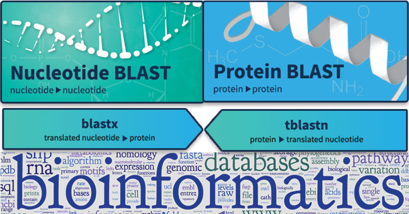
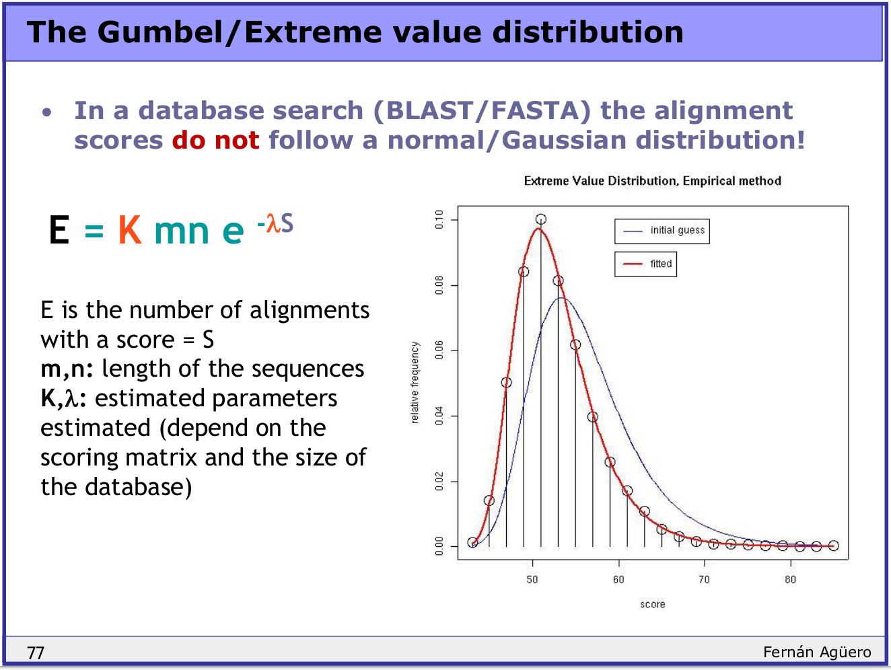
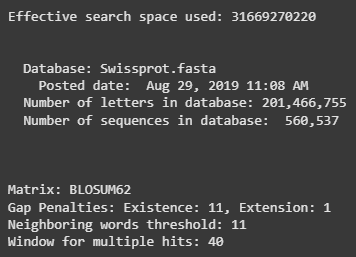
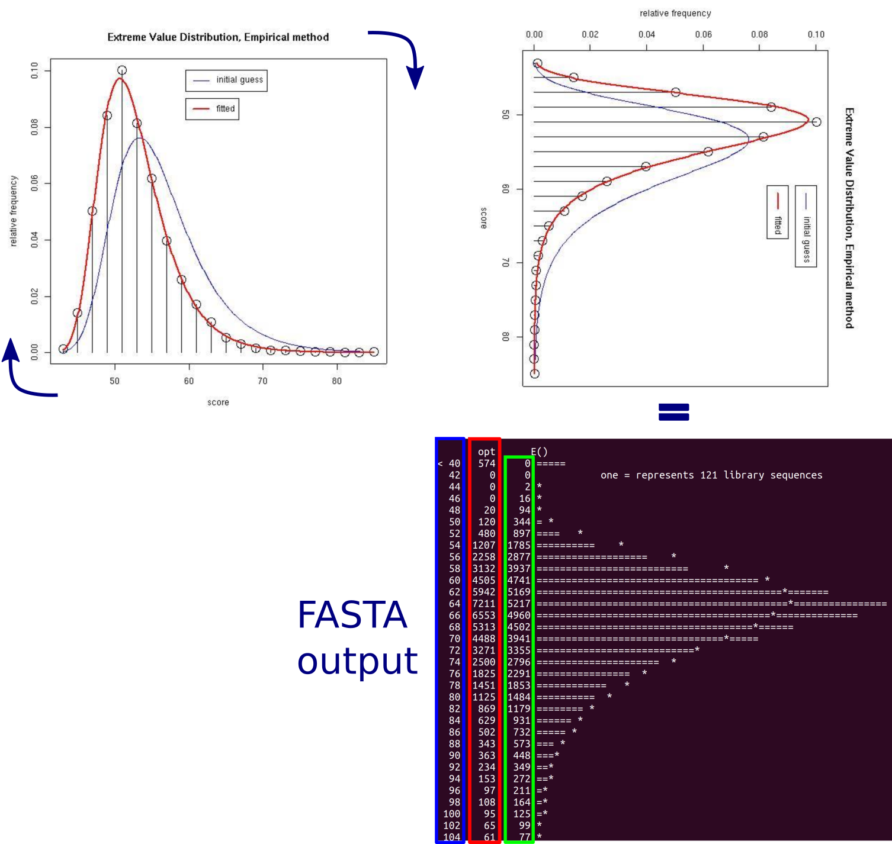
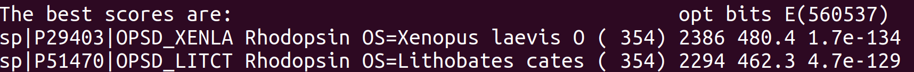

{ width="250", align="left" }

# **TP 4**. Búsqueda de secuencias por similitud { markdown data-toc-label = 'TP 4' }

<br>
<br>
<br>

!!! attention "Atención"
	Hay tiempo hasta el Lunes 31/08 a las 23:59 para responder el parcialito

[:fontawesome-solid-download: Parcialito](https://drive.google.com/drive/folders/12XmxoCv9hSTMIzvPr1yvfegAni_moJl7?usp=sharing){ .md-button .md-button--primary }

<!--
[:fontawesome-solid-download: Materiales](https://drive.google.com/drive/folders/12XmxoCv9hSTMIzvPr1yvfegAni_moJl7?usp=sharing){ .md-button .md-button--primary }
[:fontawesome-solid-computer: Google Colab](https://colab.research.google.com/drive/1sa7M4iYVhydk9xrzY4XZae4NhXXOshGa?usp=sharing){ .md-button .md-button--primary }
[:fontawesome-solid-file-powerpoint: Slides](https://docs.google.com/presentation/d/1aLdSql8KIhMJuJAoA8iRC6hJABwODWse7F31q3h2lB4/edit?usp=sharing){ .md-button .md-button--primary }
-->

<br>

## **Objetivos**

* Familiarizarse con el uso de programas de búsqueda de secuencias en bases de datos.
* Familiarizarse con el uso de parámetros estadísticos en relación a la búsqueda en bases de datos.
* Familiarizarse con el uso de BLAST por línea de comandos usando Google Colab.

## **Introducción a Bases de Datos de Proteínas**

La mayor base de datos de Uniprot es UniProtKB (UniProt KnowledgeBase) que está dividida en dos secciones: TrEMBL y Swiss-Prot.

- TrEMBL es una recolección de proteínas anotadas automáticamente que en su mayoría, aunque no de manera exclusiva, fueron obtenidas a partir de la traducción de secuencias nucleotídicas codificantes (CoDing Sequences, CDS) disponibles en GenBank.

	??? info "Recordatorio"
			
		 Una secuencia codificante (CDS) es una región de ADN o ARN cuya secuencia determina la secuencia de aminoácidos en una proteína. No se debe confundir con un marco abierto de lectura (Open Reading Frame, ORF) que es una región continua de codones de ADN que empiezan con un codón de inicio y termina con un codón stop. Todos los CDS son ORFs pero no todos los ORFs son CDS, por ejemplo, los ORFs incluye a los intrones.

- Swiss-Prot es una base de datos de proteínas que fueron revisadas y anotadas manualmente por un curador/a experto/a. Por lo tanto, Swiss-Prot contiene la información de más alta calidad para secuencias de proteínas.

TrEMBL brinda los datos crudos para que los curadores de Swiss-Prot los revisen. Por lo tanto, TrEMBL tiene más entradas que Swiss-Prot, pero carece de la anotación manual de un experto. En este TP trabajaremos con **Swiss-Prot**.

## Parte 1: Introducción a BLAST

!!! info 

	**El problema de la alineación de a pares**

	La comparación de secuencias biológicas es fundamental en bioinformática. Métodos como **Smith-Waterman** ofrecen una alineación óptima, pero su costo computacional es prohibitivo. Para dos secuencias de longitudes `n` y `m`, Smith-Waterman requiere `O(nm)` operaciones. Por ejemplo, alinear un ARN de 1000 nucleótidos contra un cromosoma de 100 megabases implicaría **cien mil millones** de cálculos intermedios.

	**Heurísticas: sacrificar exactitud por velocidad**

	**BLAST (Basic Local Alignment Search Tool)** y otros alineadores locales populares utilizan **heurísticas** para reducir drásticamente el espacio de búsqueda. La idea central es identificar rápidamente "semillas" o **"seeds"** —regiones cortas de coincidencia exacta o casi exacta— entre la secuencia **consulta (query)** y la **base de datos (database)**. Solo estas regiones prometedoras se extienden y evalúan con algoritmos más costosos. 
	
	En la práctica, BLAST encuentra alineamientos muy buenos de manera rápida pero matemáticamente no garantiza que sea el mejor. Si necesitas el alineamiento perfecto y exacto, hay que usar algoritmos como Smith-Waterman

	**K-tuplas o k-mers: las palabras de la secuencia**

	El primer paso de BLAST es dividir la secuencia consulta en todas sus **subcadenas de longitud fija `k`**. Estas subcadenas se conocen como **k-tuplas**, **k-mers** o **palabras (words)**.

	**La tabla hash: indexando la consulta**

	Para poder verificar rápidamente si un k-mer de la base de datos está presente en la consulta, BLAST construye una **tabla hash** (hash table) a partir de los k-mers de la consulta.

	**Función hash y buckets**

	Idealmente, se podría usar el k-mer como clave directa en un arreglo. Sin embargo, para proteínas (20 aminoácidos) y `k=10`, existen `20^10 ≈ 10^13` k-mers posibles, lo que requeriría **10 terabytes** de RAM solo para almacenar las posiciones.

	Para solucionarlo, se usa una **función hash** que transforma cada k-mer en un número entero más pequeño, que sirve como índice en un arreglo de buckets o slots. 

	**Almacenamiento de posiciones**

	Cada entrada de la tabla hash (cubeta) almacena una lista de las **posiciones** dentro de la secuencia consulta donde aparece ese k-mer (o sus vecinos). 

	**Vecinos (neighborhood): permitiendo coincidencias inexactas**

	BLAST no solo busca coincidencias exactas de k-mers. Introduce un **parámetro `T` (threshold o umbral)**. Para cada k-mer de la consulta, se calculan todos los **"k-mers vecinos"** cuya puntuación de alineación global contra el k-mer original sea al menos `T`. Las posiciones de estos vecinos también se almacenan en la tabla hash.

	Esto permite detectar semillas incluso con **sustituciones de aminoácidos o nucleótidos**, mejorando la sensibilidad a costa de un mayor tiempo de búsqueda.

	**Búsqueda en la base de datos (scanner)**

	Una vez construida la tabla hash de la consulta (con k-mers y vecinos), BLAST **escanea** secuencialmente cada secuencia de la base de datos. En cada posición, se extrae el k-mer de la base de datos, se aplica la misma función hash, y se **busca en la tabla hash**.

	*   Si el k-mer de la base de datos **no está** en la tabla, se descarta.
	*   Si **está** en la tabla (en una cubeta), se obtienen las posiciones en la consulta donde aparece. Esto constituye una **"semilla" (seed) o "hit"**.

	**Extensión y alineación final (seed-and-extend)**

	Este es el enfoque **"seed-and-extend"** común a todos los algoritmos basados en tablas hash.

	1.  **Semillas (seeds)**: Se identifican todos los pares de posiciones (una en la consulta, una en la base de datos) que comparten un k-mer (o vecino).
	2.  **Extensión**: Alrededor de cada semilla, se intenta **extender** la alineación hacia la izquierda y hacia la derecha, permitiendo gaps (inserciones/eliminaciones).
	3.  **Puntuación**: La extensión se evalúa usando una **matriz de sustitución** (como BLOSUM para proteínas) y se calcula una puntuación de alineación.
	4.  **Resultado**: Se seleccionan y reportan las extensiones con las puntuaciones más altas.


!!! info "Resumen del flujo de BLAST"

	1.  **Entrada**: Secuencia consulta y base de datos.
	2.  **Indexado**: Se divide la consulta en k-mers. Se construye una tabla hash con los k-mers y sus vecinos (según umbral `T`), almacenando las posiciones de cada uno.
	3.  **Scaneo**: Se recorren las secuencias de la base de datos. Para cada k-mer, se consulta la tabla hash.
	4.  **Detección de semillas**: Cada coincidencia (exacta o por vecino) genera una semilla (par de posiciones).
	5.  **Extensión**: Cada semilla se extiende en ambas direcciones para formar una alineación local.
	6.  **Salida**: Se reportan las alineaciones con las mejores puntuaciones (estatísticamente significativas).

### Ejercicio 1

Vamos a replicar manualmente una búsqueda de BLAST. En este ejercicio, vamos a construir un diccionario a partir de la siguiente secuencia:

```
matematica
```

Y luego vamos a realizar búsquedas contra el diccionario generado

### Extracción de todas las k‑tuplas

El primer paso es obtener las k-tuplas que hay en la frase. Para hacerlo, recorremos la cadena desde la posición `0` hasta `longitud - k`. Para este ejercicio, las k-tuplas tienen una longitud de 3 (k=3)

| Posición (i) | k‑tupla |
|--------------|---------------------|
| 0            | `mat`               |
| 1            | `ate`               |
| 2            | `tem`               |

#### ✏️ Paso 1: 
Ahora completa vos las siguientes k‑tuplas:

| Posición (i) | k‑tupla |
|--------------|---------------------|
| 3            | ___________________ |
| 4            | ___________________ |
| 5            | ___________________ |
| 6            | ___________________ |
| 7            | ___________________ |

### Construcción del diccionario hash
Un **diccionario** (tabla hash) tendrá como **clave** cada k‑tupla y como **valor** una **lista de posiciones** donde aparece esa k‑tupla. Si se repite, su lista debe contener **todas** las posiciones donde aparece.

| Clave  | Lista de posiciones |
|------------------|----------------------|
| `mat`            | [0]                  | 
| `ate`            | [1]                  |
| `tem`            | [2]                  |
| `ema`            | [3]                  |

La siguiente Clave es `mat`, asá que actualizo ese elemento en la lista de posiciones

| Clave  | Lista de posiciones |
|------------------|----------------------|
| `mat`            | [0, 4]               | 
| `ate`            | [1]                  |
| `tem`            | [2]                  |
| `ema`            | [3]                  |

#### ✏️ Paso 2: 
Ahora agregá el resto de las claves del diccionario:

| Clave (triplete) | Lista de posiciones |
|------------------|----------------------|
| `mat`            | [0]                  | 
| `ate`            | [1]                  |
| `tem`            | [2]                  |
| `ema`            | [3]                  |
|                  |                      |
|                  |                      |
|                  |                      |
|                  |                      |
|                  |                      |
|                  |                      |

### Búsqueda de consultas (queries) en el diccionario

Usaremos el diccionario para responder rápidamente si una palabra query existe y en qué posiciones.

Hagamos juntos el primer ejemplo con la query **`"mat"`**:

1. Buscamos la clave `"mat"` en el diccionario.
2. Encontramos que **sí existe** y su valor es `[0, 4]`.

#### ✏️ Paso 3: 
Ahora hace lo mismo con las siguientes queries:

| Query (triplete a buscar) | ¿Existe en el diccionario? (Sí / No) | Si existe, ¿en qué posición(es)? |
|---------------------------|--------------------------------------|-----------------------------------|
| `ate`                     |                                      |                                   |
| `ema`                     |                                      |                                   |
| `ati`                     |                                      |                                   |

---

## Parte 2: Exploración BLAST web 
!!! info
	Secciones principales de la interfaz

	**Encabezado común (Header)**

	Todas las páginas de BLAST comparten el mismo encabezado con cuatro pestañas principales:

	| Pestaña | Función |
	|---------|---------|
	| **Home** | Enlace a la página principal de BLAST |
	| **Recent Results** | Acceso a los resultados de búsquedas anteriores realizadas en la sesión actual del navegador |
	| **Saved Strategies** | Estrategias de búsqueda guardadas previamente (requiere cuenta My NCBI) |
	| **Help** | Documentación completa y ayuda sobre el uso de BLAST |

	**Sección "Web BLAST" (o "Basic BLAST")**

	Contiene los enlaces a los **cinco programas BLAST más comunes**:

	| Programa | Secuencia consulta (Query) | Base de datos (Database) | Uso principal |
	|----------|---------------------------|--------------------------|---------------|
	| **blastn** | Nucleótidos | Nucleótidos | Comparar ADN/ARN contra ADN/ARN |
	| **blastp** | Proteínas | Proteínas | Comparar proteínas contra proteínas |
	| **blastx** | Nucleótidos (traducido) | Proteínas | Traducir ADN a proteína y buscar en BD de proteínas |
	| **tblastn** | Proteínas | Nucleótidos (traducido) | Buscar proteína contra ADN traducido en 6 marcos |
	| **tblastx** | Nucleótidos (traducido) | Nucleótidos (traducido) | Traducir ambos y comparar a nivel proteico |

	**Sección "Specialized searches" (Búsquedas especializadas)**

	Contiene herramientas adicionales como:
	- **CD-search**: Identificación de dominios conservados
	- **bl2seq**: Alineamiento de dos secuencias (BLAST 2 Sequences)
	- **MegaBLAST**: Búsqueda rápida para secuencias muy similares
	- **Discontiguous MegaBLAST**: Para secuencias divergentes

	**Formulario de búsqueda**

	Al seleccionar un programa (ej. blastn), se despliega el formulario con varias secciones:

	a) **Query Input** (Ingreso de la consulta)
	- **Área de texto "Search"**: se pega la secuencia en formato FASTA, secuencia "cruda" o incluso un identificador NCBI
	- **Formato FASTA**: comienza con `>` seguido de una descripción, luego la secuencia
	- **Subrange**: permite seleccionar solo un fragmento de la secuencia consulta
	- **Carga de archivo**: se puede subir un archivo con una o varias secuencias

	b) **Database Selection** (Selección de base de datos)
	- **nr**: base de datos no redundante (la más usada)
	- **RefSeq Select**: transcriptos seleccionados de ratón, rata y humano
	- **Genomes**: genomas completos de organismos modelo
	- **Organism limit**: restringir por grupo taxonómico
	- **Sequence type exclusion**: excluir tipos de registros no deseados

	c) **Program Selection** (Selección del programa)
	- Para blastn, se puede elegir entre:
	- **Megablast** (secuencias muy similares, word size 28)
	- **Discontiguous megablast** (secuencias divergentes)
	- **blastn** (secuencias algo similares, word size 11)

	d) **Algorithm Parameters** (Parámetros del algoritmo)

	| Parámetro | Explicación | Efecto |
	|-----------|-------------|--------|
	| **Word size** | Longitud de la semilla inicial | Mayor → más rápido, menos sensible; Menor → más lento, más sensible |
	| **Expect (E-value)** | Umbral de significancia estadística | Default: 0.05. Menor → más estricto |
	| **Max target sequences** | Número máximo de resultados mostrados | Default: 100. Aumentar para ver más resultados |
	| **Gap open penalty** | Penalización por abrir un hueco | Afecta la cantidad y tamaño de gaps |
	| **Gap extend penalty** | Penalización por extender un hueco | Similar al anterior |
	| **Filtering / Masking** | Filtrado de regiones de baja complejidad | Se activa/desactiva en Algorithm Parameters |

	**Resultados de la búsqueda**

	Al finalizar la búsqueda, los resultados se organizan en varias secciones:

	1. **Descriptions**: Lista de secuencias con similitud, ordenadas por E-value
	2. **Graphic Summary**: Representación gráfica de los alineamientos
	3. **Alignments**: Alineamientos detallados entre query y cada hit
	4. **Taxonomy**: Distribución taxonómica de los resultados

### Ejercicio 2

Recibieron en el laboratorio una secuencia "incógnita" y deben identificarla usando BLAST. 
 
```
>secuencia_incognita
ATGGTGCACCTGACTCCTGAGGAGAAGTCTGCCGTTACTGCCCTGTGGGGCAAGGTGAACGTGGATGAAGTTGGTGGTGAGGCCCTGGGCAGGTTGGTATCAAGGTTACAAGACAGGTTTAAGGAGACCAATAGAAACTGGGCATGTGGAGACAGAGAAGACTCTTGGGTTTCTGATAGGCACTGACTCTCTCTGCCTATTGGTCTATTTTCCCACCCTTAGGCTGCTGGTGGTCTACCCTTGGACCCAGAGGTTCTTTGAGTCCTTTGGGGATCTGTCCACTCCTGATGCTGTTATGGGCAACCCTAAGGTGAAGGCTCATGGCAAGAAAGTGCTCGGTGCCTTTAGTGATGGCCTGGCTCACCTGGACAACCTCAAGGGCACCTTTGCCACACTGAGTGAGCTGCACTGTGACAAGCTGCACGTGGATCCTGAGAACTTCAGGGTGAGTCTATGGGACGCTTGATGTTTTCTTTCCCCTTCTTTTCTATGGTTAAGTTCATGTCATAGGAAGGGGATAAGTAACAGGGTACAGTTTAGAATGGGAAACAGACGAATGATTGCATCAGTGTGGAAGTCTCAGGATCGTTTTAGTTTCTTTTATTTGCTGTTCATAACAATTGTTTTCTTTTGTTTAATTCTTGCTTTCTTTTTTTTTCTTCTCCGCAATTTTTACTATTATACTTAATGCCTTAACATTGTGTATAACAAAAGGAAATATCTCTGAGATACATTAAGTAACTTAAAAAAAAACTTTACACAGTCTGCCTAGTACATTACTATTTGGAATATATGTGTGCTTATTTGCATATTCATAATCTCCCTACTTTATTTTCTTTTATTTTTAATTGATACATAATCATTATACATATTTATGGGTTAAAGTGTAATGTTTTAATATGTGTACACATATTGACCAAATCAGGGTAATTTTGCATTTGTAATTTTAAAAAATGCTTTCTTCTTTTAATATACTTTTTTGTTTATCTTATTTCTAATACTTTCCCTAATCTCTTCTTTTCAGGGCAATAATGATACAATGTATCATGCCTCTTTGCACCATTCTAAAGAATAACAGTGATAATTTCTGGGTTAAGGCAATAGCAATATCTCTGCATATAAATATTTCTGCATATAAATTGTAACTGATGTAAGAGGTTTCATATTGCTAATAGCAGCTACAATCCAGCTACCATTCTGCTTTTATTTTATGGTTGGGATAAGGCTGGATTATTCTGAGTCCAAGCTAGGCCCCTTTGCTAATCATGTTCATACCTCTTATCTTCCTCCCACAGCTCCTGGGCAACGTGCTGGTCTGTGTGCTGGCCCATCACTTTGGCAAAGAATTCACCCCACCAGTGCAGGCTGCCTATCAGAAAGTGGTGGCTGGTGTGGCTAATGCCCTGGCCCACAAGTATCACTAAGCTCGCTTTCTTGCTGTCCAATTTCTATTAAAGGTTCCTTTGTTCCCTAAGTCCAACTACTAAACTGGGGGATATTATGAAGGGCCTTGAGCATCTGGATTCTGCCTAATAAAAAACATTTATTTTCATTGC
```
  
#### ✏️ Pasos a seguir: 
1. Ingresen a [https://blast.ncbi.nlm.nih.gov/Blast.cgi](https://blast.ncbi.nlm.nih.gov/Blast.cgi)
2. Ingresen a "Nucleotide BLAST"
3. En la sección "Enter accession number(s), gi(s), or FASTA sequence(s)" ingrsá la secuencia incógnita indicada al comienzo del Ejercicio 2
4. Navegar hasta la sección inferior de la pantalla y apretar el botón "BLAST" para realizar la búqueda. Ejecute la búqueda sin cambiar ningún parámetro. 

!!! info "¿Qué estamos viendo?"

	**Secciones principales de los resultados de BLAST**

	A continuación se explican las cuatro pestañas principales que aparecen en la parte superior de la página de resultados:

	| Pestaña | ¿Qué contiene? | ¿Para qué sirve? |
	|---------|----------------|------------------|
	| **Descriptions** | Una tabla resumen con todas las secuencias que tienen similitud con tu consulta (query). | Es la vista rápida para identificar los mejores “hits”. Te dice el organismo, el puntaje, el E‑value y el porcentaje de identidad. |
	| **Graphic Summary** | Un gráfico de barras que muestra la posición de los alineamientos a lo largo de tu secuencia consulta. | Permite ver de un vistazo si la cobertura es completa o parcial, y si hay múltiples alineamientos en diferentes regiones. |
	| **Alignments** | Los alineamientos detallados entre tu secuencia y cada una de las secuencias de la base de datos. | Muestra par a par las coincidencias, sustituciones, inserciones y deleciones (gaps). Es donde se puede comprobar la calidad del alineamiento. |
	| **Taxonomy** | Un resumen de la distribución taxonómica de los resultados (dominio, filo, clase, etc.). | Ayuda a saber si los hits pertenecen a grupos relacionados o si hay contaminación con organismos de otros reinos. |

	Además, en la parte superior derecha suele haber enlaces a:
	- **Reports**: para cambiar el formato de visualización.
	- **Lineage**: para ver la jerarquía taxonómica.
	- **Organism**: para filtrar por organismo.
	- **Taxonomy**: para acceder al árbol taxonómico interactivo.

	**Análisis de la tabla "Descriptions"**

	La tabla que has obtenido para la secuencia de la β‑globina tiene las siguientes columnas:

	| Columna | Significado | Ejemplo de tu captura |
	|---------|-------------|------------------------|
	| **Description** | Nombre de la secuencia y organismo. | *Homo sapiens voucher Yoruba_9_0 hemoglobin subunit beta (HBB) gene complete cds* |
	| **Scientific Name** | Nombre científico del organismo. | *Homo sapiens* |
	| **Max Score** | Puntuación máxima del mejor alineamiento (contempla coincidencias y penalizaciones). | **2852** (muy alto) |
	| **Total Score** | Suma de puntuaciones si hay varios fragmentos alineados (suele coincidir con Max Score si solo hay un alineamiento). | **2852** |
	| **Query Coverage** | Porcentaje de tu secuencia consulta que está cubierta por el alineamiento. | **100%** (toda la secuencia se alinea) |
	| **E‑value** | Valor esperado: probabilidad de que este alineamiento se dé por azar en una base de datos del mismo tamaño. Cuanto más pequeño, mejor. | **0.0** (prácticamente cero) |
	| **Per. Ident** | Porcentaje de identidad (bases exactamente iguales) en el alineamiento. | **99.74%** (casi perfecta) |
	| **Acc. Len** | Longitud total del registro en la base de datos (en pb). | **1824** |
	| **Accession** | Identificador único de la secuencia en el NCBI. | *MK476483_1* |

#### ✏️ Preguntas para responder

1. **¿Qué gen has identificado con BLAST?** Nombra el gen completo y el organismo al que pertenece según el mejor hit (primer resultado).

2. **¿Por qué el primer resultado tiene un E‑value = 0.0 y un porcentaje de identidad del 99.74%?** Explica con tus palabras qué significa cada uno de estos valores.

3. **¿Qué significa que el "Query Coverage" sea del 100% en todos los primeros hits?** ¿Qué implicación tiene esto sobre la calidad de tu secuencia original?

4. **Observá los cinco primeros resultados. Todos tienen exactamente el mismo Max Score (2852) y Per. Ident (99.74%).** ¿Por qué hay múltiples entradas con los mismos valores si el organismo es el mismo (*Homo sapiens*)?

### Ejercicio 3

Realizaron un aislamiento bacteriano y obtuvieron la siguiente secuencia. El objetivo es identificar a que organismo pertenece.  

```
>proteina_incognita
MTMITDSLAVVLQRRDWENPGVTQLNRLAAHPPFASWRNSEEARTDRPSQQLRSLNGEWR
```

#### ✏️ Pasos a seguir: 
1. Ingresen a [https://blast.ncbi.nlm.nih.gov/Blast.cgi](https://blast.ncbi.nlm.nih.gov/Blast.cgi)
2. Ingresen a "Protein BLAST"
3. En la sección "Enter accession number(s), gi(s), or FASTA sequence(s)" ingresá la secuencia de la proteina incógnita indicada al comienzo del Ejercicio 3
4. Seleccionen la base de datos "UniProt/Swiss-Prot(swissprot)"
5. Navegar hasta la sección inferior de la pantalla y apretar el botón "BLAST" para realizar la búqueda. 

!!! info "Graphic Summary"
	El **Graphic Summary** es una representación visual de los alineamientos entre tu secuencia consulta (query) y las secuencias de la base de datos que han mostrado similitud. Esta vista te permite comprender rápidamente:

	- **Cobertura**: qué parte de tu secuencia está alineada.
	- **Calidad del alineamiento**: mediante colores que indican el puntaje (score).
	- **Distribución de los hits**: si hay múltiples alineamientos en diferentes regiones.
	- **Dominios conservados**: si tu proteína contiene regiones funcionales conocidas.

	**Elementos del Graphic Summary**

	En la parte superior del gráfico aparece una leyenda con rangos de puntuación:

	|Rango de Score | Significado |
	|----------------|-------------|
	| < 40 | Alineamiento muy débil |
	| 40 - 50 | Alineamiento moderadamente bajo |
	| 50 - 80 | Alineamiento aceptable |
	| 80 - 200 | Alineamiento bueno |
	| ≥ 200 | Alineamiento excelente  |

	**Interpretación:**  
	Cuanto más azul sea el puntaje, mayor será la coincidencia entre tu secuencia y la de la base de datos.

!!! info "Alignments"
	La pestaña **Alignments** muestra el alineamiento detallado **par a par** entre tu secuencia consulta (query) y cada una de las secuencias de la base de datos que han mostrado similitud. Esta sección te permite:

	- **Ver exactamente** qué aminoácidos o nucleótidos coinciden.
	- **Identificar sustituciones, inserciones y deleciones** (gaps).
	- **Evaluar la calidad del alineamiento** a nivel de residuo individual.
	- **Acceder a información complementaria** como estructuras 3D o dominios.

	En la parte superior de cada alineamiento aparece un recuadro con información clave sobre la secuencia de la base de datos que se está mostrando:

	| Elemento | Ejemplo en tu captura | Significado |
	|----------|------------------------|-------------|
	| **Nombre de la proteína** | `RecName: Full=Beta-galactosidase; Short=Beta-gal; AltName: Full=Lactase` | Nombre completo y sinónimos de la proteína. |
	| **Organismo** | `[Escherichia coli HS]` | Especie de la que proviene la secuencia. |
	| **Sequence ID** | `A7WZ1.1` | Identificador único en la base de datos del NCBI. |
	| **Length** | `1024` | Longitud total de la proteína (en aminoácidos). |
	| **Number of Matches** | `1` | Número de fragmentos alineados (si es 1, el alineamiento es continuo). |

	**Estadísticas del alineamiento**

	| Estadística | Valor en tu captura | Significado |
	|-------------|---------------------|-------------|
	| **Score** | `125 bits (313)` | Puntuación total del alineamiento. Se mide en bits (valor normalizado) y en unidades crudas. **125 bits es muy alto** (normalmente > 50 bits es significativo). |
	| **Expect (E‑value)** | `2e-34` | Valor esperado. La probabilidad de que este alineamiento se dé por azar en una base de datos de este tamaño. **2 × 10⁻³⁴** es extremadamente bajo, lo que indica que la coincidencia es **altamente significativa** y no es casual. |
	| **Method** | `Compositional matrix adjust.` | BLAST ha ajustado la matriz de sustitución (BLOSUM62) en función de la composición de aminoácidos de tu secuencia para mejorar la sensibilidad. |
	| **Identities** | `60/60 (100%)` | 60 de 60 aminoácidos coinciden exactamente. **100% de identidad** significa que tu fragmento es idéntico a esa región de la proteína de la base de datos. |
	| **Positives** | `60/60 (100%)` | 60 de 60 aminoácidos son similares (incluye sustituciones conservativas). Al ser 100%, indica que no hay ningún cambio, ni siquiera conservativo. |
	| **Gaps** | `0/60 (0%)` | No hay inserciones ni deleciones en el alineamiento. Es un alineamiento perfecto, sin huecos. |

	**El alineamiento visual (alineamiento par a par)**

	El bloque central muestra la comparación directa entre tu secuencia (Query) y la secuencia de la base de datos (Sbjct).

!!! info "Taxonomy"?

	La pestaña **Taxonomy** organiza los resultados de BLAST desde una perspectiva **filogenética y taxonómica**. Te presenta un **árbol jerárquico** que agrupa los hits según su clasificación biológica: desde el dominio más amplio (ej. Bacteria) hasta la especie más específica (ej. *Escherichia coli*).

	Esta vista es útil para:

	- **Identificar rápidamente** a qué grupo taxonómico pertenece tu secuencia.
	- **Detectar posibles contaminaciones** (ej. si tu secuencia de bacteria aparece mezclada con hits de hongos o mamíferos).
	- **Evaluar la diversidad** de organismos que comparten similitud con tu secuencia.
	- **Confirmar la identidad** de tu secuencia viendo que todos los hits relevantes se agrupan en el mismo taxón.

#### ✏️ Preguntas para responder

1. **¿Cuál es el nombre completo de la proteína** que aparece en el mejor hit (primer resultado)?
2. **¿A qué organismo pertenece** esa proteína?
3. **¿Cuál es el número de acceso (Accession)** del mejor hit?
4. Visualizando la pestaña Graphic Summary, **Según la escala de colores de tu captura (rojo = ≥ 200, verde = 80‑200, etc.), ¿qué colores predominan en las barras de los hits?** ¿Qué te dice eso sobre la calidad de los alineamientos?
5. Visualizando la pestaña "Alignments", **En el primer alineamiento detallado, ¿qué porcentaje de identidad y positividad (Positives) muestra el mejor hit?** ¿Hay algún gap (hueco)?
6. Visualizando la pestaña "Taxonomy", **Escribe la jerarquía taxonómica completa** desde el nivel más general (Bacteria) hasta el más específico (cepa) que aparece en los resultados.

---

## Parte 3: Uso de BLAST en la línea de comando

**BLAST**, tal como es distribuído por el **NCBI**, se encuentra disponible mediante el comando ``blastall``. Este comando necesita como mínimo tres argumentos para realizar una búsqueda:

* ``-i`` una secuencia *query* (recordar, i = input) 
* ``-d`` una base de datos con secuencias (recordar, d = database) 
* ``-p`` el tipo de busqueda (p = programa: *blastp*, *blastn*, *blastx*, etc.) 

??? tip "Tip"

	 Para ver una lista de los argumentos que acepta ``blastall`` prueben correr el comando sin argumentos. Si esto no les funciona pueden ver todos los argumentos haciendo click [aquí](https://www.genome.jp/tools-bin/show_man?blast2). Para una lista detallada de los comandos que acepta cada programa, pueden consultar [la página del NCBI](https://www.ncbi.nlm.nih.gov/books/NBK279684/).

??? info "Recordatorio: Estadística de los Alineamientos"

	¿Qué es un Expect value o **E-value**?

	El E-value (E) es un parámetro que describe el número de hits que uno espera encontrar por azar cuando está buscando en una base de datos de un tamaño particular. Este disminuye exponencialmente a medida que el Score (S) del alineamiento aumenta. Esencialmente el E-value describe el ruido de fondo aleatorio que está presente al realizar una búsqueda en una base de datos de secuencias. 

	Cuanto más pequeño sea el E-value, o más cercano a 0, más significativo resulta ser nuestro hit. Sin embargo, siempre hay que tener en cuenta que los alineamientos cortos tienen E-values relativamente altos, y esto es debido a que el E-value tiene en cuenta el largo de la secuencia *query*. Estos E-values tienen sentido porque las secuencias cortas tienen una probabilidad más alta de estar presentes en una base de datos puramente por azar.

	El E-value es un parámetro conveniente para establecer un umbral de significancia a la hora de reportar los resultados de una búsqueda en una base de datos. Uno puede cambiar el E-value umbral al listar los resultados de una búsqueda con BLAST. 

	Recordemos la fórmula para calcular el E-value (E) de la teórica.

	


### Ejercicio 4

#### ✏️ Paso 0
1. Abran Google Colab desde el navegador ([Google Colab](https://colab.research.google.com/)) 
2. Agreguen una celda de código y peguen los comandos necesarios para instalar los programas que vamos a usar

```bash
!sudo apt-get install -y ncbi-blast+-legacy
``` 

3. Ejecuten la celda y esperen a que se complete la instalación.
4. Descarguen la base de datos de SwissProt
```bash
# 1. Instalar gdown 
!pip install gdown

# 2. Descargar la base de datos
!gdown --id 1lNHS7B3wQZvym2oTtbTEV5v4TEtFe7DL

# 3. Descomprimir el archivo
!tar -xzvf /content/swissprot_db.tar.gz

# 4. Verificar la descarga
!ls -l /content/Swissprot_db/
``` 

#### ✏️ Paso 1
Como primer ejemplo podemos usar la secuencia *xlrhodop.pep* para realizar una búsqueda contra **Swiss-Prot**. Como estamos trabajando con una secuencia y una base de datos de proteínas, usamos ``blastp`` para realizar la busqueda: 

Descargar el archivo *xlrhodop.pep*
```bash
!wget "https://bioinformatica-iib.github.io/introduccion_bioinformatica/practicos/TP04_Busqueda_por_similitud/data/xlrhodop.pep"
``` 

Y ejecutar la búsqueda usando BLASTp de xlrhodop.pep contra la base de datos de SwissProt
```bash
!blastall -p blastp -i xlrhodop.pep -d Swissprot_db/Swissprot.fasta
``` 

!!! attention "Atención"

	 Este comando no se ejecutará correctamente si las secuencia xlrhodop y la base de datos **Swiss-Prot** no están en los directorios correctos. Chequeen donde está la base de datos, y si el comando no se ejecuta, especifiquen el camino o *path* completo.

#### ✏️ Paso 2
En este ejemplo, el resultado de la búsqueda es volcado en la consola (**stdout**). Para que el resultado aparezca en un archivo, podemos redireccionar **stdout** (usando ``>``, ver TP01-Linux) o usar la opcion ``-o`` (output).

```Bash
!blastall -p blastp -i xlrhodop.pep -d Swissprot_db/Swissprot.fasta -o xlrhodop.blastp
``` 

#### ✏️ Paso 3
Pueden ver el resultado del ``blastp``, por ejemplo, revisando las _n_ líneas del principio (head) o del final (tail):

```Bash
!head -n 10 xlrhodop.blastp
```

O pueden acceder desde la pestaña de Archivos

#### ✏️ Preguntas para responder
* **Inspeccionen el archivo y respondan:** ¿Qué indican las últimas líneas de este archivo?

* Si recuerdan cómo se computa el E-value, ¿cuál es la relevancia de reportar el tamaño de la base de datos (*number of letters*, *number of sequences*)?



!!! note "Nota"

	 El término ***neighboring words*** refiere a palabras "vecinas" o "cercanas", es decir con alta similitud de secuencia. 

!!! attention "Atención"

	 Si corren ``blastp`` sólo, es decir sin invocar primero al comando ``blastall``, van a poder realizar las mismas búsquedas pero los nombres de los argumentos del comando ``blastp`` sólo difieren de los de ``blastall -p blastp``. Por lo tanto, no les recomendamos correrlo de esta forma.

#### ✏️ Paso 4
Explore las siguientes opciones del programa ``blastp``:  

* ``-G`` Costo del gap open (*default*: 11)
* ``-E`` Costo del gap extend (*default*: 1)   
* ``-W`` Tamaño de la ktupla. (*default*: 3, puede variar entre 2 y 7)

!!! attention "Atención"

	 Hay tuplas de valores permitidos para los argumentos ``-G`` y ``-E``, no cualquier
    combinación de costos es válida.

* **Pruebe con distintas combinaciones de estos parámetros** y preste atención al impacto que esto tiene en los alineamientos reportados.

#### ✏️ Preguntas para responder

**a.** Si observa los primeros 20 hits de su búsqueda, ¿puede detectar alguna diferencia en los alineamientos reportados si cambia los parámetros indicados más arriba?

**b.** A medida que va descendiendo en la lista de los hits reportados (menor Score, mayor E-value), ¿qué patrones puede observar en los alineamientos que arroja BLAST?

**c.** Tome como ejemplo dos de los siguientes hits: 
	
	- OPSD_CARAU 
	- OPN4A_DANRE
	- OPN4_RUTRU

y complete para cada uno de los alineamientos reportados la siguiente tabla, teniendo en cuenta los diferentes **costos** de *gap open* y *gap extend* propuestos. 

|| Número total de gaps | Extensión de las regiones con gaps |
| :--: | :--: | :--: |
| Gap open: 6 + gap extend: 2 | |
| Gap open: 13 + gap extend: 1 | |

#### ✏️ Paso Opcional 

Evaluando el impacto del parámetro longitud de la k-tupla.

#### ✏️ Preguntas para responder

Para una misma combinación de costos para *gap open* y *gap extend* (pueden usar los valores default):

**a.** ¿Qué sucede con los valores de ktupla=2 y ktupla=7 ? 

**b.** ¿Cuál búsqueda es la que tarda más? ¿Cuál menos? 

**c.** ¿Cuántas secuencias devuelven?

Para los más curiosos, las respuestas a estas preguntas pueden hallarlas en el siguiente [link](https://docs.google.com/presentation/d/1ch3I2UmYGSnxt-Glk7ChnK2Lo8FQ5oK10FMNieFbkyA/edit?usp=sharing).


<!--
## **Introducción a FASTA**

!!! info "Curiosidad"

	 El nombre **FASTA** proviene de "FAST-All" porque funciona con cualquier alfabeto, esto significa que es una extensión de las herramientas originales para realizar alineamientos "FAST-P" (proteínas) y "FAST-N" (nucleótidos). El formato ".fasta" para almacenar secuencias de proteínas o nucleótidos se origina con el software **FASTA**, es por esto que llevan el mismo nombre. 

Al igual que **BLAST**, **FASTA** necesita los mismos tres argumentos obligatorios. Sin embargo, el paquete **FASTA** provee un comando ejecutable para cada tipo de búsqueda.
 
Comparación de programas en el paquete FASTA

**FASTA** permite comparar una secuencia proteica contra una base de datos de proteínas o una secuencia de ADN contra una base de datos de ADN (*Pearson and Lipman, 1988, Pearson, 1996*). La velocidad de la búsqueda y la selectividad están controladas por el parámetro ktup (*word size*). Para comparaciones entre proteínas, ktup=2 es el default, ktup=1 es más sensible pero más lento. Para comparaciones entre secuencias de ADN, ktup=6 es el default, ktup=3 o ktup=4 proveen una mayor sensibilidad, ktup=1 debe ser utilizado para oligonucleótidos (secuencias *query* de ADN de longitud < 20).

- **ssearch:** Compara una secuencia proteica contra una base de datos de proteínas o una secuencia de ADN contra una base de datos de ADN usando el algoritmo de Smith-Waterman (*Smith and Waterman, 1981*). 

- **fastx y fasty:** Compara una secuencia de ADN contra una base de datos de proteínas.

	 - *fasty* compara la secuencia de ADN traducida en 3 marcos de lectura, permitiendo gaps y *frameshifts* (cambios en el marco de lectura). Es más lento que *fastx* pero produce mejores alineamientos para secuencias de baja calidad ya que los *frameshifts* se admiten entre codones. 

	 - *fastx* usa un algoritmo más simple y rápido para alineamientos que permiten *frameshifts* sólo entre codones. 

* **tfastx:** Compara una secuencia proteica a una base de datos de ADN, calculando las similaridades con *frameshifts* para las orientaciones forward y reverse.  

* **tfasta:** Compara una secuencia proteica a una base de datos de ADN, calculando las similaridades (sin *frameshifts*) para los 3 forward y los 3 reverse ORFs. *tfastx* es preferido debido a que calcula las similaridades teniendo en cuenta *frameshifts*. 

* **fasts:** Compara un set pequeño de péptidos, obtenidos por ejemplo de un experimento de espectrometría de masas, contra una base de datos de proteínas (*fasts*) o de ADN (*tfasts*). 

### Ejercicio 2 

Ahora corramos la misma búsqueda del ejemplo anterior usando FASTA: 

```bash
!fasta -H Data/xlrhodop.pep Data/Swissprot_db/Swissprot.fasta > xlrhodop.fasta
```
Para interpretar correctamente el histograma que FASTA da como output tenemos que pensar que está **apaisado** (o rotado 90 grados en sentido horario) con respecto al típico histograma que muestra la distribución de scores para todas las secuencias halladas. Esto se ilustra en la siguiente figura.



**2.1** Responda a las siguientes preguntas con respecto al histograma **apaisado** que obtuvo como output:

**a.** ¿Qué valores se representan en el eje y (vertical)?

**b.** ¿Qué valores se representan en el eje x (horizontal)?

**c.** ¿Qué representan los asteriscos "\*" ?

**d.** ¿Qué representan los iguales "=" ? ¿Cuánto representa el "=" ?

**e.** ¿Qué es la <span style="color:blue;font-weight:bold;">primera columna</span> de números?, ¿por qué hay un "<" en la primera línea? y ¿por qué hay un ">" en la última?

**f.** ¿Qué es la <span style="color:red;font-weight:bold;">segunda columna</span> de números? (Pista: miren el número de iguales que hay en esa línea)

**g.** ¿Qué es la <span style="color:green;font-weight:bold;">tercera columna</span> de números?

**h.** ¿Qué es un *inset*? ¿Qué región del histograma está representada en el *inset*? ¿Cuánto representa el "=" en el *inset*?

**i.** ¿El valor del “=” en el *inset* es mayor o menor que en el resto del histograma? ¿Tiene sentido?

**2.2** ¿Por qué le parece que es relevante que se reporte el tamaño de la base de datos (**"x residues in y sequences"**) en el *header* del archivo de salida? 

**2.3** ¿Qué parámetros se utilizaron en esta corrida con FASTA?

**2.4** ¿En qué se diferencian las distribuciones esperadas y observadas? ¿Qué implica?

**2.5** ¿En qué región del histograma se ubican los puntajes de los alineamientos que consideramos más significativos (*hits* con mejor puntaje)?

**2.6** ¿Qué representa el número que está entre paréntesis en el E (ver figura más abajo)? ¿Cuál es el E-value para el mejor *hit*?


 
??? nota "**Diferencias entre BLAST y FASTA**"

	 * **ktup:** Tanto FASTA como BLAST usan una estrategia de búsqueda inicial basada en palabras cortas. **ktup** en FASTA es el parámetro que indica el tamaño de la palabra utilizada en esta búsqueda inicial.

	 	* FASTA utiliza por default ktup=2,
		* BLAST utiliza ktup=3.

		Sin embargo:

		* FASTA sólo considera identidades respecto a la palabra,
		* BLAST utiliza identidades y sustituciones conservativas.
		Por lo tanto BLAST con ktup=3 es en general más sensible que FASTA con ktup=2. FASTA con ktup=1 es más sensible, pero es también más lento.
	 
	 * **Matrices y scores:** BLAST y FASTA usan distintas matrices de *scoring* y *gap penalties* por *default* 

	 	* FASTA: BLOSUM50, gap open:-10, gap extend:-2
		* BLAST: BLOSUM62, gap open:-11, gap extend:-1. 

	 * **Estadísticas** Los parámetros *kappa* y *lambda* son centrales para estimar scores en BLAST y en FASTA.
	 	* FASTA calcula estos parámetros *on the fly* a partir de la base de datos (se tiene en cuenta el tamaño) y la matriz de *scoring*. Esto produce estadísticas más representativas, pero puede ser problemático para bases de datos pequeñas. Si la base de datos es de menos de 10 secuencias, FASTA no estima estos parámetros.
		* BLAST usa valores pre-calculados para estos parámetros, que fueron derivados a partir de simulaciones. 
	 * **Alineamientos:** 
	 	* BLAST puede mostrar varios alineamientos por cada par de secuencias (varios *high-scoring pairs* o HSPs) aunque por *default* sólo muestra el mejor,
		* FASTA únicamente reporta un alineamiento posible. 
	 * **Filtrado de secuencias de baja complejidad:** 

	 	* BLAST, por default, filtra secuencias de baja complejidad o repeticiones,
		* FASTA no filtra!
		
		Esto puede afectar la capacidad de discriminar falsos positivos, aunque FASTA provee otro tipo de opciones para manejar este tipo de casos. Ver la sección específica sobre este punto más abajo en la guía. 

	 * **Traducciones:**
	 	* *blastx* hace 6 búsquedas independientes (una en cada marco de lectura) 
		* *fastx3* y *fasty3* hacen una única búsqueda *forward* (o *reverse* usando ``-i``) que permite *frameshifts*. Estos últimos son más sensibles y pueden producir mejores alineamientos que *blastx* cuando se usan secuencias de baja calidad (lo mismo es cierto para *tblastn* vs *tfastx3* y *tfasty3*). 
	 * **Homólogos distantes:** 
	 	* En FASTA existe una opción (``-F``) que les permite ignorar (i.e. que no aparezcan en el output) secuencias altamente similares al *query*. Esto es útil, por ejemplo, para focalizar una búsqueda en las secuencias más divergentes.
		* En BLAST no existe una opción similar. 
	 * **Secuencias cortas:** Ya sea que busquen un *primer* (iniciador) o un péptido, si quieren utilizar BLAST o FASTA para esto, tengan en cuenta que BLAST es generalmente inútil al respecto. Esto es porque BLAST tiene un límite inferior sobre la longitud que puede tener una palabra (ktup). En el caso de nucleótidos, el límite inferior es 7 (el *default* es 11). En este sentido FASTA es mejor, porque siempre pueden usar ktup=1. Por otra parte, en el caso específico de péptidos, FASTA provee algunos algoritmos particulares de búsqueda (*fastf*, *fasts* y *tfasf*, *tfasts*).

!!! tip "Tip"

	 Usar un cuchillo en lugar de un destornillador, a veces puede funcionar, pero no deja de ser cierto que cada herramienta fue diseñada para un fin distinto. Si quieren realizar búsquedas de secuencias cortas prueben primero con *fuzznuc*, *fuzzpro* o *findpatterns* (todos parte de **EMBOSS**).

## **Filtrado de secuencias de baja complejidad**

Muchas secuencias son altamente repetitivas. Si la secuencia *query* contiene regiones de baja complejidad o repeticiones, es posible que una búsqueda encuentre muchas secuencias no relacionadas, con altos scores (por ej. *hits* contra colas de poly-A o regiones ricas en Prolina).
En otros casos, la secuencia puede contener un vector (plásmido) o repeticiones Alu, que ustedes pueden querer omitir en la búsqueda. 

**BLAST** permite filtrar el primer tipo de casos, mediante la opción ``-F``.

**FASTA** en cambio no provee esta alternativa. Es el usuario el que tiene que filtrar el *query* antes de realizar una búsqueda. 

### Ejercicio 3 

**3.1** Usar la proteína Groucho de Drosophila (grou_drome) para buscar secuencias similares en **Swiss-Prot** usando **BLAST**. Comparar los resultados obtenidos usando (``-F T``) y sin usar (``-F F``) la opción de filtrado que provee **BLAST**. 

* Observen el primer hit en las lista de los alineamientos resultantes y responda: ¿Qué pueden detectar de diferencia entre los dos comandos que corrieron?


**3.2** Ahora para repetir el mismo ejercicio con **FASTA**, tenemos que detectar y marcar las regiones de baja complejidad. Para esto se utiliza ``segmasker``: 

```bash
segmasker -in Data/grou_drome.fasta -outfmt fasta > grou_drome_lc.fasta
```

**3.3** Comparen las secuencias *grou_drome.fasta* y *grou_drome_lc.fasta* e identifiquen las diferencias. ¿Qué hizo *segmasker* con la secuencia? 

Ahora, podemos buscar secuencias similares en **Swiss-Prot** usando *grou_drome.fasta* (con opciones standard) y *grou_drome_lc.fasta* (usando la opción ``-S``). 

```bash
!fasta -H Data/grou_drome.fasta Data/Swissprot_db/Swissprot.fasta | head -74
print("\n")
!fasta -H -S grou_drome_lc.fasta Data/Swissprot_db/Swissprot.fasta | head -74
```

* Responda: ¿Qué diferencias encuentran en los histogramas de cada búsqueda? 

## **Bases de datos propias**

Tener acceso a **BLAST** o **FASTA** en la línea de comando les da la posibilidad de crear sus propias bases de datos para realizar búsquedas. 
**FASTA** puede realizar búsquedas sobre un archivo en formato *fasta* conteniendo varias secuencias sin ningún otro tipo de tratamiento. **BLAST**, sin embargo necesita contar con una base de datos indexada. ``formatdb`` es el comando que vamos a utilizar para generar los índices que **BLAST** necesita. 

### Adicional: Ejercicio 4

**4.1** Primero, vamos a generar un archivo *fasta* múltiple con algunas secuencias. Por ejemplo, para construir una base de datos con secuencias de opsinas podemos empezar con: 

```Bash
!seqret Data/Swissprot_db/Swissprot.fasta:ops* fasta::ops

!head ops
```
Esto debería generar un archivo FASTA múltiple conteniendo secuencias de opsinas. 

**4.2** Responda: ¿Cuántas secuencias tiene nuestra base de datos? 

Ahora para indexar el archivo ops (en formato *fasta*), usamos ``formatdb``, indicándole el archivo que contiene las secuencias (``-i``) y si el archivo contiene secuencias de ADN (``-p F``) o de proteínas (``-p T``). 

```Bash
!formatdb -i ops -p T
```

**4.3** Una vez indexada la base de datos, podemos hacer una búsqueda, por ejemplo, con nuestra ya conocida *xlrhodop.pep*

```Bash
!blastall -p blastp -d ./ops -i Data/xlrhodop.pep > xlrhodop.ops.blastp
```

Pueden ver las opciones que acepta el comando ``formatdb`` pidiendo ayuda: 

```Bash
!makeblastdb -help

```

## **BLAST con múltiples secuencias**

Si tienen un archivo con múltiples secuencias en formato *fasta*, pueden usarlo como *query* en una búsqueda, usando **BLAST**. 

### Adicional: Ejercicio 5 

**5.1** El archivo *opsv.fasta* contiene la secuencia de 4 fotorreceptores, usen este archivo para realizar una búsqueda, usando *blastp*, contra la base de datos **ops** que crearon en el ejercicio anterior. 

**5.2** El output generado consiste en 4 reportes de **BLAST**, concatenados en un único archivo. ¿Cómo pueden navegar fácilmente dentro del documento usando `sed`? 

!!! tip "Tip"

	 Tip: ¿qué palabras o conjunto de palabras ocurren una sola vez en cada reporte?

**5.3** Ahora puedo leer el reporte y manejarme bien dentro de él. Si quiero partirlo en 4 reportes individuales ¿Cómo hago? 

Tanto en Linux como en cualquier Unix, una manera de partir un archivo en varios usando un *pattern* es usando el comando `awk`: 

Dado un archivo llamado *blast.out*, podemos partirlo en varios usando la siguiente invocación: 

```Bash
!awk -v i=0 '/pattern/{i++}{print > "blast."i}' blast.out 
```
!!! attention "Atención"

	 Recuerden reemplazar "*pattern*" por el patrón que quieren utilizar para dividir el archivo y blast.out por el nombre del archivo que quieren partir.

¿Lo lograron?
-->
##  **Bibliografía**

- Tutorial de BLAST en la web del NCBI: [The Statistics of Sequence Similarity Scores](https://www.ncbi.nlm.nih.gov/BLAST/tutorial/Altschul-1.html)
