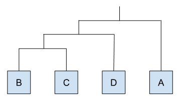
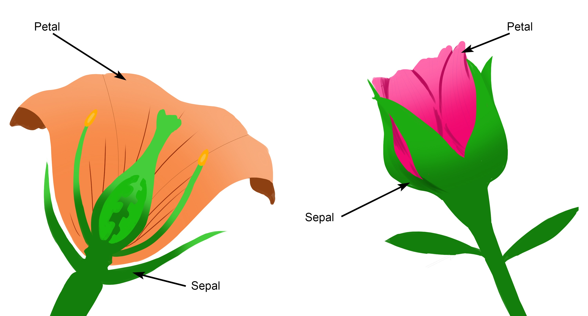
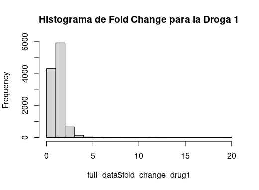
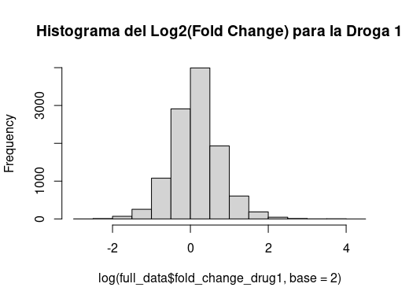
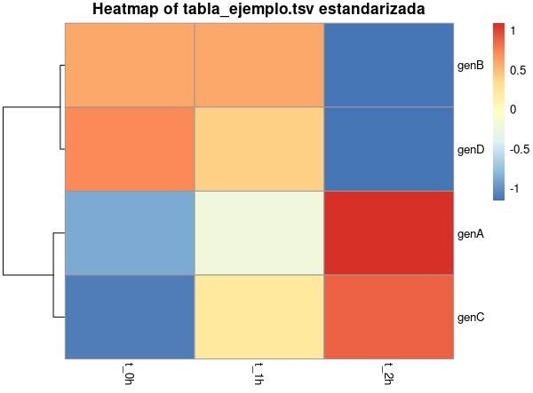
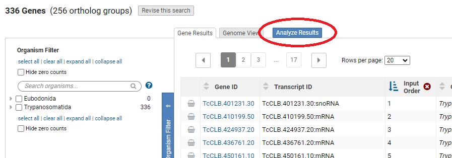

{ width="250", align="left" }

# **TP 5**. Clustering y Data Mining { markdown data-toc-label = 'TP 05' }

<br>
<br>
<br>

[:fontawesome-solid-download: Materiales](https://drive.google.com/file/d/1ezf6beXBVId14bUPcqUur8rHnend0g3-/view?usp=sharing){ .md-button .md-button--primary }  [:fontawesome-solid-file-powerpoint: Slides](https://docs.google.com/presentation/d/1vnhl53yQaSNsyjumxBXrl-GBp-17898aSnUL4DKltAM/edit?usp=sharing){ .md-button .md-button--primary }

!!! warning "Atención: Este TP tiene parcialito."

### Software a usar
* Python (ya instalado en la VM).
* Colab

### Librerías de Python a usar
* `pandas` (manejo de tablas de datos)
* `numpy` (operaciones numéricas)
* `matplotlib` y `seaborn` (plots)
* `scipy` (`scipy.cluster.hierarchy`, `scipy.spatial.distance`)
* `scikit-learn` (`sklearn.cluster.KMeans`, `sklearn.metrics.silhouette_*`)

### Recursos Online
* Introducción a **Python**, **TPP** de esta materia: [Parte 1](../TPPa_Programando_en_Biologia/index.md) y [Parte 2](../TPPb_Programando_en_Biologia/index.md)
* [Clustering jerárquico con scikit-learn](https://scikit-learn.org/stable/modules/clustering.html#hierarchical-clustering)
* [Silhouette score en scikit-learn](https://scikit-learn.org/stable/modules/generated/sklearn.metrics.silhouette_score.html)
* [Python for Everybody (Coursera)](https://www.coursera.org/specializations/python) (se puede hacer gratis, en ese caso no da certificado)
* pandas: [Introducción oficial (10 minutes to pandas)](https://pandas.pydata.org/docs/user_guide/10min.html) y [User Guide completa](https://pandas.pydata.org/docs/user_guide/index.html)
* Visualización con matplotlib/seaborn: [Tutorial de seaborn](https://seaborn.pydata.org/tutorial.html), [galería de matplotlib con detalles sobre tipos de plots](https://matplotlib.org/stable/gallery/index.html), [cheatsheets oficiales de matplotlib](https://matplotlib.org/cheatsheets/) e [información sobre colores y daltonismo](https://jfly.uni-koeln.de/color/)
* scipy.cluster.hierarchy: [Documentación de `dendrogram`](https://docs.scipy.org/doc/scipy/reference/generated/scipy.cluster.hierarchy.dendrogram.html)

### Objetivos

* Familiarizarse con el funcionamiento del *clustering jerárquico aglomerativo*.
* Familiarizarse con el método de clustering particional *K-means*.
* Explorar algunas medidas de calidad de los clusters, como la silueta o *silhouette*.
* Usar métodos de clustering con herramientas de programación para resolver problemas biológicos

## **Introducción al tema**

Hoy vamos a retomar el trabajo con **Python**. Recomendamos repasar o tener a mano los TPPs de esta materia por si necesitan recordar como hacer ciertos comandos ([Parte 1](../TPPa_Programando_en_Biologia/index.md) y [Parte 2](../TPPb_Programando_en_Biologia/index.md)).

Los experimentos biológicos nos permiten analizar miles a millones de interacciones biológicas a la vez, lo que resulta en tablas con millones de datos. Esto hace necesario entonces saber utilizar herramientas que nos permitan extraer, o *minar*, información de estos enormes conjuntos de datos. A este proceso lo vamos a denominar *Data Mining*.

Los métodos de clustering nos permiten agrupar elementos analizados en base a datos observados sobre ellos. Esto tiene muchas utilidades, como por ejemplos entender mejor las diferencias entre grupos conocidos, encontrar diferentes grupos dentro del conjunto datos analizado, o remover datos redundantes. El objetivo final de los métodos de clustering es identificar agrupamientos naturales en los datos con alguna relevancia biológica.

##  **Ejercicio 1 - Clustering Jerárquico Manual** { markdown data-toc-label='Ejercicio 1 - Clustering Manual' }

Para empezar este TP vamos a realizar un pequeño *clustering jerárquico* a mano para repasar el concepto.

En la siguiente tabla se reportan los niveles de expresión de cuatro genes (A, B, C y D) a las 0hs, 1hs y 2hs luego de algún tratamiento (aplicado a las 0hs):
 
<figure markdown>
| gen { data-sort-method='none' } | t_0h { data-sort-method='none' } | t_1h { data-sort-method='none' } | t_2h { data-sort-method='none' } |
| :---: | :---: | :---: | :---: |
| genA | 2 | 4 | 8 |
| genB | -1| -1 | -2 |
| genC | -2 | 0 | 1 |
| genD | 0 | -1 | -6 |
</figure>


Queremos entonces agrupar a los diferentes genes por como varían sus niveles de expresión cuando se aplica dicho tratamiento. Para hacer esto vamos a:

### ✏️ Paso 1. Calcular la distancia euclidiana entre los diferentes genes

??? info "Explicación Paso 1 - Distancia euclidiana"

    Es una de las varias formas de calcular una distancia entre dos vectores de datos, lo cual es necesario al momento de calcular una matriz de distancias. Por ejemplo, suponiendo que tenemos 2 vectores de forma $V = (x, y, z)$ la distancia euclidiana entre ellos se calcula como:

    $$
    distanciaEuclidiana(V_1, V_2) = \sqrt{(x_1 - x_2)^2 + (y_1 - y_2)^2 + (z_1 - z_2)^2}
    $$

    Aplicando esto a nuestros datos, la distancia entre los genes A y B se calcula como:

    $$
    distanciaEuclidiana(genA, genB) = \sqrt{(2 - (-1))^2 + (4 - (-1))^2 + (8 - (-2))^2} = 11,58
    $$

### ✏️ Paso 2. Construir una matriz de distancias

??? info "Explicación Paso 2 - Matriz de distancias"

    Es una matriz donde tanto las filas como las columnas representan un mismo conjunto de elementos y en cada intersección se pone la distancia (en nuestro caso euclidiana) entre dos elementos específicos. Es la base de muchos métodos de clustering.

    Para nuestros datos la matriz de distancias entre los cuatro genes es:

    | | genA { data-sort-method='none' } | genB { data-sort-method='none' } | genC { data-sort-method='none' } | genD { data-sort-method='none' } |
    | :---: | :---: | :---: | :---: | :---: |
    | genA | 0 | | | |
    | genB | 11,58 | 0 | | |
    | genC | 9 | 3,32 |0 | |
    | genD | 15 | 4,12 | 7,35 | 0 |

    Como el orden de los elementos es igual para las filas que para las columnas, en la diagonal se compara cada elemento contra sí mismo por lo que la distancia es 0. Por otro lado, estamos llenando solo la mitad de la matriz ya que las matrices de distancia son matrices simétricas, es decir, que el triángulo superior derecho de la matriz va a ser un reflejo del triángulo inferior izquierdo.

### ✏️ Paso 3. Agrupar usando *clustering jerárquico* donde el criterio de agregación va a ser "vecino más lejano" o *complete linkage*

??? info "Explicación Paso 3 - Criterios de agregación"

    Los criterios de agregación indican que operación hay que hacer al momento de calcular la distancia entre un nuevo elemento creado en una matriz de distancias y los ya existentes. Cada uno tiene sus ventajas y desventajas.

    Siguiendo con nuestro ejemplo, si queremos calcular la distancia entre el nuevo elemento **"genB+C"** y el **"genA"**:

    * **Single Linkage:** la nueva distancia es la ***menor*** entre las distancias $dist(genA, genB)$ y $dist(genA, genC)$
    * **Complete Linkage:** la nueva distancia es la ***mayor*** entre las distancias $dist(genA, genB)$ y $dist(genA, genC)$
    * **Average Linkage:** la nueva distancia es el ***promedio*** de las distancias $dist(genA, genB)$ y $dist(genA, genC)$

??? info "Explicación Paso 3 - Clustering jerárquico"

    El *clustering jerárquico* es una forma de agrupar elementos dependiendo de que tan similares son entre ellos. Usa un algoritmo bastante sencillo de entender que se basa en una matriz de distancias:

    1. Sin considerar a la diagonal, encontrar el par de elementos (fila, columna) que son más similares entre sí (el menor número en la matriz de distancias). En nuestra matriz de distancias los elementos más parecidos son **"genB"** y **"genC"** ya que tienen la menor distancia (3,32)

    2. Dejar constancia de dicha similitud y reconstruir la matriz, reemplazando ambos elementos por uno nuevo (saco los elementos **"genB"** y **"genC"** y agrego el elemento **"genB+C"**)

    3. Al momento de calcular la nueva distancia entre este nuevo elemento (**"genB+C"**) y el resto de los elementos de la matriz, usar algún criterio de agregación (por ejemplo: *single linkage*, *average linkage* o *complete linkage*)

    4. Volver al paso 1 hasta que todos los elementos estén unidos entre sí

    Una vez hecho esto puedo dibujar el *clustering jerárquico* teniendo en cuenta qué elementos se juntaron con qué elementos.


### ✏️ Paso 4. Armar un esquema del dendograma o árbol de similitud que resulta de este clustering

### ✏️ Paso 5. Repetir todo lo anterior, pero estandarizando previamente los datos de niveles de expresión

Para simplificar las cuentas durante la clase, les dejamos acá la tabla con los datos estandarizados. Para estandarizar, restamos a cada dato el promedio de los tres tiempos para ese gen y dividimos el resultado por la desviación estándar de los tres tiempos para ese gen, es decir:

$$
datoEstandarizado(genA, t_0) = \frac{dato(genA, t_0) - promedio(genA)}{desviacionEstandar(genA)}
$$

<figure markdown>
| gen { data-sort-method='none' } | t_0h { data-sort-method='none' } | t_1h { data-sort-method='none' } | t_2h { data-sort-method='none' } |
| :---: | :---: | :---: | :---: |
| genA | -0.87 | -0.22 | 1.09 |
| genB | 0.58 | 0.58 | -1.15 |
| genC | -1.09 | 0.22 | 0.87 |
| genD | 0.73 | 0.41 | -1.14 |
</figure>


### ✏️ Pregunta 1

    Comparando los agrupamientos obtenidos con los datos estandarizados y sin estandarizar. ¿Qué diferencias observan?

### ✏️ Pregunta 2

    ¿Cuál de los dos agrupamientos les parece mejor para este escenario donde queríamos evaluar cómo afecta un tratamiento los niveles de expresión de diferentes genes?

### ✏️ Pregunta 3

    ¿Les parece qué es siempre correcto estandarizar los datos de esta forma o se les ocurre escenarios donde no es así?


## **Ejercicio 2 - Agrupando flores por especies** { markdown data-toc-label='Ejercicio 2 - Agrupando flores por especies' }

### Introducción al data set

En este ejercicio vamos a trabajar una vez más con el data set **iris**, un set de datos clásico que no viene incluido con Python, pero que podemos cargar fácilmente usando la librería `seaborn` (o alternativamente `scikit-learn`).

Este data set contiene las medidas de ancho (*width*) y largo (*length*) de los sépalos y los pétalos para 3 especies de flores diferentes: setosa, versicolor, y virginica (todas del Genus *Iris*). Tiene mediciones de 150 flores, 50 por especie.

!!! info "Nombres de las columnas en Python"

    Al cargar el dataset con `seaborn` en **Python**, las columnas van a llamarse en minúscula y separadas por guión bajo: `sepal_length`, `sepal_width`, `petal_length`, `petal_width` y `species`. Vamos a usar esta convención (llamada *snake_case*) durante todo el TP.


??? info "¿Qué son los sépalos y los pétalos?"

    <figure markdown>
    { max-width="400" }
    </figure>

Antes que nada vamos a familiarizarnos un poco con este data set.

### ✏️ Código 1.

Corran el siguiente código y vean el plot resultante:

```python
import pandas as pd
import seaborn as sns
import matplotlib.pyplot as plt

# Cargo el dataset iris como un DataFrame de pandas
df_iris = sns.load_dataset("iris")

# Defino a mano los colores para cada especie
colores_especies = {"setosa": "#004D40", "versicolor": "#D81B60", "virginica": "#FFC107"}

# Hago un plot comparando el largo de los sépalos y los pétalos
# Estoy cambiando el color según la especie
fig, ax = plt.subplots(figsize=(8, 7))
sns.scatterplot(data=df_iris, x="sepal_length", y="petal_length", hue="species",
                 palette=colores_especies, s=60, ax=ax)
ax.set_xlabel("Sepal Length")
ax.set_ylabel("Petal Length")
ax.set_title("Sepal Length vs Petal Length per Species", fontsize=16, loc="center")
ax.tick_params(axis="both", labelsize=12)
ax.xaxis.label.set_size(14)
ax.yaxis.label.set_size(14)

plt.show()
```

Podemos ver que al graficar el largo de los pétalos y los sépalos ya se observan diferencias entre las especies.

Es posible agregar una tercera dimensión para graficar otra de las variables, e incluso agregar la cuarta variable como "tamaño" de los diferentes puntos, pero dichos plots van a resultar considerablemente más complejos al momento de leerlos.

### ✏️ Código 2. Clustering Jerárquico Complete linkage

Supongamos que no conocemos a que especie corresponde cada línea (es decir, no existe la columna **species** en la tabla), pero sospechamos que son tres especies.

Vamos a usar métodos de clustering para tratar de recuperar lo mejor que podamos los tres grupos de flores.

En este TP vamos a hacer un *poco de trampa* y vamos a comparar visualmente los resultados de los distintos métodos de clustering con lo que nosotros ya sabemos que es verdad (es decir, vamos a comparar con el dato de especie).

Vamos a tener que hacer varios plots similares, por lo tanto, en vez de repetir el código, vamos a usar por primera vez funciones de **Python** creadas por nosotros.

#### ✏️ Paso 1. Crear la función de Python.

Copien el siguiente código en el colab y modifiquen las secciones que dicen `@@EDITAR@@`. Tienen que asignar a cada parámetro de la función el valor que quieren graficar en el **eje x** y en el **eje y**, por ejemplo `x_col = "sepal_length"`. Una vez hecho esto, corran el código repetir el gráfico hecho en el **Código 1** y guardarlo en un archivo llamado **01_Sepal_vs_Petal_Length_per_Species.pdf**.

=== "Código"

    ```python
    import pandas as pd
    import seaborn as sns
    import matplotlib.pyplot as plt

    #### FUNCIONES AUXILIARES ####
    def plot_data_to_pdf_w_color(data, x_col, y_col, color_col,
                                  x_label, y_label, plot_title,
                                  pdf_file, palette=None):
        fig, ax = plt.subplots(figsize=(8, 7))
        sns.scatterplot(data=data, x=x_col, y=y_col, hue=color_col,
                         palette=palette, s=60, ax=ax)
        ax.set_xlabel(x_label, fontsize=14)
        ax.set_ylabel(y_label, fontsize=14)
        ax.set_title(plot_title, fontsize=16, loc="center")
        ax.tick_params(axis="both", labelsize=12)

        fig.savefig(pdf_file)
        plt.close(fig)

    #### CODIGO PRINCIPAL ####
    df_iris = sns.load_dataset("iris")

    plot_data_to_pdf_w_color(data=df_iris,
                              x_col="@@EDITAR@@",
                              y_col="@@EDITAR@@",
                              color_col="@@EDITAR@@",
                              x_label="@@EDITAR@@",
                              y_label="@@EDITAR@@",
                              plot_title="@@EDITAR@@",
                              pdf_file="01_Sepal_vs_Petal_Length_per_Species.pdf",
                              palette={"setosa": "#004D40", "versicolor": "#D81B60", "virginica": "#FFC107"})
    ```

=== "Código con comentarios"

    ```python
    import pandas as pd
    import seaborn as sns
    import matplotlib.pyplot as plt

    #Estoy usando comentarios rodeados de cuatro numerales para delimitar secciones de mi código
    #Esto no es puramente estético, sino que también ayuda a la navegación del código en editores como VS Code
    #### FUNCIONES AUXILIARES ####
    def plot_data_to_pdf_w_color(data, x_col, y_col, color_col,
                                  x_label, y_label, plot_title,
                                  pdf_file, palette=None):
        #En seaborn no existe una función *aes()* separada: los parámetros x, y, hue, etc. de
        #*scatterplot()* cumplen ese rol, y como reciben strings, son ideales para cuando el
        #nombre de la columna a usar está guardado en una variable (como acá con x_col, y_col, color_col)
        fig, ax = plt.subplots(figsize=(8, 7))
        sns.scatterplot(data=data, x=x_col, y=y_col, hue=color_col,
                         palette=palette, s=60, ax=ax)
        ax.set_xlabel(x_label, fontsize=14)
        ax.set_ylabel(y_label, fontsize=14)
        ax.set_title(plot_title, fontsize=16, loc="center")
        ax.tick_params(axis="both", labelsize=12)

        #*fig.savefig()* es el equivalente a abrir un archivo pdf, imprimir el plot y cerrarlo,
        #todo en un solo paso. La extensión del archivo (.pdf) determina el formato de salida
        fig.savefig(pdf_file)
        #*plt.close()* libera la figura de la memoria, algo similar en espíritu a *dev.off()* en R
        plt.close(fig)

    #### CODIGO PRINCIPAL ####
    df_iris = sns.load_dataset("iris")

    plot_data_to_pdf_w_color(data=df_iris,
                              x_col="@@EDITAR@@",
                              y_col="@@EDITAR@@",
                              color_col="@@EDITAR@@",
                              x_label="@@EDITAR@@",
                              y_label="@@EDITAR@@",
                              plot_title="@@EDITAR@@",
                              pdf_file="01_Sepal_vs_Petal_Length_per_Species.pdf",
                              palette={"setosa": "#004D40", "versicolor": "#D81B60", "virginica": "#FFC107"})
    ```

#### ✏️ Paso 2.

Usando la función que acabamos de crear, vean como se distribuyen los puntos al comparar **sepal_width** contra **petal_width**. Guarden este plot en un archivo llamado **02_Sepal_vs_Petal_Width_per_Species.pdf**.


#### ✏️ Paso 3. Agregar IDs.

Un problema que tenemos es que por ahora no hay ninguna forma de identificar a una fila específica, así que le vamos a agregar un ID numérico a cada fila. Debido al orden que tienen las filas de **df_iris**, los primeros 50 IDs van a corresponder a flores de la especie setosa, los segundos 50 a versicolor y los últimos a virginica (aunque supuestamente esto no lo sabemos).

**4)** Corran el siguiente código para crear la matriz de datos que vamos a usar al momento de clusterizar. Lean los comentarios en la segunda pestaña para entender que estamos haciendo.

=== "Código"

    ```python
    df_iris["row_id"] = range(1, len(df_iris) + 1)

    columnas_ordenadas = ["row_id"] + [c for c in df_iris.columns if c != "row_id"]
    df_iris = df_iris[columnas_ordenadas]

    matriz_datos = df_iris.drop(columns=["species"]).set_index("row_id")
    ```

=== "Código con comentarios"

    ```python
    #Agregamos una nueva columna denominada row_id que tiene un numero entre 1 y 150
    #len(df_iris) es una función de Python que me devuelve el numero de filas en la tabla
    #El numero de filas también se puede conseguir haciendo df_iris.shape[0]
    df_iris["row_id"] = range(1, len(df_iris) + 1)

    #Aca estamos cambiando el orden de las columnas de df_iris, moviendo row_id al principio
    #(el resto de las columnas quedan en el mismo orden relativo en el que estaban)
    columnas_ordenadas = ["row_id"] + [c for c in df_iris.columns if c != "row_id"]
    df_iris = df_iris[columnas_ordenadas]

    #Similar a lo que hicimos en el TP anterior, estamos usando row_id como índice de la tabla
    #(el equivalente a los "nombres de fila" o rownames de R)
    #Estamos sacando la columna species ya que queremos simular que no tenemos esta información
    #(la columna species va a estar todavía en df_iris, pero no en matriz_datos)
    matriz_datos = df_iris.drop(columns=["species"]).set_index("row_id")
    ```

#### ✏️ Paso 4. Cálculo de distancias.

Usando la matriz de datos recién creada (`matris_datos`), vamos a crear la matriz de distancias euclidianas usando las funciones `pdist()` y `squareform()` de `scipy.spatial.distance`.

=== "Código"

    ```python
    from scipy.spatial.distance import pdist, squareform

    distancias_condensadas = pdist(matriz_datos.values, metric="euclidean")
    matriz_distancias = squareform(distancias_condensadas)
    ```

=== "Código con comentarios"

    ```python
    from scipy.spatial.distance import pdist, squareform # Importo las funciones pdist y squareform de la librería scipy.spatial.distance

    # Uso la función pdist para calcular las distancias euclidianas (metric="euclidean)
    distancias_condensadas = pdist(matriz_datos.values, metric="euclidean")
    
    # pdist devuelve las distancias en formato condensado, sin repetir la mitad simétrica ni la diagonal.

    # Agrego la mitad simétrica y la diagonal usando squareform
    matriz_distancias = squareform(distancias_condensadas)
    ```

#### ✏️ Paso 5. Clustering jerárquico.

Lo primero que vamos a hacer es un **clustering jerárquico** para agrupar a las 150 filas en 3 grupos según los valores de las 4 medidas. El criterio de agregación será *complete linkage*.

Para esto se utiliza la función `linkage()` de `scipy.cluster.hierarchy`, de la siguiente manera:

=== Código

    ```python
    from scipy.cluster.hierarchy import linkage

    clustering_jerarquico = linkage(distancias_condensadas, method="complete")
    ```

=== Código con comentarios

    ```python
    from scipy.cluster.hierarchy import linkage # importo la función linkage de la librería scipy.cluster.hierarchy

    # uso la función linkage para realizar el clustering jerárquico con el criterio de agregación complete linkage (method="complete")
    clustering_jerarquico = linkage(distancias_condensadas, method="complete")
    ```


<!--
Donde `method = "complete"` está indicándole a la función que criterio de agregación usar al momento de combinar elementos. 
-->

Pueden usar `help(linkage)` o consultar la [documentación de scipy](https://docs.scipy.org/doc/scipy/reference/generated/scipy.cluster.hierarchy.linkage.html) para ver otros posibles criterios.


#### ✏️ Paso 6. Creación del dendrograma.

Usen la función `dendrogram()` (también de `scipy.cluster.hierarchy`) para plotear `clustering_jerarquico`. Usen el parámetro `ax.set_title()` para cambiarle el título al plot indicando que es un *clustering jerárquico*, que usa *complete linkage*.

=== "Código"

    ```python
    from scipy.cluster.hierarchy import dendrogram
    import matplotlib.pyplot as plt

    fig, ax = plt.subplots(figsize=(10, 6))
    dendrogram(clustering_jerarquico, ax=ax)
    ax.set_title("Clustering Jerárquico - Complete Linkage")
    plt.show()
    ```

=== "Código con comentarios"

    ```python

    from scipy.cluster.hierarchy import dendrogram # importo la función dendrograma de la librería scipy.cluster.hierarchy
    import matplotlib.pyplot as plt # importo matplotlib.pyplot como plt para poder graficar

    fig, ax = plt.subplots(figsize=(10, 6))
    dendrogram(clustering_jerarquico, ax=ax)
    ax.set_title("Clustering Jerárquico - Complete Linkage")
    plt.show()
    ```

##### ✏️ Pregunta

Mirando el plot recién creado, ¿les es fácil distinguir a simple vista los tres grupos de especies en el clustering jerárquico? (recuerden que pueden hacer zoom sobre la figura para agrandarla).


#### ✏️ Paso 7. Mejorando el gráfico del dendrograma.

<!--
#### Mejorar el plot del clustering jerárquico { markdown data-toc-label='Mejorar el plot' }
-->
Acá vamos a hacer un poquito de trampa y vamos a usar la información que no tenemos, es decir la columna **species**.

Vamos a colorear cada flor dependiendo de su especie. La función `dendrogram()` no colorea las etiquetas por sí sola en base a una variable externa, pero podemos hacerlo coloreando manualmente las etiquetas del eje después de graficar el dendrograma:

=== "Código"

    ```python
    import numpy as np
    from scipy.cluster.hierarchy import dendrogram
    import matplotlib.pyplot as plt

    colores_especies = {"setosa": "#004D40", "versicolor": "#D81B60", "virginica": "#FFC107"}
    colores_por_fila = df_iris["species"].map(colores_especies).values

    fig, ax = plt.subplots(figsize=(18, 6))
    resultado_dendro = dendrogram(clustering_jerarquico, labels=df_iris["row_id"].values, ax=ax)

    orden_hojas = resultado_dendro["leaves"]
    colores_ordenados = colores_por_fila[orden_hojas]

    for etiqueta, color in zip(ax.get_xticklabels(), colores_ordenados):
        etiqueta.set_color(color)
        etiqueta.set_fontsize(6)

    ax.set_title("Clustering Jerárquico - Complete Linkage - Color per Species")

    pdf_file = "11_Clustering_jerarquico_complete_linkage.pdf"
    fig.savefig(pdf_file, bbox_inches="tight")
    plt.close(fig)
    ```

=== "Código con comentarios"

    ```python
    import numpy as np
    from scipy.cluster.hierarchy import dendrogram
    import matplotlib.pyplot as plt

    #Estoy asumiendo que guardaron la salida de linkage() en una variable llamada clustering_jerarquico
    #De no ser así, cambien el nombre de la variable a continuación por lo que corresponda

    #Armo un diccionario que asigna un color a cada especie, y lo aplico a la columna species
    #para tener un color por fila, en el mismo orden que las filas de df_iris
    colores_especies = {"setosa": "#004D40", "versicolor": "#D81B60", "virginica": "#FFC107"}
    colores_por_fila = df_iris["species"].map(colores_especies).values

    fig, ax = plt.subplots(figsize=(18, 6))
    #dendrogram() nos devuelve un diccionario con información del plot, entre otras cosas el
    #orden final en el que quedaron las hojas (leaves) en el eje X
    resultado_dendro = dendrogram(clustering_jerarquico, labels=df_iris["row_id"].values, ax=ax)

    #Reordeno los colores para que coincidan con el orden en que quedaron las hojas en el dendrograma
    orden_hojas = resultado_dendro["leaves"]
    colores_ordenados = colores_por_fila[orden_hojas]

    #Recorro las etiquetas del eje X y les asigno el color y tamaño de fuente correspondiente
    #(esto es lo que en R se lograba con dendextend::labels_colors())
    for etiqueta, color in zip(ax.get_xticklabels(), colores_ordenados):
        etiqueta.set_color(color)
        etiqueta.set_fontsize(6)

    ax.set_title("Clustering Jerárquico - Complete Linkage - Color per Species")

    #Guardo la figura en un pdf y cierro la figura
    pdf_file = "11_Clustering_jerarquico_complete_linkage.pdf"
    fig.savefig(pdf_file, bbox_inches="tight")
    plt.close(fig)
    ```

#### ✏️ Pregunta.

Abran el archivo **11_Clustering_jerarquico_complete_linkage.pdf**. ¿Pueden ahora distinguir los tres grupos de especies en el clustering jerárquico? ¿Cuáles especies les parecen mejor agrupadas? (los colores de las especies corresponden al color usado en los gráficos anteriores.


#### ✏️ Paso 8. Clustering Jerárquico single linkage

Hasta el momento sólo utilizamos *complete linkage* al momento de hacer nuestros clustering jerárquicos, ahora vamos a realizar el clustering usando otro criterio de agregación, por ejemplo el *single linkage*. Para esto:

1. Vuelvan a correr la función `linkage()` pero ahora usen `method = "single"`. Guarden el clustering resultante en una nueva variable (`clustering_jerárquico_single`).
2. Crear un archivo que contenga al dendrograma hecho a partir del clustering jerárquico que usa *single linkage* como criterio de agregación. Nombren a este archivo **12_Clustering_jerarquico_single_linkage.pdf**.

<!--
```python
clustering_jerarquico_single = linkage(distancias_condensadas, method="single")
```
-->

##### ✏️ Pregunta

¿Qué diferencias ven entre este dendrograma y el anterior? ¿Pueden relacionar estas diferencias con lo que saben de *single linkage* y *complete linkage*?


##### ✏️ Pregunta

Ignorando los colores, ¿cuál les parece el mejor criterio de agregación para este caso donde queremos recuperar tres clusters?


####  ✏️ Paso 9. Asignar clusters.

Cuando uno mira el dendrograma se puede ver que ciertas flores son más similares entre sí que otras, y podemos suponer que entonces pertenecen a un mismo grupo.

Esto se puede calcular computacionalmente "cortando" el dendrograma usando un *cierto umbral de similitud* y agrupando en un mismo *cluster* a aquellos elementos que queden por debajo de ese umbral.

Esto se puede hacer de dos formas, o determinando el umbral de similitud o determinando la cantidad de *clusters* a crear. En Python esto se hace con la función `fcluster()` de `scipy.cluster.hierarchy`:

```python
from scipy.cluster.hierarchy import fcluster

clusters_por_altura = fcluster(clustering_jerarquico, criterion="distance", t=@@EDITAR@@)
clusters_por_cantidad = fcluster(clustering_jerarquico, criterion="maxclust", t=@@EDITAR@@)
```

Donde:

* `criterion="distance"` con `t` recibe la **altura de similitud** a la cual cortar (eje y en el plot anterior)
* `criterion="maxclust"` con `t` recibe la **cantidad de clusters** a crear.


####  ✏️ Paso 10.Hacer clusters y gráficos

Por último vamos a querer recrear el gráfico de puntos generado en los pasos **agregar el nro de paso**, pero ahora mostrando información tanto de las especies originales (con el color) como de la agrupación resultante del clustering jerárquico (con la forma). Vamos a utilizar los datos del clustering jerárquico que usa el criterio de agregación *complete linkage*.

1. Lo primero es entonces agregar la información del clustering jerárquico a nuestro **df_iris**; para ello usen los datos guarados en la variable `clusters_por_cantidad` (lo tienen que haber realizado con t=3)

<!--
Usen `fcluster()` con `criterion="maxclust"` para dividir a los datos obtenidos en **5.2)** en 3 clusters.
-->

2. Asignen esa información a una nueva columna en la tabla **df_iris** llamada **cj_cluster** (como en este caso `fcluster()` devuelve los datos en el mismo orden que están en la tabla se puede hacer directamente con `=`, no hace falta usar `merge()`).

3. Los valores guardados en la columna **cj_cluster** son del tipo numérico, pero para nosotros los números 1, 2 y 3 son categorías. Corran el siguiente código para convertir la columna recién creada en una variable categórica:

```python
#En este caso poner las categorías a mano no es 100% necesario, pero no viene mal
#Recuerden que no sabemos que numero corresponde a que especie
#(porque ademas ya vimos que no hay un match perfecto 1 a 1)
df_iris["cj_cluster"] = pd.Categorical(df_iris["cj_cluster"], categories=[1, 2, 3])
```

Ahora vamos a hacer el gráfico de manera similar al creado antes, pero donde la columna **species** determine el color y la columna **cj_cluster** determine la forma de los diferentes puntos del plot; para ello:

4. Copien la función `plot_data_to_pdf_w_color()` y cámbienle el nombre a `plot_data_to_pdf_w_color_and_shape()`. Modifiquen esta nueva función considerando lo siguiente:

* Agreguen un parámetro a la función el cual va a recibir el nombre de la columna que determina la forma, o *shape*, de los puntos.
* Modifiquen la llamada a `sns.scatterplot()`, agregando el parámetro `style` y asignándole el valor del parámetro agregado.
* Agreguen un parámetro `markers` a la función para definir a mano las tres formas. Usen los valores `{1: "^", 2: "x", 3: "o"}` (triángulo, cruz y círculo).

5. Usando la función que acabamos de crear, vean como se distribuyen los puntos al comparar **sepal_length** contra **petal_length** usando la columna **species** para determinar el color y la columna **cj_cluster** para determinar la forma de los diferentes puntos. Guarden este plot en un archivo llamado **21_Sepal_vs_Petal_Length_per_Species_CJ3.pdf**.

#### ✏️ Pregunta

Abran el archivo recién creado. ¿Cuáles especies les parecen mejor agrupadas? Entre este plot y el dendrograma creado en **11_Clustering_jerarquico_complete_linkage.pdf** ¿Cuál les parece la mejor manera de representar este clustering? ¿Por qué?

!!! danger "Importante - Clustering vs Plot"

    Tengan en cuenta que al momento de clusterizar estamos usando los datos de las cuatro columnas de la tabla. Sin embargo, en este último plot estamos viendo solo la relación entre dos. Por esta razón, este plot no es realmente representativo del clustering que estamos haciendo.

    Dicho todo esto, este plot es útil ya que es mucho más fácil de leer que otros plots más complejos, pero debe tomarse como un análisis exploratorio.

### K-means

Otro método muy popular para agrupar elementos es el *K-means*. A diferencia del *clustering jerárquico*, éste no crea un árbol de similitud, sino que utiliza un método iterativo para asignar directamente cada elemento a diferentes grupos. Otra característica del *K-means* es que hay que pasarle el número de clusters a crear.

La clase `KMeans` viene con `scikit-learn` y se usa:

```python
from sklearn.cluster import KMeans

#Corro KMeans para la matriz de datos pidiéndole 3 clusters
#random_state controla el aspecto azaroso de kmeans para que nos de igual a todos
kmeans_k3 = KMeans(n_clusters=3, random_state=1, n_init=10)
clustering_kmeans_k3 = kmeans_k3.fit(matriz_datos.values)

#Extraigo los clusters calculados (sumo 1 para que arranquen en 1, como en el clustering jerárquico)
clusters_kmeans_k3 = clustering_kmeans_k3.labels_ + 1
```
Donde `n_clusters = 3` le está diciendo a la función que cree 3 clusters (lo que estoy indicando en el nombre de la variable con **_k3** para que el nombre de la variable sea descriptivo).

!!! tip "Tip - Predeterminar el azar"

    La clase `KMeans` genera la primera posición de sus centros al azar. Esto hace que si la corren varias veces o en diferentes computadoras va a dar diferentes resultados cada vez. Esto se puede controlar con el parámetro `random_state` que asigna a mano el valor de la *seed*, que es el número base que usa **Python** al momento de generar azar. Si les interesa hacer esto tienen que pasarle dicho parámetro a `KMeans()`, por ejemplo `random_state = 1`.

    P.D.: El azar en las computadoras no existe realmente. Muchos programas usan listas pre-generadas de "números creados al azar" y otras usan cosas como "el quinto decimal de la temperatura del procesador en este momento", lo que se aproxima suficientemente al azar para funcionar bien.

**10)** Comparen los clusters obtenidos utilizando `KMeans()` contra los clusters a los obtenidos previamente usando *clustering jerárquico*. Para eso:

* Usen la clase `KMeans()` para crear un nuevo clustering. Usen la cantidad de `n_clusters` que consideren necesarios.
* Extraigan los clusters del clustering recién creado y asígnenlos a una nueva columna en **df_iris** llamada **k3_cluster** (como en este caso `KMeans()` devuelve los datos en el mismo orden que están en la tabla se puede hacer directamente con `=`, no hace falta usar `merge()`).
* Transformen dicha columna en una variable categórica (`pd.Categorical`).
* Usando la función creada en el punto **9)**, vean como se distribuyen los puntos al comparar **sepal_length** contra **petal_length** usando la columna **species** para determinar el color y la columna **k3_cluster** para determinar la forma de los diferentes puntos. Guarden este plot en un archivo llamado **22_Sepal_vs_Petal_Length_per_Species_K3.pdf**.

**10.2)** Abran el archivo recién creado. Basándose solo en lo que pueden observar en este plot, ¿pueden decir algo de si este agrupamiento es mejor, peor o similar al obtenido con el clustering jerárquico? (recuerden que "no" también es una respuesta válida)

### Silhouette

Para cada elemento presente en un agrupamiento se puede calcular un *Silhouette coeficient*, el cual es un número entre -1 y 1 que indica que tan similar es dicho elemento a otros elementos de su mismo *cluster* y que tan diferente es dicho elemento a los elementos de otros *clusters*. Cuanto más cerca de 1, mejor asignado esta dicho elemento en su *cluster*.

Es posible entonces calcular el promedio de los *Silhouette coefficients* de todos los elementos presentes en un agrupamiento, donde promedios más cercanos a 1 van a indicar que el agrupamiento general es mejor.

Este método tiene bastantes usos, pero uno de los más comunes es definir cuál es el número ideal de clusters a crear con *K-means*. 

En **Python** esto se usa con las funciones `silhouette_samples()` y `silhouette_score()` de `sklearn.metrics`:

```python
from sklearn.metrics import silhouette_samples, silhouette_score
import numpy as np
import matplotlib.pyplot as plt

#Calculo los silhouette coefficients para los datos agrupados en 3 clusters usando kmeans
#Le paso la matriz de datos original; internamente calcula las distancias necesarias
silhouette_kmeans_k3 = silhouette_samples(matriz_datos.values, clusters_kmeans_k3, metric="euclidean")

#Puedo plotear los silhouette coefficients con un bar plot horizontal, ordenado por cluster
orden = np.argsort(clusters_kmeans_k3)
fig, ax = plt.subplots(figsize=(6, 8))
ax.barh(range(len(silhouette_kmeans_k3)), silhouette_kmeans_k3[orden],
        color=[plt.cm.tab10(c) for c in clusters_kmeans_k3[orden]])
ax.set_title("Kmeans - centers = 2")
plt.show()

#Y podemos extraer el promedio de los Silhouette coefficients
promedio_silhouette_kmeans_k3 = silhouette_score(matriz_datos.values, clusters_kmeans_k3, metric="euclidean")
```
**11)** Corran el código anterior y vean su salida.

**11.1)** Supongamos ahora que estamos en un escenario real, por lo que no tenemos información de a que especie corresponde cada punto. Evalúen objetivamente cual es el mejor clustering de los realizados


## Ejercicios adicionales

!!! Info "Sobre los ejercicios adicionales"

    Recomendamos hacer los ejercicios extra de este TP!
    
    El primero les enseña a realizar gráficos usando `matplotlib`/`seaborn` y a personalizarlos, por lo que van a aprender un poco mas sobre como mostrar sus datos. 
    
    El segundo, es la continuación del TPP 2, donde van a poder aplicar los conceptos de clustering en un estudio de transcriptómica. Es un ejercicio integrador, similar a lo que se haría trabajando en un laboratorio. En este punto pueden que les surjan dudas conceptuales sobre que están haciendo en cada paso, no duden en usar discord!

## **Ejercicio adicional 1 - Mejores plots: matplotlib y seaborn**

En el **TPP 1** mencionamos rápidamente a las librerías `matplotlib` y `seaborn`, que son de las formas más populares de hacer plots en **Python**. Estas librerías son bastante completas y tienen un sinfín de funcionalidades, pero hoy vamos a darle un vistazo a su funcionalidad básica (la [galería de matplotlib](https://matplotlib.org/stable/gallery/index.html) y el [tutorial de seaborn](https://seaborn.pydata.org/tutorial.html) son una forma rápida de ver todas las posibilidades que tienen).

Un ejemplo muy simple de hacer un plot con la función `scatterplot` de seaborn sería:

```python
import seaborn as sns
import matplotlib.pyplot as plt

#Recuerden que sns.load_dataset("iris") carga el dataset iris en un DataFrame de pandas
df_iris = sns.load_dataset("iris")

fig, ax = plt.subplots()
sns.scatterplot(data=df_iris, x="petal_length", y="sepal_length", ax=ax)

plt.show()
```

* `fig` y `ax` son variables en las que estoy guardando la figura y los ejes del plot. Cuando llamo a `plt.show()` el plot va a aparecer en una ventana nueva (o directamente en la celda, si estamos trabajando en un notebook de Jupyter).
* `data = df_iris` le está indicando a la función `scatterplot` de que tabla va a sacar la información a plotear. En seaborn se puede usar cualquier DataFrame de pandas.
* A diferencia de `ggplot` en R, en `seaborn` no existe una función `aes()` separada: los parámetros como `x`, `y`, `hue`, `style` o `size` se pasan directamente a la función del plot y son los que se van a encargar de relacionar las diferentes columnas de la tabla con las diferentes variables del plot.
* `x = "petal_length"` está indicando que la variable X en el plot va a ser los datos de la columna **petal_length**.
* `y = "sepal_length"` está indicando que la variable Y en el plot va a ser los datos de la columna **sepal_length**.
* `sns.scatterplot()` está indicando el tipo de plot a realizar (un scatter plot).
* A diferencia de `ggplot`, en Python no encadenamos configuraciones con el símbolo `+`. En cambio, cada ajuste adicional (título, nombres de ejes, colores, etc.) se hace llamando a métodos sobre el objeto `ax` (por ejemplo `ax.set_title(...)`) antes de mostrar o guardar el plot.

**1)** Corran el código anterior y vean el plot resultante.

### Cambiar la estética del plot según variables { markdown data-toc-label='Estética variable' }

El parámetro `hue` de muchas funciones de seaborn (entre otros, `style` y `size`) es el que nos permite modificar los colores, formas o tamaños de cada punto del plot en base a otra columna de la tabla.

**2)** Corran el siguiente código y vean el plot resultante:

```python
fig, ax = plt.subplots()
sns.scatterplot(data=df_iris, x="petal_length", y="sepal_length", hue="species", ax=ax)

plt.show()
```

En este código, `hue = "species"` le está diciendo a `scatterplot` que modifique el color de los puntos dependiendo del valor de la columna **species**. Si recuerdan a **iris**, esta columna era una columna categórica con 3 valores que podemos ver en el plot. Como le pasamos a `hue` una variable categórica, nos devolvió una escala de colores categórica.

**3)** Corran el código anterior, pero ahora reemplacen a **species** por **petal_width**, ¿qué cambios observan?

**4)** Es posible también modificar varias de estas características a la vez. Corran el siguiente código y vean el plot resultante:

```python
fig, ax = plt.subplots()
sns.scatterplot(data=df_iris, x="petal_length", y="sepal_length",
                 hue="species", style="species", size="petal_width", ax=ax)

plt.show()
```

En este caso agregamos 2 características nuevas, `style` (la forma de los puntos) y `size` (el tamaño de los puntos) y le asignamos cada uno de ellos a una variable de la tabla. Noten que no hay problema con que una columna modifique más de una característica a la vez.

**5)** Tal vez ya lo notaron, pero por el momento no tenemos ningún control sobre que colores o formas le asigna `seaborn` a mis tres categorías. Vamos a mostrarles como hacerlo para este caso específico.

Corran el siguiente código y vean el plot resultante:

```python
#Los colores se pueden escribir en inglés o en hexadecimal
#"#FF0000" es el color rojo (se podría haber puesto "red")
colores = {"setosa": "#FF0000", "versicolor": "blue", "virginica": "green"}
formas = {"setosa": "^", "versicolor": "x", "virginica": "o"}

fig, ax = plt.subplots()
sns.scatterplot(data=df_iris, x="sepal_length", y="petal_length",
                 hue="species", style="species",
                 palette=colores, markers=formas, ax=ax)

plt.show()
```

* `palette = colores`: me permite modificar a mano una escala discreta de colores, asignando a cada categoría (cada especie) el color que yo quiera mediante un diccionario.
* `markers = formas`: me permite modificar a mano una escala discreta de formas, asignando a cada categoría el símbolo de marcador de matplotlib que yo quiera.

Como estamos usando diccionarios (donde cada clave es directamente el nombre de la categoría), no dependemos del orden en el que aparecen los valores de **species** en la tabla: cada color y cada forma quedan asignados siempre a la especie correcta, sin importar el orden.

??? tip "Tip - Posibles valores para `markers`"

    <figure markdown>
    { max-width="500" }
    </figure>

    La imagen anterior muestra los códigos numéricos de forma que usa R (`pch`). En Python, `matplotlib` usa strings en cambio de números para indicar la forma de los puntos: algunos de los más comunes son `"o"` (círculo), `"^"` (triángulo hacia arriba), `"s"` (cuadrado), `"x"` (cruz), `"D"` (diamante) y `"*"` (estrella). Pueden ver la lista completa en la [documentación de matplotlib sobre markers](https://matplotlib.org/stable/api/markers_api.html).

    El color interior de algunas de estas formas depende de la variable `edgecolor`/`facecolor`, que no mencionamos todavía, pero se usa de forma similar al resto.

??? tip "Tip - Colores y daltonismo"

    El daltonismo ocurre cuando hay un problema con los pigmentos en ciertas células nerviosas del ojo que perciben el color. Estas células se llaman conos y los hay de tres tipos, los cuales son responsables de ver principalmente al rojo, al verde y al azul respectivamente. 

    <figure markdown>
        
    </figure>

    La frecuencia del daltonismo es bastante alta, con un 8% de los hombres caucásicos, 5% de los asiáticos y 4% de los africanos presentando problemas para distinguir el color rojo del verde. Como la mayoría de los casos de daltonismo provienen de una mutación de un gen recesivo ligado al cromosoma X, muy pocas mujeres son daltónicas.

    Debido al considerable número de personas con daltonismo, es buena ídea tener en cuenta esto al momento de elegir colores para cualquier figura que vaya a ser vistas por el público general. Se pueden encontrar decenas de herramientas online que nos ayudan a crear esto, así como paquetes de **Python** o paletas de colores (por ejemplo, las paletas `"colorblind"` o `"cividis"` de `seaborn`/`matplotlib`). Un ejemplo de una paleta de colores sería:

    <figure markdown>
        
    </figure>

    Pueden leer más información sobre este tema [aca](https://jfly.uni-koeln.de/color/).

**6)** Por último, ¿qué pasa si no queremos cambiar la estética del plot dependiendo del valor de una variable, sino que simplemente queremos cambiarla y que afecte a todos los puntos por igual? En estos casos hay que pasar dicha característica directamente a la función del plot (fuera de `hue`/`style`/`size`).

Corran el siguiente código y vean el plot resultante:

```python
colores = {"setosa": "#FF0000", "versicolor": "blue", "virginica": "green"}

fig, ax = plt.subplots()
sns.scatterplot(data=df_iris, x="sepal_length", y="petal_length", hue="species",
                 palette=colores, s=60, marker="x", ax=ax)

plt.show()
```

### Nombres y estilo de los ejes y el plot { markdown data-toc-label='Nombres de los ejes' }

**7)** Ahora que ya modificamos bastante el estilo de los datos, vamos a modificar el resto del plot. Lo primero que vamos a hacer es cambiar el nombre del eje X, el eje Y y el título del plot.

Corran el siguiente código y vean el plot resultante:

```python hl_lines="8-10"
colores = {"setosa": "#FF0000", "versicolor": "blue", "virginica": "green"}
formas = {"setosa": "^", "versicolor": "x", "virginica": "o"}

fig, ax = plt.subplots()
sns.scatterplot(data=df_iris, x="sepal_length", y="petal_length",
                 hue="species", style="species",
                 palette=colores, markers=formas, s=60, ax=ax)
ax.set_xlabel("Sepal Length")
ax.set_ylabel("Petal Length")
ax.set_title("Sepal Length vs Petal Length per Species")

plt.show()
```

* `ax.set_xlabel()`: indica el nombre del eje X
* `ax.set_ylabel()`: indica el nombre del eje Y
* `ax.set_title()`: indica el título del plot

**8)** Si bien obtuvimos lo deseado, puede ser que queramos cambiar el tamaño de los ejes o centrar el título. Esto lo hacemos pasando parámetros adicionales a esas mismas funciones, y usando `ax.tick_params()`:

Corran el siguiente código y vean el plot resultante:

```python hl_lines="9-11"
colores = {"setosa": "#FF0000", "versicolor": "blue", "virginica": "green"}
formas = {"setosa": "^", "versicolor": "x", "virginica": "o"}

fig, ax = plt.subplots()
sns.scatterplot(data=df_iris, x="sepal_length", y="petal_length",
                 hue="species", style="species",
                 palette=colores, markers=formas, s=60, ax=ax)
ax.set_xlabel("Sepal Length")
ax.set_ylabel("Petal Length")
ax.set_title("Sepal Length vs Petal Length per Species", fontsize=16, loc="center")
ax.xaxis.label.set_size(14)
ax.yaxis.label.set_size(14)
ax.tick_params(axis="both", labelsize=12)

plt.show()
```

* `ax.set_title(..., fontsize=16, loc="center")`: estamos modificando el título del plot, donde `fontsize` modifica el tamaño de letra y `loc = "center"` lo centra horizontalmente.
* `ax.xaxis.label.set_size(14)` / `ax.yaxis.label.set_size(14)`: estamos modificando el tamaño de letra de los títulos de los ejes (es decir, los nombres de los ejes).
* `ax.tick_params(axis="both", labelsize=12)`: estamos modificando el tamaño de los números de los ejes.

### Fondo del plot

**9)** Lo último que nos queda por modificar es el "fondo" del plot, es decir, el color de fondo, las líneas que corresponden a las divisiones de los ejes y el recuadro general del plot. Si bien esto se puede hacer a mano, **seaborn** viene con algunas opciones ya armadas.

Corran el siguiente código y vean el plot resultante:

```python hl_lines="1"
sns.set_style("whitegrid")

colores = {"setosa": "#FF0000", "versicolor": "blue", "virginica": "green"}
formas = {"setosa": "^", "versicolor": "x", "virginica": "o"}

fig, ax = plt.subplots()
sns.scatterplot(data=df_iris, x="sepal_length", y="petal_length",
                 hue="species", style="species",
                 palette=colores, markers=formas, s=60, ax=ax)
ax.set_xlabel("Sepal Length")
ax.set_ylabel("Petal Length")
ax.set_title("Sepal Length vs Petal Length per Species", fontsize=16, loc="center")

plt.show()
```

* `sns.set_style("whitegrid")` es una función que setea el estilo general de los plots subsiguientes (en este caso un estilo simple con fondo blanco y una grilla). A diferencia de `ggplot`, esta función se llama antes de crear el plot y no se "encadena" con el resto de la configuración: queda aplicada de forma global hasta que se cambie de nuevo. Otros estilos posibles son `"white"`, `"dark"`, `"darkgrid"` y `"ticks"`.

### Otros tipos de plots

Si bien la mayoría de lo que les mencionamos hasta ahora es aplicable al uso general de `seaborn`, hasta el momento nos enfocamos en un solo tipo de plot, el scatter plot, hecho mediante `sns.scatterplot()`.

Debido a que esto es suficiente para lo que necesitamos hacer hoy, no vamos a hablar hoy de otros tipos de plots, pero si les interesa pueden verlo con mucho detalle en [la galería de ejemplos de seaborn](https://seaborn.pydata.org/examples/index.html) o en los [cheatsheets de matplotlib](https://matplotlib.org/cheatsheets/).

## **Ejercicio adicional 2 - Analizando el efecto de dos inhibidores** { markdown data-toc-label='Ejercicio adicional 2 - Analizando el efecto de dos inhibidores' }

En el **TPP 2** hicimos un ejercicio donde usábamos el equipo **FilterMax F5** para analizar 22 inhibidores de una llamada **Enzima Z**, la cual resulta que era la cruzipaína, es decir, la cisteín proteasa principal de *Trypanosoma cruzi*, el parásito causante de la enfermedad de Chagas.

En esta segunda fase del experimento se eligieron 2 inhibidores y se realizó un análisis más detallado, estudiando como varía la expresión de miles de genes en presencia o ausencia de dichos inhibidores. Para esto se hizo un estudio de transcriptómica (RNA-seq) donde se extrajo el ARN y se lo analizó con **Illumina**. Luego, cada *read* encontrado se mapeó contra el genoma de referencia y se llegó a una tabla de conteo para cada uno de las transcriptos del genoma.

Para cada caso (*control*, *droga 1* y *droga 2*) se realizaron 3 réplicas técnicas para obtener resultados más robustos.

Nuestro objetivo va a ser entonces obtener una lista de los genes que son más afectados por cada droga.

### Leer los datos

**1)** Lean los archivos **control_data.tsv**, **drug1_data.tsv** y **drug2_data.tsv** que se encuentran en sus materiales de trabajo y guárdenlos en diferentes variables llamadas **control_data**, **drug1_data** y **drug2_data** respectivamente. Asegúrense de que las variables son del tipo `DataFrame` de `pandas` (pueden usar `pd.read_csv(archivo, sep="\t")`).

### Estandarizar los datos

El conteo de *reads* no se puede comparar entre genes puesto que la expresión basal de cada uno es distinto, por lo cual encontrar 10 *reads* de un gen puede ser mucho, y encontrar 1000 de otro puede ser poco. Además cada ensayo de secuenciación puede tener distinta profundidad con lo que tampoco sería viable comparar 10 *reads* de un ensayo donde en total se mapearon $2\text{x}10^8$ *reads* con los mismos 10 de otro ensayo donde se mapearon $1\text{x}10^8$ (es decir, la mitad).

Por esta razón vamos a querer modificar las nueve columnas y transformar el valor a "conteo por millón", cuya fórmula es:

$$
\text{RPM or CPM} = \frac{ReadsDelGen * 10^6}{ReadsTotales}
$$

### Combinar las réplicas

Otra cosa que vamos a querer hacer es combinar las tres réplicas para cada caso. Esto lo vamos a hacer simplemente promediando los 3 valores de CPM para cada gen en cada tratamiento.

**2)** En base a los TPs anteriores ya tienen los conocimientos para hacer el estandarizado de datos y la combinación de réplicas usando *fors*, pero para hacerla un poco más fácil les vamos a dar un par de funciones que les van a simplificar bastante este paso (y ya que estamos les mostramos la función `apply()` de `pandas` en acción):

=== "Código"

    ```python
    import pandas as pd

    def calcular_conteo_por_millon(vector_cuentas):
        #Dado un vector (columna) de reads, esta funcion lo transforma en CPM y devuelve el vector
        return vector_cuentas * 1_000_000 / vector_cuentas.sum()

    def parsear_datos(df, columnas_a_parsear, nombre_columna_nueva):
        #Dado un DataFrame, una lista de strings con los nombres de las columnas con reads a parsear y
        #un nombre de una columna a crear, esta funcion:
        # - Transforma los reads de las columnas a parsear en CPM
        # - Calcula el promedio de los CPM por cada fila y lo guarda en una columna nueva con el nombre dado
        # - Saca las columnas a parsear del DataFrame
        # - Devuelve el DataFrame con los cambios

        df_aux = df[columnas_a_parsear].apply(calcular_conteo_por_millon, axis=0)

        df[nombre_columna_nueva] = df_aux.mean(axis=1).round(4)

        df = df.drop(columns=columnas_a_parsear)

        return df
    ```

=== "Código con comentarios"

    ```python
    import pandas as pd

    def calcular_conteo_por_millon(vector_cuentas):
        #Dado un vector (columna) de reads, esta funcion lo transforma en CPM y devuelve el vector

        #Aca estoy asumiendo que vector_cuentas.sum() nunca es 0 (lo que tiene un poco
        #de sentido ya que si es 0 entonces todos los counts son 0)
        return vector_cuentas * 1_000_000 / vector_cuentas.sum()

    def parsear_datos(df, columnas_a_parsear, nombre_columna_nueva):
        #Dado un DataFrame, una lista de strings con los nombres de las columnas con reads a parsear y
        #un nombre de una columna a crear, esta funcion:
        # - Transforma los reads de las columnas a parsear en CPM
        # - Calcula el promedio de los CPM por cada fila y lo guarda en una columna nueva con el nombre dado
        # - Saca las columnas a parsear del DataFrame
        # - Devuelve el DataFrame con los cambios

        #Me quedo con un DataFrame auxiliar que solo contenga las columnas a parsear (y no el ID del gen)
        df_aux = df[columnas_a_parsear]

        #La función apply() con axis=0 va a ejecutar la función calcular_conteo_por_millon para
        #cada COLUMNA de df_aux (las tres réplicas, en este caso)
        df_aux = df_aux.apply(calcular_conteo_por_millon, axis=0)

        #.mean(axis=1) calcula el promedio para cada FILA de df_aux (cada uno de los genes estudiados)
        df[nombre_columna_nueva] = df_aux.mean(axis=1).round(4)

        #Saco las columnas que ya no me interesan del DataFrame original
        df = df.drop(columns=columnas_a_parsear)

        return df
    ```

**2.1)** Corran las funciones anteriores para cargarlas en memoria, luego úsenlas para estandarizar y combinar las réplicas del control y las drogas 1 y 2. Un ejemplo de correr esta función para el caso de control sería:

```python
control_data = parsear_datos(df=control_data,
                              columnas_a_parsear=["control1", "control2", "control3"],
                              nombre_columna_nueva="control")
```

**2.2)** Ahora que ya tenemos los datos parseados, usen el método `merge()` de `pandas` dos veces para combinar los 3 `DataFrame` en uno solo llamado **full_data** (si todo salió bien debería tener 11.106 filas y 4 columnas). Por ejemplo:

```python
full_data = control_data.merge(drug1_data, on="gene_id").merge(drug2_data, on="gene_id")
```

(reemplacen `"gene_id"` por el nombre real de la columna que identifica a cada gen en sus tablas)

### Calcular el Fold Change

**3)** Algo mencionamos antes, pero concluir que "hay 10 CPM más al agregarle la droga" no significa nada en el vacío. Si en el control era solo 1 CPM, entonces 10 más es mucho. Si en el control eran 10.000 CPM, 10 más es insignificante.

Vamos entonces a calcular el fold change, es decir, cuantas veces más (o menos) de CPM fueron observados al agregarle la droga frente a cuando estaba solo el control. Esto lo calculamos como:

$$
\text{Fold Change} = \frac{\text{CPM Droga}}{\text{CPM Control}}
$$

**3.1)** Antes de seguir leyendo ¿Se les ocurre algún caso donde la fórmula anterior nos de problemas?

??? tip "Respuesta"

    Básicamente hay 2 casos donde el cálculo del Fold Change va a dar problemas:

    * Cuando **CPM Control = 0**: La división no se puede hacer (y de hacerla en **Python** va a dar `inf` o un error de división por cero, dependiendo de cómo se calcule)
    * Cuando **CPM Control ~ 0**: En este caso la división se hace, pero el Fold Change va a dar un número muy grande (y probablemente varios órdenes de magnitud más grande que el resto de los Fold Change calculados). Este Fold Change no se debe a que **CPM Droga** es realmente mayor, sino a que **CPM Control** es muy chico, por lo que no es realmente informativo.

Estos dos problemas se pueden arreglar agregando un número *buffer*, es decir, un número pequeño que se adiciona al numerador y al denominador. En este caso vamos a usar 0,125 con lo que la fórmula quedaría:

$$
\text{Fold Change} = \frac{\text{CPM Droga} + 0.125}{\text{CPM Control} + 0.125}
$$

**3.2)** ¿Qué pasa ahora en los dos casos problemáticos que estamos tratando resolver? ¿Cómo afecta este *buffer* a los casos "normales"? (es decir, cuando tanto el numerador como el denominador son números mayores a 1)

**3.3)** Usando la fórmula con *buffer*, calculen el Fold Change para ambas drogas y guárdenlos en nuevas columnas de la tabla **full_data** (pónganles nombres que representen la información que contienen).

### Transformar el Fold Change

Ahora bien, vamos a analizar como se distribuyen los valores del Fold Change para todas las proteínas (primera pestaña del plot que está abajo). Podemos ver que si bien el Fold Change llega hasta 20 en algunos casos, la gran mayoría de ellas tienen Fold Changes menores a 4.

En el paso siguiente vamos a querer agrupar nuestros genes por como se comportan frente a las drogas 1 y 2 clusterizando con `KMeans` y luego plotearlo en un *heatmap*. En este momento la mayoría de los datos se encuentran en un pequeño rango del "espectro" de Fold Change, por lo que al momento de agrupar por similitud básicamente van a formar un único gran cluster, lo que no da información.

Por esta razón queremos convertir nuestros datos a una escala logarítmica. Como Fold Change solo llega hasta 20 vamos a usar una escala logarítmica en base 2. En **Python** esto se hace usando la función `numpy.log2()`.

**4)** Usando la función `numpy.log2()`, calculen el logaritmo en base 2 de los Fold Change para ambas drogas y guárdenlos en nuevas columnas de la tabla **full_data**.

=== "Fold Change para la Droga 1"

    <figure markdown>
    
    </figure>

=== "Log2(Fold Change) para la Droga 1"

    <figure markdown>
    
    </figure>

### Plotear el Heatmap

El *heatmap* es un tipo de plot que no vimos hasta el momento, pero que tal vez conozcan. La versión básica del heatmap nos permite graficar valores numéricos como una escala de colores lo que nos permite ver diferencias entre filas rápidamente e incluso encontrar filas similares o patrones.

A continuación mostramos un ejemplo que usa los datos estandarizados del **Ejercicio 2** del **TP 10a** (la tabla ejemplo con los 4 genes, **matriz_datos_ST**):

<figure markdown>

</figure>

No solo nos permite ver rápidamente que hay 2 grupos de genes, sino que la función `sns.clustermap()` (de `seaborn`) también va a agrupar las filas por similitud y mostrar un dendrograma de similitud (todo esto se puede poner o sacar con parámetros).

**5)** En nuestro caso tenemos miles de genes, por lo que es complicado usar un *heatmap* que los muestre a todos por separado. Vamos entonces a clusterizarlos por similitud usando `KMeans`, y luego graficar los centroides de cada cluster con un heatmap. Al momento de definir clusters no sabemos cuántos son, por lo que vamos a elegir un número relativamente grande, sabiendo que eso puede resultar en varios clusters que son muy similares.

**5.1)** Aseguren tener instaladas las librerías `seaborn` y `scikit-learn` (`pip install seaborn scikit-learn`).

**5.2)** Corran el siguiente código reemplazando **log2_fold_change_drug1_wBuffer** y **log2_fold_change_drug2_wBuffer** por el nombre de las columnas que contienen el logaritmo en base 2 de los Fold Change:

```python
import pandas as pd
from sklearn.cluster import KMeans
import seaborn as sns
import matplotlib.pyplot as plt

#Como voy a usar kmeans, inicializo la seed para que el plot de igual en todos lados siempre
plot_data = full_data[["log2_fold_change_drug1_wBuffer", "log2_fold_change_drug2_wBuffer"]]

#Agrupo las filas en 10 clusters usando KMeans (similar a pheatmap(kmeans_k = 10) en R)
kmeans_10 = KMeans(n_clusters=10, random_state=1, n_init=10)
clusters_kmeans_10 = kmeans_10.fit_predict(plot_data.values)

#En vez de graficar las miles de filas originales, grafico los centroides de cada uno de los 10 clusters
centroides = pd.DataFrame(kmeans_10.cluster_centers_,
                           columns=plot_data.columns,
                           index=[f"cluster_{i + 1}" for i in range(10)])

#Uso sns.clustermap() para hacer un heatmap con dendrograma de similitud entre los centroides
#col_cluster = False le está diciendo que no trate de agrupar las columnas por similitud
sns.clustermap(centroides, col_cluster=False, cmap="vlag")
plt.show()
```

* `n_clusters = 10` le está diciendo a `KMeans` que agrupe los datos en 10 clusters, similar a `pheatmap(mat = plot_data, kmeans_k = 10, ...)` en R.
* `col_cluster = False` le está diciendo a `clustermap` que no trate de agrupar las columnas por similitud y que no haga un dendrograma asociado a las columnas.

**5.3)** Mirando los 10 clusters que acabamos de crear, para que clusters de genes se observa:

* Fold change alto para ambas drogas
* Fold change bajo para ambas drogas
* Fold change alto para la droga 1 y bajo la droga 2
* Fold change bajo para la droga 1 y alto la droga 2

### Calcular genes más afectados { markdown data-toc-label='Genes más afectados' }

**6)** Si bien el *heatmap* nos da una idea global de como actuaron las drogas, nuestro objetivo es entender un poco más de su funcionamiento. Para esto, vamos a analizar la lista de genes que se vieron afectados por ellas.

Para obtener esta lista es necesario entonces definir un umbral numérico de Fold Change a partir del cual consideramos que el cambio fue "significativo" para nosotros. Estos umbrales se pueden elegir en base a conocimientos previos, en base a controles positivos y negativos, o mediante prueba y error (analizando qué y cuántos genes quedan por encima del umbral).

Otra cosa a considerar es que en este caso estamos analizando drogas que funcionan como inhibidores, por lo que no nos interesa solo los genes con Fold Change alto, sino que incluso nos interesan más los genes con Fold Change bajo (que debido a como se calculó quiere decir cercanos a 0).

En este caso vamos a quedarnos con aquellos genes que cumplan alguna de las siguientes condiciones:

* $log_2(FoldChange) \geq 1.5$ (es decir $FoldChange \geq 2.83 = 2^{1.5}$)
* $log_2(FoldChange) \leq -1.5$ (es decir $FoldChange \leq \frac{1}{2.83} = 2^{-1.5}$)

O sea, que nos vamos a quedar con aquellos genes que tienen un CPM 2.83 veces más grande o más chico que el control.

**6.1)** Filtren **full_data** para quedarnos con aquellas filas donde el logaritmo en base 2 del Fold Change de la droga 1 sea mayor a 1.5 o menor a -1.5. Guarden la lista de los IDs de las proteínas que cumplen esa condición en una nueva variable. Hagan lo mismo para la droga 2.

!!! tip "Tip - Calcular el valor absoluto"

    La función `abs()` (built-in de Python, o `numpy.abs()` si están trabajando con un vector/columna) nos devuelve el valor absoluto de un número. Si bien es posible filtrar estos datos usando simplemente un **OR** (`|` en pandas), también lo pueden hacer usando `abs()`, lo que prefieran.

**6.2)** Usen el método `to_csv()` de `pandas` para generar un nuevo archivo llamado **affected_genes_drug1** y guarden en él los IDs recién calculados para la droga 1. Tengan en cuenta que queremos solo los IDs, por lo que tienen que usar los parámetros `index=False` y `header=False` para que no haya nombres de las filas ni de las columnas. Hagan lo mismo para la droga 2.

### Buscar nuestros genes en bases de datos { markdown data-toc-label='Bases de datos' }

!!! info "Importante"

    La base de datos **TriTrypDB** se encuentra discontinuada en este momento (septiembre 2024). Dejamos el ejercicio planteado para cuando la página vuelva a estar activa, y para que vean como era el paso de data mining. Cuando haya una alternativa, vamos a reemplazar este punto con la nueva información.


**7)** Lo último que vamos a hacer con esta información es investigar en bases de datos para tratar de entender un poco más que procesos biológicos están siendo afectados por nuestras drogas. Como estamos trabajando con *Trypanosoma cruzi* vamos a ir a una página que se especializa en tripanosomátidos llamada **TriTrypDB**.

**7.1)** Entren a [este link](https://tritrypdb.org/tritrypdb/app/search/transcript/GeneByLocusTag) y copien la lista de IDs que acabamos de crear para la droga 1. Hagan click en **Get Answer**.

**7.2)** Una vez que se hayan cargados los datos vayan a **Analyze Results** :material-arrow-right: **Gene Onthology Enrichment**, asegúrense que este checkeado **Biological Process** y aprieten **Submit** (disclaimer: esta parte a veces no anda y hay que probar otro día).

??? tip "Tip - Ubicación del botón **Analyze Results**"

    <figure markdown>
    
    </figure>

**7.3)** Esta tabla muestra procesos biológicos relacionados con nuestra lista de genes. A grandes rasgos, ¿qué procesos biológicos parecen estar afectados directa o indirectamente por la droga 1? Para responder esto pueden ordenar la tabla obtenida por la columna **P-value** en forma ascendente o pueden presionar el botón **Show Word Cloud** que se encuentra arriba de la tabla para ver un *Word Cloud* de los diferentes procesos biológicos.

**7.4)** Hagan **7.1)**, **7.2)** y **7.3)** para la droga 2.

**7.5)** ¿Que habría que cambiar en lo que hicimos en el punto **6)** si sólo nos interesaran los procesos biológicos que son inhibidos por nuestras drogas?

## **Bibliografía**

<!--
### :material-bookshelf: Libros
* Libro 1 
* Libro 2
-->

<!--
### :material-web: Online
* Online 1 
* Online 2 https://en.wikipedia.org/wiki/R_(programming_language)
-->

### :material-console-line: Consola de Python
* Comando `help()`