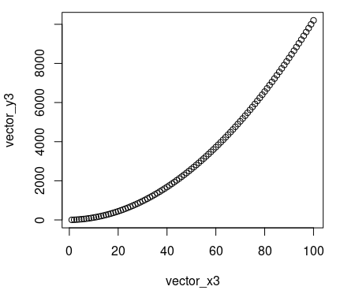

{ width="250", align="left" }

# **TP 8a**. R - Programando en biología - Parte 1 { markdown data-toc-label = 'TP 8a' }

<br>
<br>
<br>
<br>
<br>
<br>
 
<!--
[:fontawesome-solid-download: Materiales](#){ .md-button .md-button--primary }
-->
<!--
Este es el botón para decargar materiales, en (#) hay que agregar el link correspondiente
-->

### Videos de la clase grabada

* :octicons-video-16: [Introducción a la programación en R](https://www.youtube.com/watch?v=xah7gbyHXuU)
* :octicons-video-16: [Puesta en común del TP e introducción a funciones](https://www.youtube.com/watch?v=3Q7XacgdIRs)

### Software a usar
* R (ya instalado en la VM).
* RStudio (ya instalado en la VM)

### Recursos Online
* [Curso online de R de Coursera](https://www.coursera.org/learn/r-programming) (se puede hacer gratis) (en ese caso no da certificado)
* [Tips de comandos básicos de R](http://www.cookbook-r.com/)
* Data Tables: [Introducción oficial](https://cran.r-project.org/web/packages/data.table/vignettes/datatable-intro.html) y [otra página con más info](https://bookdown.org/paradinas_iosu/CursoR/data-table.html)
* ggplot2: [Vistazo rápido](https://bookdown.org/paradinas_iosu/CursoR/ggplot2.html), [otra página con cada plot detallando sus parámetros](http://sthda.com/english/wiki/ggplot2-essentials) y [cheatsheet](https://raw.githubusercontent.com/rstudio/cheatsheets/main/data-visualization.pdf)

### Objetivos

* Familiarizarse en el lenguaje de programación **R**.
* Ver como los mismos conceptos de programación se transladan de un lenguaje a otro.
* Utilizar herramientas de programación para resolver problemas biológicos.

## **Introducción al Tema**

En los últimos años se produjo un crecimiento exponencial tanto en nuestra capacidad de producir información biológica como en nuestra capacidad de analizarla. Ensayos de alto rendimiento, o *high-throughput*, nos permiten analizar miles a millones de interacciones biológicas a la vez, mientras que computadoras de nueva generación o *clusters* de ellas nos permiten procesar en días u horas lo que en otra época hubiera tomado años.

Al momento de analizar datos a esta escala muchos programas conocidos se quedan atrás. Si bien **Excell** o **Google Sheets** van a poder abrir y procesar una tabla con unos pocos miles de filas, probablemente se cuelguen de tratar de hacer lo mismo para una tabla que contenga millones de ellas. No solo eso, sino que hojas de cálculo de ese estilo son bastante limitadas en lo que permiten hacer, donde es muy dificil realizar un análisis o plot que no esté entre los predeterminados por ellos.

En este trabajo práctico vamos a aprender a usar el lenguaje de programación **R**, el cual es uno de los lenguajes más utilizados hoy en día al momento de analizar datos biológicos (junto a **Python**) debido a su practicidad al momento de leer, modificar o hacer estadística con tablas de gran tamaño, asi como la gran variedad de figuras (o *plots*) que permite crear.

## **Historia de R**

* En 1976 se crea **S**, un lenguaje de programación diseñado para análisis estadísticos. **S** fue creado en Bell Labs, que es el mismo lugar mismo lugar donde se creo **Unix** (pero por otras personas).

* En 1991, Ross Ihaka (estadístico) y Robert Gentleman (estadístico y bioinformático) empiezan a trabajar en una versión gratis y de código abierto de **S**. Debido a sus nombres le ponen **R** a dicho lenguaje.

* La primera versión oficial de **R** fue publicada en 1995 bajo una licencia de código abierto *GNU General Public License*. Esta licencia fue creada originalmente para el desarrollo de **GNU** y **Linux**, pero hoy en día es muy común al momento de distribuir programas gratis o de código abierto.

* En 1997 se crea **CRAN** (*Comprehensive R Archive Network*), un repositorio oficial para **R** así como los paquetes creados por usuarios agregaban nuevas funcionalidades a **R**. Originalmente había solo 12 paquetes, pero a principios del 2022 ya existían más de 18.500 diferentes paquetes de **R** en **CRAN**.

## **RStudio**

Cuando nosotros programamos en **Bash** lo hicimos usando **Leafpad**, un editor de texto genérico de Lubuntu. Luego al momento de ejecutar nuestro *script* ibamos a la terminal de Lubuntu y lo ejecutabamos con el comando `bash`. Si bien esto funciona bien para códigos simples, al momento de crear programas complejos puede resultar un poco lento y engorroso.

En programación existen programas denominados *entornos de desarrollo* o **IDE**s (*Integrated Development Environment*) que nos permiten programar, encontrar errores (*debuguear*) y correr el *script* todo desde el mismo lugar. No solo esto, sino que varios **IDE**s también ayudan en el proceso de programar, insertando estructuras vacias (*ifs*, *fors*) o autocompletando los comandos o parámetros mientras uno los escribe.

Antiguamente los **IDEs** funcionaban casi exclusivamente para un solo lenguaje de programación, pero los **IDEs** más recientes suelen funcionar para varios lenguajes (tras un poco de configuración).

**RStudio** es el **IDE** más conocido del lenguaje de programación **R** y nos va a ayudar a programar en dicho lenguaje. 

**1)** Abran RStudio en sus computadoras (acceso directo en el escritorio, o desde **Inicio** :material-arrow-right: **Programación** :material-arrow-right: **RStudio**).

!!! important "Importante"

    Si les pregunta de actualizar pongan **"Ignore Update"**.

??? warning "Si no estan usando la Maquina Virtual de Introducción a la Bioinformática lean esto:"

    R y RStudio estan ya instalados en la máquina virtual que les pasamos. Si no estas usando la máquina virtual tenes que instalar ambos siguiendo la guía de la [página de RStudio](https://www.rstudio.com/products/rstudio/download-server/debian-ubuntu/).

    También hay algunos paquetes de **R** ya instalados en la máquina virtual que van a necesitar instalar cuando aparezcan en las guías. Los paquetes se pueden instalar desde **R** corriendo por ejemplo:

    ```R
    install.packages("data.table", repos="https://cloud.r-project.org")
    ```

    Diferentes versiones de **R** pueden llegar a usar diferentes versiones de paquetes (y algunos paquetes pueden no ser triviales de instalar en algunas versiones).

RStudio se divide en 4 paneles, pero probablemente solo vean 3 ya que todavía no hemos abierto ningún archivo.

**2)** Creen un nuevo *script* haciendo click en **File** :material-arrow-right: **New File** :material-arrow-right: **R Script**

Ahora sí, deberían ver lo siguiente:

<figure markdown>

</figure>

* **Panel superior izquierdo: Editor de Scripts**

    En este panel está el *script* que acabamos de crear. Igual que en **Bash**, un *script* no es más que un archivo de texto con instrucciones para un lenguaje de programación específico, que en este caso es **R**.

    Este panel puede contener varias pestañas al mismo tiempo, cada una con un *script* diferente. También puede contener pestañas con visualizaciones de tablas.

* **Panel inferior izquierdo: Consola**

    La consola (pestaña **Console**) es similar a la terminal de Lubuntu, pero para el lenguaje de programación **R**. En ella podemos escribir comandos en **R** directamente y serán corridos. Tambíen es donde vamos a ver la salida de nuestro *script* de correrlo dentro de RStudio.

    Hablando de la terminal de Lubuntu, la pestaña **Terminal** es literalmente eso. No vamos a utilizar esta pestaña en esta materia.

* **Panel superior derecho: Variables**

    La pestaña **Environment** tiene una lista de todas las variables cargadas en el *"entorno"* que están trabajando, o sea, todas las variables que crearon desde que abrieron RStudio (esto va a quedar más claro cuando corramos código). 

    De ser posible va a mostrar el valor de la variable y de no serlo va a mostrar alguna información al respecto (como el largo de una lista). Para el caso de tablas, pueden hacer click sobre ellas y se abrirán en una nueva pestaña del panel superior izquierdo.

    Tener esta lista de variables es muy útil para aprender a programar en **R** así como para encontrar errores (o *debugear*).

    La pestaña **History** tiene una lista de los últimos comandos usados y la pestaña **Connections** se usa para unir bases de datos. No vamos a utilizar ninguna de estas pestañas en esta materia.

* **Panel inferior derecho: Archivos, Plots y Ayuda**

    La pestaña **Files** es simplemente un explorador de archivos donde pueden navegar entre las carpetas disponibles y visualizar los archivos que encuentren. Es especialmente útil cuando estan trabajando en proyectos grandes con varios *scripts*.

    La pestaña **Plots** es donde apareceran todos los gráficos que vayan generando (o *plots*). Más adelante veremos más información sobre los diferentes botones de esta pestaña.

    Desde la pestaña **Help** podrán acceder a toda la ayuda disponible de **R** y de todos los paquetes y funciones que quieran usar (similar a `man` en **Bash**). Pueden buscar información sobre una función desde la caja de texto junto a la lupa o seleccionando dicho comando en el editor de scripts y apretando ++f1++.

    La pestaña **Packages** tiene información sobre los paquetes de **R** instalados y la pestaña **Viewer** es usada para visualizar contenido web local. No vamos a utilizar ninguna de estas pestañas en esta materia.

!!! info "Archivos .RHistory"

    En la pestaña **Files** pueden ver un archivo llamado **.RHistory**. Este es un archivo creado por RStudio que guarda los últimos comandos corridos (que pueden recorrer en la consola con ++arrow-up++ y ++arrow-down++). Estos archivos pesan poco, pero se van a crear en varios directorios donde trabajemos con **R**. Si les molesta y no les importa guardar los últimos comandos usados pueden borrarlos sin problema.

### Programando en RStudio

Ahora que tenemos una idea de la interfaz de **RStudio** vamos a ver como se crean los programas.

**3)** En la consola (pestaña **Console**) escriban lo siguiente y aprieten ++enter++:

```R
print("Hello World!")
```

`print` es equivalente al `echo` de **bash** y cuando lo usamos decimos que *imprimimos* a la variable. Puede ser que usemos las frases *"imprimir por terminal"*, *"imprimir por consola"*, o *"imprimir por por pantalla"* de forma intercambiable.

Como muestra el código anterior, en **R** los argumentos van pegados a la función y entre paréntesis; de haber mas de un argumento se separan con comas (dentro de los paréntesis).

Al correr el código deberían ver algo como:

```
[1] "Hello World!"
```

El `[1]` lo está agregando RStudio y se debe a que en **R** todo es un vector, pero por ahora pueden ignorarlo.

Lo que hicimos hasta ahora fue similar a correr un comando en la terminal. Vamos ahora a crear un *script* de **R**. 

**4)** En la editor de scripts (que debería tener una página vacía) escriban:

```R
print("Hola Mundo!")
```

Hay varias formas de ejecutar código desde el editor de scripts, algunas de ellas son:

* **Ejecutar una linea:** poner el cursor sobre la linea a correr :material-arrow-right: ++ctrl+enter++
* **Ejecutar varias líneas:** seleccionar o *pintar* las lineas a correr :material-arrow-right: ++ctrl+enter++
* **Ejecutar todas las líneas hasta el cursor:** poner el cursor en la última línea que quiero correr :material-arrow-right: ++ctrl+alt+b++
* **Ejecutar todas las líneas en el script:** ++ctrl+alt+r++

**5)** Elijan uno de los métodos y corran la línea que acabamos de escribir en el editor de *scripts*. Esto también lo pueden hacer a mano desde el menú **Code**, pero es recomendado usar los atajos de teclado ya que es algo que van a hacer bastante seguido mientras programan.

**6)** Por último vamos a guardar nuestro *script*.

* Vayan a **File** :material-arrow-right: **Save** (o aprieten ++ctrl+s++)
* Creen donde prefieran una carpeta para el TP
* Pónganle un nombre al *script* y guárdenlo

Van a ver que **Rstudio** le agrega automáticamente la extensión **.R**, que es la extensión usada por los *scripts* de **R** y asocia automáticamente dichos *scripts* con **RStudio**.

!!! tip "Tip - Ejecutando *scripts* de **R** desde la terminal de **Lubuntu**"

    Ahora que creamos un archivo en disco, es posible tambien ejecutar nuestro script de **R** desde la terminal de Lubuntu. De querer hacerlo, tendrían que correr:

    ```bash
    Rscript ARCHIVO_SCRIPT.R
    ```

    Como siempre, reemplazando **ARCHIVO_SCRIPT.R** por el nombre de su archivo.

## **R: Variables**

Como dijimos cuando vimos **Bash**, diferentes lenguajes tienen elementos similares, pero se usan ligeramente diferente. Vamos a entonces a aprender como se usan las variables en **R**.

**1)** Escriban en el editor de scripts la siguiente línea y corranlá:

```R
saludo <- "Hola Mundo!"
```

En **R** las variables se asignan con el símbolo `<-` (o *"flecha a la izquierda"*) y se usan mencionando el nombre de la variable. En **RStudio** se puede insertar el símbolo `<-` rapidamente usando el atajo de teclado ++alt+minus++ (signo *"menos"*).

¿Se acuerdan de la pestaña **Environment** de la que hablamos antes? Si la ven ahora va a tener la variable **saludo** y su valor.

**2)** Agreguen entonces la siguiente linea al editor de scripts y corran **solo** esta línea:

```R
print(saludo)
```

No se si se dan cuenta lo que acaba de pasar, pero estan imprimiendo en la consola el valor de una variable que declararon previamente. Esto es un gran beneficio de **RStudio**, que nos permite guardar valores de variables y usarlos en el futuro, sin tener que correr todo el *script* de arriba a abajo cada vez que queremos modificar algo. Sin embargo, un gran poder conlleva una gran responsabilidad, ya que este sistema también hace posible estar usando un valor "viejo" o "equivocado" en una variable.

La forma correcta de trabajar es ir dejando en nuestro *script* un registro de las órdenes correctas para llegar al output deseado. También es buena práctica comentar las instrucciones más importantes para que se pueda entender por quien tenga que reutilizar el código. Es algo así como el **cuaderno de laboratorio bioinformático**.

De poner solo el nombre de una variable es equivalente a hacer un `print`, o sea los siguiente dos comandos son equivalentes:

```R
print(saludo)
saludo
```

Sin embargo, en el código es recomendable usar `print` para dejar clara nuestra intención y evitar ciertos escenarios donde la variable sola no funcionaría como queremos. Dicho esto, este método es muy útil para ver rápidamente lo que contiene una variable (hagan doble click en una variable, lo que la selecciona o *pinta*, y luego aprieten ++ctrl+enter++).

!!! info "Asignar variables con ="

    **R** también permite asignar variables usando el símbolo `=`, por ejemplo, `a = "Hola Mundo!"` funcionaría perfecto en el código anterior. Sin embargo, el símbolo `=` también es el usado para pasar argumentos y es similar al usado en los condicionales, por lo que se recomienda usar el `<-` al momento de asignar valores a variables en **R**.

### Comentarios

Los comentarios en **R** se hacen de la misma forma que para **Bash**, ignorando todo lo que está despues de un `#`.

```R
saludo <- "Hola Mundo!"
# saludo <- "Esto no va a hacer nada"
 
print(saludo) # print("Esto tampoco")
```

!!! tip "Tip - Comentar en masa"

    Es posible comentar o descomentar grandes secciones de texto. Para esto hay que seleccionar o *pintar* las lineas y apretar ++ctrl+shift+c++.

### Números

En **R** hay 2 tipos principales de variables numéricas, numeros enteros (o **integer**) y numeros reales (o **numeric**). Por temas de simplicidad, es bastante común trabajar con variables del tipo **numeric** por más que esten usando números enteros (y de hecho es lo que hace **R** por defecto).

**3)** Prueben correr el próximo código línea a línea y vean como se va modificando el valor de **n** en el **Environment**:

```R
n <- 2 # *n* es una variable *numeric*

# pueden hacer diferentes operaciones matemáticas con las variables numéricas
n <- ((n + 2) * 2) ^ 2

n <- ((n - 2) / 2) ^ (1/2)

print(n)
```

!!! tip "Tip - Averiguar el tipo de una variable"

    Si uno no sabe el tipo de una variable puede usar la función `class()` la cual devuelve por consola el tipo de dicha variable. Por ejemplo, en este caso `class(n)` devolvería **"numeric"**.

!!! info "Tipos de variables"

    Si bien al momento de trabajar con **R** vamos a aceptar usar **numeric** incluso cuando trabajamos con **integer**, en otros lenguajes de programación esta diferencia puede ser más estricta por lo que habría que usar **integer** al trabajar con números enteros. Otro factor a considerar es que los **integer** ocupan menos tamaño en memoria, lo que puede ser relevante en ciertos casos.

### Cadenas de caracteres o *Strings* { markdown data-toc-label='Cadenas de caracteres' }  

En **R** las cadenas de caracteres, comunmente llamadas *strings*, tienen el tipo de variable **character**.

**4)** Prueben correr el próximo código línea a línea, lean los comentarios y vean como se va modificando el valor de la variable **frase** en el **Environment**:

=== "Código"

    ```R
    frase <- "Había"

    frase <- paste(frase, "una")

    frase <- paste(frase, "vez", sep = " ")

    frase <- paste(frase, "...", sep = "")

    print(frase)
    ```

=== "Código con comentarios"

    ```R
    frase <- "Había" # *frase* es una variable *character*

    # paste es una funcion de R que concatena strings
    frase <- paste(frase, "una")

    # Las funciones de R tienen argumentos
    # *sep* es el argumento que indica que caracter va a ponerse entre las palabras que paste esta pegando
    # Varios argumentos en R tienen valores por defecto, que son el valor que van a tener si no los aclaro
    # En el caso de *sep*, el valor por defecto es " ", por lo que en la siguiente linea podría haberlo omitido
    frase <- paste(frase, "vez", sep = " ")

    # Quiero agregar tres puntos, pero no quiero un espacio entre "vez" y los puntos
    # Uso la funcion paste y cambio el argumento *sep* al valor "" (que es el string vacio, lo que significa
    # no agregarle ningun separador)
    frase <- paste(frase, "...", sep = "")

    print(frase)
    ```

!!! tip "Tip - paste0"

    También existe en **R** una función llamada `paste0`, que es igual a `paste`, pero en la cual el valor por defecto de `sep` es `""` (string vacio).

Se pueden hacer muchas más cosas con *strings* en **R**, como por ejemplo extraer un *substrings* (`substr` o `substring`) o buscar si un *substring* existe dentro del *string* (`grep`, `grepl`, `gsub`), pero las vamos a ir viendo cuando las necesitemos.

<!--
!!! tip "Tip - Caracteres especiales"

    Existen caracteres especiales en **R** (y en muchos otros lenguajes) que nos permiten poner en un *string* cosas que no son literalmente caracteres. Por ejemplo:

    * `\n` indica un salto de línea (similar a apretar ++enter++)
    * `\t` indica una tabulación o ++tab++
-->

## **Ejercicio 1 - Variables simples** { markdown data-toc-label='Ejercicio 1 - Variables' }

En este ejercicio vamos a practicar el uso de variables numéricas y *strings* en **R**:

1. Creen un nuevo *script* que declare 2 variables, asigne un número a cada una, calcule la suma de ambos números y la imprima por la consola.
1. Editen el *script* anterior agregando 2 otras operaciones matemáticas e impriman sus resultados.
1. En el mismo *script*, creen una nueva variable y asignenle el valor 0. Fijense que pasa si quieren dividir alguno de los otros números por esta nueva variable.
1. Creen un nuevo *script* que declare 2 variables, asigne un *string* a cada una, imprima la longitud de cada variable, concatene ambas variables (sin espacio entre ellas) e imprima la concatenación.

    Para este último punto van a necesitar la función `nchar()`. Pueden ver que hace desde la pestaña **Help**.

!!! tip "Tip - Carpetas para los ejercicios"

    Como ya mencionamos varias veces en la materia es recomendado utilizar diferentes carpetas para los diferentes TPs y Ejercicios. Esto es especialmente cierto al momento de trabajar con *scripts* de **R** ya que no es raro que un programa real tenga archivos de entrada (**/input**), archivos finales o de salida (**/output**) y archivos temporales (**/temp**). Por ahora probablemente no necesiten crear subcarpetas de este estilo, pero ténganlo en cuenta.

<!--
??? tip "Si no pudieron resolver el punto 4 leer esto:"

    ```R
    dna1 <- "GATACA"
    dna2 <- "GAGA"

    # No hace falta hacerlo en solo print y con paste, pero, ya que estamos lo hacemos lindo
    print(paste("Las longitudes ingresadas son:", nchar(dna1), "y", nchar(dna2)))

    # Concatenamos las variables sin espacio entre ellas
    strings_concatenados <- paste(dna1, dna2, sep = "")

    # Imprimir las variables concatenadas
    print(strings_concatenados)
    ```
-->

## **R: Vectores y Plots**

### Vectores

**R** tiene la variable de tipo **vector**, que son vectores o arreglos, es decir, listas ordenadas de elementos de un mismo tipo. Vendrían a ser el equivalente de las listas que vimos de costado en **Bash**. Es importante ir aclarando que **R** también tiene variables del tipo **list** que vamos a ver en un rato, y que si bien son similares no son lo mismo.

```R
# Los vectores se declaran con c() y sus elementos se separan con ","

# Este es un vector con 3 elementos de tipo *character*
vector_frase <- c("Había", "una", "vez...") 

# Este es un vector con 10 elementos de tipo *numeric*
vector_numeros <- c(1,2,3,4,5,6,7,8,9,10) 

# Este vector es igual al anterior
# R permite usar rangos al momento de definir vectores usando el simbolo ":"
vector_numeros_rango <- c(1:10)

# Este vector es igual al anterior
# Escribir solo el rango también devuelve un vector
vector_numeros_rango2 <- 1:10

# Es posible combinar "," y ":"
# Este vector tiene los valores c(1,2,3,7,8,9,10)
vector_numeros_hueco <- c(1:3,7:10)
```

Los vectores son una parte escencial de **R**; de hecho, la mayoría de las variables son vectores de lóngitud 1 (razón por la que aparece el `[1]` al imprimirlas con `print`). Como consecuencia, la mayoría de las funciones u operaciones de **R** aceptan reemplazar números o *strings* por vectores de ellos.

**1)** Ejecuten el código anterior para crear los vectores y corran las siguientes líneas una a la vez. Vean que pasa en cada caso.

```R
print(vector_frase)

print(vector_numeros)

print(vector_frase[2])

# *paste* se puede usar tambien con vectores
# En este caso no se usa *sep*, sino *collapse*, pero cumplen la misma función
print(paste(vector_frase, collapse = " "))

print(vector_numeros + 2)

print(vector_numeros_rango * vector_numeros_rango)
```

Como pueden ver, en **R** se puede trabajar con vectores de una forma muy similar a que si trabajaramos con un solo número o *string*, lo que abre la puerta a grandes posibilidades. Otra cosa a destacar de lo anterior es que es posible acceder a una variable individual del vector usando corchetes, donde por ejemplo `vector_frase[2]` es el segundo valor del vector `vector_frase`.

!!! info "Índices de los vectores"

    En **R** el índice del primer elemento de los vectores, listas y tablas es el 1. En muchos lenguajes de programación (incluyendo **Python**) el índice del primer item de un vector es el 0. Esto es algo que es importante acordarse de checkear cuando estas usando vectores en un nuevo lenguaje de programación.

Lo último que queremos volver a remarcar sobre los vectores es que son listas de elementos **del mismo tipo**. Sin embargo **R** probablemente no les tire un error si mezclan tipos de variables, sino que va a transformar automáticamente todas las variables a un mismo tipo.

**2)** Vean que pasa al correr:

```R
vector_mixto <- c(1, 2, "asd")
print(vector_mixto) # Aca los números tienen comillas en el *print*, indicando que ya no son más números
print(vector_mixto[1] + 2) # Esto les va a tirar error ya que no puede sumar el número 2 al *string* "1"
```

### Plots simples

**R** tiene muchas formas de hacer plots, especialmente usando paquetes externos. Sin embargo, para empezar vamos a ver las formas que vienen por defecto con **R**, que si bien crean *plots* más simples, también son más fáciles de usar y sirven para hacer una inspección rápida de sus datos.

**3)** Creen un nuevo script, escriban el siguiente código y corranló:

```R
x <- c(1:100)
y <- x ^ 2

plot(x, y)
```

Si todo funcionó bien les debería haber aparecido el siguiente plot en la pestaña **Plots** del panel de abajo a la derecha (puede estar mas o menos achatado). La función `plot` por defecto hace lo que se denomina *"dot plot"* o *"scatter plot"*, donde dibuja un punto para cada valor `(x, y)`.

<figure markdown>

</figure>

**4)** En unos minutos vamos a hablar de los botones de la ventana **Plots**, pero antes corran el siguiente código:

```R
# rnorm es una función que crea numeros random (o aleatorios) que siguen una distribución normal
# En este caso esta devolviendo 1000 números sacados de una distribución normal con 
# media de 15 y un desvío estándar de 2.5
vector_numeros <- rnorm(mean = 15, sd = 2.5, n = 1000)

hist(vector_numeros)
```

Si todo funcionó bien el plot de la pestaña **Plots** debería haber cambiado al siguiente *plot* (como `rnorm` devuelve valores aleatorios puede no ser idéntico). La función `hist` hace un histograma de frecuencias a partir de un vector de valores.

<figure markdown>

</figure>

En la pestaña **Plots** hay varios botones que van a ser muy útiles al momento de trabajar con plots:

* **Flechas hacia la izquierda y derecha:** nos permiten navegar entre los últimos plots que creamos.
* **Zoom:** nos permite abrir una nueva ventana para ver una versión mas grande del plot.
* **Export:** nos permite salvar el plot a varios formatos de imagen (**PNG**, **SVG**, etc.) o a **PDF**. De trabajar con varios plots es común salvar las imágenes desde el código mismo, pero cuando se trabaja con pocas imágenes este método es bastante útil.
* **Remove the current plot:** elimina el plot actual de la lista de plots guardados.
* **Clear all Plots:** vacía la lista de plots guardados.

**5)** Prueben entonces salvar el plot actual como una imagen **PNG** usando el botón **Export**. En la ventana que les va a aparecer pueden cambiar el formato de la imagen y también su tamaño, ya sea ingresando el ancho (**Width**) y el alto (**Height**) o a mano usando el *"triangulo"* de abajo a la derecha (ver figura).

<figure markdown>

</figure>

## **Ejercicio 2 - Vectores y plots** { markdown data-toc-label='Ejercicio 2 - Plots' }

Para valores enteros de `x` entre 1 y 200, calculen el `y` correspondiente a una recta con pendiente 3 y ordenada al origen 5 y hagan el plot de dicha recta usando el comando `plot`.

Una vez creado el plot, salvenló en un archivo con extensión **SVG**.

!!! tip "Tip - Plotear una línea"

    Al momento de usar `plot` pueden agregar el parámetro `type = "l"` al final para que plotee líneas en vez de puntos.

## **R: Estructuras lógicas**

### Condicionales y Booleanos

De igual forma que en **Bash**, en **R** también existen los condicionales *ifs*, pero se escriben ligeramente diferente:

=== "Código"

    ```R
    numero <- 42

    print(paste(numero, "es un numero"))

    if (numero > 10) {
        print(paste(numero, "es mayor a 10"))    
    } else {
        print(paste(numero, "es menor o igual a 10"))
    }
    ```

=== "Código con comentarios"

    ```R
    numero <- 42

    print(paste(numero, "es un numero"))

    # *if* es la estructura más usada para condicionales.
    # Adentro de los paréntesis va la condición.
    # > es el comparador, o sea, estamos preguntando si la variable *numero* es mayor que 10
    if (numero > 10) {
        # El codigo entre *{* y el primer *}* solo si ejecuta si la condición es verdad, de otra forma se saltea
        # Este codigo esta más a la derecha, o *indentado*. Esto se hace con tab y en la mayoría de los lenguajes
        # es solo para entender más fácil el código (RStudio lo va a hacer automáticamente de pegar código)
        print(paste(numero, "es mayor a 10"))    
    } else {
        # El código entre *else {* y *}* se ejecuta solo cuando la condición no es verdad
        print(paste(numero, "es menor o igual a 10"))
    }
    # Este *}* indica donde termina el condicional
    ```

Es bastante similar a lo que conocían, pero aca no esta *then* ni *fi* y los diferentes bloques lógicos se marcan con llaves (en **R** esto también va a pasar en *fors* y en muchas otras estructuras).

Las condiciones del *if* existen más alla de los condicionales y de hecho la comparación `numero > 10` es una variable en sí misma. A estas variables las vamos a llamar **booleanos** y pueden tener 1 de 2 valores: o **TRUE** (verdadero) o **FALSE** (falso).

Hay 3 formas principales de generar variables booleanas:

```R
# Dándoles el valor TRUE o FALSE a mano
booleano1 <- TRUE

# Usando un comparador, en este caso el *>*
numero1 <- 5
booleano2 <- numero1 > 10

# Combinando booleanos con operadores lógicos, en este caso con *and*
booleano3 <- booleano1 & booleano2
```

Como mostramos en la tercer forma de generar variables booleanas, se pueden hacer operaciones entre los booleanos usando la llamada **algebra booleana**. Esto es un mundo en sí mismo, pero por suerte al momento de programar solo nos van a importar las tres operaciones básicas de la algebra booleana: el **AND**, el **OR** y el **NOT**.

El **AND** y el **OR** son operaciones entre dos booleanos, mientras que **NOT** es una operación que se le aplica a un solo booleano.

* El **AND** es el **"Y"**, devolviendo **TRUE**{ .green_text } solo cuando ambos booleanos eran **TRUE**{ .green_text }. Se escribe en **R** con **&**
* El **OR** es el **"O"**, devolviendo **TRUE**{ .green_text } cuando por lo menos uno de ambos booleanos era **TRUE**{ .green_text }. Se escribe en **R** con **|** (*pipe*)
* El **NOT** es el **"NO"**, invirtiendo el valor del booleano (o sea, devuelve **TRUE**{ .green_text } solo si el booleano era **FALSE**{ .red_text }). Se escribe en **R** con **!**

??? tip "Detalles de **AND**, **OR** y **NOT**"

    | Booleano 1 { data-sort-method='none' } | Booleano 2 { data-sort-method='none' } | AND (&) { data-sort-method='none' } | OR (\|) { data-sort-method='none' } |
    | :---: | :---: | :---: | :---: |
    | **TRUE**{ .green_text } | **TRUE**{ .green_text } | **TRUE**{ .green_text } | **TRUE**{ .green_text } |
    | **TRUE**{ .green_text } | **FALSE**{ .red_text } | **FALSE**{ .red_text } | **TRUE**{ .green_text } |
    | **FALSE**{ .red_text } | **TRUE**{ .green_text } | **FALSE**{ .red_text } | **TRUE**{ .green_text } |
    | **FALSE**{ .red_text } | **FALSE**{ .red_text } | **FALSE**{ .red_text } | **FALSE**{ .red_text } |

    | Booleano 1 { data-sort-method='none' } | NOT (!) { data-sort-method='none' } |
    | :---: | :---: |    
    | **TRUE**{ .green_text } | **FALSE**{ .red_text } |
    | **FALSE**{ .red_text } | **TRUE**{ .green_text } |

Las variables booleanas se pueden usar en los directamente en las condiciones de los *ifs*. Si bien se pueden comparar contra **TRUE**{ .green_text } y **FALSE**{ .red_text }, de poner solo la variable en la condición del *if*, es equivalente a preguntar si esa variable es **TRUE**{ .green_text }. Vean las siguientes tres pestañas para entenderlo mejor:

=== "Código"

    ```R
    llueve <- TRUE
    tengo_paraguas <- TRUE

    if ((llueve == TRUE) & (tengo_paraguas == FALSE)) {
        print("Me mojo")
    } else {
        print("No me mojo")
    }    
    ```

=== "Código con comentarios"

    ```R
    llueve <- TRUE
    tengo_paraguas <- TRUE

    if ((llueve == TRUE) & (tengo_paraguas == FALSE)) {
        # Aca solo voy a entrar si llueve y no tengo paraguas
        # Si una o ambas de esas afirmaciones son falsas, entonces se imprime el código en el *else*
        print("Me mojo")
    } else {
        print("No me mojo")
    }
    ```

=== "Código - Versión mínima"

    ```R
    # T es equivalente a escribir TRUE
    # F es equivalente a escribir FALSE
    llueve <- T
    tengo_paraguas <- T

    # *llueve* es equivalente a *llueve == TRUE*
    # *!tengo_paraguas* es equivalente a *(!tengo_paraguas) == TRUE*, o sea, *tengo_paraguas == FALSE*
    if ((llueve) & (!tengo_paraguas)) {
        print("Me mojo")
    } else {
        print("No me mojo")
    }
    ```
    
!!! info "Paréntesis en las condiciones"

    En la versión mínima los paréntesis internos no son estrictamente necesarios, es decir, que podrían haber puesto:

    ```R
    if (llueve & !tengo_paraguas) {
    ```

    De hecho, la versión del código que tiene los `==` también andaría bien de sacarle los paréntesis internos, pero esto es mucho más peligroso. Al momento de encadenar condiciones con **AND** (`&`) u **OR** (`|`) les recomendamos poner cada condición entre paréntesis para evitar errores, especialmente si las condiciones tienen `<`, `>`, `==`, etc.

### Ciclos

#### Ciclo *For*

En **R** todos los ciclos *for* tienen una estructura similar a lo que nosotros llamamos anteriormente ciclos *for each*. Se escribe de la siguiente forma:

=== "Código"

    ```R
    for (i in 1:1000) {
        print(i)
    }
    ```

=== "Código con comentarios"

    ```R
    # *for* es una de las estructuras más usadas para hacer ciclos
    # *i* es el nombre de la variable que va a cambiar de valor en cada ciclo. Se le podria poner cualquier nombre a 
    # ésta variable, por ejemplo *numero* en nuestro caso, pero es costumbre ponele *i*
    # En este caso, *i* va a recorrer cada valor del rango 1:1000 (es decir, del número 1 al número 1000)
    for (i in 1:1000) {
        # El código entre las llaves se va a ejecutar una vez para cada posible *i* en el rango
        print(i)
    }
    ```

En este caso el *for* va a recorrer todos los elementos de un vector de números que vá entre 1 y 1000. También podemos recorrer en el *for* los elementos de un vector previamente declarado, por ejemplo:

=== "Código"

    ```R
    vector_colores <- c("rojo", "amarillo", "verde")
    for (color in vector_colores) {
        print(color)
    }
    ```

=== "Código con comentarios"

    ```R
    vector_colores <- c("rojo", "amarillo", "verde")
    for (color in vector_colores) {
        # *color* es la variable que va cambiando en cada iteración del *for* (como antes era *i*)
        # En este caso va a ir tomando los valores de los diferentes elementos de *vector_colores*
        print(color)
    }
    ```

#### Ciclo *While*

El *for* es muy útil, pero tiene el problema de que uno necesita saber cuantas iteraciones va a realizar antes de empezar el ciclo, lo que no es siempre posible. Para casos donde desconocemos el número de iteraciones, existen herramientas como el ciclo *while* que se puede pensar como una combinación entre el *for* y el *if*. El código dentro de este ciclo se va a repetir ***mientras*** se cumpla una condición. Por ejemplo:

=== "Código"

    ```R
    contador <- 1

    while(contador <= 1000) {
        print(contador)

        contador <- contador + 1
    }
    ```

=== "Código con comentarios"

    ```R
    # Estamos declarando una variable *contador* que vale 1
    contador <- 1

    # Todo lo que esta adentro del ciclo *while* se va a repetir mientras la condición *contador <= 1000* sea TRUE
    while(contador <= 1000) {
        # Imprimo la variable *contador* en la terminal
        print(contador)

        # Le sumo uno a la variable *contador*
        # Esto es equivalente al *contador++* de Bash
        contador <- contador + 1
    }
    ```

Tal vez no se dan cuenta, pero este programa va a hacer lo mismo que el `for (i in 1:1000)` que usamos arriba: La variable `contador` va a empezar en 1 y al final de cada ciclo va a aumentarse en 1 gracias al comando `contador <- contador + 1`. Cuando `contador` llegue a 1001, la condición `contador <= 1000` va a ser **FALSE**{ .red_text } y el *while* va a terminar (es decir, el número 1001 nunca se imprime en la terminal).

Ahora bien, para el caso anterior no tiene mucho sentido usar un ciclo *while* ya que se podría haber hecho perfectamente con un *for*. Supongamos entonces que queremos escribir las potencias de 2 que son menores a 1.000.000, en ese caso podemos hacer:

=== "Código"

    ```R
    numero <- 1

    while(numero < 1000000) {
        print(numero)

        numero <- numero * 2
    }
    ```

=== "Código con comentarios"

    ```R
    # Declaro una variable *numero* con el valor 1 (que es 2^0)
    numero <- 1

    # El loop este va a seguir mientras *numero* sea menor a 1 millon
    while(numero < 1000000) {
        # Imprimo *numero* en la terminal
        print(numero)
        
        # Multiplico a *numero* por 2, lo que me va a dar la próxima potencia de 2
        # 2^1 = 2
        # 2^2 = 2 * 2 = 4
        # 2^3 = 2 * 2 * 2 = 8 
        # 2^4 = 2 * 2 * 2 * 2 = 16
        # etc
        numero <- numero * 2
    }
    ```

Si bien hay formas de hacer este último loop con un *for*, esto es más que nada un ejemplo para que entiendan el concepto de que el *while* nos permite repetir algo una cantidad indeterminada de veces.

!!! danger "Loops Infinitos"

    Al usar el ciclo *while* hay que prestar mucha atención de no escribir un código que genere un *loop infinito*, es decir, un loop donde la condición del *while* siempre va a ser **TRUE**{ .green_text }. Si pasa esto probablemente se cuelgue **R** y tendrán que reiniciarlo o interrumpirlo para volver a programar. En el ejemplo anterior esto habría ocurrido si no hubiesemos puesto la línea que aumenta el valor de `numero`.

## **Ejercicio 3 - Estructuras lógicas** { markdown data-toc-label='Ejercicio 3 - Estructuras lógicas' }

El objetivo de este ejercicio es hacer un script de **R** que:

* Cree una variable llamada `resultado` y le asigne el valor 0
* Cree un *for* que defina una variable `i` que recorra los números de 1 a 50
* En cada iteración vamos a sumarle o restarle algo a `resultado` (guardando el nuevo valor en `resultado`):
    * Para todo `i` menor a 5 o mayor a 47 :material-arrow-right: Restarle `i` a `resultado`
    * Para todo `i` mayor a 20 y menor a 30 :material-arrow-right: Sumarle `i` a `resultado`
* Imprima el valor final de `resultado` por la consola

<!--
    * Para los primeros 25 `i` (1 a 25) :material-arrow-right: Sumarle 1 a `resultado`
    * Para los últimos 25 `i` (26 a 50) :material-arrow-right: Restarle 1 a `resultado`
-->

!!! tip "Tip"

    Aca van a necesitar usar diferentes estructuras *ifs* adentro del *for* teniendo en cuenta que hay varias condiciones.

## **R: Tablas**

### Data Frames

El *Data Frame* es el tipo de variable que viene por defecto con **R** para usar tablas. Hay varias formas de crearlas, pero la más simple es con la función `data.frame()`. Por ejemplo:

```R
genes <- c("ERT2", "TTR4", "REC1")
esencialidad <- c(F, F, T)
expresiones <- c(100 ,1000, 10000)

df <- data.frame(gen = genes,
                 esencial = esencialidad,
                 expresion = expresiones)
```

Aca estamos creando una variable llamada `df` que contiene 3 columnas, **gen**, **esencial** y **expresion**, cada una conteniendo los valores de los vectores que declaramos previamente. Noten que los tres vectores tienen la misma cantidad de elementos. El primer elemento de cada vector corresponde a los valores de las columnas para la primera fila de la tabla, y así.

!!! tip "Tip"

    Una cosa que les puede llamar la atención es que pusimos los diferentes parámetros de la función `data.frame` en tres líneas diferentes. Para **R** es equivalente poner todo en la misma línea o como lo hicimos en el ejemplo anterior, lo que ayuda a leer más fácil cada uno de los parámetros. Sin embargo, es importante notar que los saltos de línea tienen que ir inmediatamente después de una coma.

Podemos ver los contenidos de la tabla usando el comando:

```R
print(df)
```
```R
   gen esencial expresion
1 ERT2    FALSE       100
2 TTR4    FALSE      1000
3 REC1     TRUE     10000
```

### Data Tables

Si bien los *Data Frames* tienen bastantes funcionalidades, existe un tipo de variable llamada *Data Table* que básicamente es un *Data Frame* con muchas mejoras, por lo que va a ser la variable que vamos a usar nosotros al momento de trabajar con tablas.

El problema es que las variables *Data Tables* no vienen por defecto con **R**, sino que necesitamos usar un paquete externo llamado **data.table**. Este paquete de **R** ya está preinstalado en sus máquinas virtuales, pero pueden ver como se instala de 0 en la sección **RStudio** al principio de esta guia.

Por más que esté instalado el paquete, es necesario cargarlo cada vez que abramos **R**. Es común cargar al principio de cada *script* todos los paquetes que uno va a usar (no hay problemas al intentar cargar un paquete ya cargado):

```R
library(data.table) # Esto carga el paquete data.table para poder usar el tipo de variable Data Tables

genes <- c("ERT2", "TTR4", "REC1")
esencialidad <- c(F, F, T)
expresiones <- c(100 ,1000, 10000)

dt <- data.table(gen = genes,
                 esencial = esencialidad,
                 expresion = expresiones)

print(dt)
```
```R
   gen esencial expresion
1 ERT2    FALSE       100
2 TTR4    FALSE      1000
3 REC1     TRUE     10000
```

En los *Data Tables* vamos a usar el símbolo `$` para acceder a las diferentes columnas (en cuyo caso va a devolver un vector con los contenidos de dicha columna):

```R
print(dt$gen)
```
```R
[1] "ERT2" "TTR4" "REC1"
```

Por otro lado, podemos usar los corchetes `[]` de forma similar a como los usabamos en los vectores para devolver una fila específica.

```R
print(dt[1])
```
```R
    gen esencial expresion
1: ERT2    FALSE       100
```

Otra función que les puede ser util es el comando `summary`, quien devuelve información de las diferentes columnas de la tabla:

```R
summary(dt)
```
```R
     gen             esencial         expresion    
 Length:3           Mode :logical   Min.   :  100  
 Class :character   FALSE:2         1st Qu.:  550  
 Mode  :character   TRUE :1         Median : 1000  
                                    Mean   : 3700  
                                    3rd Qu.: 5500  
                                    Max.   :10000
```
Fijense que `summary` va a devolver información en base a que contiene la columna (**gen** tiene *strings*, por lo que devuelve info general; **esencial** tiene *booleanos*, por lo que devuelve la cantidad de cada uno; **expresion** tiene números, por lo que devuelve varios estadísticos).

Lo último que vamos a aprender hoy sobre *Data Tables* es a filtar filas, por ejemplo si quisieramos quedarnos solo con aquellas no esenciales sería:

```R
dt[esencial == FALSE]
```
```R
    gen esencial expresion
1: ERT2    FALSE       100
2: TTR4    FALSE      1000
```

??? info "Algunas ventajas de Data Tables vs Data Frames"

    * Lee tablas más rápido
    * Límita automáticamente la sálida por terminal al usar `print()` con tablas muy grandes    
    * Permite filtrar sin repetir el nombre de la tabla varias veces
    * Tiene variables internas que facilitan calcular el número de filas o el índice de cada fila
    * Tiene funciones internas que permiten calcular promedio por grupos, por ejemplo
    * ¡Y muchas más!

### Working Directory

Esto es algo que lo veníamos posponiendo desde el principio de este TP, pero ahora vamos a querer leer y escribir archivos de disco, por lo que es necesario. El *Working Directory* es el *path* en donde estoy trabajando y comparándolo con lo que hicimos en **Bash** se puede pensar como en que carpeta está ahora la terminal.

En **R** el comando para saber en que *path* estoy "parado" es la función `getwd()`.

Si quiero cambiar este *path*, tengo que usar la función `setwd("PATH_ABSOLUTO")`.

**1)** Creen una carpeta donde van a trabajar, por ejemplo **\~/Documentos/TP_08**

**2)** Usen la función `getwd()` para ver el *Working Directory* actual

**3)** Usen la función `setwd()` para asignar la carpeta creada en **1)** como *Working Directory* (recuerden que tienen que pasarle como parámetro el *path* absoluto de dicha carpeta)

### Escribir Tablas

Hay varias funciones para escribir tablas, pero la que vamos a usar nosotros es `write.table`, por ejemplo:

```R
write.table(dt, file = "ARCHIVO_DT", col.names = T, row.names = F, sep = "\t", quote = T)
```

Los parámetros de `write.table` que estamos usando son:

* `dt` es el *Data Table* que estamos guardando
* `file` es donde se escribe el nombre del archivo. Si es un *path* absoluto se guarda en dicho *path*, y si es un *path* relativo es relativo al *Working Directory*
    * `"ARCHIVO_DT"` suele tener extensión **.tsv** de separar las columnas con tabs, o extensión **.csv** de separarlas con comas
* `col.names` pregunta si queremos o nó guardar el nombre de nuestras columnas en el archivo de salida (puede ser **T**{ .green_text } o **F**{ .red_text })
* `row.names` pregunta si queremos o nó guardar el nombre de nuestras filas en el archivo de salida, el cual generalmente es el número de fila (puede ser **T**{ .green_text } o **F**{ .red_text })
* `sep` indica cual es el separador de columnas. En este caso es `"\t"`, es decir, ++tab++
* `quote` indica si queremos colocar comillas bordeando a los *strings* que tengamos en la tabla. Puede ser **T**{ .green_text } o **F**{ .red_text }, o tambíen puede ser un vector numérico que indica a las columnas a las que hay que ponerle comillas (con la primera siendo la número 1)

**4)** Existen algunas tablas en **R** que estan siempre cargadas en memoria y sirven para probar cosas. Una de estas tablas es **iris**. Usen `print` para ver esta tabla y luego usen `help(iris)` para ver la ayuda relacionada a esta tabla (que explica un poco las columnas).

**5)** Guarden la tabla **iris** en un archivo llamado **iris.tsv** dentro de la carpeta creada en el punto **1)**. Usen los parámetros usados en el ejemplo de arriba. Confirmen que se creo el archivo.

!!! info "Comillas en los archivos **.tsv**"

    Si abren con **Leafpad** el archivo **iris.tsv** recién creado van a ver que los nombres de las columnas y todos los valores de la columna **Species** estan rodeados por comillas. Estas comillas no son parte de los nombres o valores de las columnas, sino que es la forma que usamos para indicar que lo que está dentro de ellas es un *string*. Estas comillas aparecen por haber usado el parámetro `quote = T` y son útiles para varios casos, por ejemplo de trabajar con *strings* con espacios.

!!! info "Data Tables y nombres de las filas"

    Es medio técnico, pero a diferencia de los *Data Frames*, los *Data Tables* no pueden tener nombres en las filas (razón por la que estoy usando `row.names = F` en el código anterior). Esta es una decisión consciente de los creadores de los *Data Tables* ya que cualquier información que uno quiera almacenar en los nombres de las filas también se puede almacenar en una nueva columna, lo que hace mucho más fácil trabajar con esa información (filtrar, ordenar, etc).

### Leer Tablas

Hay varias funciones para leer tablas, pero la que vamos a usar nosotros es `fread`, por ejemplo:

```R
nuevo_dt <- fread("ARCHIVO_DT", header = T, sep = "\t")
```

Esta función es una de las funciones del paquete **data.table**. Los parámetros de `fread` que estamos usando son:

* `nuevo_dt` es el nombre de la variable donde se va a cargar la tabla
* `"ARCHIVO_DT"` es el nombre del archivo a leer. Si es un *path* absoluto se lee dicho *path*, y si es un *path* relativo es relativo al *Working Directory*
* `header` pregunta si nuestro archivo tiene el nombre de nuestras columnas (puede ser **T**{ .green_text } o **F**{ .red_text })
* `sep` indica cual es el separador de columnas. En este caso es `"\t"`, es decir, ++tab++

**6)** Creen una variable llamada **nuevo_dt_iris** y carguen la tabla creada en el punto **5)**. Usen `print` para confirmar visualmente que se la tabla se leyó bien.

!!! info "Info"

    No se si lo notaron, pero de imprimir **iris** y **nuevo_dt_iris** por consola van a ver que se imprimen de forma ligeramente diferente. Esto se debe a que **iris** es un *Data Frame* (ya que viene por defecto con **R**), mientras que **nuevo_dt_iris** es un *Data Table* (por haber sido leído con `fread`).

## **Ejercicio 4 - Tablas** { markdown data-toc-label='Ejercicio 4 - Tablas' }

1. Creen un vector de 5 *strings* (cualquiera, pero no muy largos) y otro vector de 5 numeros (entre 1 a 10)
1. Creen un *Data Table* con 2 columnas llamadas **col1** y **col2**
    1. **col1** va a contener el vector de *strings*
    1. **col2** va a contener el vector de numeros
1. Impriman por pantalla los valores de la columna **col1**
1. Impriman por pantalla los valores de la tercera fila de la tabla
1. Impriman por pantalla el valor de **col2** de la cuarta fila de la tabla
1. Impriman por pantalla todas las filas donde **col2** sea menor o igual a 7

## **R: Funciones**

Como ya mencionamos cuando hablamos de los *ciclos*, es común en programación querer realizar una tarea varias veces en condiciones ligeramente diferentes. Otra herramienta que tenemos a nuestra disposición son las funciones, que ademas de ser parte de **R** y de los paquetes, pueden ser creadas por nosotros desde 0.

Supongamos que por alguna razón es común para nosotros querer calcular $y = 2x + x^2$, podemos entonces hacer:

```R
myFunction <- function(x) {
    output <- 2 * x + x ^ 2
    
    return(output)
}

x1 <- 5
x2 <- 7
vector_x3 <- c(1:100)

y1 <- myFunction(x = x1)
y2 <- myFunction(x = x2)
vector_y3 <- myFunction(x = vector_x3)

# Ya que estamos hacemos un plot de los vectores (a x1, x2, y1 e y2 no los estoy usando para nada por ahora)
plot(x = vector_x3, y = vector_y3)
```

<figure markdown>

</figure>

Si bien en este caso puede no ser super necesario, van viendo como me ahorro bastante código al usar funciones. Imaginenese ahora si lo que está adentro de la función es algo mas complejo que ocupa 20 líneas de código.

También es posible darle más de un parámetro a una función, por ejemplo:

```R
myFunction <- function(x, exp = 2) {
    output <- 2 * x + x ^ exp
    
    return(output)
}

x1 <- 5
x2 <- 7
vector_x3 <- c(1:100)

# El parametro *exp* tiene por defecto el valor 2
# Estas dos lineas de código devuelven lo mismo
y1 <- myFunction(x = x1)
y1 <- myFunction(x = x1, exp = 2)

y4 <- myFunction(x = x2, exp = 4)
vector_y5 <- myFunction(x = vector_x3, exp = 10)

plot(x = vector_x3, y = vector_y5)
```

<figure markdown>

</figure>

## **R: Plots más complejos**

Si bien la funciones `plot` e `hist` se pueden usar para hacer muchos tipos de plots, la mayoría de los plots hechos por **R** que uno puede llegar a ver en papers o similar estan hechos con paquetes de **R** que se especializan en plots.

El paquete `ggplot2` es uno de los más usados, debido a su gran variedad de plots y a que le permite al usuario modificar practicamente cualquier detalle del plot (con más o menos dificultad).

**1)** La función principal del paquete `ggplot2` se llama `ggplot` y comunmente es usada con *Data Frames* o *Data Tables*. Entonces, corran el siguiente código que usa la tabla **iris** para hacer un ejemplo de un plot simple con `ggplot`:

```R
library(ggplot2)

ggplot(data = iris, aes(x = Sepal.Length, y = Petal.Length)) +
    geom_point()
```

* `data` es el parámetro que indica la tabla de la que se va a sacar la información
* `aes` es una subfunción a la que le pasamos cual columna es el `x` y cual el `y`
* `geom_point()` está indicando uno de los varios plots posibles con ese `x` e `y`, en este caso es un *"dot plot"* o *"scatter plot"*
* Si bien es medio extraño, las diferentes opciones que le pasamos a `ggplot` se van a unir con el signo `+`

**2)** Existen varias otras funciones de plots y cada una de ellas tiene sus propios parámetros. Vean como cambia el plot el siguiente código:

```R
ggplot(data = iris, aes(x = Sepal.Length, y = Petal.Length)) +
    geom_point(shape = 3, color = "red") +
    geom_line(linetype = "dashed", color = "blue", alpha = 0.25)
```

Como dijimos antes hay muchas funciones de ploteo, cada una con muchos parámetos posibles. Lo más normal al usar `ggplot` es googlear el uso específico que uno quiere hacer en ese momento y ver como se hace.

**3)** El siguiente código es un ejemplo más "completo" de un plot hecho con `ggplot`. Corran el siguiente código y vean el plot. Fijense si pueden inferir en base a su nombre que hacen algunos de los parámetros que le pasamos a `ggplot` (pueden ver el [cheatsheet](https://raw.githubusercontent.com/rstudio/cheatsheets/main/data-visualization.pdf)):

```R
ggplot(data = iris, aes(x = Sepal.Length, y = Petal.Length, color = Species)) +
    geom_point(size = 1.5) +
    xlim(c(1, 8)) +
    ylim(c(1, 8)) +
    theme_bw() +
    xlab("Sepal Length") +
    ylab("Petal Length") +
    ggtitle("Sepal vs Petal Length per Species") +
    theme(plot.title = element_text(size = 16, hjust = 0.5),
          axis.title = element_text(size = 14),
          axis.text = element_text(size = 12)) +
    scale_color_discrete(labels = c("Setosa", "Versicolor", "Virginica"))
```

<figure markdown>

</figure>

## **R: Variables más complejas**

### Listas

El concepto de las listas es similar al de los vectores, solo que las listas pueden contener elementos de diferentes tipos (incluyendo vectores, plots, tablas u otras listas). Sin embargo, las listas son estructuras un poco más complejas, por lo que de querer multiplicar cada elemento de una lista por dos no alcanza con hacer `lista * 2`.

Las listas se crean de la siguiente forma:

```R
lista_numeros <- list(3,4,7,13,45.3)
lista_strings <- list("hola","chau","perro")
lista_mixta <- list(3,4,7,"perro")
```

Si bien los nombres indicarían que creamos tres "tipos" de lista, en realidad a las listas les da lo mismo si todos sus elementos son del mismo tipo o no. 

**1)** Impriman por pantalla a la `lista_mixta`. Deberían ver lo siguiente:

```
[[1]]
[1] 3

[[2]]
[1] 4

[[3]]
[1] 7

[[4]]
[1] "perro"
```

Hay 2 cosas de interés. Primero que cada elemento esta en su propia fila con un encabezado con su índice `[[i]]`, y segundo que los números aca no tienen comillas (como pasaba en los vectores al mezclar tipos de datos) por lo que siguen siendo números.

Como sospecharan por los índices que aparecen, al momento de querer un elemento específico de una lista hay que usar doble corchete, por ejemplo:

=== "Código"

    ```R
    lista_super_mixta <- list(3,4,7,"perro",c(20:30))

    print(lista_super_mixta[[1]])

    print(lista_super_mixta[[2]] + lista_super_mixta[[3]]) 

    print(lista_super_mixta[[5]][7])
    ```

=== "Código con comentarios"

    ```R
    lista_super_mixta <- list(3,4,7,"perro",c(20:30))

    # Imprimo el primer elemento de la lista
    print(lista_super_mixta[[1]])

    # Esto funciona por ser una lista. Si fuera un vector mixto los números se habrían transformado en *strings*
    # y tiraría un error al tratar de sumarlos
    print(lista_super_mixta[[2]] + lista_super_mixta[[3]]) 

    # El quinto elemento de la lista es un vector conteniendo los números de 20 a 30
    # Estoy imprimiendo el séptimo elemento de dicho vector
    print(lista_super_mixta[[5]][7])
    ```

Si bien las listas tienen sus usos, en esta materia nos vamos a enfocar más en usar vectores. Dicho esto, existen funciones de **R** que van a devolver listas por defecto. Para transformar estas listas en vectores pueden usar la función `unlist`. 

**2)** Prueben usar `unlist` con la variable `lista_super_mixta` y vean que pasa.

### Factores

Los factores son un tipo de variable que es usada para cuando tenemos variables categóricas, por ejemplo la columna **Species** en la tabla **iris** que vimos anteriormente era una variable de tipo *factor*. Para entenderlo mejor supongamos que tenemos 5 individuos que fueron tratados con diferentes niveles de una droga y mostraron diferentes resultados. Queremos entonces plotear boxplots mostrando los resultados por cada nivel de tratamiento:

**3)** Prueben correr el próximo código y vean si funciona (spoiler: no va a funcionar).

```R
niveles_tratamiento <- c("bajo", "medio", "alto", "alto", "bajo")
resultados_tratamiento <- c(2, 5, 8, 9, 4)

plot(x = niveles_tratamiento, y = resultados_tratamiento)
```

El problema con el código anterior es que `plot` no sabe que hacer cuando uno le pasa un vector de *strings*, es decir, no entiende que son categorías. Necesitamos entonces transformar nuestros datos en factores.

**4)** Vean que pasa de correr el siguiente código:

```R
niveles_tratamiento <- c("bajo", "medio", "alto", "alto", "bajo")
resultados_tratamiento <- c(2, 5, 8, 9, 4)

factor_niveles_tratamiento <- factor(niveles_tratamiento)

plot(x = factor_niveles_tratamiento, y = resultados_tratamiento)
```

En este momento aunque sea vemos un plot, pero si se fijan en el eje X tenemos un problema: los niveles de tratamiento no están en un órden lógico. Cuando uno crea factores puede asignar este orden a mano.

**5)** Cambien entonces el código anterior al código siguiente y corranló:

```R
niveles_tratamiento <- c("bajo", "medio", "alto", "alto", "bajo")
resultados_tratamiento <- c(2, 5, 8, 9, 4)

factor_niveles_tratamiento <- factor(niveles_tratamiento, levels = c("bajo", "medio", "alto"))

plot(x = factor_niveles_tratamiento, y = resultados_tratamiento)
```

Como ven el parámetro `levels` nos permite indicar a mano el orden de los factores.

**6)** Impriman por consola a **niveles_tratamiento** y a **factor_niveles_tratamiento** y vean las diferencias.

!!! info "Factores y ggplot2"

    La función `ggplot` transforma lista de *strings* a factores automaticamente al momento de plotear, por lo que no va a dar error de haber usado **niveles_tratamiento** (en una columna de un *Data Table*). Sin embargo, los factores siguen siendo útiles en estos casos para controlar el órden en los que se plotean las variables categóricas.

!!! info "Estructura interna de los factores"

    Esto es un poco técnico, pero otro beneficio de los factores es que ahorran memoria. Esto se debe a que en realidad no se guardan como una lista de *strings*, sino que **R** le asigna un número a cada `level` y eso es lo que realmente guarda para todos los datos. Esto se puede ver con la función `as.numeric()`:

    ```R
    as.numeric(factor_niveles_tratamiento)
    ```
    ```R
    [1] 1 2 3 3 1
    ```

### Averiguar el tipo de las variables  { markdown data-toc-label='Tipos de las variables' }

Muchas veces queremos operar con variables y obtenemos errores puesto que son de un tipo distinto al que esperábamos. ¿Cómo podemos averiguar entonces de que tipo son las variables? Sabemos que si tienen comillas es texto, pero esto no alcanza.

La forma correcta de saber que tipo de variable es una variable es usando las funciones `class()` o `typeof()`. No vamos a detallar mucho estas funciones, pero `class()` suele devolver el nombre de la variable a la que estamos acostumbrados (*numeric*, *factor*, etc), mientras que `typeof()` devuelve como se almacena esa variable internamente.

**7)** Vean que devuelve `class()` y `typeof()` para las siguientes variables (en algunos casos `typeof()` va a ser un poco raro):

```R
library(data.table)

numero <- 2
cadena <- "uno dos tres"
booleano <- TRUE
vector_numeros <- c(1, 2, 3)
vector_strings <- c("uno", "dos", "tres")
df <- data.frame(numeros = vector_numeros, strings = vector_strings)
dt <- data.table(numeros = vector_numeros, strings = vector_strings)
factor_vector_strings <- factor(vector_strings, levels = c("dos", "tres", "uno"))

class(numero)
typeof(numero)
```

## **Ejercicio Adicional 1** { markdown data-toc-label='Ejercicio Adicional 1' }

En este Ejercicio vamos a ver si los números aleatorios de **R** se portan como deberían. Para esto vamos a hacer un script que:

* Tire una moneda
* Anote si salió cara o seca
* Repita los pasos anteriores hasta tener 100 caras o 100 secas (o dicho de otra forma, repita los pasos ***mientras*** no tenga 100 caras ni 100 secas)
* Imprima por pantalla cuantas secas y cuantas caras obtuvo (usar `paste` para que que en la salida se entienda bien que número corresponde a quien)

Una cosa que van a necesitar para hacer esto es la siguiente función:

```R
moneda <- sample(x = c("Cara", "Seca"), size = 1)
```

Donde `sample` devuelve un sampleo al azar de `size` elementos (en este caso `1`) del vector `x` (en este caso `c("Cara", "Seca")`). En definitiva esto quiere decir que cada vez que ejecuten esa línea `moneda` va a recibir el valor **"Cara"** o el valor **"Seca"** al azar.

Ejecuten el código anterior varias veces y vean si los números aleatorios funcionan bien en **R** o si está todo arreglado.

## **Bibliografía**

<!--
### :material-bookshelf: Libros
* Libro 1 
* Libro 2
-->

<!--
### :material-web: Online
* Online 1 
* Online 2 https://en.wikipedia.org/wiki/R_(programming_language)
-->

### :material-console-line: Consola de R
* Comando `help()`

