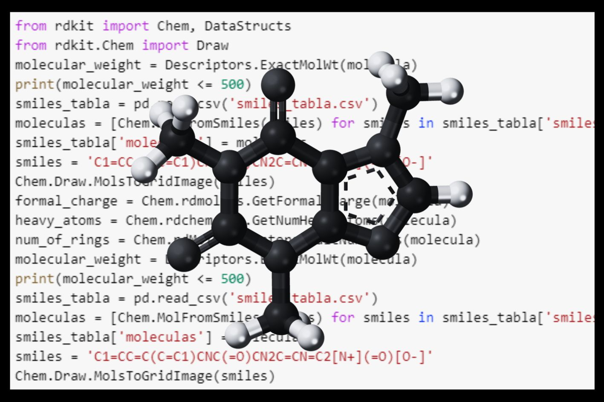
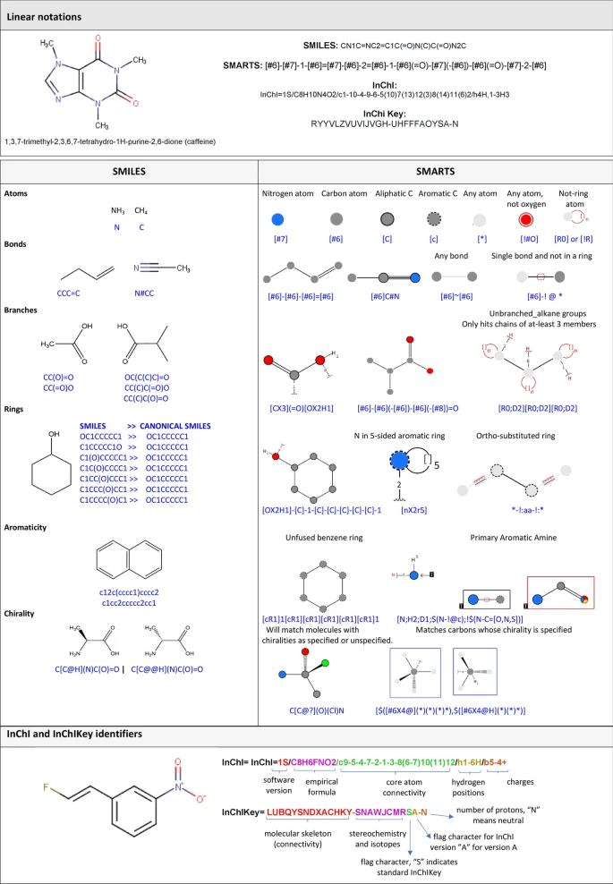
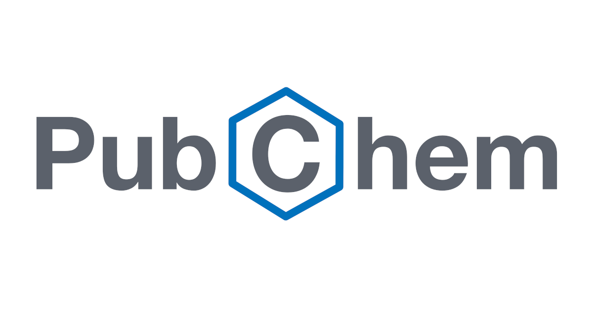

{ width="250", align="left" }

# **TP 6**. Quimioinformática { markdown data-toc-label = 'TP 6' }

<br>
<br>
<br>
<br>
<br>
<br>


!!! abstract "Atención: Este TP NO tiene informe."

<!--
### Slides mostrados en la clase

* :fontawesome-regular-file-pdf: [Slides TP](https://drive.google.com/file/d/1epc2_TThW1rG8V7Km3ebO25WxI3qeGeH/view?usp=sharing)
-->
<!--
### Videos de la clase grabada

* :octicons-video-16: [Cierre TP](https://youtu.be/ihqPF9RgthQ)
-->


### Software a usar
* [Google Colab](https://colab.research.google.com/)
* [RDKit](https://www.rdkit.org/docs/GettingStartedInPython.html)

## Objetivos

* Familiarizarse con la representación de estructuras químicas (SMILES, InchI)
* Aprender a caracterizar fisicoquímicamente compuestos químicos

## Parte 1: Análisis de datos quimioinformáticos

## Usando RDKit
RDKit es un software quimioinformático de código abierto.


Fue desarrollado por Greg Landrum con numerosas contribuciones adicionales de la comunidad de código abierto RDKit. Tiene una interfaz de programación de aplicaciones para Python, Java, C++ y C#

- Homepage: [http://www.rdkit.org](http://www.rdkit.org) Documentation, links
- Github ([https://github.com/rdkit)](https://github.com/rdkit)) Downloads, bug tracker, git repository
- Sourceforge ([http://sourceforge.net/projects/rdkit](http://sourceforge.net/projects/rdkit)) Mailing lists
- Blog ([https://greglandrum.github.io/rdkit-blog/](https://greglandrum.github.io/rdkit-blog/)) Tips, tricks, random stuff
- Tutorials ([https://github.com/rdkit/rdkit-tutorials](https://github.com/rdkit/rdkit-tutorials)) Jupyter-based tutorials for using the RDKit
- KNIME integration ([https://github.com/rdkit/knime-rdkit](https://github.com/rdkit/knime-rdkit)) RDKit nodes for KNIME


### Preparación del notebook

Vayan a [https://colab.research.google.com/](https://colab.research.google.com/)

Y se les abre una ventana. En la parte inferior elijan: New Notebook

Y ahora sí! Manos a la obra!

En la celda que se encuentra a continuación vamos a importar e instalar todas las librerías que se van a usar.

Primero vamos a instalar todo el software RDKit y otras librerias que vamos a usar con el comando `!pip install`. Este comando permite que las librerias estén descargadas e instaladas en Google Colab.

Luego le vamos a pedir que "tenga a mano" las librerías que vamos a usar con el comando `import`. De esta manera las tiene abiertas dentro de Google Colab para que estén disponibles para usar.

Si compararáramos las librerías de Python con libros físicos, podríamos decir que `!pip install` es el equivalente a comprar el libro y tenerlo en nuestra estantería y que `import` es el equivalente a agarrarlo de la estanteria y a abrirlo en nuestro escritorio.

```Python
# Instalar las librerias
!pip install rdkit
```

Ahora vamos a importar las librerias que vamos a usar. 

```Python
# Importar libreria de RDKit
from rdkit import Chem
from rdkit.Chem import AllChem
from rdkit.Chem import Descriptors
from rdkit.Chem import Draw
from rdkit.Chem.Draw import rdMolDraw2D
```

A lo largo de este práctico vamos a estar explorando las bases de datos quimioinformáticos y trabajando con los comandos básicos de RDKit para trabajar con moléculas.

### Representación de compuestos

Un compuesto químico puede escribirse de muchas maneras:
- The International Chemical Identifier (InChI)
- A 27-character hash code derived from an InChI (InChIKey)
- The Simplified Molecular-Input Line-Entry System (SMILES)

Cada una de estas notaciones tiene sus ventajas y desventajas.

Para cualquier trabajo quimioinformático, la notación que usemos para las moléculas va a ser clave. A continuación encontrarán un breve ilustración de la sintaxis de cada notación:

<br>

{ width="600", align="Center" }

<br>

En el caso de que quieran profundizar sobre los diferentes tipos de notación, en la publicación de dicha imagen pueden encontrar más información al respecto. Pueden acceder ingresando a este link: [https://doi.org/10.1186/s13321-020-00466-z](https://jcheminf.biomedcentral.com/articles/10.1186/s13321-020-00466-z)

### Generar una molécula a partir de SMILES
Para comenzar a trabajar necesitamos ingresar a la computadora el compuesto con el que vamos a trabajar, para eso vamos a generar una variable con la notación del compuesto. En este caso, vamos a usar la notación en smiles.

En programación se llama "variable" a la asignación de una palabra para identificar un objeto. En este caso, la palabra "smiles" la vamos a usar como variable para identificar la secuencia en smiles del Benznidazol.


```Python
# Generar la variable "smiles"
smiles = 'C1=CC=C(C=C1)CNC(=O)CN2C=CN=C2[N+](=O)[O-]'
```

Al generar la variable llamada smiles, guardamos la estructura en una palabra que podemos usar en el resto del código.

Vamos a ver que pasa si imprimimos la variable usando el comando `print()`:


```Python
# Imprimir la variable
print(smiles)
```

RDKit cuenta con un módulo llamado `Chem()`

Usando la analogía del comienzo, un módulo es un cápitulo del libro de RDKit.

Este módulo se escribe continuado por la acción que queremos que haga.
Vamos a usarla mucho, a medida que la usemos vamos a ver que se puede hacer con ella.

En este link encontrarán todas las opciones posibles: https://www.rdkit.org/docs/source/rdkit.Chem.html

En este caso, el módulo va a estar seguido de la función `MolFromSmiles()`, porque queremos que transforme el <i>string</i> que generamos a una <i>molécula</i>.

Vamos a generar la variable <b>molecula</b> para guardar la molécula de Benznidazol generada.

```Python
# Generar una molécula a partir del smiles
molecula = Chem.MolFromSmiles(smiles)
```

#### Actividad N°1 usando SMILES

💭 ¿Qué pasa si ahora imprimimos la variable?
```Python
print(molecula)
```

💭 ¿Qué pasa si imprimo sólo la molécula?
```Python
molecula
```

Imprimiendo sólo la variable que generamos con la información de la molécula podemos visualizarla!

### Generar una molécula a partir de InChI

Vamos a repetir el paso anterior pero usando la nomenclatura en InChI:

```Python
# Generar la variable "InChI"
inchi = "InChI=1S/C12H12N4O3/c17-11(14-8-10-4-2-1-3-5-10)9-15-7-6-13-12(15)16(18)19/h1-7H,8-9H2,(H,14,17)"
```
#### Actividad N°1 usando InChI
💭 ¿Qué pasa si ahora imprimimos la variable?

Ahora vamos a generar la molécula usando RDKit

```Python
# Generar una molécula a partir del InChI
molecula = Chem.MolFromInchi(inchi)
```
Este tipo de objeto nos va a permitir realizar trabajar directamente con la molécula.

Ahora vamos a visualizarla!

Para hacerlo, sólo tienen que ejecutar el nombre de la variable: 👇

```Python
# Visualizar la molécula
molecula
```

Y podemos transformar la nomenclatura de la molécula a InchiKey usando el siguiente comando:


```Python
# Generar el InchiKey de una molécula
inchikey = Chem.MolToInchiKey(molecula)
print(inchikey)
```

## Propiedades fisicoquímicas

Ahora vamos a algunas propiedades fisicoquímicas. 

Para hacerlo, vamos a usar la función `Descriptors` y `Chem` de RDKit.

Esta función permite indicar que tipo de descriptor queremos calcular para una molécula.

Vamos a calcular:

* El número de donodores de enlaces de hidrógeno en la molécula 

* El número de aceptores de enlaces de hidrógeno en la molécula

* El peso molecular de la molécula

* El logP (coeficiente de partición octanol-agua) de la molécula

* El número de enlaces rotativos en la molécula

RDKit permite calcular más descriptores, pero estos son los más usados. Si quieren saber más sobre esto pueden acceder al [manual de RDKit](https://www.rdkit.org/docs/source/rdkit.Chem.rdMolDescriptors.html)

Para calcular las propiedades podemos usar este código reemplazando **molecula** por el nombre de la molecula que quieran usar:
```Python
# Calcular el peso molecular exacto de la molécula
molecular_weight = Descriptors.ExactMolWt(molecula)

# Calcular el logP (coeficiente de partición octanol-agua) de la molécula
logp = Descriptors.MolLogP(molecula)

# Calcular el número de donodores de enlaces de hidrógeno en la molécula
h_bond_donor = Descriptors.NumHDonors(molecula)

# Calcular el número de aceptores de enlaces de hidrógeno en la molécula
h_bond_acceptors = Descriptors.NumHAcceptors(molecula)

# Calcular el número de enlaces rotativos en la molécula
rotatable_bonds = Descriptors.NumRotatableBonds(molecula)
```

#### Actividad N°1 usando las propiedades fisicoquímicas

💭 Coincide con peso molecular calculado en el punto anterior con el obtenido por RDKit?
```Python
#Escribí el código acá
```

## Parte 2: Análisis y clusterización de datos químicos

En esta sección exploramos un conjunto de moléculas con datos de **HIA (Human Intestinal Absorption)**, indicando si cada molécula tiene buena absorción intestinal (**+**) o mala (**-**). El objetivo es analizar cómo las propiedades estructurales y fisicoquímicas se relacionan con la absorción intestinal.  

## Dos enfoques de análisis

### Ejercicio 1. Clustering Jerárquico basado en fingerprints moleculares
- Cada molécula se representa mediante un **fingerprint**, una codificación binaria de su estructura química.  
- Calculamos **similitudes de Tanimoto** entre todas las moléculas y construimos un **dendrograma**, que muestra cómo se agrupan según su similitud.  
- Esto permite identificar grupos de moléculas estructuralmente similares y analizar la distribución de HIA dentro de cada cluster.

[:fontawesome-solid-computer: Ejercicio 1](https://colab.research.google.com/drive/1IoptwXEgPDecaKi3nQd8_7zxE-oT8epA?usp=sharing){ .md-button .md-button--primary }

### Ejercicio 2. Clusterización basada en propiedades fisicoquímicas y PCA
- Calculamos propiedades moleculares como **peso molecular, TPSA, logP, número de enlaces rotativos, H-bond donors y acceptors**.  
- Aplicamos **PCA (Análisis de Componentes Principales)** para reducir la dimensionalidad y capturar las variaciones más relevantes.  
- Luego utilizamos **K-means** para agrupar moléculas según estas propiedades, explorando relaciones entre características fisicoquímicas y absorción intestinal.

[:fontawesome-solid-computer: Ejercicio 2](https://colab.research.google.com/drive/1xahRSPWc8GAfPW3Tv4x3IHBjHXYT4lyy?usp=sharing){ .md-button .md-button--primary }

## Preguntas guía para el análisis

Al explorar los resultados, considerá:  
1. Completar la tabla con el **número óptimo de clusters** y el **índice de silueta promedio** para cada enfoque. 

| Enfoque                                    | Número óptimo de clusters | Silhouette promedio |
|--------------------------------------------|---------------------------|---------------------|
| Clustering jerárquico (fingerprints)       |                           |                     |
| KMeans sobre PCA (propiedades moleculares) |                           |                     |

2. Comparar la distribución de **HIA positivo (+)** y **negativo (-)** en cada cluster.  
3. Analizar qué moléculas se agrupan de manera diferente según la **estructura** (fingerprints) o las **propiedades fisicoquímicas** (PCA + K-means).  
4. Reflexionar sobre qué enfoque (jerárquico o K-means) parece capturar mejor la relación entre estructura/propiedades y absorción intestinal.

<div style="border-bottom: 3px solid black;">

</div>

## Ejercicios Adicionales

### Ejercicio integrador

En esta sección trabajaremos con un conjunto de moléculas que cuentan con datos reportados de HIA (Human Intestinal Absorption) y BBB (Blood-Brain Barrier). 
El objetivo es definir umbrales que permitan clasificar si una molécula puede atravesar la membrana intestinal y la barrera hematoencefálica. 
Posteriormente, aplicaremos estos umbrales para predecir HIA y BBB en nuevas moléculas y completar una tabla resumen con su clasificación.

1. Cargar los datos de moléculas para trabajar.
2. Seleccionar los umbrales para clasificar HIA y BBB.
3. Construir un modelo basado en esos umbrales.
4. Evaluar nuevas moléculas usando el modelo y los umbrales establecidos.
5. Completar la tabla resumen con HIA, BBB, clasificación y uso según PubChem.

[:fontawesome-solid-computer: Ejercicio Integrador](https://drive.google.com/file/d/1FokUQHov4ElVqivNnztyyBMjCmvOFMc2/view?usp=drive_link){ .md-button .md-button--primary }

Completá la siguiente tabla con la resolución del ejercicio integrador:

|  Molécula | SMILES | HIA | BBB | Clasificación | Uso según PubChem |
|-----------|--------|-----|-----|---------------|------------------|
|Molécula 1 | `CC1([C@@H](N2[C@H](S1)[C@@H](C2=O)NC(=O)[C@@H](C3=CC=C(C=C3)O)N)C(=O)O)C` |     |     |               |                  |
|Molécula 2 | `COC(=O)C(C1CCCCN1)C2=CC=CC=C2` |     |     |               |                  |
|Molécula 3 | `CN[C@H]1CC[C@H](C2=CC=CC=C12)C3=CC(=C(C=C3)Cl)Cl` |     |     |               |                  |
|Molécula 4 | `CC(CS(=O)(=O)C1=CC=C(C=C1)F)(C(=O)NC2=CC(=C(C=C2)C#N)C(F)(F)F)O` |     |     |               |                  |
|Molécula 5 | `CC1=CC(=O)[N-]S(=O)(=O)O1.[K+]` |     |     |               |                  |
|Molécula 6 | `C([C@@H]1[C@@H]([C@@H]([C@H]([C@H](O1)O[C@]2([C@H]([C@@H]([C@H](O2)CCl)O)O)CCl)O)O)Cl)O` |     |     |               |                  |


### Bases de datos quimioinformáticas

### Base de datos 1: PubChem
La primera que vamos a ver es PubChem, que es una base de datos químicos abierta del National Institutes of Health (NIH).

<br>

{ width="250", align="center" }

<br>

En esa base de datos se pueden cargar datos generados por nosotros o podemos usar los datos cargados por otras personas.
Recopila información sobre estructuras químicas, identificadores, propiedades químicas y físicas, actividades biológicas, patentes, salud, seguridad, datos de toxicidad y muchos otros.

Ahora vamos a ingresar y a recorrerla. Pueden acceder ingresando a este link: [PubChem](https://pubchem.ncbi.nlm.nih.gov/). En la página principal podemos ver que tenemos la opción de cargar una molécula en el recuadro blanco, de dibujar una estructura, de subir una lista de datos, de recorrer los datos disponibles y de acceder a una tabla periódica. En el práctico de hoy vamos a trabajar ingresando una sóla molécula, pero ustedes pueden explorar el resto de las opciones más tarde.

#### Actividad usando Pubchem
1.   Dentro del recuadro blanco pegar esta molécula:
`C1=CC=C(C=C1)CNC(=O)CN2C=CN=C2[N+](=O)[O-]` y usar la lupa para buscarlo dentro de la base de datos
2.   Verán que aparece un sólo resultado, una molécula llamada "BENZNIDAZOLE". Vamos a hacer click en el nombre para ingresar a ver la información que tiene cargada.
3.   A la derecha encontrarán la tabla de "CONTENTS" donde hay una lista de toda la información disponible para este compuesto. Recorran las diferentes secciones.
4.  Bajen hasta la sección "Names and Identifiers" ¿Que ven ahí?

###  Base de datos 2: ChEMBL
La segunda base de datos que vamos a ver es ChEMBL, es una base de datos curada manualmente de moléculas bioactivas del Laboratorio Europeo de Biología Molecular (EMBL).

<br>

{ width="250", align="center" }

<br>

Es una base de datos de moléculas pequeñas similares a fármacos bioactivos, contiene estructuras bidimensionales, propiedades calculadas (p. ej., logP, peso molecular, parámetros de Lipinski, etc.) y bioactividades resumidas (p. ej., constantes de unión, farmacología y datos ADMET).

Ahora vamos a ingresar y a recorrerla. Pueden acceder ingresando a este link: [ChEMBL](https://www.ebi.ac.uk/chembl/). En la página principal podemos ver que tenemos la opción de cargar una molécula en el recuadro blanco o de recorrer los datos disponibles. Vamos a volver a ingresar la misma molécula que usamos antes.

#### Actividad N° 1 usando ChEMBL
1.   En el recuadro de búsqueda pegar esta molécula:
tryptophan. (Es importante que le pongan las comillas!)
2.   Apretar en la lupa para buscar
3.   Ingresar al compuesto "CHEMBL54976".
4.   A la derecha encontrarán una lista de toda la información disponible para este compuesto. Recorrer las diferentes secciones.

#### Actividad N°2 usando ChEMBL
1.   Debajo del recuadro blanco, ingresar a "Advanced Search".
2.   En la pestaña de "Chemical Structure" pegar esta molécula:
`C1=CC=C(C=C1)CNC(=O)CN2C=CN=C2[N+](=O)[O-]`
3.   Subir la "Similarity" al 100%
4.   Apretar el recuadro de "Similarity"
5.   Ingresar al compuesto "CHEMBL110".
6.   A la derecha encontrarán una lista de toda la información disponible para este compuesto. Recorrer las diferentes secciones.
7.  ¿Que diferencias encuentran con la información en PubChem?


### Base de Datos 3: SureChEMBL

SureChEMBL es una base de datos química que proporciona acceso a información valiosa sobre patentes relacionadas con compuestos químicos. Es una herramienta poderosa y ampliamente utilizada en el campo de la química y la investigación farmacéutica.

Lo que distingue a SureChEMBL es su enfoque en el análisis y la extracción de datos de patentes químicas de manera eficiente y estructurada. La base de datos recopila y organiza millones de patentes de todo el mundo, permitiendo a los investigadores explorar una gran cantidad de información en busca de nuevos compuestos, reacciones químicas y avances tecnológicos.

En 2013 la empresa Digital Science (dueña de SureChem) transfirió esta base de datos al EMBL-EBI, poniendola en el dominio público. Es la primera vez que una colección de estructuras químicas de patentes mundiales de este tamaño se pone a disposición del público y de forma gratuita, lo que lo convierte en un avance significativo en el descubrimiento de fármacos. ([Ver noticia](https://www.ebi.ac.uk/about/news/technology-and-innovation/SureChEMBL/))

<br>

{ width="600", align="center" }

<br>

Ahora vamos a ingresar y a recorrerla. Pueden acceder ingresando a este link: [SureChEMBL](https://www.surechembl.org). En la página principal podemos ver que tenemos la opción de cargar una molécula en el recuadro blanco o de cargarla usando Marvin Js.

#### Actividad N°1 usando SureChEMBL
1.   Ingresar a la sección "Structure Search" que se encuentra debajo de la caja de búsqueda. 
2.   Dentro del recuadro de Marvin Js, pegar este smiles
`CC(C)(C)C1=CC(=C(C=C1NC(=O)C2=CNC3=CC=CC=C3C2=O)O)C(C)(C)C`
3.   Seleccionar la búsqueda según Identical
4.   Apretar el recuadro de "Search"
5.   Seleccionar "See More" en la molécula "SCHEMBL351373"

¿Cuántas patentes tiene este compuesto?

#### Actividad N°2 usando SureChEMBL
1.   Ingresar a la sección "Structure Search" que se encuentra debajo de la caja de búsqueda. 
2.   Dentro del recuadro de Marvin Js, pegar este smiles `O=C1C=CNC2=CC=CC=C12`
3.   Seleccionar la búsqueda según Substructure
4.   Apretar el recuadro de "Search"

¿Que encontramos haciendo este tipo de búsqueda?


## Material de lectura y consulta

Si les interesa profundizar en el uso de Python les dejamos una notebook con algunos comandos para prácticar en este [link](https://colab.research.google.com/drive/1JlSzqQ5SgvB4UWaH2tmD4hZ61-2TxMPm?usp=sharing)

Pueden ver todos las funciones de este módulo entrando a este [link](https://www.rdkit.org/docs/source/rdkit.Chem.rdchem.html)

En el caso de que quieras profundizar en alguna (o buscar nuevas) ahi encontrarás toda la información

   * :paperclip: O'Boyle NM, Banck M, James CA, Morley C, Vandermeersch T, Hutchison GR. Open Babel: An open chemical toolbox. J Cheminform. 2011 Oct 7;3:33. [DOI:10.1186/1758-2946-3-33](https://doi.org/10.1186/1758-2946-3-33). [PMID:21982300](https://pmid.us/21982300).
  * :octicons-link-16: [A beginner's guide for understanding Extended-Connectivity Fingerprints(ECFPs). Manish Kumar (2021).](https://chemicbook.com/2021/03/25/a-beginners-guide-for-understanding-extended-connectivity-fingerprints.html) 

  * :paperclip: Hu Y, Stumpfe D, Bajorath J. Recent Advances in Scaffold Hopping. J Med Chem. 2017 Feb 23;60(4):1238-1246. [DOI:10.1021/acs.jmedchem.6b01437](https://doi.org/10.1021/acs.jmedchem.6b01437). Epub 2016 Dec 21. [PMID:28001064](https://pmid.us/28001064).
  * :paperclip: Mitternacht S. FreeSASA: An open source C library for solvent accessible surface area calculations. F1000Res. 2016 Feb 18;5:189. [DOI:10.12688/f1000research.7931.1](https://doi.org/10.12688/f1000research.7931.1). [PMID:26973785](https://pmid.us/26973785).
  * :paperclip: Bolcato G, Heid E, Boström J. On the Value of Using 3D Shape and Electrostatic Similarities in Deep Generative Methods. J Chem Inf Model. 2022 Mar 28;62(6):1388-1398. [DOI:10.1021/acs.jcim.1c01535](https://doi.org/10.1021/acs.jcim.1c01535). Epub 2022 Mar 10. [PMID:35271260](https://pmid.us/35271260).
  * :paperclip: Ertl P, Rohde B, Selzer P. Fast calculation of molecular polar surface area as a sum of fragment-based contributions and its application to the prediction of drug transport properties. J Med Chem. 2000 Oct 5;43(20):3714-7. [DOI:10.1021/jm000942e](https://doi.org/10.1021/jm000942e). [PMID:11020286](https://pmid.us/11020286).
  * :material-book-education: [ChEBI User Guide](https://docs.google.com/document/d/1_w-DwBdCCOh1gMeeP6yqGzcnkpbHYOa3AGSODe5epcg/edit) 