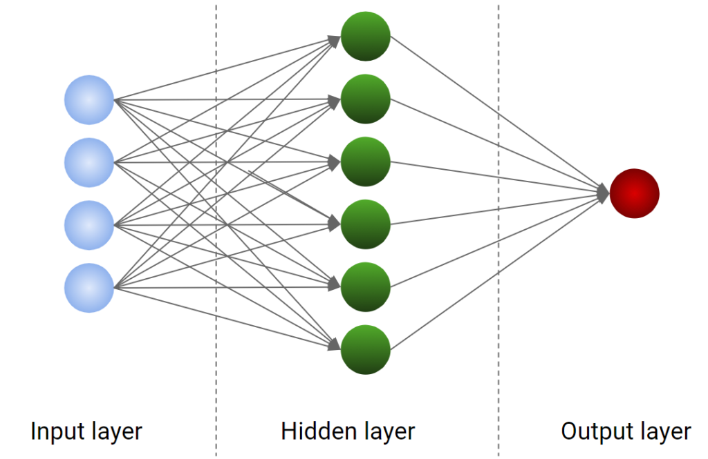
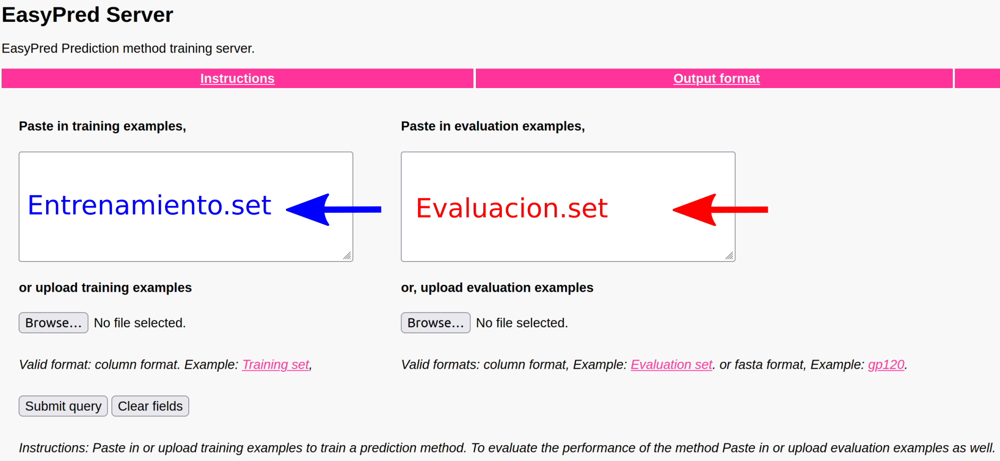
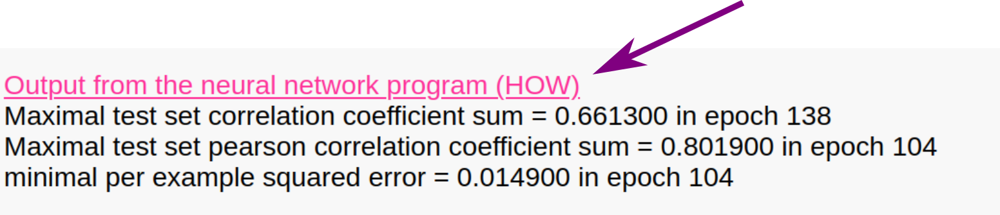

<!--
{ width="250", align="left" }
-->

# **TP 08**. Hidden Markov Models (HMMs) { markdown data-toc-label = 'TP 08' }

<br>

[:fontawesome-solid-download: Materiales](https://drive.google.com/file/d/1eL9f2b1i7_i6IfcxBv4tlrkBtTpXHBEy/view?usp=share_link){ .md-button .md-button--primary }
<!--
[:fontawesome-solid-download: Slides](https://docs.google.com/presentation/d/1s62O4NBwBTA1oQ8wTm85rNmqorYB9XWh/edit?slide=id.p1#slide=id.p1){ .md-button .md-button--primary }
-->
<br>

<!--
### Slides mostrados en la clase

* :fontawesome-regular-file-pdf: [Explicación ANNs](https://docs.google.com/presentation/d/1XALgjFolvOZMH-ksATU3YI7YQgU75q8R/edit?usp=sharing&ouid=115287066011570616875&rtpof=true&sd=true)
* :fontawesome-regular-file-pdf: [Explicación HMMs](https://docs.google.com/presentation/d/1s62O4NBwBTA1oQ8wTm85rNmqorYB9XWh/edit?usp=sharing&ouid=115287066011570616875&rtpof=true&sd=true)

### Videos de la clase grabada
* :octicons-video-16: [Puesta en común ANNs y Ejercicio guiado HMMer](https://youtu.be/Z03cj479g_A)
-->

## Objetivos

<!--
* Comprender cómo se entrena y evalúa un modelo basado en redes neuronales.
* Familiarizarse con el esquema de validación cruzada para el entrenamiento de dichos modelos.
-->

* Construir un perfil basado en HMMs y utilizar el mismo para realizar búsquedas en bases de datos de secuencias.
* Crear una base de datos de perfiles de secuencias y utilizar la misma para identificar dominios conservados en secuencias *query*.

<!--
## Parte I. Artificial neural networks

En esta sección vamos a utilizar redes neuronales para hacer predicciones como habíamos hecho anteriormente con las PSSM. La idea es similar a la del TP6 donde entrenamos un modelo con péptidos que se unen a MHC. Variaremos los parámetros de modelo para mejorarlo, sensando en cada corrida los indicadores de desempeño del mismo (**Aroc** y **Pearson correlation coefficient**). 

!!! attention "Atención"

    Si no recuerdan qué significan las métricas **Aroc** y **Pearson correlation coefficient (PCC)** diríjanse al TP6 para refrescar estos conceptos.

Para esto vamos a volver a utilizar [EasyPred](https://services.healthtech.dtu.dk/service.php?EasyPred-1.0) y los archivos de **Entrenamiento.set** y **Evaluacion.set** en la carpeta del TP (que descargaron al inicio).

- **Entrenamiento.set** contiene 1200 péptidos de longitud 9, con un valor asociado de afinidad de unión a HLA-A\*02:01 transformado entre 0 y 1. Recuerde que mientras más cercano a 1 el péptido tiene mayor afinidad de unión y que a partir de 0.426 se considera que el péptido es un ligando. 
- **Evaluacion.set** contiene 66 péptidos, también con sus valores correspondientes de afinidad de unión. 

Para el entrenamiento del modelo se particionará el archivo **Entrenamiento.set**, de tal manera que una parte se usará para entrenar y la restante se empleará para ir monitoreando el proceso de entrenamiento y así evitar el sobreajuste de los pesos de nuestra red.

Luego el archivo **Evaluacion.set** contiene datos independientes, que se utilizarán para evaluar la capacidad de generalización de nuestro modelo. 

!!! tip "Tip"

    Es recomendable abrir los archivos y ver qué es lo que contienen. Esto SIEMPRE es una buena práctica.

!!! note "Nota"

    A lo largo del TP vamos a mantener el valor de *Cutoff for counting an example as a positive example* en 0.5.

!!! attention "Atención"

    Vayan corriendo las diferentes pruebas en diferentes pestañas o guarden el reporte de salida para poder compararlo cuando sea necesario.  

### Primera prueba: *Comprendiendo los resultados que indican el desempeño de la red*

Para nuestro primer modelo vamos a ir a [EasyPred](https://services.healthtech.dtu.dk/service.php?EasyPred-1.0) y cargamos los archivos en los cuadros correspondientes:



Luego bajamos hasta la opción *Select method* dónde vamos a cambiar de *Matrix method* a *Neural Network*.  

Allí vamos a poder ver que nos habilita a ingresar otros parametros que están relacionados a la arquitectura y el entrenamiento de la red.

Los parámetros que queremos utilizar en este paso son:

* *Number of hidden units*: 2  
* *Number iterations (epochs) to run neural network*: 300  
* *Fraction of data to train on (the rest is used to avoid overtraining)*: 0.8  
* *Learning rate*: 0.05  
* *Use top sequences for training*  

Es decir dejamos los valores por defecto y le damos *Submit*.

Una vez entrenado el modelo, recuerde que puede chequear el desempeño del mismo iteración a iteración haciendo click en **Output from the neural network program (HOW)** 



1. ¿Cuál es el máximo valor de PCC alcanzado sobre el set de prueba? (*Maximal test set pearson correlation coefficient sum*) 
1. ¿En qué iteración se alcanza ese máximo? ¿Qué información le está dando esto sobre el proceso de entrenamiento del modelo?  
1. ¿Cuáles son los valores de desempeño del modelo sobre el set de evaluación? (PCC y Aroc)
1. ¿El PCC obtenido en el punto 3. es mayor o menor al obtenido en el punto 1.? ¿Qué implica este resultado?  

### Segunda prueba: *Cambiando el set de entrenamiento*

Mantenga los mismos parámetros que en el paso anterior pero esta vez seleccione *Use bottom sequences for training*. 

1. ¿Cuál es el máximo valor de PCC alcanzado sobre el set de prueba y en qué iteración ocurre esta vez?
1. ¿Qué valores de desempeño alcanza el modelo aplicado al set de evaluación?
1. ¿A qué se debe que no coincidan con lo obtenido en la primera prueba?

### Tercera prueba: *Cambiando la arquitectura de la ANN*

Repita los parámetros de la **primera prueba** excepto por el número de neuronas en la capa intermedia o *hidden layer*:

* *Number of hidden units*: 1

Observe el impacto en los parámetros de desempeño del modelo. Guarde los resultados. 

Repita el ensayo esta vez con:

* *Number of hidden units*: 5

Responda a las siguientes preguntas para ambos casos estudiados:

1. ¿Cómo varía la *performance* en el set de prueba?  
1. ¿Qué impacto tienen estos cambios en la *performance* del set de evaluación?  
1. ¿Puede elegir un número óptimo de neuronas para la capa oculta?  
1. ¿Por qué cree que el número de neuronas en la capa oculta tiene tan poco impacto en esta prueba? Piense en el número de datos de entrada y el número de pesos de la red. 

### Cuarta prueba: *Empleando un esquema de validación cruzada*

Como deberían haber notado en las dos primeras pruebas, la partición de los datos que se utilizan en el entrenamiento/prueba influyen significativamente en el desempeño del modelo. 

Como *a priori* uno no puede establecer cuál es la mejor forma de partir los datos en entrenamiento y *test* se recurre a una estrategia denominada *cross-validation*. La técnica de validación cruzada consiste en hacer *N* particiones (por lo general 5) y rotarlas, utilizando N-1 para entrenar y la N-ésima (es decir la que queda afuera) como set de prueba. Esto resulta en N modelos diferentes, cada uno entrenado y probado en datos diferentes. Para realizar predicciones en nuevos sets, como el de evaluación, se realizan predicciones con los N métodos y se promedian sus predicciones.

Para realizar esta prueba vuelvan a los parámetros de la **Primera prueba** pero modifiquen lo siguiente:

* *Number of partitions for cross-validated training*: 5

!!! attention "Este paso puede llevar varios minutos. Paciencia."

1. ¿Encuentran diferencias entre los desempeños de los 5 modelos? ¿Es esperable? ¿Por qué?
1. Comparen los resultados obtenidos para el set de evaluación con respecto a la primera prueba.
1. En este caso se usa el ensamble de los 5 modelos para realizar las predicciones sobre el set de evaluación. ¿Cómo piensa que se obtienen los valores predichos?

### Utilizando el modelo entrenado

Como vimos en el TP de PSSM, una vez que uno entrena un método, puede guardar los valores ajustados (ya sea de la matriz en el caso de la PSSM o los pesos de la red en el caso de ANN) y utilizarlos para hacer predicciones en un set nuevo de datos.

!!! attention "Guardar el modelo entrenado"

    Para ello vamos a guardar el modelo entrenado en la **Cuarta prueba** haciendo **click derecho** en *Parameters for prediction method* del reporte de resultados y seleccionando "Guardar enlace como..." (el archivo se guarda como **para.dat**). 
    Este modelo será utilizado en el ejercicio a entregar de este TP.
--> 
## HMMer

### Introducción

**HMMer** es un paquete de programas que nuclea varias funciones para realizar búsquedas en bases de datos mediante la utilización de perfiles de secuencias. Está basado en *profile Hidden Markov Models*, presentados por Anders Krogh (Krogh *et al.*, 1994). Estos perfiles son una aproximación estadística del consenso de un alineamiento múltiple y utilizan un sistema de puntaje posición-específico, en contraste con métodos ya vistos como BLAST o FASTA en donde la matriz de puntajes utilizada es la misma en cada posición.

En esta clase utilizaremos el paquete HMMer en un colab para la generación de distintos perfiles.

#### ✏️ Instalación de HMMer

Abran un colab, creen una celda de código e ingresen el siguiente comando para la instalación de HMMer

```Bash
!apt install hmmer2
```

### Ejercicio 1. Construcción de un perfil para la detección de homólogos lejanos.

Los HMM son modelos probabilísticos que capturan la información de un alineamiento múltiple de secuencias, asignando probabilidades tanto a la presencia de aminoácidos por posición, como a la ocurrencia de inserciones y deleciones, considerando las probabilidades de transición entre distintos estados.

Por lo tanto, a diferencia de las matrices de sustitución, esta forma de puntuación permite detectar relaciones evolutivas más distantes entre secuencias.

#### ✏️ Descarga de las secuencias

Para la identificación de homólogos dentro de la familia de las globinas, utilizaremos un alineamiento múltiple de 50 secuencias de globinas (`globins50.msf`). 

```Bash
!wget "https://drive.google.com/uc?export=download&id=1JCpvyTT94ECPC2dWwAErIbQlB_cdP62t" -O globins50.msf # Descarga el alineamiento múltiple
```

#### ✏️ Construcción del perfil

El alineamiento será utilizado para la construcción de un perfil basado en HMM (de sus siglas en inglés, Hidden Markov Model) utilizando la función `hmm2build`:

```Bash
!hmm2build globin.hmm globins50.msf # construcción del perfil
```

`hmm2build` recibe dos argumentos:

- archivo en el cual va a guardar el perfil (`globin.hmm`)
- archivo con el cual crea el perfil (`globins50.msf`).

#### ✏️ Visualice el perfil
Si bien el contenido del archivo donde se guardó el perfil es legible, su contenido no debería tener sentido para ustedes (más allá del encabezado con información sobre las opciones que se utilizaron para crearlo) porque únicamente almacena los pesos de las transiciones de estado del HMM.

- ¿Puede identificar lo que es cada columna y cada fila?


#### ✏️ Calibración del perfil

Este paso no es imprescindible pero sí aconsejable.

La **calibración del perfil** le otorga mayor sensibilidad en la búsqueda ya que modifica la estimación del E-value de los *hits* encontrados. 

La búsqueda contra bases de datos nos devuelve junto con cada alineamiento un score y un E-value, este último nos da una idea sobre la cantidad de *hits* que esperamos encontrar con ese score en una base de datos construida con secuencias aleatorias y se calcula según la longitud de la secuencia *query* y *subject*, el tamaño de la base de datos y la matriz de *scoring*.

En el caso de HMMer, la estimación del E-value es analítica y resulta muy conservativa, por lo que se dejan de lado posibles *hits* (como homólogos lejanos). Utilizando `hmm2calibrate` podemos calibrar el cálculo de E-values de manera empírica incrementando de manera significativa la sensibilidad de la búsqueda.

`hmm2calibrate` toma como parámetro el archivo con un modelo HMM como **globin.hmm** y puntúa un número grande de secuencias sintetizadas al azar (por default 5000 secuencias) con este modelo. Luego ajusta una EVD (Extreme Value Distribution) al histograma de los puntajes obtenidos y guarda nuevamente el modelo HMM con estos nuevos parámetros.

Como para realizar este cálculo se sintetizan secuencias al **azar**, estableceremos una semilla (o *seed*) para poder reproducir nuestros resultados.

Primero, realice una copia del perfil sin calibrar para poder ver los cambios en el archivo.

```Bash
!cp globin.hmm globin_no_calibrado.hmm
```

Segundo, corra el comando para realizar la calibración.

```Bash
# !hmm2calibrate globin.hmm # Este es el comando sin seed

!hmm2calibrate --seed 1 globin.hmm  
```

Inspeccione el nuevo perfil y responda:

- A simple vista, ¿Qué cambio observa en el archivo?

Puede inspeccionar las diferencias entre los archivos utilizando el siguiente comando:

```Bash
!diff globin.hmm globin_no_calibrado.hmm
```

- ¿Qué son los valores de la línea que dice EVD? (Pista: Observe la salida en la celda donde corrió la calibración)


#### ✏️ Uso del perfil para búsqueda en base de datos

El comando para realizar una búsqueda en base de datos con nuestro perfil es `hmm2search`.
La base de datos que vamos a utilizar es `Artemia.fa` que contiene una única secuencia de globina en búsqueda de dominios pertenecientes a nuestra familia de interés.

Primero, obtenga la secuencia:

```Bash
!wget "https://drive.google.com/uc?export=download&id=1nCIhJP1F5GkUuZzqUDenRy5T_q-_ROuP" -O Artemia.fa
```

Segundo, realice la búsqueda utilizando el perfil calibrado:

```Bash
!hmm2search globin.hmm Artemia.fa
```

La salida de este comando es más larga que las anteriores, consta de un encabezado con la información sobre el programa y los parámetros que utilizamos en la búsqueda (*Los datos que aparecen en esta muestra pueden no coincidir con lo que aparece en su colab*):

```
hmmsearch - search a sequence database with a profile HMM
HMMER 2.3.2 (Oct 2003)
Copyright (C) 1992-2003 HHMI/Washington University School of Medicine
Freely distributed under the GNU General Public License (GPL)
- - - - - - - - - - - - - - - - - - - - - - - - - - - - - - - - - - - -
HMM file:                   globin.hmm [globins50]
Sequence database:          Artemia.fa
per-sequence score cutoff:  [none]
per-domain score cutoff:    [none]
per-sequence Eval cutoff:   <= 10        
per-domain Eval cutoff:     [none]
- - - - - - - - - - - - - - - - - - - - - - - - - - - - - - - -

Query HMM:   globins50
Accession:   [none]
Description: [none]
  [HMM has been calibrated; E-values are empirical estimates]
```

Una lista parecida a la que da BLAST con los *hits* más importantes ordenados por su E-value:

```
Scores for complete sequences (score includes all domains):
Sequence Description                                    Score    E-value  N 
-------- -----------                                    -----    ------- ---
S13421   S13421 GLOBIN - BRINE SHRIMP                   347.5    2.4e-105   8
```

Noten que después del E-value hay un campo que no se encontraba en los otros algoritmos de búsqueda denominado "N". Este valor representa la cantidad de dominios de nuestro profile que fueron encontrados en el hit.

Luego encontramos información sobre los dominios de nuestro *profile* individualmente. 

```
Parsed for domains:
Sequence Domain  seq-f seq-t    hmm-f hmm-t      score  E-value
-------- ------- ----- -----    ----- -----      -----  -------
S13421     6/8     928  1075 ..     1   162 []    66.8  7.9e-21

...

```

Los campos son:

- el nombre del hit 

- el dominio que se alineó (por ej. 2/4 significa que es el dominio Nro 2 de 4 que hay en total en nuestro perfil) 

- **seq-f** y **seq-t** son las posiciones del hit donde comienza y termina el alineamiento con ese dominio y el campo siguiente a estos valores (sin nombre) es una codificación de qué parte de la secuencia fue alineada. 

  - los corchetes significan extremos y los puntos posiciones en el medio, por lo que:

      - ".." significa que el alineamiento comenzó y terminó en una posición que no es terminal de la secuencia hit

      - "\[." significa que el alineamiento empieza al comienzo de la secuencia y termina en alguna posición en medio

      - al revés, ".\]" empieza en una posición intermedia y termina en el fin de la secuencia

      - por último "\[\]" es que el dominio abarca toda la secuencia. 

- Los tres siguientes campos son análogos pero refiriéndose a la secuencia del dominio en nuestro perfil HMM.

- Luego se reportan el score y el E-value.

 La sección siguiente contiene los alineamientos de los dominios que fueron hit en la lista anterior en un formato similar al de BLAST, teniendo como primera secuencia el consenso del *profile* (noten que hay aminoácidos en mayúsculas, estos se encuentran altamente conservados en el profile). 

 Al igual que BLAST en medio de ambas secuencias se escriben los aminoácidos que coinciden o "matchean" y signos más (+) en donde hay mismatches con puntaje positivo en la matriz de sustitución.

```
Alignments of top-scoring domains:
S13421: domain 6 of 8, from 928 to 1075: score 66.8, E = 7.9e-21
                   *->vilealvnssShLSaeekalVkslWYgKVegnaeeiGaeaLgRlFvv
                      +           LSa e a Vk++W   V+ ++ ++G  ++  lF +
      S13421   928    G-----------LSAREVAVVKQTW-NLVKPDLMGVGMRIFKSLFEA 962  

                   YPwTqryFphFgdLssldavkgspkvKaHGkKVltalgdavkhLDdtgnl
                   +P  q+ Fp+F+d+ +ld +++ p v +H   V t l++ ++ LD   nl
      S13421   963 FPAYQAVFPKFSDV-PLDKLEDTPAVGKHSISVTTKLDELIQTLDEPANL 1011 

                   kgalakLSelHadklrVDPeNFklLghvlvvvLaehfgkdftPevqAAwd
                   +    +L+e H   lrV+   Fk +g+vlv  L   +g  f+  +  +w 
      S13421  1012 ALLARQLGEDH-IVLRVNKPMFKSFGKVLVRLLENDLGQRFSSFASRSWH 1060 

                   KflagvanaLahKYr<-*
                   K++++++  +++      
      S13421  1061 KAYDVIVEYIEEGLQ    1075 

```

Llegando al final encontramos un histograma en formato ASCII. En este caso como nuestra "base de datos" tiene una sola secuencia no es informativo en absoluto.

```
Histogram of all scores:
score    obs    exp  (one = represents 1 sequences)
-----    ---    ---
  347      1      0|=
```

Y por último algunos detalles estadísticos que corresponden al ajuste de la EVD, en los cuales no vamos a focalizar. 

```
% Statistical details of theoretical EVD fit:
              mu =  -106.9318
          lambda =     0.1910
chi-sq statistic =     0.0000
  P(chi-square)  =          0

Total sequences searched: 1

Whole sequence top hits:
tophits_s report:
     Total hits:           1
     Satisfying E cutoff:  1
     Total memory:         20K

Domain top hits:
tophits_s report:
     Total hits:           8
     Satisfying E cutoff:  8
     Total memory:         25K

```

### Ejercicio 2. Uso del perfil para búsqueda en Bases de datos reales.

HMMer puede leer los formatos de la mayoría de las bases de datos conocidas. A diferencia de BLAST no es necesario indexar la base de datos.

Para el uso de BLAST, uno puede crear su propia base de datos donde realizar los alineamientos a partir de un archivo multifasta que era necesario indexar usando las *ktuplas*.

En este caso HMMer puede realizar la búsqueda directamente sobre el multifasta sin necesidad de más procesamiento.

#### ✏️ Descarga de SwissProt

En primer lugar vamos a descargar la base de datos de secuencias de proteínas **Swissprot**

```Bash
# Para archivos de más de 100 Megas google nos genera un warning, por lo tanto en este caso no se puede utilizar wget.
!gdown "https://drive.google.com/uc?id=1AYZ2T4wzfCR95Oz86r6VubX4ciE7JY1W" -O Swissprot.fasta
```

#### ✏️ Búsqueda en SwissProt

En nuestro servidor podemos realizar la búsqueda utilizando:

```Bash
!hmm2search globin.hmm Swissprot.fasta > globin.swissprot.search
```

!!! note "A tener en cuenta:"

      Notarán que la búsqueda directa aumenta considerablemente el tiempo de cómputo necesario para obtener un resultado.

#### ✏️ Inspección de la salida

Descarguen el archivo de salida y observen el resultado. Luego, responda:

- ¿Qué nombres de proteínas observa al principio y al final de la lista?
- ¿Qué rango de e-values observa?
- ¿Qué rango de Scores observa?
- Vaya al final del archivo e interprete el histograma.

#### Alineamientos con HMM

HMMer no utiliza los métodos clásicos de alineamiento (*Smith-Waterman o Needleman-Wunsch*) como el resto de los algoritmos de alineamiento sino que el modo de alinear (local o global) está dado por el modelo que construimos. 

Por defecto `hmm2build` lleva a cabo alineamientos que son globales con respecto al HMM y locales con respecto a la secuencia objetivo, permitiendo alinear varios dominios en esa misma secuencia. 

Es decir, cada dominio se intenta alinear **completamente** en alguna porción de la secuencia objetivo. Si queremos recuperar secuencias que contengan alineamientos parciales de dominios podemos agregar a `hmm2build` la opcion `-f` .


### Ejercicio 3. Bases de Datos de HMMs

#### Bases de datos de HMM (Online)

Así como nos es posible realizar búsquedas de *profiles* contra bases de datos de secuencias, podemos crear una base de datos de *profiles* y utilizar como *query* a una secuencia. Este es el caso de la base de datos **PFAM** (Sonnhammer *et al.*, 1997; Sonnhammer *et al.*, 1998) que nuclea *profiles* de una gran variedad de dominios y es una herramienta sumamente utilizada para analizar secuencias de proteínas de las cuales no tenemos información previa.

Como ejemplo, tomemos el producto del gen *Sevenless* de *Drosophila melanogaster* que codifica un receptor de *tyrosine kinase* esencial para el desarrollo de las células R7 del ojo de la mosca. 

La secuencia proteica de este receptor se encuentra en el archivo **7LESS_DROME**.

#### ✏️ Búsqueda en InterPro

- Realice una búsqueda de esta secuencia en [Interpro](https://www.ebi.ac.uk/interpro/). Para esto ingrese en **Search by text** el accession number de la secuencia: P13368.

- En la tabla de resultados vaya a la sección de Domains y despliéguela.

- Inspeccione y conteste:

* ¿Qué dominios Pfam fueron identificados en esta proteína y en qué posiciones se encuentran? Recuerde estos resultados para contrastarlo con lo que hará más adelante (La lista de dominios y su base de datos aparece a la derecha junto con el identificador).

* Haga click en el identificador del dominio de Fibronectina 3 (FN3) para ver más información sobre el mismo.

    * ¿Qué información relevante puede obtener de esta página?
    * Vaya a Profile HMM ¿Qué observa?


#### Bases de datos de HMM (Locales)

Las bases de datos de *profiles* no son más que múltiples HMMs concatenados, por lo que el comando para construirlas es también **hmm2build**, pero vamos a utilizar la opción **-A** (append) para agregar nuevos *profiles* a nuestro archivo de HMMs original.

Primero, descargue los alineamientos de las secuencias de dominios **rrm** de reconocimiento de ARN, **fn3** de fibronectina tipo III y **pkinase** del dominio catalítico de las kinasas a partir de las cuales construiremos los HMM:

#### ✏️ Descarga de secuencias

```Bash
!wget "https://drive.google.com/uc?export=download&id=1H5fl9m3xBy6Nlcp3BYNhOTEcBhjNtqKc" -O rrm.sto
!wget "https://drive.google.com/uc?export=download&id=1oPOoDMfuOQku4PB3DA4SoprwXrHuORRh" -O pkinase.sto
!wget "https://drive.google.com/uc?export=download&id=12EL1MYx7pqM45DyFTVPnKRmfPgrwq5Mb" -O fn3.sto
```

#### ✏️ Construcción de base de datos de perfiles

Construya la base de datos **"myhmms"** con hmm2build pero habilitando la opción de *agregar* nuevos HMMs usando `-A` :

```Bash
!hmm2build -A myhmms rrm.sto
!hmm2build -A myhmms fn3.sto
!hmm2build -A myhmms pkinase.sto
```

!!! warning "No correr más de una vez esta celda sin borrar el archivo myhmms antes"

    Dado que está agregando HMMs a una base de datos, lo que puede ocurrir es que agregue más de una vez el mismo hmm a la base de datos y obtenga un mayor número de regiones identificadas con ese hmm únicamente porque está repetido.


#### Búsqueda con nuestra base de datos en una secuencia

Para realizar búsquedas en nuestra nueva base de datos utilizamos el comando `hmm2pfam`. En este caso empleamos nuevamente, como ejemplo, a la proteína codificada por el gen *Sevenless* de *Drosophila melanogaster*

#### ✏️ Descarga de secuencia

```Bash
!wget "https://drive.google.com/uc?download&id=1H7DcDVDAsgEZdIjAxreykbs7LFQrmhAx&usp=drive_copy" -O 7LESS_DROME.dat
```

#### ✏️ Uso de la base de datos de HMMs

```Bash
!hmm2pfam myhmms 7LESS_DROME.dat >7LESS_DROME.pfam
```

#### ✏️ Inspección de la salida

La salida es muy parecida a la de **hmm2search** pero los hits reportados no serán secuencias sino dominios contenidos en la base de datos. 

En nuestro caso particular podrán notar que tenemos un hit contra un **dominio RRM**: 

- ¿recuerdan si la base de datos Pfam identificó este dominio en la proteína de estudio?
- ¿que observa en el hit que le llama la atención?


#### ✏️ Uso restrictivo de la base de datos de HMMs

El límite de E-value por defecto, al igual que para BLAST es 10, este umbral es extremadamente permisivo y proclive a devolver ruido. Si queremos ser más quisquillosos podemos utilizar la opción **-E** seguida del umbral deseado. Por ejemplo:

```Bash
!hmm2pfam -E 0.1 myhmms 7LESS_DROME.dat >7LESS_DROME_e001.pfam
```

### Ejercicio Adicional: Alineamientos múltiples con HMM

Otro uso que se les da a los *profiles* es el de asistir a la hora de llevar a cabo alineamientos múltiples de grandes cantidades de secuencias. En general este proceso suele ser lento y los alineamientos resultantes contienen errores que requieren curarse a mano. Utilizando HMMs construidos a partir de un alineamiento de unas pocas secuencias representativas, se pueden alinear grandes cantidades de secuencias relacionadas fácilmente. 

Siguiendo con nuestras globinas, descargue el archivo (**globins630.fa**), que como habrán deducido, contiene 630 secuencias de globinas:

```Bash
!wget "https://drive.google.com/uc?download&id=14JA6qwCBTj16GuAUPRkNSH3PIs8FytpE" -O globins630.fa
```

Estas secuencias, las vamos a alinear utilizando el comando `hmm2align`:

```Bash
!hmm2align -o globins630.ali globin.hmm globins630.fa
```

`hmm2align` recibe los siguientes parámetros:

- opción `-o` indica el archivo en el que deseamos guardar el alineamiento, `globins630.ali`,
- el profile que vamos a utilizar como "semilla", `globin.hmm`
- el archivo con las secuencias a alinear, `globins630.fa`.

Noten que también se puede utilizar la opción `--outformat` para cambiar el formato del alineamiento producido. Por defecto se utiliza el formato *Stockholm*, pero también puede producir alineamientos en formato *MSF*, *Clustal*, *Phylip* y *SELEX*.

<!--
## Ejercicio a informar

!!! info 

    <span style="font-weight:bold;">Fecha límite de entrega:</span> Viernes, 10 de Noviembre 2023, 23:59hs.

### Enunciado

Su jefe analizó los resultados de la identificación de ligandos de HLA-A02*01 utilizando una PSSM. Lamentablemente no está muy conforme con los resultados porque considera que hay métodos mejores para realizar esta predicción.

Por lo tanto, usted decide volver a realizar las predicciones, utilizando la red que entrenó en la cuarta prueba del TP11, para las mismas proteínas de la variante de coronavirus que está estudiando actualmente. Recordemos que eran las siguientes: proteína **S** (spike o proteína de glicoproteína de superficie), **E** (proteína de la envoltura), **M** (proteína de membrana) y **N** (fosfoproteína de la nucleocápside).

Para lograr su objetivo utilizará la herramienta **EasyPred**. Como va a realizar una predicción, siga los mismos pasos que realizó para hacer la predicción con la PSSM con la diferencia de que en **Load saved prediction method** debe subir el archivo con los pesos de la red. Seleccione **Sort output on predicted values** y apriete el botón **Submit query**.

1. Interprete la salida que obtiene al correr **Easypred**. ¿Cuántas redes se utilizan para realizar las predicciones?
1. ¿Cuántos péptidos se podrían considerar ligandos en cada caso? Recuerde los umbrales para la clasificación de ligandos que enunciamos en los TP6 y TP11.
1. ¿Cuáles son los péptidos que elegiría para testear en el laboratorio de cada una de las proteínas analizadas? Tenga en cuenta que puede elegir como máximo 5 péptidos en total.
1. Teniendo en cuenta su respuesta al punto 2., ¿tiene sentido este resultado considerando la alta especificidad del MHC analizado?
1. Ingrese a Seq2Logo y genere un logo con todos los péptidos que etiquetó como ligandos. Ajuste los parámetros según su criterio. 
1. En base a los conocimientos adquiridos, ¿le parece razonable el motivo hallado para el alelo HLA-A*02:01? ¿Puede ver claramente las posiciones ancla? ¿Qué aminoácidos son los preferidos para estas posiciones?
1. Compare el logo obtenido con el que construyó para el ejercicio final del TP6 (péptidos con un puntaje predicho mayor a 1).

    * ¿Qué diferencias y similitudes observa? ¿Qué diferencia observa en el information content (eje y), y a qué se lo atribuye?
    * ¿Por qué cree que el motivo generado por redes neuronales es más parecido a lo ya conocido en la literatura que el motivo construído a partir de la PSSM?

1. Ahora compare **todas** las predicciones realizadas con la PSSM con las obtenidas utilizando la red neuronal. Calcule el coeficiente de correlación de Pearson y Spearman entre ambos conjuntos de predicciones. Investigue cuál de estas dos métricas sería la más adecuada para realizar esta comparación (Pista: ¿Notó que las predicciones están en diferentes escalas?). Para completar esta tarea puede usar Excel (ver Extras) o cualquier otro programa de su preferencia. A su jefe le gustan las figuras, así que decide realizar un plot o gráfico de dispersión de los datos, además de calcular las métricas enunciadas anteriormente. 

!!! example "Extras (y por ende opcionales):"

    1. Puede realizar un `for` loop junto con un `awk` para seleccionar los péptidos relevantes de cada una de las proteínas (recuerde que en un TP se realizó un `awk` para seleccionar columnas).

    1. Para completar el punto 8., puede usar R para calcular las métricas y ggplot2 para realizar el gráfico de dispersión. 

    Algunos links que les pueden resultar útiles para resolver el punto 8. y los extras:

    * [Cálculo de coeficientes de correlación en R](https://cran.r-project.org/web/packages/correlation/vignettes/types.html)
    * [Scatterplot en ggplot2](http://www.cookbook-r.com/Graphs/Scatterplots_(ggplot2)/)

<br>
-->