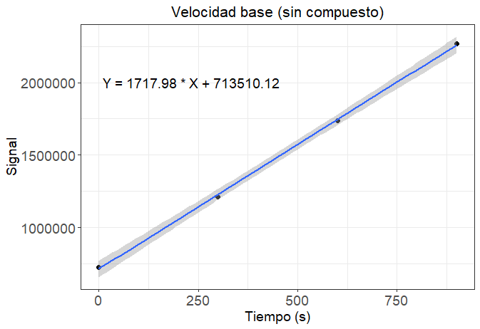
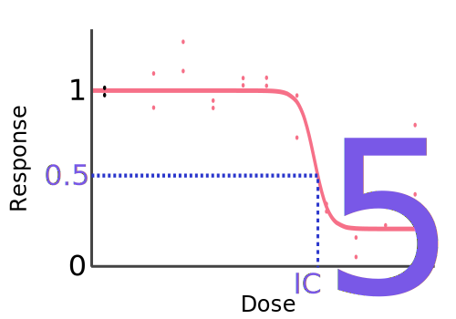

{ width="250", align="left" }

# **TP 8b**. R - Programando en biología - Parte 2 { markdown data-toc-label = 'TP 8a' }

<br>
<br>
<br>
<br>
<br>
<br>
<br>
 
[:fontawesome-solid-download: Materiales](https://drive.google.com/file/d/133TQL4mzP8ZNIb3vzP5bbqt1KZa1iWrO/view?usp=sharing){ .md-button .md-button--primary }

<!--
Este es el botón para descargar materiales, en (#) hay que agregar el link correspondiente
-->

### Videos de la clase grabada

* :octicons-video-16: [Introducción al TP](https://www.youtube.com/watch?v=MoGWtBkaVIU)
* :octicons-video-16: [Puesta en común del TP](https://www.youtube.com/watch?v=0KKRWkZDvXw)

### Códigos resueltos

* :octicons-file-code-16: [Códigos completos](https://drive.google.com/file/d/1fBpEtMAAMvbx9zmbow4ovosQY7fu9kJc/view?usp=sharing) (tienen que setear el *Working Directory*) (si corren el 3, 4 y 5 llegan al **PDF**)

### Software a usar
* R (ya instalado en la VM).
* RStudio (ya instalado en la VM)

### Recursos Online
* [Curso online de R de Coursera](https://www.coursera.org/learn/r-programming) (se puede hacer gratis) (en ese caso no da certificado)
* [Tips de comandos básicos de R](http://www.cookbook-r.com/)
* Data Tables: [Introducción oficial](https://cran.r-project.org/web/packages/data.table/vignettes/datatable-intro.html) y [otra página con más info](https://bookdown.org/paradinas_iosu/CursoR/data-table.html)
* ggplot2: [Vistazo rápido](https://bookdown.org/paradinas_iosu/CursoR/ggplot2.html), [otra página con cada plot detallando sus parámetros](http://sthda.com/english/wiki/ggplot2-essentials) y [cheatsheet](https://raw.githubusercontent.com/rstudio/cheatsheets/main/data-visualization.pdf)

### Objetivos

* Familiarizarse en el lenguaje de programación **R**.
* Ver como los mismos conceptos de programación se trasladan de un lenguaje a otro.
* Utilizar herramientas de programación para resolver problemas biológicos.

## **Introducción al Tema**

Es muy normal que en trabajos de biología sea necesario trabajar con datos provenientes de servicios o equipos que no generan *outputs* de formato estándar (separados por tabs, comas, etc). Esto hace que cuando queramos cargar estos *outputs* en cualquier programa de análisis de datos vamos a tener que darles formato manualmente, algo que puede no ser muy complicado cuando se trata de unos pocos archivos o un solo ensayo, pero se vuelve un problema en grandes cantidades.

En la materia ya vimos varios archivos de salida con patrones propios, por ejemplo los archivos FASTA, donde el marcador `>` es usado para indicar el comienzo del header una secuencia. Diferentes programas van a tener diferentes patrones de salida, pero suelen haber ciertos caracteres bastante usados como `#`, `!`, `*`, `|`, etc.

En este trabajo práctico vamos a usar el lenguaje de programación **R** para leer datos generados por un lector de placas de wells. Vamos a parsear dichos datos para que estén en un formato con el que podamos trabajar, y vamos a procesarlos como necesitemos para calcular estadísticos y plots que contengan información sobre el experimento realizado.

## **Experimento**

### Objetivo

En el TP de hoy vamos a querer encontrar un compuesto que funcione de inhibidor para una enzima de interés, a la que vamos a denominar **enzima Z**. No solo nos va a interesar que compuestos funcionan como inhibidores para ella, sino que también queremos calcular el **IC 50** de cada uno de dichos compuestos (que en nuestro caso sería la concentración a la cual el inhibidor produce una reacción un 50% más lenta que sin inhibidor).

Por suerte nuestra enzima de interés tiene como producto un compuesto fluorescente. Sabiendo esto podemos estimar la velocidad de la reacción calculando una regresión lineal de la abundancia de dicho producto a lo largo del tiempo (esto lo vamos a explicar un poco más detalladamente cuando lo hagamos). Si un compuesto funciona como inhibidor en algunas de las concentraciones evaluadas, la velocidad de la reacción debería caer.

### FilterMax

Una forma de analizar varios compuestos y concentraciones a la vez es usar el equipo **FilterMax F5**, el cual permite hacer mediciones puntuales de absorbancia y fluorescencia (entre otros) en placas de wells de 96, 384 y 1536. Incluso permite hacer mediciones a distintos tiempos (por ejemplo, se le puede programar para hacer mediciones cada ciertos intervalos temporales).

En nuestro ejemplo (datos reales, nombres ficticios), vamos a utilizar el **FilterMax F5** para evaluar varias placas de 384 wells y vamos a hacer 4 evaluaciones por placa, una cada 5 minutos. Cada columna de la placa corresponde compuesto distinto (22 compuestos, 1 por columna) y cada fila tiene concentraciones diferentes de cada compuesto (16 concentraciones, diluciones seriadas). Un esquema de este experimento se puede ver en [esta planilla](https://docs.google.com/spreadsheets/d/1ey-c3nuc2zd4Cqj6B_uYcq1gAx0FPybLJUDCbV56my4/edit?usp=sharing).

## **Paso 1 - Familiarizarnos con el Archivo** { markdown data-toc-label='Paso 1 - Familiarizarnos' }

El primer paso cuando uno empieza a trabajar con un archivo nuevo es siempre mirarlo y deducir su formato. Los resultados reales de este experimento pueden verlos en el archivo **00_datos_filtermax.txt** que se encuentra en sus materiales de trabajo.

Abran el archivo **00_datos_filtermax.txt** con Leafpad, vean su estructura y respondan las siguientes preguntas:

**1)** ¿Se parece un poco a algún **.csv** (columnas separadas por comas) o **.tsv** (columnas separadas por tabs) que hayan visto antes? ¿Que diferencias tiene? Teniendo en cuenta esas diferencias y considerando que vamos a querer leerlo como una tabla en **R** ¿Les parece que hay filas que están de más?

**2)** Mirando el archivo y la planilla del experimento:

* ¿Qué hay en la celda A1?

* ¿Qué posiciones contienen las diferentes diluciones del compuesto "Umbrella2"?

* ¿Cuántos datos hay para cada dilución del compuesto "Umbrella2"? ¿Por qué?

**3)** Ahora abra el archivo con Gnumeric (Click derecho sobre el archivo :material-arrow-right: Abrir con :material-arrow-right: Oficina :material-arrow-right: Gnumeric). Al final de cada placa hay varias celdas sin datos. ¿Hay algo en la planilla del experimento que explique por qué pasa esto?

## **Paso 2 - Limpiar y Parsear el Archivo** { markdown data-toc-label='Paso 2 - Limpiar y Parsear' }

En este paso queremos hacer 2 cosas:

* Primero, queremos sacar cualquier fila extra de **00_datos_filtermax.txt** que nos impida leer el archivo usando `fread`. Si bien en este caso esto se podría hacer a mano, como programadores queremos soluciones que escalen bien con el número de datos, asi que lo vamos a hacer en un *script*.

* Segundo, queremos reorganizar los datos para poder trabajar con ellos más fácil, y para eso queremos una tabla con la siguiente estructura:

<figure markdown>
| time { data-sort-method='none' } | temperature { data-sort-method='none' } | fila { data-sort-method='none' } | columna { data-sort-method='none' } | signal { data-sort-method='none' } |
| :---: | :---: | :---: | :---: | :---: | 
| "00:00:00" | 30 | "A" | 1 | 417246 |
| "00:04:59" | 30 | "A" | 1 | 595504 |
| "00:10:00" | 30 | "A" | 1 | 789920 |
| "00:15:00" | 30 | "A" | 1 | 985947 |
| "00:00:00" | 30 | "A" | 2 | 389328 |
| ... | ... | ... | ... | ... |
</figure>

Si bien este paso es importante, también es bastante específico a la salida del **FilterMax F5**. Por esta razón les vamos a dar el archivo ya parseado para que pasemos directamente al análisis de datos más general. Este es el archivo **02_datos_filtermax_parseados.tsv** que se encuentra en sus materiales de trabajo.

Dicho esto, si completan el resto del TP a tiempo y quieren aprender cómo llegar del archivo original a éste archivo pueden hacer el **Ejercicio Adicional 1** abajo de todo.

**1)** Abran el archivo **02_datos_filtermax_parseados.tsv** con Leafpad y vean la columna **signal**. ¿Qué piensan que significan los **NA** en esa columna?

## **Paso 3 - Agregar la información que necesito** { markdown data-toc-label='Paso 3 - Agregar Información' }

En este momento tenemos una tabla donde cada fila es una señal independiente, pero tenemos algunos problemas:

* No tengo información de los compuestos en la tabla, solo de los números de las columnas

* No tengo información de las diluciones en la tabla, solo de las letras de las filas

* Más adelante vamos a querer calcular la *velocidad de reacción*, es decir, cómo varía la **signal** según el **time**. Sin embargo, acá **time** es un *string*, por lo que necesito transformarlo a número

Estas son las cosas que queremos arreglar. Por suerte tenemos también otras dos tablas, una indicando que compuesto hay en cada columna (**00_datos_compuestos.tsv**) y otra indicando que dilución hay en cada fila (**00_datos_concentraciones.tsv**).

Esto se podría hacer a mano, pero llevaría mucho tiempo y podría haber errores de tipeo. Por esta razón vamos a crear un programa que haga todo esto por nosotos. Sin embargo, antes de crear este programa necesitamos aprender algunas cosas nuevas:

### Herramientas necesarias

#### Filtrar filas en *Data Table*

Algo de esto vimos en el TP anterior, pero es posible filtrar filas de un *Data Table* según el valor de las diferentes columnas en dicha fila.

Vamos a volver a usar el data set **iris** que está siempre cargado en memoria; sin embargo, **iris** es un *Data Frame*, por lo que lo vamos a tener que convertir en *Data Table*.

```R
library(data.table) #tenemos que cargar el paquete data.table en memoria cada vez que cerramos RStudio

dt_iris <- as.data.table(iris)
```

Ahora supongamos que queremos solo las filas donde la columna **Species** es **versicolor** ó **virginica**. Hay varias formas de hacer esto y todas les van a ser útiles para lo que tenemos que hacer hoy.

**1)** Corran por lo menos dos de las líneas de código siguientes y vean lo que devuelven:

```R
# Cualquiera de estas 5 líneas de código devuelve el mismo *Data Table*
dt_iris[(Species == "versicolor") | (Species == "virginica")]
dt_iris[Species %in% c("versicolor", "virginica")]
dt_iris[Species != "setosa"]
dt_iris[!(Species == "setosa")]
dt_iris[!(Species %in% c("setosa"))]
```

#### Mergear *Data Tables*

Por *mergear* nos referimos a juntar dos *Data Tables* horizontalmente, es decir, agregar de alguna forma las columnas de uno al otro. 

**2)** Corran el siguiente ejemplo y vean lo que devuelve.

```R
genes <- c("ERT2", "TTR4", "REC1")
esencialidad <- c(F, F, T)
expresiones <- c(100 ,1000, 10000)

dt_info_de_esencialidad <- data.table(gen = genes,
                                      esencial = esencialidad)
dt_info_de_expresion <- data.table(gen = genes,
                                   expresion = expresiones)

dt_toda_la_info <- merge(dt_info_de_esencialidad,
                         dt_info_de_expresion,
                         by = "gen")

print(dt_toda_la_info)
```

Como ven, la función `merge` toma 2 *Data Tables* y los une por la columna definida en el parámetro `by`. Una cosa interesante es que no es necesario que ambos *Data Frames* tengan el mismo tamaño.

**3)** Corran el siguiente ejemplo y vean lo que devuelve.

```R
especies <- c("setosa", "virginica", "versicolor")
empieza_con_S <- c(T, F, F)

dt_info_S <- data.table(Species = especies,
                        empieza_con_S = empieza_con_S)

nueva_dt_iris <- merge(dt_iris,
                       dt_info_S,
                       by = "Species")

print(nueva_dt_iris)
```

Para cada fila de **dt_iris** el `merge` agrego el valor de **empieza_con_S** según la columna **Species**. Van a ver que se desordenaron las filas y las columnas. Esto sucede ya que `merge` va a mover a la columna usada en el `by` al principio. Uno después tiene que reordenarlas como prefiera.

#### Agregar filas a *Data Tables*

Ahora que aprendimos a agregar columnas en masa también queremos hacer lo mismo con una o más filas.

**4)** Corran el siguiente ejemplo y vean lo que devuelve.

```R
genes <- c("ERT2", "TTR4", "REC1")
esencialidad <- c(F, F, T)
expresiones <- c(100 ,1000, 10000)

dt_toda_la_info <- data.table(gen = genes,
                              esencial = esencialidad,
                              expresion = expresiones)

dt_nueva_fila <- data.table(gen = "AFK5",
                            esencial = T,
                            expresion = 50)

dt_toda_la_info <- rbindlist(list(dt_toda_la_info,
                                  dt_nueva_fila))

print(dt_toda_la_info)
```

El comando `rbindlist` concatena dos *Data Tables*, donde el segundo puede ser una sola fila o algo más grande. Es importante que ambos *Data Tables* tengan la misma estructura para que el comando no devuelva errores.

#### Crear *Data Table* vacío

Ahora que sabemos agregar filas a un *Data Table*, puede ser entonces útil tener un *Data Table* vacío al que le voy a agregando filas que voy calculando (por ejemplo en un ciclo).

**5)** Corran el siguiente ejemplo y vean lo que devuelve.

```R
dt_toda_la_info_vacio <- data.table(gen = character(),
                                    esencial = logical(),
                                    expresion = numeric())

print(dt_toda_la_info_vacio)

dt_nueva_fila <- data.table(gen = "AFK5",
                            esencial = T,
                            expresion = 50)

dt_toda_la_info <- rbindlist(list(dt_toda_la_info_vacio,
                                  dt_nueva_fila))

print(dt_toda_la_info)
```

Como ven, al crear un *Data Table* vacío tengo que asignar a cada columna el tipo de datos que va a contener. Aca estoy usando `character()` (*strings*), `logical()` (*booleano*) y `numeric()` (números reales). El único otro tipo que puede ser que usen en esta materia es el `integer()` que son números enteros, pero como dijimos en el TP anterior es común usar `numeric()` para estos también.

#### Reordenar columnas en *Data Tables* { markdown data-toc-label='Reordenar columnas' }

Como mencionamos antes, el `merge` nos va a desordenar las columnas de la tabla. Además, es posible querer quedarnos con solo algunas de las columnas de una tabla porque ya no tenemos más usos para otras. Una forma de hacer esto es:

```R
dt_iris <- as.data.table(iris)

#Los tres siguientes bloques hacen lo mismo, quedándonos solo con las 
#columnas Species, Sepal.Length y Sepal.Width

dt_iris[, .(Species, Sepal.Length, Sepal.Width)]

dt_iris[, c("Species", "Sepal.Length", "Sepal.Width")]

columnas_a_quedarnos <- c("Species", "Sepal.Length", "Sepal.Width")
dt_iris[, columnas_a_quedarnos, with = F]
```

Esto es útil cuando queremos quedarnos con pocas columnas, pero ¿qué pasa cuando tenemos muchas y solo queremos sacar algunas? Ahí podemos hacer:

```R
dt_iris <- as.data.table(iris)

#Los dos siguientes bloques hacen lo mismo, sacando las columnas Species, Sepal.Length y Sepal.Width

dt_iris[, -c("Species", "Sepal.Length", "Sepal.Width")]

columnas_a_borrar <- c("Species", "Sepal.Length", "Sepal.Width")
dt_iris[, -columnas_a_borrar, with = F]
```

#### Splitear *strings*

Hay varias funciones en **R** que nos permiten parsear texto y una de las más fáciles de entender es `strsplit`. Como su nombre lo indica esta función *splitea* (o corta) un *string* (o cadena de caracteres). Veamos un ejemplo:

```R
frase <- "Habia-una-vez"
frase_spliteada <- strsplit(frase, split = "-")
print(frase_spliteada)
```
```R
[[1]]
[1] "Habia" "una"   "vez"
```
Como ven la función `strsplit` toma un *string* y lo divide en diferentes fragmentos según el parámetro `split`.

No se si lo recuerdan, pero en el TP anterior hablamos de las variables llamadas listas, que se pueden pensar como vectores que pueden contener variables de distinto tipo dentro de ellas (mientras que todos los elementos de un vector son de un mismo tipo).

Ese `[[1]]` en el output anterior nos está indicando que `strsplit` nos está devolviendo una variable de tipo `list` donde el primer elemento es el vector con la frase *spliteada*.

**6)** Si bien el parámetro `split` suele ser un caracter, en realidad puede ser un *string* cualquiera. Prueben el código anterior usando `split = "-una-"` y vean que pasa.

**7)** Vean que pasa cuando usan `split = ""`.

**8)** Pásenle ahora a `strsplit` el siguiente vector de strings: `frases <- c("Aquí me pongo a cantar", "al compás de la vigüela")`. Sabiendo que queremos *splitear* las diferentes palabras, ¿cuál sería el valor de `split` en este caso? ¿Cuántos elementos tiene la lista que devuelve `strsplit`? ¿Por qué? ¿Cuál es la tercera palabra de la segunda frase? (imprímanla por pantalla usando `print`)

#### Eliminar elementos repetidos en vectores { markdown data-toc-label='Elementos repetidos' }

En los *Data Tables* es común tener columnas con categorías, por ejemplo la columna **Species** en la tabla **iris**. Es normal al momento de programar no saber previamente cuáles van a ser esas categorías (especies en este caso), por lo que muchas veces se extraen de la columna misma. Una forma de hacer esto es usar la función `unique()`, la cual toma un vector y saca los elementos repetidos, dejando uno de cada uno.

**9)** Corran el siguiente ejemplo y vean lo que devuelve.

```R
vector_especies <- iris$Species

vector_especies_unicas <- unique(vector_especies)

print(vector_especies)
print(vector_especies_unicas)
```

La columna `iris$Species` es técnicamente un *factor*, pero estos son simplemente vectores con propiedades extras. La función `unique()` va a funcionar igual de pasarle un vector de caracteres; de hecho, esta función también puede remover filas repetidas de un *Data Table*.

#### Usar `fread` con datos faltantes { markdown data-toc-label='fread y NAs' }

Es común que un set de datos tenga datos faltantes, lo que en nuestro caso vendría a ser wells sin señal. Diferentes tablas los van a indicar de diferentes maneras, pero es común verlos como *nada* (o sea veo los separadores de columnas, pero no hay información en el medio), **NaN** (*Not a Number*), **ND** (*No Data*) o como **NA** (*Not Available*). En esta caso vamos a usar **NA**.

Es importante al momento de leer un archivo saber si mi archivo tiene o no estos datos faltantes, ya que de no tenerlo en cuenta puedo terminar leyendo a **NA** como el *string* "NA", lo cual puede insertar datos falsos y hasta forzar a **R** a leer una columna numérica como si fueran todos *strings*.

Podemos indicarle a `fread` si hay celdas sin valores y como están escritas con el parámetro `na.strings`:

```R
dt <- fread("ARCHIVO_DT", header = T, sep = "\t", na.strings = "NA")
```

En este caso le estamos indicando que hay celdas sin valores y que están escritas en la tabla como "NA" (pueden estar con o sin comillas en el archivo). De querer indicarle a `fread` que los datos faltantes están como *nada* se usa `na.strings = ""`, aunque en este caso cualquier columna con un *string* vacío también va a ser considerada dato faltante.

!!! tip "Tip - Carga más rápida de los datos"

    Si estamos seguros que no hay celdas sin valores en nuestros datos, le podemos pasar `na.strings = NULL` para indicarle que no busque celdas vacías, lo que acelera la carga de la tabla.

#### Usar `fread` con decimales españoles { markdown data-toc-label='fread y decimales' }

Otro problema común al momento de trabajar con datos es que por alguna ~~diabólica~~ razón el separador de decimales y el separador de miles no son iguales para algunos países que para otros, de hecho, son exactamente al revés.

Es posible entonces que tengan una tabla que hizo alguien en Argentina donde uso comas como separador de decimales, pero que al cargarla en **R**, el cual fue creado en Estados Unidos, piense que dichas comas son separador de miles, lo que rompe completamente los números pasados.

Por suerte algo de consideración tienen y existe un parámetro de `fread` que nos permite especificar cual es el separador de decimales (que por defecto es el punto):

```R
dt <- fread("ARCHIVO_DT", header = T, sep = "\t", dec = ",")
```

### Paso 3 - Ejercicio

**10)** Creen un nuevo script de **R**, copien el siguiente código y guardenlo en su carpeta de trabajo. Vayan avanzando por el *script* y cambien las secciones que dicen `@@EDITAR@@` por lo que corresponda (esto puede ser un valor, una variable, una operación matemática, una comparación o una función de **R**).

!!! warning "Warning - Working Directory"

    Cada vez que lean o escriban un archivo recuerden que el path que le pasen debe ser un path absoluto o un path relativo al *Working Directory*. Para cambiar el *Working Directory* pueden usar la función `setwd()` que aprendimos en el TP anterior.

!!! tip "Tip - Ñ y acentos"

    Van a ver que en los códigos tratamos de no usar la letra **Ñ** o acentos. Esto es así ya que cuando uno comparte código entre varias personas suele pasar que algunas de esos caracteres se "rompen" y se ven feo (por ejemplo un texto que era **diseño_compuestos** se veía como **diseño_compuestos** en otra PC).

    Si bien es posible poner estándares de codificación de texto en grupos, la realidad es que solemos programar en inglés por lo que el problema se evita solo.

    Este tip es ***especialmente*** importante para los nombres de las variables. Ahí si que recomendamos nunca usar acentos o **Ñ** (o espacios).

```R
#Aca hay que poner el Path Absoluto que apunta a su carpeta de trabajo
#Por ej: "/home/ibioinfo/Documentos/data_TP8b"
setwd(@@EDITAR@@)

library(data.table)

#Uso fread para cargar los datos parseados teniendo en cuenta que tienen NAs
dt_parsed_data <- fread(@@EDITAR@@)

#Primero que nada se que las columnas de los wells 23 y 24 estan vacias, asi que saco las filas
#donde *columna* sea 23 o 24 (o sea, me quedo con las filas donde *columna* es 1 a 22)
dt_parsed_data <- dt_parsed_data[@@EDITAR@@]

#Ahora, la fila y la columna no me esta dando mucha informacion de lo que esta pasando, 
#por lo que quiero agregar informacion de los compuestos y de concentraciones

#Agrego informacion compuestos
dt_datos_compuestos <- fread("00_datos_compuestos.tsv", header = T, sep = "\t", na.strings = NULL)
dt_parsed_data <- merge(dt_parsed_data,
                        dt_datos_compuestos,
                        by = "columna")

#Agrego informacion concentraciones (ojo que en *00_datos_concentraciones.tsv* el separador decimal es la coma)
dt_datos_concentraciones <- fread(@@EDITAR@@)
dt_parsed_data <- merge(@@EDITAR@@)

#Para cada combinacion de compuesto y concentracion quiero saber la velocidad de la reaccion, es decir, 
#la pendiente de la recta que sale de hacer una regresion lineal por los 4 tiempos ensayados

#El primer problema que tengo es que la variable time es un *string*, por lo que no puedo usarla 
#como X en una ecuacion. Por esta razon vamos a convertir a time en cantidad de segundos

#Si bien hay 1408 filas, en si solo hay 4 tiempos que se repiten:
#"00:00:00", "00:04:59", "00:10:00" y "00:15:00"

#Voy entonces a hacer una tabla llamada dt_times_in_seconds que va a empezar vacía y una vez corrido el 
#siguiente *for* va a tener 4 filas, una por cada uno de los 4 tiempos
#Esta tabla va a tener dos columnas, la columna *time* indicando el tiempo en string que estamos analizando
#y la columna *segundos_totales* que contiene ese tiempo transformado en numero y en segundos

#Extraigo entonces los diferentes tiempos y creo una tabla vacia donde voy a guardar la cantidad de segundos 
#para cada *time*
unique_times <- unique(dt_parsed_data$time)
dt_times_in_seconds <- data.table(time = character(),
                                  segundos_totales = numeric())
for (time_for in unique_times) {
    # Esta siguiente linea comentada la uso para debuggear, es decir, para cuando estoy creando el programa
    # Si la ejecutan a mano (sin el #) pueden entonces ir paso a paso en el *for* viendo que funcione todo
    # Recuerden que pueden usar CTRL + ENTER para ejecutar el codigo seleccionado o ver el valor de una variable

    # time_for <- unique_times[2]
    
    #Divido las horas, minutos y segundos y las transformo a numeros
    time_spliteado <- strsplit(time_for, ":")

    #*strsplit* devuelve una lista, que es como un vector, pero mas complicado
    #Voy a sobreescribir la variable quedandome solo con el primer elemento de la lista, que es un vector
    time_spliteado <- time_spliteado[[1]] 
    
    #Guardo cada uno de los tres numeros en otra variable. Como ahora son *strings* uso as.numeric() para
    #convertirlos en numeros
    horas <- as.numeric(@@EDITAR@@)
    minutos <- as.numeric(@@EDITAR@@)
    segundos <- as.numeric(@@EDITAR@@)
    
    #Calculo los segundos totales, es decir, del paso anterior transformo las horas y los minutos en segundos 
    #y sumo las tres variables
    segundos_totales <- @@EDITAR@@
    
    #Guardo esta info en la tabla que acabo de crear
    dt_new_row_times_in_seconds <- data.table(time = @@EDITAR@@,
                                              segundos_totales = @@EDITAR@@)
    
    dt_times_in_seconds <- rbindlist(list(dt_times_in_seconds,
                                          dt_new_row_times_in_seconds))
}

#Agrego la informacion de los segundos totales (guardada en dt_times_in_seconds) a mi tabla original
dt_parsed_data <- merge(@@EDITAR@@)

#Ahora van a ver que las columnas de la tabla parecen estar mezcladas, lo que se debe a los merge
#Por otro lado hay columnas que ya no vamos a usar
#Resolvemos las dos cosas a la vez rearmando las columnas de la tabla
dt_parsed_data <- dt_parsed_data[, .(compuesto, concentracion, segundos_totales, signal)]

#Escribo los datos en una nueva tabla
write.table(dt_parsed_data, file = "03_datos_filtermax_parseados_y_formateados.tsv", col.names = T, row.names = F, sep = "\t", quote = T)
```

Si todo salió bien, el archivo **03_datos_filtermax_parseados_y_formateados.tsv** debería ser una tabla del estilo:

<figure markdown>
| compuesto { data-sort-method='none' } | concentracion { data-sort-method='none' } | segundos_totales { data-sort-method='none' } | signal { data-sort-method='none' } |
| :---: | :---: | :---: | :---: |
| "Umbrella1" | 200 | 0 | 417246 |
| "Umbrella2" | 200 | 0 | 389328 |
| "Umbrella3" | 200 | 0 | 225039 |
| "Umbrella4" | 200 | 0 | 248039 |
| ... | ... | ... | ... |
</figure>

!!! warning "Warning - Gnumeric transforma visualmente los separadores decimales"

	Si abren el archivo **03_datos_filtermax_parseados_y_formateados.tsv** con Gnumeric van a ver que parece que el separador decimal de los números sigue siendo la coma. Sin embargo, si abren el archivo usando Leafpad van a ver que en realidad el separador decimal es ahora el punto, por lo que para los próximos ejercicios podemos usar `fread` sin poner el parámetró `dec`. Gnumeric cambia los puntos visualmente a comas por estar en español.

## **Paso 4 - Calcular velocidades de reacción** { markdown data-toc-label='Paso 4 - Calcular velocidad' }

En física la *velocidad* es la variación de posición por unidad de tiempo. La *velocidad de reacción* es similar, donde queremos averiguar la variación de señal por unidad de tiempo (en nuestro caso es un segundo).

Para cada dilución de cada compuesto, nosotros tenemos la señal a cuatro puntos en el tiempo (una vez cada 5 minutos, o 300 segundos). Vamos a asumir que la señal varía linealmente con el tiempo, por lo que la forma más directa de conseguir la *velocidad de reacción* es calcular la pendiente de la recta que pasa por los cuatro puntos que conseguimos experimentalmente.

Es de esperar que los cuatro puntos no se alineen perfectamente, pero hay formas en **R** de calcular y plotear la línea que más se ajusta a ellos (hacer una regresión lineal). A continuación mostramos el ejemplo de "Umbrella1" a concentración 0, es decir, la *velocidad de reacción base* cuando no hay ningún compuesto.

<figure markdown>

</figure>

En este plot vemos que la pendiente de la recta es aproximadamente 1718, lo que quiere decir que cada segundo la señal aumenta en 1718. Nuestro objetivo en este paso del TP es calcular este número para todas las concentraciones de todos los compuestos.

??? info "Código usado para hacer el plot anterior (para los curiosos)"

    ```R
    library(data.table)
    library(ggplot2)

    dt_parsed_formatted_data <- fread("03_datos_filtermax_parseados_y_formateados.tsv", header = T, sep = "\t", na.strings = NULL)

    linear_regression_aux <- lm(data = dt_parsed_formatted_data[compuesto == "Umbrella1" & concentracion == 0], signal ~ segundos_totales)

    # La funcion *sprintf* se usa similar a *paste* ya que permite reemplazar los *%s* en el primer string por las variables que le paso
    # a continuacion
    formula_aux <- sprintf("Y = %s * X + %s",
                           round(linear_regression_aux$coefficients[2], 2),
                           round(linear_regression_aux$coefficients[1], 2))

    ggplot(data = dt_parsed_formatted_data[compuesto == "Umbrella1" & concentracion == 0], aes(x = segundos_totales, y = signal)) +
        geom_point(size = 2) +
        geom_smooth(method='lm') +
        theme_bw() +
        xlab("Tiempo (s)") + 
        ylab("Signal") + 
        ggtitle("Velocidad base (sin compuesto)") +
        theme(axis.title = element_text(size = 14, hjust = 0.5),
              axis.text = element_text(size = 14, hjust = 0.5),
              plot.title = element_text(size = 16, hjust = 0.5)) +
        annotate("text", x = 10, y = 2000000, label = formula_aux, hjust = 0, size = 5)
    ```

### Herramientas necesarias

En este ejercicio también vamos a necesitar varias herramientas, pero la buena noticia es que la mayoría ya las vieron en el TP anterior o en el paso anterior.

#### Fors anidados

Es bastante común cuando se trabaja con tablas querer recorrer todas las combinaciones de dos variables categóricas. Una forma de hacer esto es usar *fors anidados*, es decir, un *for* adentro de otro *for*. En este caso el *for* interno se va a ejecutar completo una vez por cada elemento del *for* externo. Dentro del *for* interno es donde vamos a poner el código que queramos hacer con cada combinación de nuestras variables.

**1)** Corran el siguiente ejemplo y vean lo que devuelve. ¿Cuántas veces se ejecutó el `print`? ¿En qué orden se recorrieron los diferentes prefijos y sufijos?

```R
vector_prefijos <- c("veinti", "cuarenti", "ciento")
vector_sufijos <- c("cuatro", "dos", "ocho")

for (prefijo_for in vector_prefijos) {
    for (sufijo_for in vector_sufijos) {
        numero_for <- paste(prefijo_for, sufijo_for, sep = "-")
        
        print(numero_for)
    }
}
```

#### Regresión lineal

El ajuste de mis datos a una fórmula matemática es un tema súper complejo; sin embargo, en este TP necesitamos la versión más simple de esto, que son las regresiones lineales. Existe una función que viene con **R** llamada `lm` que nos va a permitir calcular una regresión lineal a partir de dos vectores numéricos.

```R
regresion_lineal <- lm(data = iris, formula = Sepal.Length ~ Petal.Length)

print(regresion_lineal)
```

```R
Call:
lm(formula = Sepal.Length ~ Petal.Length, data = iris)

Coefficients:
 (Intercept)  Petal.Length  
      4.3066        0.4089
```

* El parámetro `data` nos permite poner un *Data Frame* o *Data Table* para luego poder mencionar las columnas directamente (de otra forma habría que hacer `iris$Sepal.Length`)
* El parámetro `formula` es donde le decimos a `lm` a que fórmula debe ajustar los datos. Para regresión lineal es `Y ~ X`
* De imprimir `regresion_lineal` por pantalla vemos los coeficientes de la fórmula
    * `(Intercept)` es la ordenada al origen y la otra columna (en este caso llamada `Petal.Length`) es la pendiente

Podemos extraer cada uno de estos dos números haciendo:

```R
ordenada_al_origen <- regresion_lineal$coefficients[1]
pendiente <- regresion_lineal$coefficients[2]
```

!!! question "¿Se ajustan mis datos a una recta?"

    Si bien no lo vamos a usar en este TP, es normal al momento de hacer una regresión querer saber que tan bien se ajustan mis datos a la fórmula que usé. Existen varios estadísticos para analizar esto, pero uno muy usado para regresiones lineales es el **R cuadrado**, que no tiene nada que ver con el lenguaje de programación y es un estadístico que va entre 0 y 1 y cuanto más cerca de 1 es mejor es el ajuste lineal (simplificando infinitamente el tema).

    En el ejemplo anterior podemos conseguir el **R cuadrado** haciendo:

    ```R
    r_cuadrado <- summary(regresion_lineal)$r.squared
    ```

### Paso 4 - Ejercicio

**2)** Creen un nuevo script de **R**, copien el siguiente código y guardenlo en su carpeta de trabajo. Vayan avanzando por el *script* y cambien las secciones que dicen `@@EDITAR@@` por lo que corresponda (esto puede ser un valor, una variable, una operación matemática, una comparación o una función de **R**).

```R
#Aca hay que poner el Path Absoluto que apunta a su carpeta de trabajo
#Por ej: "/home/ibioinfo/Documentos/data_TP8b"
setwd(@@EDITAR@@)

library(data.table)

#Leo los datos ya parseados y formateados
dt_parsed_formatted_data <- fread(@@EDITAR@@)

#Para cada combinacion de compuesto y concentracion quiero saber la velocidad de la reaccion, es decir, 
#la pendiente de la recta que sale de hacer una regresion lineal por los 4 tiempos ensayados

#Creo la tabla vacia donde voy a guardar estos datos
dt_velocidades_de_reaccion <- data.table(compuesto = character(),
                                         concentracion = numeric(),
                                         velocidad = numeric())

#Voy a tener que recorrer todas las combinaciones de compuestos y concentraciones
#Consigo vectores con cada compuesto diferente y con cada concentracion diferente
unique_compuestos <- unique(dt_parsed_formatted_data$compuesto)
unique_concentraciones <- @@EDITAR@@

for (compuesto_for in unique_compuestos) {
    # compuesto_for <- unique_compuestos[1]
    
    for (concentracion_for in unique_concentraciones) {
        # concentracion_for <- unique_concentraciones[1]

        #Por cada combinacion de compuesto + concentracion quiero calcular la velocidad de reaccion
        #Para eso lo primero que necesito hacer es filtrar los datos de *dt_parsed_formatted_data*, para quedarme solo
        #con aquellas signals que correspondan al compuesto y concentracion de la iteracion actual del *for*
        sub_dt_parsed_formatted_data <- dt_parsed_formatted_data[(compuesto == @@EDITAR@@) & (@@EDITAR@@)]
        
        #Calculo la regresion lineal usando los datos de *sub_dt_parsed_formatted_data* y considerando a
        #*segundos_totales* como el X y a *signal* como el Y
        regresion_lineal <- lm(data = sub_dt_parsed_formatted_data, formula = signal ~ segundos_totales)        

        #Extraigo la pendiente, que es el segundo elemento del elemento *coefficients*
        velocidad_de_reaccion <- regresion_lineal$coefficients[2]
        
        #Creo una nueva fila para agregar a mi tabla de velocidades de reaccion
        #Esta fila corresponde al compuesto y a la concentracion de esta iteracion de los *fors*, asi como
        #la velocidad que acabo de calcular
        new_row_dt_velocidades_de_reaccion <- data.table(compuesto = @@EDITAR@@,
                                                         concentracion = @@EDITAR@@,
                                                         velocidad = @@EDITAR@@)
        
        #Agrego la nueva fila recien creada a mi tabla en donde guardo todas las velocidades
        dt_velocidades_de_reaccion <- @@EDITAR@@
    }   
}

#Escribo los datos en una nueva tabla
write.table(dt_velocidades_de_reaccion, file = "04_velocidades_de_reaccion.tsv", col.names = T, row.names = F, sep = "\t", quote = T)
```

Si todo salió bien, el archivo **04_velocidades_de_reaccion.tsv** debería ser una tabla del estilo:

<figure markdown>
| compuesto { data-sort-method='none' } | concentracion { data-sort-method='none' } | velocidad { data-sort-method='none' } |
| :---: | :--- | :--- |
| "Umbrella1" | 200 | 633.30896128865 |
| "Umbrella1" | 133.3333333 | 672.561474192526 |
| "Umbrella1" | 88.88888889 | 710.350673411048 |
| "Umbrella1" | 59.25925926 | 630.08948130777 |
| "Umbrella1" | 39.50617284 | 720.288720371885 |
| ... | ... | ... |
</figure>

(sí, los decimales son horribles, en un ratito los arreglamos)

## **Paso 5 - Calcular y plotear IC 50** { markdown data-toc-label='Paso 5 - Calcular IC 50' }

Primero que nada tenemos que definir un par de conceptos:

Vamos a llamar ***velocidad de reacción base*** a la *velocidad de reacción* de la enzima cuando no tiene ningún inhibidor, o lo que es lo mismo, cuando la concentración del inhibidor es 0. En nuestro caso tenemos 22 wells donde la concentración del inhibidor es 0, por lo que vamos a calcular a la *velocidad de reacción base* como el promedio de las velocidades en esos 22 wells.

Vamos a llamar ***actividad*** a la relación entre la *velocidad de reacción* observada al usar una concentración dada de un compuesto, y la *velocidad de reacción base*. Es decir:

$$
actividad = \frac{velocidadReaccion}{velocidadReaccionBase}
$$

* Si no hay inhibidor o si la concentración del inhibidor es muy baja para que haga efecto :material-arrow-right: **Actividad ~ 1**
* Si no hay enzima o si estoy usando un inhibidor perfecto :material-arrow-right: **Actividad ~ 0**

Ahora sí, queremos calcular una curva de dosis-respuesta para ver como es afectada nuestra **enzima Z** por diferentes concentraciones de cada uno de los 22 compuestos. En general es esperable que:

* A muy bajas concentraciones del compuesto no hay efecto sobre la enzima, por lo que estoy viendo la una *actividad* cercana a 1. Esto quiere decir que esperamos ver varias concentraciones bajas de un compuesto que muestren la misma *actividad*.
* A muy altas concentraciones del compuesto ya está saturado el efecto que él pueda hacer sobre la enzima (por ejemplo todos los sitios de unión ya están ocupados), por lo que estoy viendo el máximo efecto que puede hacer dicho compuesto a la *actividad* de la enzima. Esto quiere decir que esperamos ver varias concentraciones altas que muestren la misma *actividad*.
* Las concentraciones intermedias son aquellas en donde una variación en la concentración del compuesto produce un cambio en la *actividad* de la enzima.

Estás tres propiedades hacen que la curva dosis-respuesta tenga una forma sigmoidea, es decir:

<figure markdown>

</figure>

Donde en nuestro caso la respuesta va a ser la *actividad* y la dosis va a ser la concentración de nuestro compuesto. Dependiendo de las concentraciones elegidas, es normal ver que el eje X de este plot esté en escala logarítmica.

En el plot está marcado el **IC 50**, el cual es la concentración del compuesto a la cual la *actividad* de la enzima cae al 50% (es decir, cuando la *velocidad de reacción* es la mitad que la *velocidad de reacción base*). El **IC 50** da información de donde está el rango de concentraciones de dicho compuesto que hacen variar la *actividad* enzimática, entre otras cosas.

### Herramientas

#### Instalar paquetes de **R**

Para calcular el **IC 50** vamos a ajustar nuestros datos a una curva sigmoidea, para lo cual vamos a instalar un paquete de **R** llamado `nplr` que hace estos cálculos por nosotros.

**1)** Para instalar un paquete corran en **R** la línea:

```R
install.packages("nplr")
```

Y recuerden que cuando lo quieran usar tienen que cargarlo usando `library(nplr)` o `library("nplr")`. Como es bastante avanzado no vamos a hablar de `nplr` por ahora y les vamos a dar esa parte del código ya hecha.

#### Crear y modificar columnas

Una cosa más que tenemos que aprender con los *Data Tables* es como agregar una columna nueva, o como modificar una columna ya existente. Esto se hace simplemente asignándole el nuevo valor a la columna como si fuera una variable o vector, solo que es importante que el nuevo valor sea o un solo elemento o un vector con longitud igual al número de filas de la tabla.

**2)** Corran el siguiente ejemplo y vean lo que devuelve.

```R
library(data.table)

dt_iris <- as.data.table(iris)

#Creo nuevas columnas

#Si le paso un valor solo toda esa columna va a tener ese valor
dt_iris$nueva_columna <- 1

#De otra forma tengo que pasarle un vector con longitud igual al numero de filas
#Este vector puede ser combinacion de otras de las columnas de la tabla
dt_iris$otra_nueva_columna <- dt_iris$Sepal.Length + dt_iris$Petal.Length - 1

#Me arrepenti del valor que cree en la columna al principio
dt_iris$nueva_columna <- 5

print(dt_iris)
```

#### Crear plots en PDFs

Nosotros sabemos crear plots en RStudio, pero hay veces donde uno tiene que hacer decenas (o miles) de plots y quiere guardarlos todos en un solo proceso. **R** tiene varias funciones que nos permiten guardar los plots como **.jpg**, **.png**, **.svg**, etc. Acá nos vamos a enfocar en la función que nos permite guardarlos como **.pdf**.

**3)** Corran el siguiente ejemplo y vean lo que devuelve (va a crear un archivo en su *Working Directory*).

```R
pdf("test.pdf", width = 7, height = 7)

plot(x = iris$Sepal.Length,
     y = iris$Petal.Length)

plot(x = iris$Sepal.Width,
     y = iris$Petal.Width)

plot(x = iris$Species,
     y = iris$Petal.Length)

dev.off()
```

Los parámetros `width` y `height` indican el tamaño en pulgadas de cada página en el pdf. Noten que a partir que abren el pdf los plots ya no van a aparecer en la pestaña Plots de RStudio hasta que cierren el pdf (se podría pensar que redirige la salida del plot al archivo pdf).

!!! tip "Tip - Resetear los gráficos"

    A veces pasa que un pdf queda abierto más de lo que debería y no se cierra bien, o que no se crea como debería. En estos casos pueden usar la función `graphics.off()` antes y después del código anterior (especialmente antes) para limpiar cualquier cosa abierta. Solo tengan en cuenta que esto va a vaciarles los plots que tengan guardados en el panel Plots de RStudio.

#### La verdad de la función `plot`

Nosotros acabamos de ver unos plots hechos con la función `plot()`, que es la forma de plotear por defecto en **R**. Sin embargo `plot` no solo plotea cosas pasándole un X y un Y, sino que también es una función que de pasarle ciertos tipos de variables (como puede ser una regresión logística) usa un plot interno de dichas variables. 

El paquete `nplr` trae sus propios plots que se van a hacer mediante `plot(regresion_logistica)`. Esto no es único de este paquete y existen otras librerías, por ejemplo de filogenia, que tienen este mismo funcionamiento, donde `plot` hace árboles filogenéticos.

#### Google

Es muy importante al momento de programar saber buscar funcionalidades que uno quiere usar en sus programas.

**4)** Busquen en internet:

* Cómo se calcula el máximo de los elementos de un vector de números en **R**
* Cómo se calcula el mínimo de los elementos de un vector de números en **R**
* Cómo se calcula el promedio de los elementos de un vector de números en **R**
* Cómo se redondea los decimales de un número en **R**

<!--
#### Calcular promedio

Es posible calcular el promedio de los números en un vector usando la función `mean`.

```R
promedio_sepal_length <- mean(iris$Sepal.Length)

print(promedio_sepal_length)
```

#### Redondear decimales

Es posible redondear números, lo que es especialmente útil para cuando tenemos números con muchos decimales que realmente no aportan información.

```R
numero_base <- 123.456789123456789

#Aca 2 es la cantidad de decimales
numero_redondeado <- round(numero_base, 2)

print(numero_redondeado)
```
-->

### Paso 5 - Ejercicio

**5)** Creen un nuevo script de **R**, copien el siguiente código y guárdenlo en su carpeta de trabajo. Vayan avanzando por el *script* y cambien las secciones que dicen `@@EDITAR@@` por lo que corresponda (esto puede ser un valor, una variable, una operación matemática, una comparación o una función de **R**).

!!! warning "Warnings en el código"

    Al ejecutar el siguiente código les va a aparecer por consola varios *Warnings* de `nplr` sobre el fiteo del modelo y la predicción del IC 50. Los *Warnings* son advertencias, las cuales informan eventos que pueden o no causar problemas. Si bien es importante prestarle atención a estos *Warnings* cuando aparecen, en este caso ya están contemplados y pueden ignorarlos.

```R
#Aca hay que poner el Path Absoluto que apunta a su carpeta de trabajo
#Por ej: "/home/ibioinfo/Documentos/data_TP8b"
setwd(@@EDITAR@@)

library(data.table)
library(nplr)

#Leo los datos de las velocidades de reaccion
dt_velocidades_de_reaccion <- @@EDITAR@@

#Quiero calcular la velocidad de reaccion base, es decir, la velocidad de reaccion sin compuestos
#Esto es cuando la concentracion del compuesto es 0
#Nosotros tenemos uno de esos casos para cada compuesto, o sea, tenemos 22 versiones del experimento sin compuesto
#Vamos a calcular la velocidad de reaccion base como el promedio de esas 22 velocidades
velocidades_reaccion_sin_compuesto <- dt_velocidades_de_reaccion[@@EDITAR@@]$velocidad
velocidad_reaccion_base <- mean(velocidades_reaccion_sin_compuesto)

#Ahora que ya las use, voy a sacar las filas que no tengan concentracion de compuesto 
#ya que no tiene sentido analizarlas para el IC 50
dt_velocidades_de_reaccion <- dt_velocidades_de_reaccion[concentracion > 0]

#Quiero calcular la actividad para cada combinacion de compuesto y concentracion
#La actividad es la relacion entre la velocidad de reaccion y la velocidad de reaccion base (es decir, la division)
dt_velocidades_de_reaccion$actividad <- @@EDITAR@@

#El *for* de mas adelante va a tener 2 salidas, un pdf con los plots y un tsv con los datos
#Tengo que inicializar ambos

#Abro el pdf (toda imagen que se plotee hasta que se cierre el pdf va a ir a el)
pdf("05_IC50_plots.pdf", width = 7, height = 7)

#Creo la tabla vacia
dt_IC50 <- data.table(compuesto = character(),
                      actividad_minima = numeric(),
                      actividad_maxima = numeric(),
                      IC50 = numeric())

#Recorro todos los compuestos 1 a la vez y calculo el IC 50 para cada uno
unique_compuestos <- @@EDITAR@@

for (compuesto_for in unique_compuestos) {
    # compuesto_for <- unique_compuestos[1]
    
    #Por cada compuesto quiero calcular el IC 50 y plotearlo
    #Para eso lo primero que necesito hacer es filtrar los datos de *dt_velocidades_de_reaccion*, para quedarme solo
    #con aquellas concentraciones y actividades que correspondan al compuesto de la iteracion actual del *for*
    sub_dt_velocidades_de_reaccion <- @@EDITAR@@
    
    #Calculo la regresion sigmoidea usando los datos de *sub_dt_parsed_formatted_data* y considerando a
    #*concentracion* como el X y a *actividad* como el Y
    regresion_sigmoidea <- nplr(x = sub_dt_velocidades_de_reaccion$concentracion, 
                                y = sub_dt_velocidades_de_reaccion$actividad)
    
    #Esto es una funcion de nplr que calcula el X correspondiente a Y = 0.5, es decir, el IC 50
    estimacion_IC50 <- getEstimates(regresion_sigmoidea, targets = 0.5)
    
    #Hay casos donde no puede calcularlo, pero en vez de devolver NA calcula el X para el Y mas cercano a 0.5
    #Yo no quiero eso, quiero solo los X cuando Y es 0.5, y sino devolver NA
    if (estimacion_IC50$y == 0.5) {
        IC50 <- estimacion_IC50$x
    } else {
        #Aca estoy asignando a mano el valor NA (sin comillas), o sea, el valor "vacio"
        IC50 <- NA
    }
    
    #Calculo la actividad minima y maxima para guardarla en el output
    actividad_minima <- min(sub_dt_velocidades_de_reaccion$actividad)
    actividad_maxima <- @@EDITAR@@
    
    #Creo una nueva fila para agregar a mi tabla de IC 50
    #Esta fila corresponde al compuesto de esta iteracion de los *fors*, asi como
    #el IC 50 que acabo de calcular
    new_row_dt_IC50 <- data.table(@@EDITAR@@)
    
    #Agrego la nueva fila recien creada a mi tabla en donde guardo todas las velocidades
    dt_IC50 <- @@EDITAR@@

    #Ploteo la regresion (les recomiendo poner el numero de compuesto y el IC 50 en el titulo)
    titulo_plot <- @@EDITAR@@
    plot(regresion_sigmoidea,
         main = titulo_plot,
         xlab = "Log10 Concentracion (micromolar)",
         ylab = "Actividad",
         ylim = c(0, 1.5),
         showGOF = F,
         xaxt = "n")
    #Reescribo el eje X para que se entienda que es logaritmico
    axis(side = 1, at = c(0, 0.5, 1, 1.5, 2), labels = c(expression(10^0), expression(10^0.5), expression(10^1), expression(10^1.5), expression(10^2)))
}

#Cierro el pdf
dev.off()

#Redondeo los decimales extras de los numeros
dt_IC50$IC50 <- round(dt_IC50$IC50, 4)
dt_IC50$actividad_minima <- @@EDITAR@@
dt_IC50$actividad_maxima <- @@EDITAR@@

#Escribo los datos en una nueva tabla
write.table(dt_IC50, file = "05_IC50_data.tsv", col.names = T, row.names = F, sep = "\t", quote = T)
```

Si todo salió bien, el archivo **05_IC50_data.tsv** debería ser una tabla del estilo:

<figure markdown>
| compuesto { data-sort-method='none' } | actividad_minima { data-sort-method='none' } | actividad_maxima { data-sort-method='none' } | IC50 { data-sort-method='none' } |
| :---: | :---: | :---: | :---: |
| "Umbrella1" | 0.1708 | 0.8627 | 5.2665 |
| "Umbrella2" | 0.3451 | 0.7292 | 2.3456 |
| "Umbrella3" | 0.125 | 0.1688 | NA |
| "Umbrella4" | 0.1595 | 0.7243 | 2.8252 |
| ... | ... | ... | ... |
</figure>

??? info "Detrás de escenas del armado de este TP"

    Al momento de hacer este TP tuvimos que analizar nosotros los mismos datos que ahora están utilizando ustedes y no teníamos mucha experiencia con `nplr`.

    En las primeras versiones de este TP no estaba la condición `if (estimacion_IC50$y == 0.5)`, pero mirando los datos de la tabla vs los datos del plot nos dimos cuenta que algo no cerraba. Por ejemplo, el **IC 50** en el "Umbrella22" daba 0.6851, pero miren el plot, no tenía sentido eso.

    Fuimos al *for* y reemplazamos la primera línea comentada por `# compuesto_for <- unique_compuestos[22]`, seleccionamos solo la última parte (sin el `#`) y la corrimos con ++ctrl+enter++, lo que en este caso hizo que `compuesto_for` sea "Umbrella22". Ahí fuimos paso a paso por el *for* viendo que devolvía cada función.

    Al ejecutar `estimacion_IC50 <- getEstimates(regresion_sigmoidea, targets = 0.5)` el programa nos tiró el siguiente Warning:

    ```R
    Warning: One (or more) of the values were greater or equal to the estimated top asymptote.
    These values have been replaced by the maximal possible value the model can estimate.
    ```

    Miramos entonces adentro de la variable `estimacion_IC50` y vimos que `estimacion_IC50$y` era 0.004, lo que significaba que en esta iteración no estábamos calculando el **IC 50**, sino el **IC 0.4**, que no es lo que queríamos.

    A partir de esto pusimos el `if` y le asignamos **NA** a **IC 50** cuando el `y` no era 0.5.

    Lo comentamos más que nada para mostrar que el análisis de datos es bastante prueba y error y que es importante pensar si lo que están viendo tiene sentido.

    Bienvenidos a la Bioinformática :fontawesome-regular-face-smile:

## **Paso 6 - Conclusiones**

Ahora que tenemos todos los datos que necesitamos es momento de analizarlos. Viendo el **.pdf** y la tabla generados en el paso anterior respondan:

**1)** ¿Por qué hay casos donde el **IC 50** dió **NA**?

**2)** En base a los plots obtenidos, ¿Les parecen suficientes nuestros datos para estar seguros de los **IC 50** calculados? ¿Cuál es un compuesto donde están bastantes seguros de su **IC 50**? ¿Cuál es un compuesto donde desconfían del **IC 50** calculado?

**3)** ¿Qué experimentos harían para tener la curva completa en "Umbrella1"? ¿Y en "Umbrella8"?

**4)** En base a lo observado, nombren dos o tres compuestos que recomendarían para inhibir a la **enzima Z**. ¿Por qué los eligieron?

## **Ejercicio Adicional 1 - Paso 2 - Limpiar y Parsear el Archivo** { markdown data-toc-label='Ejercicio Adicional 1 - Paso 2' }

Leer el **Paso 2** para entender el objetivo de este ejercicio.

### Herramientas

#### Leer y escribir texto plano

Por "texto plano" nos referimos a leer un archivo de texto que no tiene un formato definido (o sea no es un **.csv** o **.tsv**, por ejemplo). Esto puede ser algo como un libro, notas, o una tabla que por alguna razón no la queremos leer como tabla.

La forma más directa de leer texto plano en **R** es la función `readLines()`, a la cual hay que pasarle el path del archivo a leer. Esta función va a devolver un vector en el cual cada elemento es una línea del archivo leído. Se usa:

```R
nuevo_vector <- readLines(con = "ARCHIVO") 
```

Por otro lado también existe la función inversa, que nos permite escribir un vector en un archivo de texto, donde cada elemento del vector va a ser una línea de texto en el archivo. Esta función es `writeLines()` y se usa:

```R
writeLines(vector_con_texto, con = "ARCHIVO_SALIDA") 
```

La función `writeLines()` también se puede usar de una forma similar a `print` si no se le pasa el parámetro `con`.

#### Extraer nombres columnas

Hay varias razones por lo cual es útil extraer un vector con el nombre de las columnas de una tabla, pero hoy lo vamos a hacer para extraer información de dichos nombres.

La función `colnames()` nos devuelve un vector con el nombre de las columnas de una tabla en el orden en el que aparecen en dicha tabla. Por ej:

```R
columnas_iris <- colnames(iris)

print(columnas_iris)
```

#### Extraer substrings

Muchas veces es útil extraer pedazos de *strings* y ya vimos una forma de hacer esto con `split`. Sin embargo, hay veces cuando no sabemos el caracter que delimita el texto que queremos extraer, pero sí sabemos su posición en la cadena completa. En estos casos podemos usar la función `substring`:

```R
variable_string <- c("123456789")

segundo_caracter <- substring(variable_string, 2, 2)

tercer_a_quinto_caracteres <- substring(variable_string, 3, 5)

septimo_caracter_en_adelante <- substring(variable_string, 7)
```

#### Usar una variable para acceder a una columna de un Data Table { markdown data-toc-label='Columna variable' }

A veces pasa que quiero acceder a una variable de una tabla, pero no se previamente a cual. Aca nos va a ser útil otra forma de acceder a las columnas de las tablas, por ejemplo:

```R
# Los 3 bloques siguientes devuelven lo mismo

iris$Species

iris[["Species"]]

columna <- "Species"
iris[[columna]]
```

<!--
#### Filtrar vectores usando booleanos???

Los *booleanos* vistos en el TP anterior también pueden ser usados para filtrar vectores, por ejemplo:

```R
vector_numeros <- c(1, 5, 7, 9)

vector_booleanos1 <- c(TRUE, FALSE, FALSE, TRUE)

vector_palabras <- c("hola", "chau", "hola", "hola")
vector_booleanos2 <- vector_palabras == "hola"

vector_numeros_filtrado1 <- vector_numeros[vector_booleanos1]
vector_numeros_filtrado2 <- vector_numeros[vector_booleanos2]

print(vector_numeros_filtrado1)
print(vector_numeros_filtrado2)
```

```R
> print(vector_numeros_filtrado1)
[1] 1 9
> print(vector_numeros_filtrado2)
[1] 1 7 9
```

Donde `vector_booleanos1` es un vector de *booleanos* declarado a mano y `vector_booleanos2` se calcula a partir de una comparación en masa.

**7)** Dados los siguientes dos vectores y usando lo que acaban de aprender, impriman por pantalla un vector que contenga los nombres de las personas con mas de 20 años.

```R
# La edad en la posición 1 corresponde al nombre en la posición 1 y así
vector_edad <- c(25, 14, 5, 78, 4, 103, 19)
vector_nombres <- c("José", "Laura", "Pedro", "María", "Esteban", "Ricardo", "Clara")
```
-->

### Ejercicio

```R
library(@@EDITAR@@)

#### Paso 2a - LIMPIAR DATOS ####
#Uso readLines para cargar el archivo de texto plano
plain_text_data <- readLines(con = "00_datos_filtermax.txt")

#La fila 2 es el header
#Las filas 3 a 6 son los datos
#Las demas no me interesan
plain_text_data <- plain_text_data[c(2:6)]

#Escribo los datos en un nuevo archivo
writeLines(plain_text_data, con = "01_datos_filtermax_limpios.tsv")

#### Paso 2b - PARSEAR DATOS ####
#Uso fread para cargar la tabla con los datos como salen de FilterMax (pero sin lineas extras)
#Aca es importante recordar que teníamos NAs en nuestros datos y que estaban escritos como *nada*, es decir, ""
clean_data <- @@EDITAR@@

#Viendo clean_data pueden ver una columna extra al final llamada V387 (debido a la cantidad de tabs al final del archivo)
#Ese es el nombre que le da data.tables por defecto a las columnas sin nombre (esta es la columna 387)
#Para que no moleste la sacamos
clean_data <- clean_data[, @@EDITAR@@]

#Los numeros (columnas de la placa well) son los compuestos
#Las letras (filas de la placa well) son las diferentes concentraciones
#Queremos poner los mismos datos en una tabla donde nos sea mas facil filtrar un dato específico
#Creo la tabla vacia donde voy a guardar estos datos
dt_parsed_data <- data.table(time = @@EDITAR@@,
                             temperature = numeric()
                             fila = @@EDITAR@@,
                             columna = numeric(),
                             signal = @@EDITAR@@)

#Hay varias formas de hacer esto con paquetes extras o con codigos dificiles, pero por ahora vamos a 
#usar una forma un poco menos eficiente pero que se entiende un poco mas

#Quiero crear una lista con todos los nombres de los wells
wells_names <- colnames(clean_data)

#Ahora tengo lo que necesito, pero las primeras dos posiciones son Time y Temperature
#Las saco del vector de los nombres
wells_names <- wells_names[-c(1:2)]

#Voy a recorrer cada nombre de columna y extraer a que fila y a que columna del well corresponde
#Luego voy a guardar las cuatro signals de esa columna de la tabla con la informacion que acabo de conseguir
for (well_name_for in wells_names) {
    # well_name_for <- wells_names[1]
    
    #Uso substring para extraer la letra de la fila en el well
    fila_for <- substring(@@EDITAR@@)
    
    #Uso substring para extraer el numero de la columna en el well
    #Uso un patrón que funcione para cualquiera de los wells por más que el número tenga 1 o 2 decimales
    columna_for <- substring(@@EDITAR@@)
    
    #Quiero guardar la columna como numero, asi que transformo la variable character en un numeric
    #Es decir, paso de "1" a 1 (por ej)
    columna_for <- as.numeric(columna_for)
    
    #Creo nuevas fila para agregar a mi tabla de datos parseados
    #Aca fila y columna van a ser un valor único
    #Por otro lado, time, temperature y signal van a ser vectores de 4 valores (son las columnas de clean_data)
    #La columna Temperature puede ser que se escriba un poco rara por problemas de caracteres
    dt_new_rows_in_parsed_data <- data.table(time = clean_data$Time,
                                            temperature = clean_data$`Temperature(C)`,
                                            fila = fila_for,
                                            columna = columna_for,
                                            signal = @@EDITAR@@)
    
    #Agrego las nuevas filas recien creadas a mi tabla en donde guardo los datos parseados
    dt_parsed_data <- @@EDITAR@@
}

#Escribo los datos en una nueva tabla llamada "02_datos_filtermax_parseados_NUEVO.tsv"
write.table(@@EDITAR@@)
```

Pueden comparar **02_datos_filtermax_parseados.tsv** con **02_datos_filtermax_parseados_NUEVO.tsv** y si todo salió bien deberían ser idénticos.

## **Bibliografía**

<!--
### :material-bookshelf: Libros
* Libro 1 
* Libro 2
-->

<!--
### :material-web: Online
* Online 1 
* Online 2 https://en.wikipedia.org/wiki/R_(programming_language)
-->

### :material-console-line: Consola de R
* Comando `help()`
