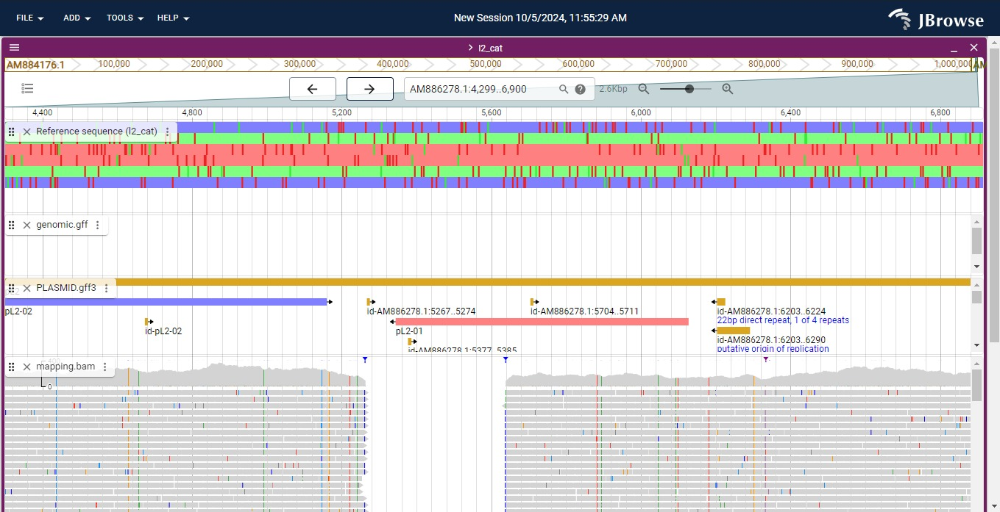{ width="250", align="left" }

# **TP 9**. Short Read Mapping { markdown data-toc-label = 'TP 09' }

<br>
<br>
<br>

[:fontawesome-solid-download: Materiales](https://drive.google.com/file/d/11jEhNiGYuAI_s9PMDmBtnDJNcaCpJTp_/view?usp=sharing){ .md-button .md-button--primary }

### Slides mostrados en la clase

* :fontawesome-regular-file-pdf: [Slides TP](https://docs.google.com/presentation/d/1gNyQKZi-3TxX2Olvc9TqVgw7I1XaQFs9YBryIevEXSc/edit?usp=sharing)

## Objetivos

* Interpretar los formatos utilizados comúnmente en NGS
* Mapear secuencias al genoma de referencia
* Visualizar e interpretar alteraciones genéticas

## Introducción

La re-secuenciación consiste en secuenciar un individuo perteneciente a una especie que ya se ha secuenciada anteriormente. Su objetivo es capturar información de polimorfismos de una base (SNPs), variaciones en el número de copias (CNVs) e inserciones y deleciones (indels) en el individuo de interés.

Siempre que exista un genoma de referencia, lo ideal es mapear en lugar de ensamblar, ya que el genoma de referencia contiene mucha información acumulada sobre el organismo de interés. Hay que tener en cuenta que al mapear se realizan múltiples asunciones, como por ejemplo, que el organismo de referencia y el analizado tienen la misma arquitectura genómica.

### *Chlamydia trachomatis*

*Chlamydia trachomatis* es uno de los patógenos humanos de mayor prevalencia en el mundo, capaz de causar una variedad de cuadros clínicos. Las cepas de transmisión sexual pueden ser subdivididas en aquellas restringidas al tracto intestinal y tipos más invasivos como el linfogranuloma venereo o *LGV biovar*. A pesar de las diferencias en la severidad de la enfermedad, hay pocas diferencias genéticas que distinguen a las diferentes cepas de *C. trachomatis*. Como veremos a continuación, la mayoría de las variaciones ocurren al nivel de SNPs.

En este trabajo práctico, procederemos a mapear las lecturas producidas con Illumina de una nueva variante de *Chlamydia trachomatis* aislada del tracto genital y compararlas con la cepa de referencia **Lb** y otra cepa conocida **L2b**. Esta nueva cepa, llamada **NV**, causó un alerta sanitario en Europa en el año 2006 y comenzó a diseminarse alrededor del mundo. La causa de su expansión es que evade la detección por el test diagnóstico basado en una reacción de PCR. En el desarrollo de este trabajo práctico podrán identificar la razón por la cual esta cepa evadió el ensayo diagnóstico.

### Flujo de trabajo de secuenciación y mapeo

**Laboratorio húmedo**: El ADN de la cepa **NV** de *C. trachomatis* es clivado en fragmentos con enzimas o sonicación. Mediante Illumina se secuencian entre 75 y 100 bases de ambos extremos de cada fragmento, generando lecturas pareadas (en inglés "paired-end reads").

**_In silico_**: Se obtienen archivos en formato `FASTQ` que contienen las secuencias de cada fragmento (llamadas lecturas o _reads_) y valores de calidad de secuenciación por base. El formato `FASTQ` es similar al formato `FASTA` pero contiene una línea con la calidad (Q) codificada en [ASCII](https://elcodigoascii.com.ar/). Luego cada lectura es alineada y mapeada al genoma de referencia. En este paso se obtiene un archivo en formato `SAM`, el cual contiene la secuencia, la calidad y además las coordenadas donde se ubica este fragmento respecto al genoma de referencia.


## Ejercicio 1: Inspección de los datos crudos

Siempre que sea posible, es una buena práctica visualizar los archivos de trabajo. 
Para comenzar leeremos los archivos crudos de secuenciación de *Chlamydia trachomatis*, los cuales tienen formato `FASTQ`.

Abrir una terminal y dirigirse al directorio de descarga de los materiales del TP "Short-Read-Mapping". 
Leer la primera línea de un archivos fastq con el siguiente comando:

```Bash 
zcat NV_1.fastq.gz | head -4 
```

**Formato FASTQ**

- **1ra línea:** `IL7_1788:5:1:34:600/1` es el nombre de la lectura secuenciada y contiene la siguiente información

	| Elemento { data-sort-method='none' } | Descripción { data-sort-method='none' } |
	| :---: | :---: |
	| IL7_1788 | ID del instrumento y número de corrida |
	| 5 | _flowcell lane_ o carril |
	| 1 | _tile_ o casilla en la _flowcell lane_ |
	| 34 | coordenada 'x' |
	| 600 | coordenada 'y' |
	| /1 | sentido de la secuenciación |

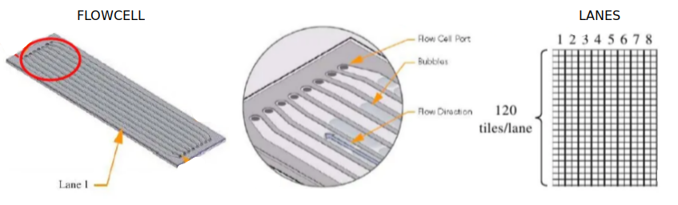

- **2da línea:** La secuencia.
- **3ra línea:** `+` Separador entre la secuencia y la calidad.
- **4ta línea:** Calidad de la secuencia. Hay un caracter para cada nucleótido. El caracter está asociado a un puntaje de calidad de cada nucleótido, lo cual está codificado de la siguiente forma: cada caracter representa un número (N°) según el código decimal [ASCII](https://elcodigoascii.com.ar/), y la calidad se define como este número menos 33. ¿Y cómo se asocia esto a la probabilidad de error (p) de la base asignada?

$$
Q = -10 \log _{{10}} P
$$

o bien:

$$
P=10^{{{\frac  {-Q}{10}}}}
$$

Donde $Q$ es la calidad:

`(N° - 33) = calidad`

El número que representa la calidad va de 33 (calidad más baja; `!` En ASCII) a 126 (calidad más alta; `~` en ASCII). Estos son los caracteres de valor de calidad en orden creciente de calidad de izquierda a derecha:

```
 ! "# $% & '() * +, -. / 0123456789:; <=>? @ ABCDEFGHIJKLMNOPQRSTUVWXYZ [\] ^ _` abcdefghijklmnopqrstuvwxyz {|} ~
```

1. Identificar los componentes de la primer lectura: nombre, secuencia, calidad y ubicación física de la lectura en la celda de flujo (es decir, lane, tile, x, y).

2. Usando el código [ASCII](https://elcodigoascii.com.ar/), determinar la calidad de las primeras 3 bases secuenciadas.

3. Leer la primera lectura del archivo `NV_2.fastq.gz`. ¿Qué similitudes y diferencias encuentra en **cada una** de las líneas de texto? ¿A qué se deben? 

## Ejercicio 2: Análisis de calidad de secuencias

Dado que la secuenciación de segunda generación tiene una mayor tasa de error que la de primera generación (Sanger), es importante revisar la calidad de nuestras lecturas. Explorar y entender las características de los datos en crudo nos dará confianza en los experimentos ulteriores que llevemos adelante con las secuencias.

### FastQC
Este programa analiza los datos crudos para realizar gráficas y tablas que muestren la calidad global de los datos. Permite identificar algunos problemas relacionados a distintos aspectos de los datos. 

El reporte de FastQC tiene este formato (puede variar entre versiones):

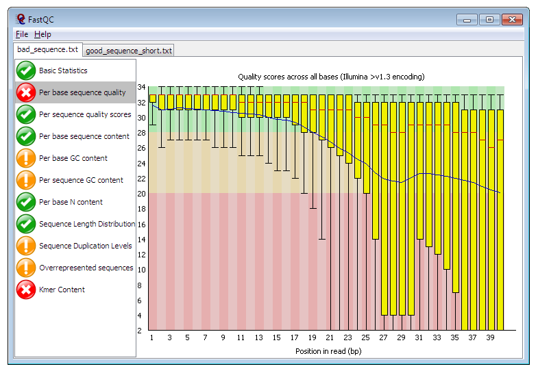

Algunos aspectos a evaluar en un reporte de calidad son:

* **Calidad de secuencia por base:** Es un indicador global que muestra la distribución de calidad de base (Phred score, en el eje y) por posición en la lectura (eje x). Los Phred scores por encima de 30 suelen considerarse de buena calidad para una lectura de Illumina. En este caso, la lectura comienza con una alta calidad (zona verde), que decrece a medida que aumenta la longitud de la lectura (zonas amarilla, Phred < 30 y rojo, Phred < 20). Debería mantenerse, en lineas generales, dentro de la zona verde; aunque no debemos preocuparnos si cae abruptamente para lecturas largas.
* **Calidad de secuencia según posición en la flowcell:** Este indicador permite detectar problemas en regiones físicas especificas del secuenciador. Un problema frecuente es la formación de burbujas. 
* **Contenido de base por secuencia:** La frecuencia de cada nucleótido en una lectura debería ser más o menos constante, y visualizarse como lineas horizontales paralelas a lo largo de toda la lectura.
* **Contenido de GC por secuencia:** Esta gráfica permite identificar contaminaciones. Un perfil de contenido de GC que no se ajusta a una distribución normal podría indicar presencia de contaminantes. La curva esperada está ajustada a la distribución en humanos, si se trabaja con otro organismo podría verse diferente, pero lo importante es ver un solo pico. 
* **Contenido de N por base:** El caracter **N** indica que el proceso de secuenciación fue inconcluyente a la hora de asignar un nucleótido. Un exceso de éstos indica problemas.
* **Niveles de duplicación de secuencia:** La aparición de duplicaciones excesivas puede sugerir artefactos durante la generación de la librería que usamos para secuenciar (o problemas en la PCR que usamos para amplificar nuestra muestra, si usamos alguna).
* **Contenido de adaptadores:** Aparición de adaptadores propios de la tecnología de secuenciación (no pertenecen a nuestra secuencia de interés y deben ser removidos antes de mapear al genoma de referencia).

### Análisis de calidad de las secuencias de *C. trachomatis*

Para realizar el análisis de calidad de la secuenciación con FastQC, ejecute el siguiente comandos:

```Bash 
fastqc NV_1.fastq.gz
fastqc NV_2.fastq.gz
```
Puede observar con el comando `ls`, que FastQC ha generado nuevos archivos en el directorio donde se encuentra. 
A continuación, visualice los resultados de cada archivo de secuenciación por separado abriendo el html generado con un navegador:

```Bash 
firefox NV_1_fastqc.html NV_2_fastqc.html
```

4. ¿Qué opina de la calidad de los datos? ¿Continuaría trabajando con ellos? Compare con este ejemplo y justifique su decisión: [Example of Conventional Base Calls](https://www.bioinformatics.babraham.ac.uk/projects/fastqc/bad_sequence_fastqc.html)

## Ejercicio 3: Mapeo de secuencias al genoma de referencia de *C. trachomatis*

El formato SAM (Sequence Alignment Map) es un formato estandarizado para guardar de secuencias de nucleótidos alineadas (Para mas información ver [SAM format](https://samtools.github.io/hts-specs/SAMv1.pdf)). 

Otro formato similar es el BAM, el cual es el equivalente binario y comprimido de SAM, desarrollado para aumentar la velocidad y utilizarse en procesamientos intensivos de datos.

!!! info "Como crear el archivo SAM"

	!!! Warning "NO EJECUTAR EL CÓDIGO A CONTINUACIÓN! Es de muestra"

	Por si no quedó claro con todas las aclaraciones, ustedes NO deben ejecutar los comandos de esta etapa. Podrán ver los resultados ya creados en su directorio de trabajo. Le brindamos los comandos en caso de querer reproducir el análisis en secuencias de su interés.

	El software para mapear las lecturas es BWA. Para instalarlo habría que ejecutar:

	```Bash
	# NO ejecutar
	sudo apt install bwa
	```

	La secuencia de referencia para este ejercicio es la cepa LGV de *Chlamydia trachomatis*, denominada **L2** y se encuentra en el archivo ``L2_cat.fasta``. Este archivo contiene concatenado en formato fasta la secuencia del genoma y de un plásmido.

	La mayoría de los programas que trabajan con genomas completos necesitan indexar la secuencia de referencia contra la que se alinearán las lecturas antes de comenzar. 
	Para ello habría que ejecutar:
	 
	```Bash 
	# NO ejecutar
	bwa index L2_cat.fasta 
	```

	Realizado el indexado del genoma de referencia, podríamos mapear nuestras secuencias crudas empleando el algoritmo BWA-MEM:
		 
	```Bash 
	# NO ejecutar
	bwa mem L2_cat.fasta NV_1.fastq.gz NV_2.fastq.gz > mapping.sam
	```

!!! info "A partir de aqui SI continúe ejecutando los comandos"

Revisen de qué se trata el `.sam` visualizando las primeras líneas del archivo por consola:

```Bash
head mapping.sam
```

Las partes del archivo SAM son las siguientes:

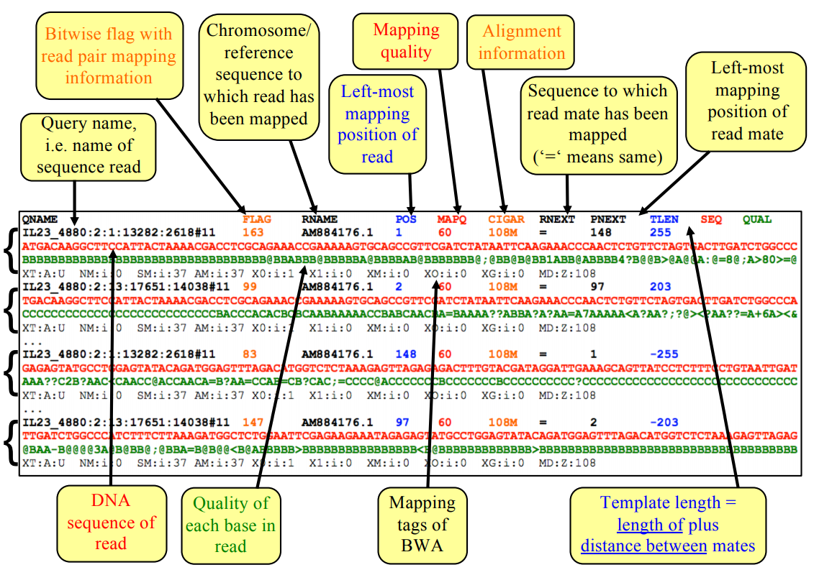


### Compresión de archivos SAM

Primero vamos a convertir el alineamiento de formato SAM a formato BAM:

```Bash 
samtools view -b -S mapping.sam > mapping.bam 
```

!!! warning "Si el comando no es encontrado, cierre TODA terminal abierta y vuelva a probar. Si ahí no anda, avise"


* Compare el tamaño de los archivos SAM y BAM y determine el factor de compresión. 

??? question "¿Se le ocurre qué comando puede utilizar para ver el tamaño de los archivos?"

      ```Bash 
      ls -lh mapping*
      ```

Seguidamente ordene las lecturas mapeadas por cromosoma y/o coordenada con el siguiente comando:

```Bash 
samtools sort -o NV.bam mapping.bam 
```

* ¿Por qué las secuencias no están ordenadas y debemos hacerlo en un paso más?

Finalmente indexaremos el archivo en formato BAM:

```bash 
samtools index NV.bam
```

## Ejercicio 4: Visualización de secuencias mapeadas

JBrowser2 permite visualizar datos de secuenciación de tecnologías de nueva generación como Illumina, 454 o Solid. JBrowser2 se puede descargar e instalar desde la [página oficial](https://jbrowse.org/jb2/download/). Si están trabajando desde las computadoras del laboratorio, ya deberían tener instalado el programa.

### Vista básica de JBrowse2

- Abra JBrowse2 y cargue la secuencia de referencia "L2_cat.fasta". Para esto, hacer click en ``'OPEN SEQUENCE FILE(S)'`` y seleccione el archivo correspondiente. En ``assembly name`` elija un nombre que sea representativo del archivo cargado, y en ``Type`` FastaAdapter. 
- Luego de seleccionar ``submit`` elija ``Linear genome view`` y luego presione ``LAUNCH VIEW``
- La siguiente ventana muestra que hay dos entradas en nuestro archivo multifasta, una que corresponde al ADN cromosomal y otra que corresponde al ADN plasmídico. Para visualizar las dos en simultaneo, seleccione ``SHOW ALL REGIONS IN ASSEMBLY``

En este punto, su programa debería verse de esta forma:

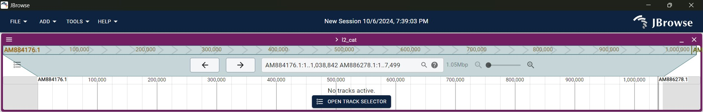

**Componentes de la interfaz:**

- Barra de herramientas (Menúes desplegables): Puede acceder a diferentes opciones, como abrir archivos, agregar tracks, descargar *plugins*, etc.
- Tracks cargados (Entradas activas): Seleccionando ``OPEN TRACK SELECTOR`` puede ver los tracks disponibles y elegir cual visualizar. En nuestro caso, verá "Reference sequence (l2_cat)" o el nombre de referencia elegido.
- Panel de visualización principal: Muestra la secuencia de referencia, con las hebras positiva y negativa representadas por líneas. Puede observar los marcos de lectura, los codones stop (mostrados como líneas verticales o puntos), y las características como genes o dominios que se representan mediante cajas coloreadas (dependiendo de los tracks que estén cargados y seleccionados).
- Desplazarse y hacer zoom: El deslizador horizontal permite moverse a lo largo de la secuencia (observe que se ven las dos entradas, cromosoma y plásmido). Haciendo zoom sobre la secuencia se pueden observar las bases de las dos hebras y los residuos en los seis marcos de lectura.

Ahora vamos a cargar las anotaciones del genoma de L2_cat. Estas anotaciones estan en formato gff, y en dos archivos distintos, uno para el ADN cromosomal y otra para el ADN plasmídico.

- Abra los archivos de anotación denominados "L2_genomic.gff" y "L2_plasmid.gff". Para esto, desde el panel ``Available tracks`` hacer click en el símbolo "+" > ``Add track`` y seleccione el archivo correspondiente. Luego de apretar ``Next``, en ``Adapter type`` seleccione ``GFF3``, deje el resto de las opciones como están y presione ``ADD``

- Para visualizar el mapeo de lecturas que acabamos de hacer vamos a cargar en JBrowse2 nuestras lecturas mapeadas en formato BAM, de la siguiente manera: desde el panel ``Available tracks`` hacer click en el símbolo "+" > ``Add track`` y abra el archivo ``NV.bam``. Luego de apretar ``Next``, en ``Adapter type`` seleccione ``BAM adapter``, deje el resto de las opciones como están y presione ``ADD``


!!! info "Recuerden que estas lecturas son de la cepa sueca **NV** mapeadas contra el genoma de referencia de la cepa **L2**." 


Ahora debería ver la ventana con las lecturas en la parte inferior de la pantalla principal. Su panel principal, donde está la secuencia y los tracks asociados, debería verse de esta forma: (la secuencia se ve según el nivel de zoom)

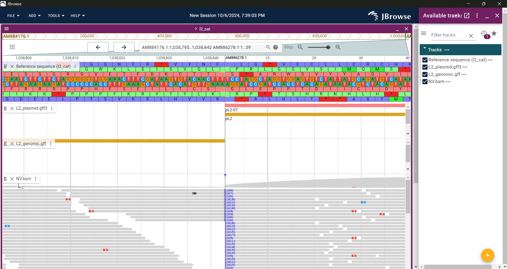

Por defecto, la vista de las lecturas tiene dos secciones. La superior muestra la profundidad de cobertura de las lecturas en cada posición en el genoma, y también con lineas de colores cualquier las discrepancias entre el genoma leído y el genoma de referencia. Abajo se muestran las lecturas apiladas, que tambien muestran las discrepancias de base con lineas de colores.

Si quieren saber mas sobre una lectura, clickeen sobre la misma y verán a la derecha una ventana con los ``Feature details``. Ahí podrán ver detalles como posición, nombre y largo de la misma, secuencia, calidad de cada una de las bases, entre otras. Para ver como se conectan las lecturas entre sí, pueden probar la vista tipo arco, la encuentran en ``Display types`` > ``Arc display``, en el menú que se abre al seleccionar los tres puntos al lado del track correspondiente.

### Calidad de Mapeo

!!! info ""

      La calidad de mapeo depende en la precisión de la lectura y el número de "*mismatches*" respecto a la secuencia de referencia. Un valor de 0 indica que la lectura mapea igualmente bien con al menos otro lugar por lo que **su mapeo no es confiable**. El máximo valor posible de "Mapping quality" es 60.

* Basándose en sus conocimientos de biología y de bioinformática ¿qué aspectos considera que podrían influir en la calidad de mapeo?

A continuación, vamos a filtrar las lecturas para visualizar solo aquellas que tienen una buena calidad de mapeo. Para realizar esto haga click en los tres puntos al lado de ``NV.bam`` en el panel de las lecturas, seleccionen ``Pileup settings`` y luego ``Filter by``. Aparecerá una ventana con muchas opciones para filtrar. En ``Filter by tag name and value`` pongan **MQ** como ``Tag name`` y **60** como ``Tag value`` (removiendo asi lecturas con calidad de mapeo menor a dicho número). En este punto, la mayoría de lecturas deberían conservarse. Si no ven esto en su aplicación, prueben poner **mq** (en minúscula) como ``Tag value``.

!!! idea "Tip"

      Filtrar lecturas con regiones repetitivas y ver únicamente lecturas correctamente apareadas puede ser muy útil para hacer el análisis del mapeo.

!!! info

	JBrowser2 no permite (por el momento) definir un intervalo de valores. Si quieren tener lecturas que estén entre dos valores de calidad, podrían filtrar por consola el archivo NV.bam.

### Visualización de las lecturas mapeadas

JBrowse2 tiene varias modalidades de visualización de archivos BAM. Para explorarlas haga click sobre los tres puntos en el panel BAM y seleccionen el menú de opciones ``Display types``: 

* La visualización por defecto (la que están viendo) es 'Alignments display (combination)'. Como ya se mencionó antes, combina la cobertura y las lecturas sobre la secuencia. La cobertura es la cantidad de lecturas secuenciadas para esa posición. Dado que esta tecnología puede tener errores, a mayor cobertura, mayor confianza en la detección de variantes. 
* La vista 'Pileup display' es una simplificación de la visualización anterior, donde sólo se muestran las lecturas. 
* La vista 'SNPCoverage display', muestra la frecuencia de aparición de cada nucleótido, y en caso de no coincidir con la referencia, lo colorea. Cuando una columna aparece completamente coloreada, en esa posición existe un SNP (no es un error de secuenciación ya que todas las lecturas presentaron la misma variación) 
* La vista 'Arc display' muestra la relación entre lecturas apareadas (paired-end reads) que están mapeadas en diferentes posiciones del genoma de referencia. Las lecturas paired-end que están mapeadas a diferentes posiciones del genoma se conectan mediante un arco. Esto es muy útil para visualizar de forma clara las lecturas que no están alineadas juntas o de forma esperada, lo que podría indicar variaciones estructurales, problemas de ensamblado, etc.
* La vista 'Read cloud display' es similar a 'Arc display', pero utiliza etiquetas provenientes de algunos tipos de secuenciación. Es especialmente útil para detectar variaciones estructurales y comprender cómo las lecturas de un mismo fragmento de ADN se alinean en el genoma 


!!! Question "¿Por qué podrían generarse lecturas duplicadas? ¿Todas las lecturas duplicadas serán útiles?"

Sacaremos provecho de la vistas en nuestro ejemplo biológico. Para ello primero creen una copia seleccionando ``Copy track`` en el panel bam. Luego, seleccionen la vista 'Read cloud display' en uno de los paneles bam y 'Pileup display' en el otro. 

Vamos a enfocarnos en el ADN plasmídico, por lo que posicionense en la secuencia 'AM886278.1' o seleccionen dicha secuencia desde el panel que se encuentra en el primer track (al lado del zoom). Comparen la cobertura del plásmido con la región genómica de **NV**

Su pantalla de JBrowse2 debería verse así:

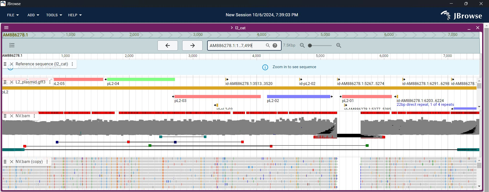

* ¿Qué aspectos considera que pueden influir en la cobertura en general y en este caso en particular?

* A simple vista, ¿notan alguna región diferente?

A continuación, copien y peguen lo siguiente en el selector de secuencias: ``AM886278.1:5,000..6,000``. Eso va a mostrar en la pantalla las **posiciones 5000 a 6000** de la secuencia **AM886278.1** (el ADN plasmídico)

Su pantalla de JBrowser2 debería verse así (en violeta el recuadro del selector de secuencias):

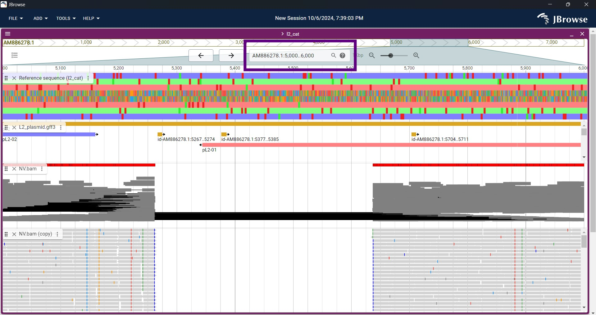

Observarán que no hay lecturas que hayan sido alineadas sobre esa región del genoma, y que además las lecturas adyacentes a dicha región están conectadas entre sí (esto también lo podrían visualizar con 'Arc display'). Esto es indicativo de una **deleción** en la cepa secuenciada comparada con la referencia.

### Visualización de múltiples archivos BAM

También pueden visualizar múltiples archivos BAM al mismo tiempo. Recuerden que los archivos BAM son un grupo procesado de lecturas alineadas de una bacteria (en este caso) contra una secuencia de referencia. Asi que en principio podriamos observar múltiples aislamientos bacterianos diferentes mapeados contra la misma referencia. La cepa de *C. trachomatis* que va a leer es la **L2b**. Es filogenéticamente más cercana a la cepa de referencia que la que hemos analizado hasta el momento, por eso el nombre similar.

No harán nuevamente el mapeo para esta cepa, ya hemos procesado los datos crudos en fastq por ustedes. El archivo que necesitan se denomina "L2b.bam". Para abrirlo, vayan al ``Track selector``, presionen el símbolo + y carguen el archivo correspondiente. Recuerden que el tipo es ``Bam adapter``, y dejen el resto de las opciones como vienen predeterminadas.

Veamos  la región no mapeada que analizamos previamente (entre las bases 5000 a 6000). Comparen los distintos tipos de visualización entre ambas secuenciaciones.

* Vuelva a leer en la Introducción la razón por la cuál la cepa **NV** causó un alerta sanitario en Europa en el año 2006. Considerando lo que acabamos de ver, ¿por qué razón cree que la cepa **NV** no es detectada en el ensayo diagnóstico estándar pero sí lo es la cepa **L2b**?

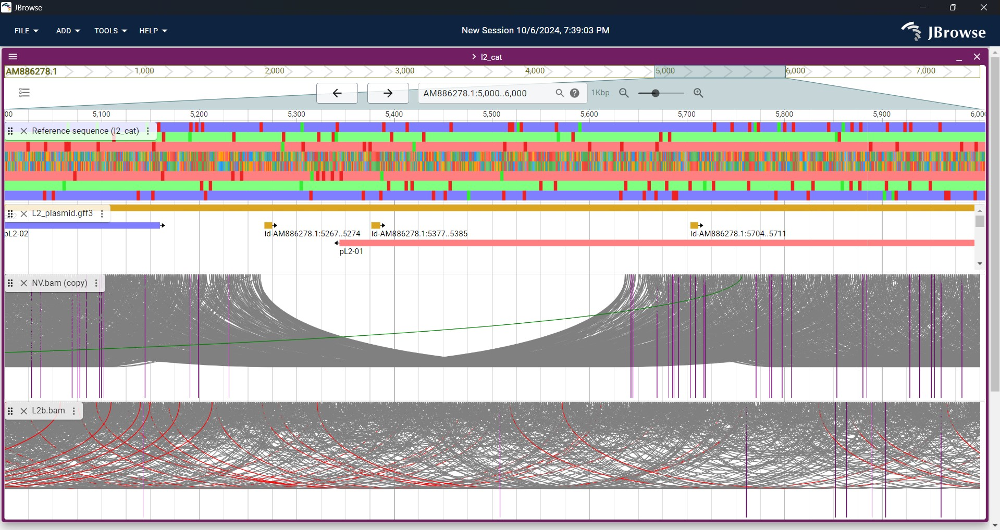


## Ejercicio 5: Detección de variantes (SNP e InDel)

Para comenzar, regresen a la visualización de lecturas apiladas (Pileup display)).

Observen las distintas líneas de colores que aparecen en algunas lecturas. Esas líneas representan los SNPs con respecto a la referencia y el color corresponde a la base presente en la lectura (C = celeste, G = naranja, T = rojo, A = verde y N = gris). Observarán que algunos SNPs están presentes en todas las lecturas, formando líneas verticales de color, mientras que otros SNPs se encuentran distribuidos más esporádicamente. Los primeros tienen mayor probabilidad de ser verdaderos SNPs mientras que los últimos probablemente sean errores de secuenciación. 

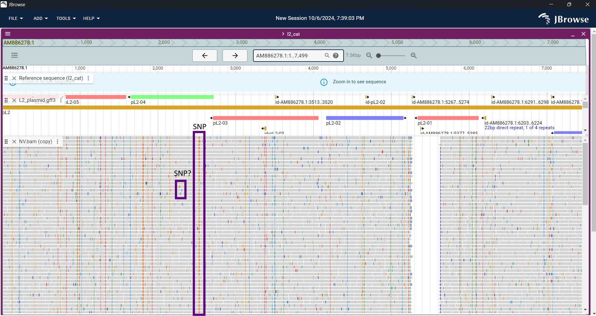

Si acerca la visualización de las lecturas apiladas al máximo podrán observar (1) las secuencias individuales de cada lectura y (2) las bases que difieren de la referencia estarán en el color correspondiente.

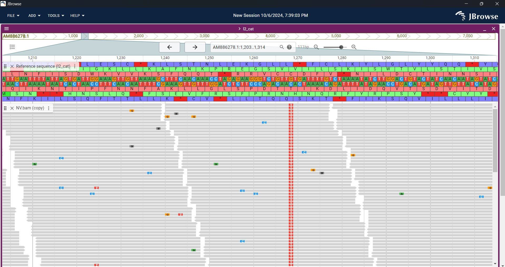

!!! info

      Muchos SNPs son bastante claros, sin embargo, esto no es siempre el caso. ¿Qué sucede si la profundidad de lecturas es muy baja? Si solo hay dos lecturas mapeando en un sector, la referencia es T y ambas lecturas son C, ¿Es evidencia suficiente para decir que hay un SNP? ¿Que pasa si hay muchas lecturas mapeando una región y, por ejemplo, de 100, 50 tienen G y las otras 50 tienen T en una posición en particular. ¿Es un SNP? También podria ser una coinfección o una variación en un genoma diploide...


### Calculando con más precisión los SNPs

Hasta el momento hemos visto la variación como un simple y homogéneo grupo de SNPs. En realidad se necesitaría más información para entender el efecto que el cambio en la secuencia puede ocasionar en, por ejemplo, la capacidad codificante. Para esto podemos visualizar un tipo de formato denominado "variant call format" (VCF), el cual tiene su forma comprimida denominada "binary variant call format" (BCF).

El formato VCF fue desarrollado para representar datos de variación de 1000 proyectos genoma humanos y ya es bastante aceptado por la comunidad como el formato estándar para *SNP calling*. 

Nosotros vamos a generar el archivo en formato VCF a partir de nuestro archivo ``'NV.bam'`` y visualizarlo en JBrowse2.

Para crear un archivo VCF necesita ir a la terminal y escribir los siguientes comandos:

```bash
bcftools mpileup -Ou -f L2_cat.fasta NV.bam | bcftools call -v -c --ploidy 1 -O v > NV.bcf
bgzip NV.vcf
tabix NV.vcf.gz
```

Visualicen el resultado del *variant calling* usando head:

```bash
zcat NV.vcf.gz | head
```

Ahora leeremos en JBrowser2 el archivo VCF que recien crearon. Para esto vayan al ``Track selector``, presionen el símbolo + y carguen el archivo ``"NV.vcf.gz"``. Presionen ``Next`` y verifiquen que en ``Adapter type`` diga **VCF tabix adapter**.

Para ver una región con algo de variación genética interesante vayan al gen CTL0578. Este gen pertenece al ADN cromosomal, y está en las posiciones 684021 a 685991

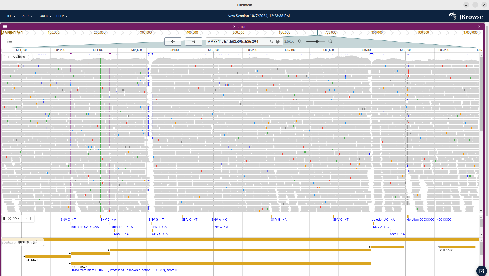

* ¿Qué tipos de variantes pueden identificar en el gen CTL0578?


## Ejercicio adicional: comparando cepas

En el directorio de trabajo tiene el archivo BAM de la cepa L2b. Con los comandos vistos, calcule las variantes de esta cepa respecto al genoma de referencia de L2. 

Una vez generado el VCF, agreguelo a la vista de la misma manera que para la cepa NV. Compare ambas cepas en el visualizador.

* ¿Qué cepa tiene mayor cantidad de variantes? ¿Por qué?
