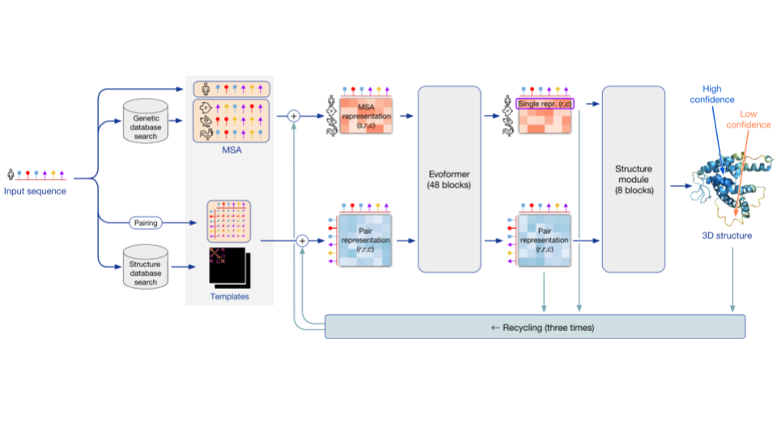
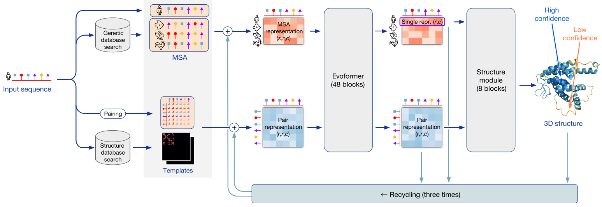
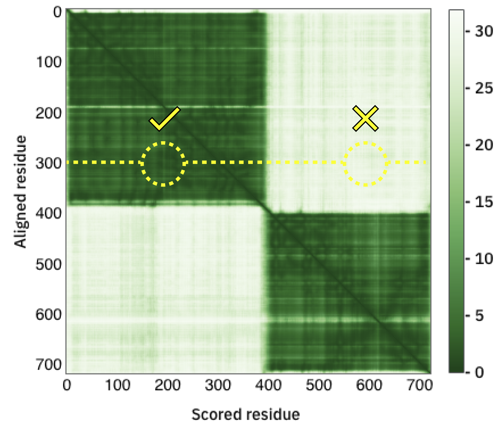

{ width="250", align="left" }

# **TP 9b**. Modelado usando AlphaFold2 { markdown data-toc-label = 'TP 9b' }

<br>
<br>
<br>

!!! abstract "Atención: Este TP tiene informe."

## Recursos Online

* ColabFold For AlphaFold2 using MMseqs2: [Aquí](https://colab.research.google.com/github/sokrypton/ColabFold/blob/main/AlphaFold2.ipynb)

## Requisitos

Para este ejercicio es necesario poseer una cuenta de gmail para poder acceder a las notebooks del Colab.

## Objetivos
* Familiarizarse con el uso del predictor AlphaFold2 y criterios que permiten evaluar los resultados obtenidos, los alcances y las limitaciones de las predicciones obtenidas.


## ¿Qué es Google Colab?

Colab, o Colaboratory, permite escribir y ejecutar Python en nuestro navegador. Nos da acceso a una máquina de manera remota.

Las ventajas son:

* No es necesaria ninguna configuración

* Es fácil de compartir

* Podemos utilizar fácilmente procesadores GPU (**G**raphics **P**rocessing **U**nit) que se diferencia del procesador “común”, el CPU (**C**entral **P**rocessing **U**nit) porque tiene más núcleos, más especializados y por lo tanto permite realizar cómputos más complejos de manera más rápida.

En esta clase, utilizaremos una **Notebook** donde ya está implementado AlphaFold2.

## AlphaFold2 (AF2)
En los últimos años, hubo un crecimiento continuo en el número de estructuras de proteínas determinadas experimentalmente depositadas en el PDB (actualmente ~170.000). Esto, junto con la explosión de la secuenciación (millones de secuencias) y el desarrollo de técnicas de deep learning benefició el desarrollo de algoritmos de predicción de estructura tridimensional de proteínas. Hasta el 2021, los algoritmos de predicción de estructura tridimensional de proteínas se basan en dos aspectos complementarios: las interacciones físicas (o contactos) o la historia evolutiva de la proteína. Sin embargo, y a pesar de los avances, la mayoría de los algoritmos de predicción no son muy precisos si se carece de un homólogo cercano con una estructura tridimensional resuelta experimentalmente.
A partir de la secuencia primaria de una proteína (Fig 1), AlphaFold2 utiliza una red neuronal para la predicción estructural de alta precisión (en la mayoría de los casos), la cual aumenta con el uso de estructuras homólogas. AlphaFold2 puede incluso predecir con alta precisión las cadenas laterales si el backbone es preciso.



**Fig 1.** Algoritmo de predicción de estructuras AlphaFold2.

<br>
<br>


### Arquitectura
AlphaFold2 utiliza una arquitectura de red que utiliza como inputs el alineamiento de secuencias (MSAs) y una representación de todos los pares de residuos de la secuencia. Mediante un algoritmo iterativo que se basa en la arquitectura Evoformer, se procesan los inputs y en conjunto con un módulo estructural se genera una representación tridimensional de la proteína query. 

### Métricas de confianza
AlphaFold2 incorpora métricas de confianza de la predicción.

* La principal métrica de confianza es el test **pLDDT** (predicted local-distance difference test) el cual es un predictor confiable del test de diferencias en las distancias Cα (IDDT-Cα) y evalúa principalmente la correctitud del modelo a nivel local (estimando el error en distancias de un Cα con Cα vecinos en un rango de 15Å).

* La segunda métrica se denomina **PAE** (por Predicted Aligned error) y compara el error en la predicción de pares de residuos, esto es el error sobre el residuo y cuando las estructuras real y predicha son alineadas sobre el residuo x. Esta medida permite la identificación global de unidades de plegamiento (dominios) y permite predecir si dos dominios guardan relaciones espaciales definidas, o si tienen variabilidad (por ejemplo, si están conectadas por un linker flexible.

{ width="400" }

{ width="400" }


**Fig 2.** *Arriba.* Se pueden observar dos dominios globulares, pero se desconoce la disposición espacial relativa entre ellos. *Abajo.* Se puede observar que además de identificar los dominios globulares, se predien correctamente pares de residuos interdominios.

<br>
<br>

### Costo computacional
AlphaFold2 consume muchísimos recursos. Por lo tanto, muchas proteínas de organismos modelos están siendo modeladas y puestas a disposición de la comunidad científica en una base de datos: [https://alphafold.ebi.ac.uk/](https://alphafold.ebi.ac.uk/).

Afortunadamente, la comunidad científica rápidamente desarrolló distintas “colabs” o “notebooks” que permiten correr AlphaFold2 en una máquina remota. Una “desventaja” es que se debe contar con una cuenta de mail de gmail, **cada cuenta de gmail puede usar un colab a la vez**.

Otra desventaja es que en la versión gratuita de colab, debido al espacio en disco y capacidad de cómputo que se adjudica, sólo se pueden correr proteínas o complejos con menos de 1000 residuos y luego de estar corriendo unas cinco proteínas, hay que esperar a que se renueve el tiempo de cómputo de esa cuenta. 

Otra desventaja, es que no se pueden modificar muchos parámetros del modelado al usar un colab, en comparación con correr la simulación desde un script en una computadora o server propio. Sin embargo, los parámetros usados en el ColabFold de AlphaFold2 son los que fueron más ampliamente validados durante el desarrollo del método.

Existen distintos colabs que implementan AlphaFold2. En este curso utilizaremos uno en particular: [AlphaFold2 using MMseqs2](https://colab.research.google.com/github/sokrypton/ColabFold/blob/main/AlphaFold2.ipynb).


Todas las versiones de las distintas NoteBooks están disponibles en el github: [https://github.com/sokrypton/ColabFold](https://github.com/sokrypton/ColabFold)


## AlphaFold2 - Ejercicios

Los papilomavirus (PVs) son virus desnudos icosaédricos y poseen un genoma ADN doble cadena circular entre 5-8 Kb. Sus hospedadores incluyen una amplia variedad de vertebrados desde peces, reptiles, aves y mamíferos. Los PV infectan el epitelio mucoso y queratinizado y producen lesiones denominadas condilomas o papilomas y verrugas respectivamente y en humanos algunos PVs están asociados al cáncer cervical uterino, de la formación de tumores en el tracto urogenital y en las vı́as aéreas superiores.

La proteína E7 del papilomavirus comparte similitudes funcionales con la proteína E1A de adenovirus y el antígeno T del poliomavirus SV40. Las tres proteínas poseen actividades transformantes e interaccionan con la proteína retinoblastoma.

La interacción de la proteína E7 con Rb es responsable de la inducción de la síntesis de ADN y proliferación celular. La inmortalización y transformación de la célula infectada inducida por E7 es consecuencia de la interacción de E7 con Rb y numerosos blancos proteicos involucrados en crecimiento celular, transformación, transcripción, apoptosis y síntesis de ADN.

### Ejercicio 1. Modelado de un Monómero de E7
1. Ingrese al ColabFold que implementa MMseq2 [Aquí](https://colab.research.google.com/github/sokrypton/ColabFold/blob/main/AlphaFold2.ipynb).

    !!! info

            Si quiere que los cambios que realice sean guardados deberá agregar la notebook a su drive. Pero esto no es necesario.
  

2. En la parte superior, haga click en *Runtime* → *Change Runtime* y asegúrese que:

    * **Runtime type:** sea *Python 3*

    * **Hardware accelerator:** este seleccionado *T4 GPU*

3. **Preparando la corrida.**

    En el campo sequence query ingrese la secuencia (**sin** el encabezado indicado por el signo `>`) de la proteína E7 de HPV16.

    ```
    >sp|P03129|VE7_HPV16 Protein E7 OS=Human papillomavirus type 16 OX=333760 GN=E7 PE=1 SV=1
    MHGDTPTLHEYMLDLQPETTDLYCYEQLNDSSEEEDEIDGPAGQAEPDRAHYNIVTFCCKCDSTLRLCVQSTHVDIRTLEDLLMGTLGIVCPICSQKP
    ```

    * En el campo **jobname** ingrese: E7_MONOMERO.

    * En el campo **num_relax** elija: 1

    !!! info

        **num_relax** es el número de modelos a relajar con Amber. Esta notebook produce hasta 5 modelos máximo por proteína. 
        
         Amber permite mejorar la geometría de la unión peptídica y posición de rotámeros luego de la relajación de la estructura. Si bien no mejora la predicción, remueve violaciones estereoquímicas.
        

    * En template mode elija pdb100 ¿Qué le parece que es este campo?

    * Vaya a  *Runtime* →  *Run all*, o presione `Ctrl`+`F9`

    * Como por defecto este ColabFold crea 5 modelos hay que esperar (unos 20 minutos).
    
    !!! danger "IMPORTANTE"

        No cierre la ventana y tampoco cierre la laptop porque la corrida entonces se detiene (no pasa nada si entra en suspensión).
    


    Al finalizar la corrida, los resultados serán descargados automáticamente como un archivo zip. Si esto no llegara a suceder, puede acceder al mismo haciendo click en el icono con forma de carpeta que se encuentra a la izquierda.

4. Una vez que terminó de correr, comience con el Ejercicio 2 (La corrida en AlphaFold2) y vuelva a este ejercicio.

5. Localice el archivo descargado y descomprímalo (el nombre del archivo comienza con `E7_MONOMERO`). Encontrará varios archivos, en particular:
    * `*_template_domain_names.json` Tiene los templados utilizados por AlphaFold2 si es que se usaron.
    * `Cite.bibtex` Contiene todas las citas correspondientes a los papers relacionados.
    * `Config.json` Contiene todos los parámetros utilizados en la corrida.
    * `*.a3m` Alineamiento
    * `*_coverage.png` Gráfico de la cobertura del alineamiento
    * `*_PAE.png` Gráfico del PAE por pares de residuos para todos los modelos.
    * `*_plddt.png` Gráfico del plddt por posición
    * `*_predicted_aligned_error_v1.json` Tiene los valores de PAE para todos los pares de todos los modelos.
    * `*_relaxed_*_model_*.pdb` Son los 5 modelos generados.
    * `*_relaxed_*_model_*.json` Son el PAE y pLDDT de cada modelo que se pueden utilizar para graficar.

6. Abra Chimera y cargue uno de los modelos relajados (si no recuerda *File* → *Open …*).

7. Abra el pdb: 2b9d.
    * ¿Estaba esta estructura entre los templados?
    * ¿Por qué método fue determinada?
    * ¿A qué proteína corresponde? ¿De qué organismo?

8. Alinee las estructuras utilizando Matchmaker (si no recuerda, *Tools* → *Structure comparison* → *Matchmaker*)

    * ¿Cuál es el RMSD global?

    Si quieren ver el RMSD por posición sobre la estructura

    *Structure Comparison* → *Match align*
    
    Seleccione el par de modelos adecuado. *En residue-residue distance cutoff* seleccione el mismo umbral que utilizó en *Matchmaker* para *pruned atoms* (Por defecto es 2)
    
    Para colorear la estructura por RMSD para eso vaya a: *Tools* → *Depiction* → *Render by Attribute*
    
    En **attributes** of asegúrese que esté seleccionado residues
    
    En el **recuadro de Models** asegúrese que estén ambos modelos seleccionados.
    
    En la pestaña **Render** seleccione **mavRMSDca** y luego haga clic en `Ok`.

9. Cierre el modelo correspondiente al pdb 2b9d. Via terminal tiene que ingresar el comando close seguido del número del modelo, por ejemplo:

    ```
    close #0
    ```

    cierra el modelo 0.

    O bien, en el **model panel**, seleccione el modelo correspondiente y haga clic en *close*.

10. Ahora abra los 4 modelos restantes, para eso, *File* → *Open…* y con el mouse seleccione los modelos manteniendo la tecla ctrl presionada.

11. Alinee los modelos ranqueados de 2 a 5 contra el modelo 1, 
    * Explore el *Reply log* ¿cuál es el RMSD global de cada par alineado?

12. Utilice **Match Align** para ver el alineamiento. Recuerde utilizar el umbral adecuado!.
    * ¿Qué observa?
    * ¿Porque si las secuencias son todas iguales no aparece el n-terminal alineado?

13. Los valores de pLDDT están almacenados en la columna del pdb que corresponde a los b-factors.
Para colorear por b-factors, utilizaremos la *command line* que Chimera trae integrada. Para esto vaya a: *Favorites* → *Command line*. En la parte inferior de la pantalla se abrirá un renglón donde puede ingresar los comandos necesarios.

    Para colorear los modelos según el atributo b-factor donde está almacenado el plDDT ingrese en la *command line*:

    ```
    rangecolor bfactor 0 orange red 50 white 100 dodger blue
    ```

    * ¿Qué observa?

    En el *reply log* se reportan los valores mínimo, medio y máximo encontrados en la columna de b-factors.

    * ¿Cuáles son el mínimo y el máximo?
    
    Ahora cambie el valor mínimo a min (se elige el valor mínimo presente en la columna de b-factors) y el valor intermedio que antes era 50, a 70:

    ```
    rangecolor bfactor min orange red 70 white 100 dodger blue
    ```

    * ¿Observa diferencias con lo anterior? ¿Cuáles?
    
    Ahora corra:

    ```
    rangecolor bfactor 50 orange red 70 white 100 dodger blue
    ```
    
    * ¿Observa diferencias con lo anterior? ¿Cuáles?

    * ¿Porqué considera que elegimos 50 como valor mínimo?

    * ¿De qué posición a qué posición consideraría que el modelo es de confianza?

14. Investigue el gráfico de pLDDT que se descargó con el modelo.

    * ¿Qué observa?

    * ¿Puede identificar las regiones con un pLDDT mayor a 70?

    * ¿Puede identificar las regiones con un pLDDT entre 50 a 70?

15. Abra R Studio. Ahora graficaremos los pLDDT por posición para cada uno de los modelos.

    ```r
    install.packages("bio3d")
    install.packages("reshape2")
    library(bio3d)
    library(ggplot2)
    library(reshape2)

    setwd(*DIRECTORIO DE TRABAJO DESEADO*)

    directorio <- "/directorio/donde/estan/los/modelos"

    archivos <- list.files(path = directorio,pattern = "_unrelaxed_",)

    miarchivo <- paste(directorio,archivos[1],sep="")
    mipdb <- read.pdb(miarchivo)

    datos <- data.frame(Residue = mipdb$atom[mipdb$calpha,"resno"],
                        Rank_1 = mipdb$atom[mipdb$calpha,"b"]
    )

    for(i in 2:length(archivos)){
        miarchivo2 <- paste(directorio,archivos[i],sep="")
        mipdb2 <- read.pdb(miarchivo2)
        nuevaColumna <- paste("Rank",i,sep="_")
        datos[nuevaColumna] <- mipdb2$atom[mipdb2$calpha,"b"]
    }

    fileOUT <- paste(directorio,"E7_Monomero.png",sep="")

    datos2 <- melt(datos, id="Residue")
    datos2$variable <- as.factor(datos2$variable)

    p1 <- ggplot(datos2, mapping=aes(x=Residue,y=value,color=variable)) + 
    geom_line() + theme_bw() +
    scale_x_continuous(name = "E7 Residue", breaks = seq(5,100,by=5),limits = c(0,100),expand=c(0,0)) +
    scale_y_continuous(name = "Predicted lDDT", breaks = seq(5,100,by=5),limits = c(0,101),expand=c(0,0)) +
    geom_hline(yintercept = 90,color="blue")+
    geom_hline(yintercept = 70,color="orange2")+
    geom_hline(yintercept = 50,color="red")
    p1

    ggsave(filename = fileOUT,plot = p1,device = "png",width = 20,height = 10,units = "cm",dpi = 300)
    ```

16. Encuentre el archivo corespondiente al gráfico del PAE.
    * ¿Qué interpreta?

17. En base a los resultados obtenidos, 
    * ¿Qué puede decir de la estructura de la proteína?
    * ¿Cuántos dominios posee? ¿ordenados o desordenados?
    * ¿Puede decir aproximadamente los límites?

18. Guarde la sesión (*Save Session As...* ) y cierre chimera.

### Ejercicio 2. Modelado de un dímero de E7

1. En la parte superior, haga click en **Runtime** → **Disconnect** and delete Runtime

2. Preparando la corrida.

    Para indicar que se quiere correr un multímero se debe ingresar las secuencias separadas por `:`.
    En el campo sequence query ingrese las secuencias de la proteína E7 de HPV16. 

    ```
    MHGDTPTLHEYMLDLQPETTDLYCYEQLNDSSEEEDEIDGPAGQAEPDRAHYNIVTFCCKCDSTLRLCVQSTHVDIRTLEDLLMGTLGIVCPICSQKP:MHGDTPTLHEYMLDLQPETTDLYCYEQLNDSSEEEDEIDGPAGQAEPDRAHYNIVTFCCKCDSTLRLCVQSTHVDIRTLEDLLMGTLGIVCPICSQKP
    ```

    * En el campo **jobname** ingrese: E7_DIMERO.

    * En **num_relax** elija 1

    * En template mode elija none

    * Vaya a *Runtime* → *Run all*, o presione `Ctrl`+`F9`

    * Vuelta a esperar ... unos 20 minutos.

    !!! warning "Atención"

        Antes de seguir adelante vaya al ejercicio 3 y ponga a correr el modelado siguiente!

3. Abra Chimera. Y abra el pdb: 2F8B.

    Para eso ingrese en el *command line*:

    ```
    open 2f8b
    ```

    * ¿Qué observa? ¿A qué se debe?

    * Investigue en el [rcsb](https://www.rcsb.org/) la técnica por la que se obtuvo esta estructura y a qué proteína pertenece.

    * ¿Este pdb es utilizado como templado para el modelado? ¿por qué?

4. Abra el model Panel: *Favorites* → *Model Panel*

    Para que sea más fácil las observaciones vamos a trabajar con un único submodelo de cada cadena. Para esto, ingrese en la línea de comando:

    ```
    close #0.2-15
    ```

    * ¿Cuál es el estado de oligomerización de E7?

5. Coloree el modelo de blanco y oculte todos los residuos utilizando los siguientes comandos

    ```
    color white #0
    ~display
    ```

6. La proteína E7 en el dominio de dimerización contiene un sitio de unión a Zinc. Ubique el zn en la estructura.

    ```
    display @ZN; color red @ZN
    ```

    Ahora vamos a seleccionar los residuos más cercanos al zinc:

    ```
    sel :@zn zr<3
    display sel; color red,a sel; color byhet sel;~sel
    delete element.H
    ```

    * ¿Qué residuos se encuentran coordinando la unión a zinc?

7. Ubique el archivo zip que se generó con ColabFold y descomprímalo en su computadora. 

8. Identifique el archivo que corresponde al pLDDT.
    * ¿Qué región está modelada con alta confianza y cual no?

9. Identifique el archivo que corresponde al PAE.

    * Interprete el gráfico.
    * ¿Cuál de los 4 gráficos muestra los valores correspondientes para los pares de residuos de la cadena A, cual para la cadena B y cual para los pares de residuos de de las cadenas A y B?
    * ¿Cuáles son los límites el dominio globular, aproximadamente?

10. Elija el modelo mejor mejor ranqueado y alineelo utilizando Matchmaker contra la estructura de 2F8B.

    * ¿Cuál es el RMSD global?

11. Abra en chimera los 5 modelos relajados que se generaron. Luego, alinee utilizando matchmaker y seleccionaremos las cisteínas que coordinan la unión al zinc.

    ```
    sel #1-5:58,61,91,94; display sel; color blue,a sel; color byhet sel; ~sel
    ```

    Coloree las cadenas A y B de los modelos predichos de distinto color

    ```
    sel #1-5:.A; color orange,r sel; ~sel
    sel #1-5:.B; color purple,r sel; ~sel
    ```

    Observe de cerca la ubicación de las cisteínas y responda:

    * ¿Considera que la predicción del sitio de unión de zinc es buena aún cuando no se incluye el ión en el modelado?

12. Coloree las cadenas de los modelos predichos según los valores de pLDDT.:

    ```
    rangecolor bfactor 50 orange red 50 white 100 dodger blue
    ```

    * ¿Qué observa?

    En base a todas las características observadas: pLDDT, PAE, coordinación de zinc,

    * ¿Pudo AF2 predecir el estado de oligomerización?

    * ¿Pudo AF2 predecir la coordinación del zinc?

    * ¿Qué opina del modelo?

13. Guarde la sesión y cierre chimera.

### Ejercicio 3. Modelado de un motivo unido a un dominio globular en Alphafold2

La proteína retinoblastoma (Rb) regula el avance del ciclo celular de la fase G1 → S. La proteína Rb posee un dominio globular llamado Dominio pocket que está formado por dos subdominios A y B unidos por un loop.

Uno de los blancos celulares de Rb es la Histone desacetilasa 1 (HDAC) que posee el motivo lineal de interacción LxCxE. Sin embargo la afinidad de HDAC1 por Rb, es mucho menor (20µM) en comparación a la afinidad del motivo de la proteína viral E7 de papilomavirus (5nM).

Una estructura tridimensional permite entender desde el aspecto molecular las diferencias en las interacciones que podrían llevar a diferencias en afinidades. Sin embargo, hasta la fecha, no se posee una estructura del complejo Rb-HDAC1.

1. Modele el complejo utilizando el colab: [AlphaFold2](https://colab.research.google.com/github/sokrypton/ColabFold/blob/main/AlphaFold2.ipynb).

    Para tardar menos en el modelado vamos a realizar algunas modificaciones.

    En lugar de ingresar la secuencia completa de la proteína retinoblastoma, vamos a ingresar únicamente la correspondiente al dominio pocket de la proteína retinoblastoma, donde los loops se encuentran reemplazados por secuencias más cortas.

    Al final, indicaremos con el `:` el inicio de la cadena correspondiente al motivo HDAC (`DKRIACEEEFSD`).

    Obteniendo finalmente:

    ```
    NTIQQLMMILNSASDQPSENLISYFNNCTVNPKESILKRVKDIGYIFKEKFAKAVGQGCVEIGSQRYKLGVRLYYRVMESMLKSEEERLSIQNFSKLLNDNIFHMSLLACALEVVMATYSRSTSQNLDSGTDLSFPWILNVLNLKAFDFYKVIESFIKAEGNLTREMIKHLERCEHRIMESLAWLSDSPLFDLIKQSKLVPRGSKSTSLSLFYKKVYRLAYLRLNTLCERLLSEHPELEHIIWTLFQHTLQNEYELMRDRHLDQIMMCSMYGICKVKNIDLKFKIIVTAYKDLPHAVQETFKRVLIKEEEYDSIIVFYNSVFMQRLKTNILQYASTRPPTLSPIPHIPR:DKRIACEEEFSD
    ```

    * En *num_relax* elija 1.

    * En *template_mode* elija: **none**.

    Luego, corra todo con `ctrl+F9` o vaya a *Runtime → Runall*

2. Abra el modelo relajado obtenido por AlphaFold2 en chimera.
3. Abra el pdb 1GUX
4. Alinee ambos complejos utilizando matchmaker.

    Los siguientes pasos se hacen en la *command line* de Chimera:

5. Oculte las posiciones que se observan.

    ```
    ~display
    ```

6. Coloree por cadenas.

    ```
    rainbow chain
    ```

7. Seleccione cada motivo y pongale un nombre (ojo, preste atención a la numeración de los modelos y los nombres de las cadenas, este comando es un ejemplo de como debería ser)

    ```
    sel #0:.E; namesel E7
    sel #1:.B; namesel HDAC
    ```

8. Represente ambos motivos en licorice (recuerde seleccionar cada cadena correspondiente antes!)

    ```
    ribscale licorice E7
    ribscale licorice HDAC
    ```

9. Elimine las aguas e hidrógenos ya que no los utilizaremos para analizar.

    ```
    delete :HOH
    delete element.H
    ```

10. Muestre las cadenas laterales de los motivos coloreando por heteroatomos.

    ```
    display E7
    display HDAC
    color byhet E7
    color byhet HDAC
    ```

   * Observe el modo de interacción, ¿Se encuentran conservado?

   * ¿Por qué podría tener más baja afinidad HDAC1 que E7?

11. Coloree por b-factors el modelo obtenido por AlphaFold (Recuerde que contienen el plDDT y asegúrese que su modelo es el indicado en el comando #1)

    ```
    rangecolor bfactor 50 orange red 70 white 100 dodger blue #1
    ```

    * A ojo, ¿Cuál es la calidad del modelado del péptido que contiene el motivo (HDAC)?

12. Investigue el gráfico de PAE que se descarga con los modelos.

    * ¿Qué nivel de confianza observa en la ubicación relativa del péptido HDAC respecto del dominio Rb?
    
13. En base a las observaciones realizadas: ¿AlphaFold se puede utilizar para analizar la interacción de motivos con dominios globulares?

## Ejercicio a informar

## Ejercicio a informar

!!! Abstract "Fecha Límite de Entrega: Viernes, 27 de Octubre 2023, 23:59hs"

### Enunciado

Su jefe sigue interesado en la proteína N que forma la nucleocápside viral de SARS-CoV2 y empaqueta el genoma viral de ARN formando una ribonucleocápside. Usted ya comprobó que la estructura de la proteína N es altamente desordenada y posee dos dominios globulares pequeños en el N-terminal (Dominio N) y C terminal (Dominio C). Dada la importancia de la proteína en la replicación viral, consideran que es un blanco posible de drogas. Por lo tanto, decide realizar un modelado por homología del dominio N-terminal de la proteína N del **aislamiento** original utilizando las herramientas que conoce.

**1.** Modele por **homología** el dominio **N-terminal**. Evalúe según las herramientas que conoce si su modelo es bueno y recuerde incluir el molde que seleccionó para crearlo justificando la elección e indicando a qué virus pertenece (incluir en el reporte el screenshot de la lista devuelta por HHPred porque los resultados varían).

**2.** Elija una estructura contra la cual comparará su modelo y justifique brevemente la elección. Recuerde reportar el RMSD global y que regiones alinean mejor.

**3.** Usted sin embargo, es muy ambicioso y quiere obtener la estructura de la proteína completa. Modele utilizando AlphaFold2 la proteína N.

**4.** Según los valores de pLDDT predichos por AlphaFold ¿que puede decir acerca de las distintas regiones de la proteína y la calidad del modelado?

**6.** Según este análisis, si desearía cristalizar el dominio N ¿Qué regiones no incluiría?

**Extra! (y por ende opcional)**

Compare el resultado de pLDDT con los predicho por IUPred2A.

Distintas formas de hacerlo:
**1.** Graficar en el mismo plot por posición los valores de IUpred y de plDDT

??? hint "Pista"

    ``` r
    ggplot(data=iupred) + 
        geom_line(mapping=aes(x=posicion,y=iupred)) +
        geom_line(data=AlphaFold, mapping=aes(x=posicion, y=plddt))
    ```

**2.** Graficar en el **eje x** el valor de IUPred (va entre 0 y 1 donde 1 es desordenado) y en el **eje y** los valores de plDDT que van entre 0 (menor confianza o sea desordenado) y 100 (mayor confianza o sea ordenado). 

??? hint "Pista"

    Den vuelta los límites del **eje y** y dividen los valores de plDDT por 100.


¿Son similares los perfiles de IUpred y plDDT?

## Otros Recursos
### How to interpret AlphaFold2 structures
[https://www.youtube.com/watch?v=UqeQfRDA8Yk](https://www.youtube.com/watch?v=UqeQfRDA8Yk)

### AlphaFold Protein structure database
[https://alphafold.ebi.ac.uk/](https://alphafold.ebi.ac.uk/)

