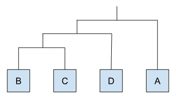

{ width="250", align="left" }

# **TP 12a**. Data Mining - Clustering { markdown data-toc-label = 'TP 12a' }

<br>
<br>
 
[:fontawesome-solid-download: Materiales](https://drive.google.com/file/d/1zT1Qt_BgAxqtDTYxBTRK5uqoIMA1EXRw/view?usp=sharing){ .md-button .md-button--primary }

<!--
Este es el botón para descargar materiales, en (#) hay que agregar el link correspondiente
-->

### Slides mostrados en la clase

* :fontawesome-regular-file-pdf: [Introducción Clustering Jerárquico](https://drive.google.com/file/d/1Eh_u3qKrqPI8AgOggD_qW_CvXjk_vNfT/view?usp=sharing)
* :fontawesome-regular-file-pdf: [Cierre TP](https://drive.google.com/file/d/17JlDGAwSoU8ynugUjD-nOSqThE2HOKPC/view?usp=sharing)

### Videos de la clase grabada

* :octicons-video-16: [Introducción al TP](https://www.youtube.com/watch?v=lmfJhns31fo)
* :octicons-video-16: [Cierre TP](https://www.youtube.com/watch?v=gkZ0wE_vdfA)

### Software a usar
* R (ya instalado en la VM).
* RStudio (ya instalado en la VM)

### Recursos Online
* Introducción a **R**, **TP 8** de esta materia: [Parte 1](../TP08a_R) y [Parte 2](../TP08b_R)
* [Clustering jerárquico en **R**](https://www.datanovia.com/en/lessons/agglomerative-hierarchical-clustering/)
* [Detalles del cálculo de Silhouette (y mucho más)](https://www.cienciadedatos.net/documentos/37_clustering_y_heatmaps#Average_silhouette_method)

### Objetivos

* Familiarizarse con el funcionamiento del *clustering jerárquico aglomerativo*.
* Familiarizarse con el método de clustering particional *K-means*.
* Explorar algunas medidas de calidad de los clusters, como la silueta o *silhouette*.

## **Introducción al Tema**

Hoy vamos a retomar el trabajo con **R**. Recomendamos repasar o tener a mano el **TP 8** de esta materia por si necesitan recordar como hacer ciertos comandos ([Parte 1](../TP08a_R) y [Parte 2](../TP08b_R)).

Como mencionamos en el **TP 8**, es cada vez más normal que experimentos biológicos nos permitan analizar miles a millones de interacciones biológicas a la vez, lo que resulta en tablas con millones de datos. Esto hace necesario entonces saber utilizar herramientas que nos permitan extraer, o *minar*, información de estos enormes conjuntos de datos. A este proceso lo vamos a denominar *Data Mining*.

En este TP nos vamos a enfocar en métodos de clustering, los cuales nos permiten agrupar elementos analizados en base a datos observados sobre ellos. Esto tiene muchas utilidades, como puede ser entender mejor las diferencias entre grupos conocidos, encontrar diferentes grupos dentro del conjunto datos analizado, o remover datos redundantes, entre otros.

Si bien este TP vamos a enfocarnos más que nada en aprender las técnicas, el objetivo final de este proceso es identificar agrupamientos naturales en los datos con alguna relevancia biológica.

## **Ejercicio 1 - Clustering Jerárquico Manual** { markdown data-toc-label='Ejercicio 1 - Clustering Manual' }

Para empezar este TP vamos a realizar un pequeño *clustering jerárquico* a mano para repasar el concepto.

Supongamos que tenemos cuatro genes (A, B, C y D) para los cuales medimos el nivel de expresión a las 0hs, 1hs y 2hs luego de algún tratamiento:

<figure markdown>
| gen { data-sort-method='none' } | t_0h { data-sort-method='none' } | t_1h { data-sort-method='none' } | t_2h { data-sort-method='none' } |
| :---: | :---: | :---: | :---: |
| genA | 2 | 4 | 8 |
| genB | -1| -1 | -2 |
| genC | -2 | 0 | 1 |
| genD | 0 | -1 | -6 |
</figure>

Queremos entonces agrupar a los diferentes genes por como varían sus niveles de expresión cuando se aplica dicho tratamiento. Para hacer esto vamos a:

* Calcular la distancia euclidiana entre los diferentes genes
* Construir una matriz de distancias
* Agruparlos usando *clustering jerárquico* donde el criterio de agregación va a ser "vecino más lejano" o *complete linkage*
* Repetir todo lo anterior, pero estandarizando previamente los datos de niveles de expresión

Si no entienden algunos de estos conceptos pueden leer un poco más sobre ellos a continuación (y más todavía en la teórica):

??? info "Distancia euclidiana"

    Es una de las varias formas de calcular una distancia entre dos vectores de datos, lo cual es necesario al momento de calcular una matriz de distancias. Por ejemplo, suponiendo que tenemos 2 vectores de forma $V = (x, y, z)$ la distancia euclidiana entre ellos se calcula como:

    $$
    distanciaEuclidiana(V_1, V_2) = \sqrt{(x_1 - x_2)^2 + (y_1 - y_2)^2 + (z_1 - z_2)^2}
    $$

    Aplicando esto a nuestros datos, la distancia entre los genes A y B se calcula como:

    $$
    distanciaEuclidiana(genA, genB) = \sqrt{(2 - (-1))^2 + (4 - (-1))^2 + (8 - (-2))^2} = 11,58
    $$

??? info "Matriz de distancias"

    Es una matriz donde tanto las filas como las columnas representan un mismo conjunto de elementos y en cada intersección se pone la distancia (en nuestro caso euclidiana) entre dos elementos específicos. Es la base de muchos métodos de clustering.

    Para nuestros datos la matriz de distancias entre los cuatro genes es:

    | | genA { data-sort-method='none' } | genB { data-sort-method='none' } | genC { data-sort-method='none' } | genD { data-sort-method='none' } |
    | :---: | :---: | :---: | :---: | :---: |
    | genA | 0 | | | |
    | genB | 11,58 | 0 | | |
    | genC | 9 | 3,32 |0 | |
    | genD | 15 | 4,12 | 7,35 | 0 |

    Como el orden de los elementos es igual para las filas que para las columnas, en la diagonal se compara cada elemento contra sí mismo por lo que la distancia es 0. Por otro lado, estamos llenando solo la mitad de la matriz ya que las matrices de distancia son matrices simétricas, es decir, que el triángulo superior derecho de la matriz va a ser un reflejo del triángulo inferior izquierdo.

??? info "Clustering jerárquico"

    El *clustering jerárquico* es una forma de agrupar elementos dependiendo de que tan similares son entre ellos. Usa un algoritmo bastante sencillo de entender que se basa en una matriz de distancias:

    1. Sin considerar a la diagonal, encontrar el par de elementos (fila, columna) que son más similares entre sí (el menor número en la matriz de distancias). En nuestra matriz de distancias los elementos más parecidos son **"genB"** y **"genC"** ya que tienen la menor similitud (3,32)

    2. Dejar constancia de dicha similitud y reconstruir la matriz, reemplazando ambos elementos por uno nuevo (saco los elementos **"genB"** y **"genC"** y agrego el elemento **"genB+C"**)

    3. Al momento de calcular la nueva distancia entre este nuevo elemento (**"genB+C"**) y el resto de los elementos de la matriz, usar algún criterio de agregación (por ejemplo: *single linkage*, *average linkage* o *complete linkage*)

    4. Volver al paso 1 hasta que todos los elementos estén unidos entre sí

    Una vez hecho esto puedo dibujar el *clustering jerárquico* teniendo en cuenta qué elementos se juntaron con qué elementos.

??? info "Criterios de agregación"

    Los criterios de agregación indican que operación hay que hacer al momento de calcular la distancia entre un nuevo elemento creado en una matriz de distancias y los ya existentes. Cada uno tiene sus ventajas y desventajas.

    Siguiendo con nuestro ejemplo, si queremos calcular la distancia entre el nuevo elemento **"genB+C"** y el **"genA"**:

    * **Single Linkage:** la nueva distancia es la ***menor*** entre las distancias $dist(genA, genB)$ y $dist(genA, genC)$
    * **Complete Linkage:** la nueva distancia es la ***mayor*** entre las distancias $dist(genA, genB)$ y $dist(genA, genC)$
    * **Average Linkage:** la nueva distancia es el ***promedio*** de las distancias $dist(genA, genB)$ y $dist(genA, genC)$

1. Para agilizar un poco este Ejercicio les vamos a dar una planilla de Google Sheets que contiene la base de lo que vamos a necesitar. Abran [esta planilla de Google Sheets](https://docs.google.com/spreadsheets/d/1RBQNAsE1N6PPfKLWCqtYuuiYVqlTcPUQeeQX3PZmre8/edit?usp=sharing) y hagan una copia. Leyendo la siguiente información, traten de entender que hacen las diferentes partes de dicha planilla (desde ya, hay partes vacías que vamos a completar).

    * Pestaña **Plot Señal**

        * **Columnas A - D:** contienen nuestros datos
        * **Columnas F y G:** contienen el promedio y la desviación estándar de cada gen (vacío, ahora lo hacemos)
        * **Columnas I - L:** contienen nuestros datos estandarizados (vacío, ahora lo hacemos)
        * **Plot izquierdo:** plot de la evolución de los niveles de expresión a los 3 tiempos para los 4 genes
        * **Plot derecho:** plot de la evolución de los niveles de expresión estandarizados a los 3 tiempos para los 4 genes (se hace solo al llenar datos)

    * Pestaña **Clustering**

        * **Columnas A - D:** contienen nuestros datos
        * **Columnas F - J:** contienen el cálculo de las distancias euclidianas entre las filas
        * **Columnas L - P:** contienen la matriz de distancias para nuestros datos (y matrices más chicas donde se van a ir escribiendo los varios pasos al hacer el clustering a mano)

    * Pestaña **Clustering Estandarizado**

        * Igual que **Clustering**, pero para datos estandarizados (vacío, ahora lo hacemos)

2. Mirando el **Plot izquierdo** de la pestaña **Plot Señal**, ¿de qué forma les parece que se van a agrupar los cuatro genes en el *clustering jerárquico*?

3. Ahora vamos a calcular el *clustering jerárquico*:

    1. Vayan a la pestaña **Clustering**. Usando la matriz de distancias ubicada en las **Columnas L - P**, calculen a mano el *clustering jerárquico* para nuestros datos usando *complete linkage*.

    2. Hagan un esquema del dendrograma o árbol de similitud que resulta de este clustering. Pueden usar la herramienta **Dibujo** de Google Sheets (no se preocupen por el largo de las ramas, solo nos importa cómo se unen los genes).

    3. ¿Dio similar a lo que habían propuesto en el punto **2**?

4. Queremos ahora calcular nuestros datos estandarizados donde vamos a estandarizar por gen, restándole a cada dato el promedio de los tres tiempos para ese gen y dividiendo el resultado por la desviación estándar de los tres tiempos para ese gen. Es decir:

    $$
    datoEstandarizado(genA, t_0) = \frac{dato(genA, t_0) - promedio(genA)}{desviacionEstandar(genA)}
    $$

    Para hacer esto:

    1. En la pestaña **Plot Señal**, completen las **columnas F y G** para que calculen el promedio y la desviación estándar para los tres tiempos de cada uno de los cuatro genes.

    2. En la pestaña **Plot Señal**, completen las **columnas J a L** para que calculen los valores estandarizados de los datos en base a la fórmula anterior.

        ??? tip "Tip - Copiar y pegar una fórmula en Google Sheets manteniendo una parte constante"

            En Google Sheets, así como en Excell y otras hojas de cálculo, es posible "arrastrar" una fórmula, por lo que podrían calcular el dato estandarizado para un solo número (por ejemplo celda **J2**) y luego copiar dicha fórmula al resto de las celdas.

            Sin embargo, de usar este método para calcular los valores estandarizados tendríamos problemas, ya que se movería también la referencia en la fórmula a las celdas del promedio y la desviación estándar (las cuales queremos que se muevan con la fórmula para abajo, pero no para la derecha).

            Por suerte es posible controlar esto agregándole el símbolo **\$** adelante de la fila o columna. Es decir, si la fórmula apunta a **F2** y no queremos que se mueva horizontalmente (es decir, no queremos que cambie la **F**), podemos agregar el símbolo **\$** en la fórmula con lo que quedaría **\$F2**. Si ahora arrastramos (o copiamos y pegamos) dicha fórmula, el **2** puede cambiar, pero la **F** se va a mantener siempre como **F**.

    3.  Una vez calculados los datos estandarizados debería aparecerles el plot en el **Plot derecho**. ¿De qué forma les parece que se van a agrupar los cuatro genes en el *clustering jerárquico* usando los datos estandarizados?

5. El próximo paso es calcular la matriz de distancias para nuestros datos estandarizados:

    1. Copien los datos recién calculados a la pestaña **Clustering Estandarizado** (tengan en cuenta al copiar y pegar los datos que queremos los valores, no las fórmulas).

    2. En la **columna J**, calculen las distancias euclidianas entre los diferentes genes.

    3. Copien a mano las distancias recién calculadas a las posiciones correspondientes de la matriz de distancias en las **Columnas L - P**.

6. Por último vamos a calcular el *clustering jerárquico* para nuestros datos estandarizados:

    1. Asegúrense que están en la pestaña **Clustering Estandarizado**. Usando la matriz de distancias ubicada en las  
    **Columnas L - P**, calculen a mano el *clustering jerárquico* para nuestros datos estandarizados usando *complete linkage*.

    2. Hagan un esquema del dendrograma o árbol de similitud que resulta de este clustering. Pueden usar la herramienta **Dibujo** de Google Sheets (no se preocupen por el largo de las ramas, solo nos importa cómo se unen los genes).

    3. ¿Dio similar a lo que habían propuesto en el punto **4.c**?

7. Comparando los clusterings obtenidos con los datos estandarizados y sin estandarizar.

    1. ¿Qué diferencias observan?
    2. ¿Cuál de los dos clusterings les parece mejor para este escenario donde queríamos evaluar cómo afecta un tratamiento los niveles de expresión de diferentes genes?
    3. ¿Les parece qué es siempre correcto estandarizar los datos de esta forma o se les ocurre escenarios donde no es así?

## **Ejercicio 2 - Clustering Jerárquico con R** { markdown data-toc-label='Ejercicio 2 - Clustering con R' }

En este Ejercicio vamos a hacer lo mismo que hicimos en el **Ejercicio 1**, pero ahora lo vamos a hacer usando **R**. Les recomendamos que creen un script nuevo donde vayan poniendo las diferentes líneas de código que van ejecutando.

### Datos sin estandarizar

#### Leer los datos

Los datos originales los tienen en el archivo **tabla_ejemplo.tsv** que se encuentra en sus materiales de trabajo.

**1)** Usen la función `fread` para cargar los datos de **tabla_ejemplo.tsv** en una nueva variable llamada `dt_tabla_ejemplo` (recuerden que van a tener que cargar el paquete `data.table` y setear el *working directory*)

#### Pasar los datos a una matriz { markdown data-toc-label='Pasarlos a una matriz' }

Queremos crear una matriz de distancias, las cuales se calculan usando la función `dist`. Para que la matriz de distancias tenga los nombres de los genes en las filas y columnas necesitamos que la tabla que le pasemos también cumpla esta condición, cosa que los *Data Tables* no hacen (ya que no pueden tener nombres en las filas).

Por esta razón vamos a transformar nuestro *Data Table* en una matriz. En **R** las matrices son un tipo de variable (*matrix*) y son básicamente vectores de dos dimensiones. Hay varias formas de crear una matriz, por ejemplo:

```R
matriz_ejemplo <- matrix(c(1:9), nrow = 3, ncol = 3, byrow = T)

#Si quisieramos ver por consola algun dato de la matriz podemos hacer:
matriz_ejemplo #imprimo toda la matriz
matriz_ejemplo[1, ] #imprimo la primera fila
matriz_ejemplo[, 1] #imprimo la primera columna
matriz_ejemplo[2, 3] #imprimo el elemento ubicado en la fila 2 y la columna 3
```

Ahora bien, en nuestro caso no queremos crear una matriz de 0, sino que queremos transformar nuestro *Data Table* en una matriz, para lo cual tenemos que hacer:

```R
matriz_datos <- as.matrix(dt_tabla_ejemplo, rownames = 1)
```

Donde `rownames = 1` le está indicando a **R** que los valores de la primera columna de `dt_tabla_ejemplo` van a ser usados como los nombres de cada fila de la matriz.

**2)** Corran el código anterior (sin el ejemplo) e impriman `matriz_datos` por consola. Van a ver que es similar a como se imprimía el *Data Table*, solo que las filas tienen nombre. Traten ahora de acceder a los valores de la primera columna de `matriz_datos`, ¿cómo tienen que hacer para lograrlo?

#### Crear la matriz de distancias { markdown data-toc-label='Matriz de distancias' }

Ahora que tenemos una matriz con los nombres de los genes en las filas y las columnas, queremos usar la función `dist` para calcular la matriz de distancias. El código es:

```R
matriz_distancias <- dist(matriz_datos, method = "euclidean", diag = T)
```

Donde `method = "euclidean"` le está diciendo a la función `dist` que tiene que calcular las distancias euclidianas entre filas y `diag = T` hace que deje la diagonal de ceros en el output.

**3)** Corran el código anterior e impriman `matriz_distancias` por consola. ¿Coinciden los datos con la matriz de distancias vista en el **Ejercicio 1**?

#### Hacer el clustering jerárquico { markdown data-toc-label='Clustering jerárquico' }

El *clustering jerárquico* se hace con la función `hclust`, la cual se usa:

```R
clustering_jerarquico <- hclust(matriz_distancias, method = "complete")
```

Donde `method = "complete"` está indicándole a la función que criterio de agregación usar al momento de combinar elementos. Pueden usar `help(hclust)` para ver otros posibles criterios.

**4)** Corran el código anterior e impriman `clustering_jerarquico` por consola. ¿Da alguna información útil a simple vista?

**5)** Usen la función `plot` para plotear `clustering_jerarquico`. Usen el parámetro `main` para cambiarle el título al plot indicando que es un *clustering jerárquico*, que usa *complete linkage* y que usa datos sin estandarizar.

#### Asignando clusters

Cuando uno mira el árbol creado en el punto **5)** es común detectar que ciertos genes son más similares entre sí que otros y suponer que entonces pertenecen a un mismo grupo. Esto se puede calcular computacionalmente "cortando" el árbol usando un cierto umbral de similitud y agrupando en un mismo *cluster* a aquellos elementos que queden por debajo de ese umbral.

Esto se puede hacer de dos formas, o determinando el umbral de similitud o determinando la cantidad de *clusters* a crear.

```R
clusters_porAltura <- cutree(clustering_jerarquico, h = @@EDITAR@@)
clusters_porCantidad <- cutree(clustering_jerarquico, k = @@EDITAR@@)
```

Donde `h` es el parámetro que recibe la altura de similitud a la cual cortar (eje y en el plot anterior) y `k` es el parámetro que recibe la cantidad de *clusters* a crear. Hay que usar uno o el otro.

**6)** Basándose en el plot creado en el punto **5)**, corran el código anterior cambiando `@@EDITAR@@` por el número correspondiente para agrupar los genes como le parezca mejor. Impriman las variables `clusters_porAltura` y `clusters_porCantidad` para confirmar que los genes se agruparon como ustedes querían.

??? info "Extraer esta información a un Data Table"

    La variable `clusters_porAltura` es un vector con nombres, por lo que si quisiéramos extraer su información y guardarla en un *Data Table*, tendríamos que hacer:

    ```R
    dt_clusters_porAltura <- data.table(gen = names(genes_clusters_porAltura),
                                        cluster = genes_clusters_porAltura)
    ```

### Datos estandarizados

#### Estandarizar los datos

El primer paso para trabajar con estos datos es estandarizarlos como hicimos en el **Ejercicio 1**. Si bien podríamos calcular a mano el promedio (función `mean`) y la desviación estandar (función `sd`) de cada fila y luego hacer las cuentas, existe ya en **R** una función que hace esta estandarización por nosotros.

Esta función es `scale`, pero un problema que tenemos es que dicha función estandariza por columna, no por fila. Por suerte es bastante fácil en **R** transponer una matriz (lo que básicamente cambia filas por columnas y viceversa). Esto se hace usando la función `t`.

```R
#Transpongo la matriz de datos
t_matriz_datos <- t(matriz_datos) 

#Estandarizo los datos por columna (que ahora son los tres tiempos de cada gen)
#*scale* va a devolver una variable que tiene mas informacion que una matriz, pero funciona como matriz
t_matriz_datos_ST <- scale(t_matriz_datos) 

#Vuelvo a transponer la matriz, lo cual la pone en el orden de antes, ahora estandarizada
matriz_datos_ST <- t(t_matriz_datos_ST) 
```

**7)** Corran el código anterior e impriman `matriz_datos_ST` por consola. ¿Coinciden los datos estandarizados con los obtenidos en el **Ejercicio 1**?

#### Hacer el resto del análisis

**8)** Vuelvan a hacer los pasos **3)** a **6)** usando la nueva matriz de datos estandarizados, `matriz_datos_ST`. Vayan creando nuevas variables en cada caso para no sobrescribir las anteriores (recomendamos usar los mismos nombres y agregarles el sufijo `_ST`).

## **Ejercicio 3 - K-means y Silhouette** { markdown data-toc-label='Ejercicio 3 - K-means' }

### K-means

Otro método muy popular para agrupar elementos es el *K-means*. A diferencia del *clustering jerárquico*, éste no crea un árbol de similitud, sino que utiliza un método iterativo para asignar directamente cada elemento a diferentes grupos. Otra característica del *K-means* es que hay que pasarle el número de clusters a crear.

La función `kmeans` viene con **R** y se usa:

```R
#Esta funcion controla el aspecto azaroso de kmeans para que nos de igual a todos
set.seed(1)

#Corro la funcion kmeans para los datos sin estandarizar pidiendole 2 clusters
clustering_kmeans_k2_ST <- kmeans(matriz_datos_ST, centers = 2)

#Extraigo los clusters calculados
clusters_kmeans_k2_ST <- clustering_kmeans_k2_ST$cluster
```

Donde `centers = 2` le está diciendo a la función que cree 2 clusters (lo que estoy indicando en el nombre de la variable con **_k2** para que no haya confusión más adelante).

!!! tip "Tip - Predeterminar el azar"

    La función `kmeans()` genera la primera posición de sus centros al azar. Esto hace que si la corren varias veces o en diferentes computadoras va a dar diferentes resultados cada vez. Esto se puede controlar con una función de **R** que asigna a mano el valor de la *seed*, que es el número base que usa **R** al momento de generar azar. Si les interesa hacer esto tienen que ejecutar la siguiente línea antes de usar la función `kmeans()`:

    ```R
    set.seed(1)
    ```

    P.D.: El azar en las computadoras no existe realmente. Muchos programas usan lista pre-generadas de "números creados al azar" y otras usan cosas como "el quinto decimal de la temperatura del procesador en este momento", lo que se aproxima suficientemente al azar para funcionar bien.

**1)** Corran el código anterior y comparen estos clusters a los obtenidos para los datos estandarizados en el **Ejercicio 2** usando *clustering jerárquico*.

### Silhouette

Para cada elemento presente en un agrupamiento se puede calcular un *Silhouette coeficient*, el cual es un número entre -1 y 1 que indica que tan similar es dicho elemento a otros elementos de su mismo *cluster* y que tan diferente es dicho elemento a los elementos de otros *clusters*. Cuanto más cerca de 1, mejor asignado esta dicho elemento en su *cluster*.

Es posible entonces calcular el promedio de los *Silhouette coefficients* de todos los elementos presentes en un agrupamiento, donde promedios más cercanos a 1 van a indicar que el agrupamiento general es mejor.

Este método tiene bastantes usos, pero uno de los más comunes es definir cuál es el número ideal de clusters a crear con *K-means*. 

<!--
La función `silhouette` no viene por defecto con **R**. Corran el siguiente código para instalar el paquete `cluster`:

```R
install.packages("cluster")
```
-->

En **R** Esta función se usa:

```R
library(cluster) #paquete que contiene la funcion silhouette()

#Calculo los silhouette coefficients para los datos estandarizados agrupados en 2 clusters usando kmeans 
#Tengo que pasarle tambien la matriz de distancias correspondiente para que pueda calcular similitud entre elementos
silhouette_kmeans_k2_ST <- silhouette(clusters_kmeans_k2_ST, dist = matriz_distancias_ST)

#La funcion *silhouette* saca los nombres de las filas, por lo cual ahora mis genes estan como numeros
#Para recuperar los nombres de las filas (o *rownames*) hago lo siguiente
rownames(silhouette_kmeans_k2_ST) <- rownames(matriz_datos_ST)

#Podemos plotear los silhouette coefficients con plot
plot(silhouette_kmeans_k2_ST, main = "STD - Kmeans - centers = 2")

#Y podemos extraer el promedio de los *Silhouette coefficients*
promedio_silhouette_kmeans_k2_ST <- summary(silhouette_kmeans_k2_ST)[[1]][["Mean"]]
```

**2)** Corran el código anterior y vean su salida.

**3)** Basándose en los códigos usados en **1)** y en **2)**, vuelvan a agrupar a los cuatro genes en base a sus datos estandarizados pero ahora en 3 clusters. Luego ploteen los *Silhouette coefficients* de este agrupamiento y calculen su promedio. Guarden estos nuevos datos en variables con diferentes nombres que las anteriores.

**4)** Comparando lo obtenido en los puntos anteriores, ¿qué número de *clusters* resulta en un mejor promedio para los *Silhouette coefficients*? ¿coincide esto con lo observado en el dendrograma hecho a partir del *clustering jerárquico*?

## **Bibliografía**

<!--
### :material-bookshelf: Libros
* Libro 1 
* Libro 2
-->

<!--
### :material-web: Online
* Online 1 
* Online 2 https://en.wikipedia.org/wiki/R_(programming_language)
-->

### :material-console-line: Consola de R
* Comando `help()`
