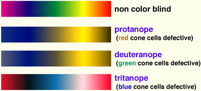
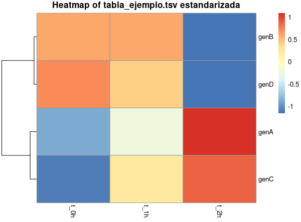

{ width="250", align="left" }

# **TP 12b**. Data Mining { markdown data-toc-label = 'TP 12b' }

<br>
<br>
<br>
 
[:fontawesome-solid-download: Materiales](https://drive.google.com/file/d/1rJFe_Q5_oKo5OOoo2HXIsVMqtKlGNheV/view?usp=sharing){ .md-button .md-button--primary }

<!--
Este es el botón para descargar materiales, en (#) hay que agregar el link correspondiente
-->

### Slides mostrados en la clase

* :fontawesome-regular-file-pdf: [Cierre TP](https://drive.google.com/file/d/1jFMlmnG0Aik4L17XbKI2EmzGYo1CH7mJ/view?usp=sharing)

### Videos de la clase grabada

* :octicons-video-16: [Introducción al TP](https://www.youtube.com/watch?v=ID6R3fBj3vo)
* :octicons-video-16: [Cierre TP](https://www.youtube.com/watch?v=iqwjW6oZKO8)

### Software a usar
* R (ya instalado en la VM).
* RStudio (ya instalado en la VM)

### Recursos Online
* [Curso online de R de Coursera](https://www.coursera.org/learn/r-programming) (se puede hacer gratis) (en ese caso no da certificado)
* Data Tables: [Introducción oficial](https://cran.r-project.org/web/packages/data.table/vignettes/datatable-intro.html) y [otra página con más info](https://bookdown.org/paradinas_iosu/CursoR/data-table.html)
* ggplot2: [Vistazo rápido](https://bookdown.org/paradinas_iosu/CursoR/ggplot2.html), [detalles sobre los tipos de plots](http://sthda.com/english/wiki/ggplot2-essentials), [cheatsheet](https://raw.githubusercontent.com/rstudio/cheatsheets/main/data-visualization.pdf) e [información sobre colores y daltonismo](https://jfly.uni-koeln.de/color/)
* dendextend: [Detalle del paquete](https://cran.r-project.org/web/packages/dendextend/vignettes/dendextend.html)

### Objetivos

* Usar métodos de clustering junto con herramientas de programación para resolver problemas biológicos.
* Familiarizarse en el paquete `ggplot2` para hacer plots en **R**.
* Introducir paquetes de **R** que permiten plotear dendrogramas y *heatmaps*.

## **Introducción al Tema**

Este TP retoma lo empezado en el **TP 12a**, donde aprendimos métodos de clustering como *clustering jerárquico* o *K-means* y los aplicamos a un ejemplo mínimo de una tabla con solo 4 filas.

Vamos ahora a utilizar los mismos métodos para trabajar con data sets más grandes y tratar de ir entendiendo cuándo, cómo y por qué es conveniente agrupar nuestros datos.

A su vez vamos a desarrollar algunos temas de **R** que son muy útiles, pero para los cuales no nos alcanzó el tiempo en los TPs anteriores: plotear usando `ggplot2` y utilizar funciones creadas por nosotros.

Para hacer esto vamos a utilizar 2 data sets. En el **Ejercicio 1** vamos a trabajar con el ya conocido data set **iris** que tiene 150 filas y viene por defecto con **R**. En el **Ejercicio 2** vamos a trabajar con datos de un estudio de transcriptómica que nos devolvió 9 datos para cada uno de 11.106 genes estudiados. Este trabajo es un segundo paso de lo realizado en el **TP 8b** cuando buscábamos inhibidores para la **Enzima Z**.

## **Mejores plots: ggplot2**

### Bases de ggplot2

En el **TP 8a** mencionamos rápidamente al paquete `ggplot2`, el cual es uno de las formas más populares de hacer plots en **R**. Este paquete es bastante complicado y tiene un sinfín de funcionalidades, pero hoy vamos a darle un vistazo a su funcionalidad básica (el [cheatsheet](https://raw.githubusercontent.com/rstudio/cheatsheets/main/data-visualization.pdf) es una forma rápida de ver todas las posibilidades que tiene).

Un ejemplo muy simple de hacer un plot con la función `ggplot` sería:

```R
library(ggplot2)

#Recuerden que *iris* es un *Data Frame* para hacer pruebas que esta siempre cargado en la memoria de R
p <- ggplot(data = iris, aes(x = Petal.Length, y = Sepal.Length)) +
    geom_point()

print(p)
```

* **p** es una variable en la que estoy guardando el plot. Cuando la imprimo (usando `print`) el plot va a aparecer en la pestaña **Plots** en **RStudio** (en el panel de abajo a la derecha).
* `data = iris` le está indicando a la función `ggplot` de que tabla va a sacar la información a plotear. En `ggplot` se pueden usar *Data Frames* o *Data Tables* indistintamente.
* `aes()` es una función que se encuentra dentro de la función principal de `ggplot`. Se va a encargar de relacionar las diferentes columnas de la tabla con las diferentes variables del plot.
* `x = Petal.Length` está indicando que la variable X en el plot va a ser los datos de la columna **Petal.Length**.
* `y = Sepal.Length` está indicando que la variable Y en el plot va a ser los datos de la columna **Sepal.Length**.
* `geom_point()` está indicando el tipo de plot a realizar. Si leen el [cheatsheet](https://raw.githubusercontent.com/rstudio/cheatsheets/main/data-visualization.pdf) van a ver que en este caso estamos haciendo un scatter plot.
* Ambas funciones del plot están separadas por el símbolo `+`, lo que les puede resultar un poco extraño (porque lo es), pero así es como funciona `ggplot`.

**1)** Corran el código anterior y vean el plot resultante.

### Cambiar la estética del plot según variables { markdown data-toc-label='Estética variable' }

La función `aes()` recibe su nombre de la palabra en inglés *aesthetics*, o estética. No es de extrañar entonces que dentro de dicha función es donde podemos poner otras variables que determinen los colores, formas o tamaños de cada punto del plot (entre otras características).

**2)** Corran el siguiente código y vean el plot resultante:

```R
p <- ggplot(data = iris, aes(x = Petal.Length, y = Sepal.Length, color = Species)) +
    geom_point()

print(p)
```

En este código, `color = Species` le está diciendo a `ggplot` que modifique el color de los puntos dependiendo del valor de la columna **Species**. Si recuerdan a **iris**, esta columna era una columna categórica (o *factor*) con 3 valores que podemos ver en el plot. Como le pasamos a `color` una variable categórica, nos devolvió una escala de colores categórica.

**3)** Corran el código anterior, pero ahora reemplacen a **Species** por **Petal.Width**, ¿qué cambios observan?

**4)** Es posible también modificar varias de estas características a la vez. Corran el siguiente código y vean el plot resultante:

```R
p <- ggplot(data = iris, aes(x = Petal.Length, y = Sepal.Length, color = Species, shape = Species, size = Petal.Width)) +
    geom_point()

print(p)
```

En este caso agregamos 2 características nuevas, `shape` (la forma de los puntos) y `size` (el tamaño de los puntos) y le asignamos cada uno de ellos a una variable de la tabla. Noten que no hay problema con que una columna modifique más de una característica a la vez.

**5)** Tal vez ya lo notaron, pero por el momento no tenemos ningún control sobre que colores o formas le asigna `ggplot` a mis tres categorías. Vamos a mostrarles como hacerlo para este caso específico, pero sepan que las funciones a usar son ligeramente diferentes dependiendo si la variable pasada es discreta o continua. 

Corran el siguiente código y vean el plot resultante:

```R hl_lines="5 6"
#Los colores se pueden escribir en ingles o en hexadecimal
#"#FF0000" es el color rojo (se podría haber puesto "red")
p <- ggplot(data = iris, aes(x = Sepal.Length, y = Petal.Length, color = Species, shape = Species)) +
    geom_point() +
    scale_colour_manual(values = c("#FF0000", "blue", "green")) +
    scale_shape_manual(values =  c(2, 4, 1))

print(p)
```

* `scale_colour_manual()`: me permite modificar a mano una escala discreta de colores. El parámetro `values` modifica los colores en sí.
* `scale_shape_manual()`: me permite modificar a mano una escala discreta de formas. El parámetro `values` modifica las formas, las cuales corresponden a un número entero (en el tip a continuación se muestran las más comunes).

Un detalle importante a destacar es que el orden en que se asignó cada color a cada categoría depende del orden en el que aparecen los *Levels* de la columna **Species**, la cual es un *factor* (pueden imprimir `iris$Species` para ver a lo que nos referimos). 

??? tip "Tip - Posibles valores para `shape`"

    <figure markdown>
    { max-width="500" }
    </figure>

    El color interior las formas 21 a 25 depende de la variable `fill` que no mencionamos todavía, pero se usa igual que el resto.

??? tip "Tip - Colores y daltonismo"

    El daltonismo ocurre cuando hay un problema con los pigmentos en ciertas células nerviosas del ojo que perciben el color. Estas células se llaman conos y los hay de tres tipos, los cuales son responsables de ver principalmente al rojo, al verde y al azul respectivamente. 

    <figure markdown>
        
    </figure>

    La frecuencia del daltonismo es bastante alta, con un 8% de los hombres caucásicos, 5% de los asiáticos y 4% de los africanos presentando problemas para distinguir el color rojo del verde. Como la mayoría de los casos de daltonismo provienen de una mutación de un gen recesivo ligado al cromosoma X, muy pocas mujeres son daltónicas.

    Debido al considerable número de personas con daltonismo, es buena ídea tener en cuenta esto al momento de elegir colores para cualquier figura que vaya a ser vistas por el público general. Se pueden encontrar decenas de herramientas online que nos ayudan a crear esto, así como paquetes de **R** o paletas de colores. Un ejemplo de una paleta de colores sería:

    <figure markdown>
        
    </figure>

    Pueden leer más información sobre este tema [aca](https://jfly.uni-koeln.de/color/).

??? tip "Tip - Asignar colores específicos a cada característica sin depender del orden de los *Levels*"
    
    Si bien el código anterior funciona perfecto, depender del orden de los *Levels* de un *factor* al momento de matchear color con un valor dado puede ser peligroso. Una forma de estar seguros que le estamos asignando el color correcto a cada valor es usando vectores con nombres (o *named vectors*). Algo mencionamos de estos vectores en el pasado, pero básicamente son vectores donde cada posición tiene un nombre (además del índice). En este caso sería:

    ```R
    categorias <- c("setosa", "versicolor", "virginica")
    colores <- c("#FF0000", "blue", "green")
    names(colores) <- categorias

    #Puedo acceder a "blue" haciendo `colores[2]` o `colores["versicolor"]`
    ```

    De hacer `scale_colour_manual(values = colores)` en la función `ggplot` nos aseguraríamos que el primer elemento de `categorias` va a tener el primer color de `colores` y así.

**6)** Por último, ¿qué pasa si no queremos cambiar la estética del plot dependiendo del valor de una variable, sino que simplemente queremos cambiarla y que afecte a todos los puntos por igual? En estos casos hay que modificar dicha característica dentro de la función específica del plot.

Corran el siguiente código y vean el plot resultante:

```R
p <- ggplot(data = iris, aes(x = Sepal.Length, y = Petal.Length, color = Species)) +
    geom_point(size = 2, shape = 4) +
    scale_colour_manual(values = c("#FF0000", "blue", "green"))

print(p)
```

### Nombres y estilo de los ejes y el plot { markdown data-toc-label='Nombres de los ejes' }

**7)** Ahora que ya modificamos bastante el estilo de los datos, vamos a modificar el resto del plot. Lo primero que vamos a hacer es cambiar el nombre del eje X, el eje Y y el título del plot.

Corran el siguiente código y vean el plot resultante:

```R hl_lines="3-5"
p <- ggplot(data = iris, aes(x = Sepal.Length, y = Petal.Length, color = Species, shape = Species)) +
    geom_point(size = 2) +
    xlab("Sepal Length") +
    ylab("Petal Length") +
    ggtitle("Sepal Length vs Petal Length per Species") +
    scale_colour_manual(values = c("#FF0000", "blue", "green")) +
    scale_shape_manual(values =  c(2, 4, 1))

print(p)
```

* `xlab()`: indica el nombre del eje X
* `ylab()`: indica el nombre del eje Y
* `ggtitle()`: indica el título del plot

**8)** Si bien obtuvimos lo deseado, puede ser que queramos cambiar el tamaño de los ejes o centrar el título. Esto lo hacemos con la función `theme()`:

Corran el siguiente código y vean el plot resultante:

```R hl_lines="6-8"
p <- ggplot(data = iris, aes(x = Sepal.Length, y = Petal.Length, color = Species, shape = Species)) +
    geom_point(size = 2) +
    xlab("Sepal Length") +
    ylab("Petal Length") +
    ggtitle("Sepal Length vs Petal Length per Species") +
    theme(plot.title = element_text(size = 16, hjust = 0.5),
          axis.title = element_text(size = 14),
          axis.text = element_text(size = 12)) +
    scale_colour_manual(values = c("#FF0000", "blue", "green")) +
    scale_shape_manual(values =  c(2, 4, 1))

print(p)
```

* `theme()`: es la función que contiene el estilo del texto de los ejes y del título de un plot.
* `plot.title = element_text(size = 16, hjust = 0.5)`: estamos modificando el titulo del plot, donde `size` modifica el tamaño de letra y `hjust = 0.5` lo centra horizontalmente.
* `axis.title = element_text(size = 14)`: estamos modificando los títulos de los ejes (es decir, los nombre de los ejes).
* `axis.text = element_text(size = 12)`: estamos modificando el tamaño de los números de los ejes.

Noten que dentro de `theme()` cada línea se separa con comas, y recién una vez que termina volvemos a usar el símbolo `+`.

### Fondo del plot

**9)** Lo último que nos queda por modificar es el "fondo" del plot, es decir, el color de fondo, las líneas que corresponden a las divisiones de los ejes y el recuadro general del plot. Si bien esto se puede hacer a mano, **ggplot** viene con algunas opciones ya armadas.

Corran el siguiente código y vean el plot resultante:

```R hl_lines="6"
p <- ggplot(data = iris, aes(x = Sepal.Length, y = Petal.Length, color = Species, shape = Species)) +
    geom_point(size = 2) +    
    xlab("Sepal Length") +
    ylab("Petal Length") +
    ggtitle("Sepal Length vs Petal Length per Species") +
    theme_bw() +
    theme(plot.title = element_text(size = 16, hjust = 0.5),
          axis.title = element_text(size = 14),
          axis.text = element_text(size = 12)) +
    scale_colour_manual(values = c("#FF0000", "blue", "green")) +
    scale_shape_manual(values =  c(2, 4, 1))
print(p)
```

* `theme_bw()` es una función que setea varias opciones de `theme()` a un estilo específico (en este caso un estilo simple en blanco y negro). La tenemos que usar antes de `theme()` para asegurarnos que cualquier cambio que hagamos a mano en `theme()` sobrescriba los de `theme_bw()`.

<!--
**10)** Reemplacen a `theme_bw()` por `theme_` y vean la lista de temas que aparecen en el autocompletar de RStudio (si no aparece pueden apretar ++ctrl++ + ++space++). Prueben correr el código anterior con 2 temas que no sean `theme_bw()` y vean como se ve el plot en cada caso.
-->

### Otros tipos de plots

Si bien la mayoría de lo que les mencionamos hasta ahora es aplicable al uso general de **ggplot**, hasta el momento nos enfocamos en un solo tipo de plot, el scatter plot, hecho mediante `geom_point()`.

Debido a que esto es suficiente para lo que necesitamos hacer hoy (y que este TP es de *Data Mining*) no vamos a hablar hoy de otros tipos de plots, pero si les interesa pueden verlo con mucho detalle en [esta página](http://sthda.com/english/wiki/ggplot2-essentials) o ver un vistazo rápido en la [cheatsheet](https://raw.githubusercontent.com/rstudio/cheatsheets/main/data-visualization.pdf).

## **Ejercicio 1 - Agrupando flores por especies** { markdown data-toc-label='Ejercicio 1' }

### Introducción al data set

En este ejercicio vamos a trabajar una vez más con el data set **iris**, el cual es un set de datos que viene por defecto con **R** y está siempre cargado en memoria.

Este data set contiene las medidas de ancho (*width*) y largo (*length*) de los sépalos y los pétalos para 3 especies de flores diferentes: setosa, versicolor, y virginica (todas del Genus *Iris*). Tiene mediciones de 150 flores, 50 por especie.

??? info "Sépalo vs pétalo"

    <figure markdown>
    { max-width="400" }
    </figure>

Antes que nada vamos a familiarizarnos un poco con este data set.

**1)** Corran el siguiente código y vean el plot resultante:

```R
library(data.table)
library(ggplot2)

#Transformo a iris en un *Data Table* (que aca realmente no hace falta, pero para despues)
dt_iris <- as.data.table(iris)

#Hago un plot comparando el largo de los sepalos y los petalos
#Estoy cambiando la forma y el color segun la especie
p <- ggplot(data = dt_iris, aes(x = Sepal.Length, y = Petal.Length, color = Species)) +
    geom_point(size = 2) +
    theme_bw() +
    xlab("Sepal Length") +
    ylab("Petal Length") +
    ggtitle("Sepal Length vs Petal Length per Species") +
    theme(plot.title = element_text(size = 16, hjust = 0.5),
          axis.title = element_text(size = 14),
          axis.text = element_text(size = 12)) +
    scale_colour_manual(values = c("#004D40","#D81B60","#FFC107"))

print(p)
```

Podemos ver que con solo plotear el largo de los pétalos y los sépalos ya estamos viendo diferencias entre las especies. Es teóricamente posible agregar una tercera dimensión para plotear otra de las variables, e incluso agregar la cuarta variable como "tamaño" de los diferentes puntos, pero dichos plots van a resultar considerablemente mas complejos al momento de leerlos.

### Problema a resolver

En este ejercicio vamos a suponer que alguien apretó el botón equivocado y borró la columna **Species** de dicha tabla. Como nos acordamos de que eran tres especies y que tenían diferencias en sus largos y anchos de pétalos y sépalos, queremos entonces usar métodos de clustering para tratar de recuperar lo mejor que podamos los tres grupos de flores.

Dicho esto vamos a hacer un poco de trampa y vamos a comparar visualmente lo que vamos obteniendo por los métodos de clustering con lo que nosotros sabemos es verdad.

Por último, cómo vamos a tener que hacer varios plots similares, vamos a aprovechar la oportunidad y vamos a usar por primera vez funciones de **R** creadas por nosotros.

### Guardar el plot en un PDF

Vamos a crear una función que guarde diferentes plots como PDFs.

**2)** Copien el siguiente código y modifiquen las secciones que dicen `@@EDITAR@@`. Para esto vean el punto **1)** y asígnenle a cada parámetro de la función el valor que tenía en dicho punto, por ejemplo `x_colname = "Sepal.Length"` (el nombre de las columnas vá entre comillas porque estamos usando `aes_string()` y no `aes()`). Una vez hecho esto, corran la función para replicar el plot hecho en el punto **1)** y guardarlo en un archivo llamado **01_Sepal_vs_Petal_Length_per_Species.pdf**.

=== "Código"

    ```R
    library(data.table)
    library(ggplot2)

    #### FUNCIONES AUXILIARES ####
    plotData2PDF_wColor <- function(data_par,
                                    x_colname, y_colname, color_colname,
                                    x_label, y_label, plot_title,
                                    pdf_file) {
        p <- ggplot(data = data_par, aes_string(x = x_colname, y = y_colname, color = color_colname)) +
            geom_point(size = 2) +
            theme_bw() +
            xlab(x_label) +
            ylab(y_label) +
            ggtitle(plot_title) +
            theme(plot.title = element_text(size = 16, hjust = 0.5),
                  axis.title = element_text(size = 14),
                  axis.text = element_text(size = 12)) +
            scale_colour_manual(values = c("#004D40","#D81B60","#FFC107"))
        
        pdf(file = pdf_file, width = 8, height = 7)
        print(p)
        dev.off()
    }

    #### CODIGO PRINCIPAL ####
    dt_iris <- as.data.table(iris)

    plotData2PDF_wColor(data_par = dt_iris,
                        x_colname = "@@EDITAR@@", 
                        y_colname = "@@EDITAR@@", 
                        color_colname = "@@EDITAR@@",
                        x_label = "@@EDITAR@@", 
                        y_label = "@@EDITAR@@", 
                        plot_title = "@@EDITAR@@",                        
                        pdf_file = "01_Sepal_vs_Petal_Length_per_Species.pdf")    
    ```

=== "Código con comentarios"

    ```R
    library(data.table)
    library(ggplot2)

    #Estoy usando comentarios rodeados de cuatro numerales para delimitar secciones de mi código 
    #Esto no es puramente estético, sino que también es aprovechado por *RStudio* para crear una de barra de 
    #navegación del código (es la barra horizontal entre el script y la consola)
    #### FUNCIONES AUXILIARES ####
    plotData2PDF_wColor <- function(data_par,
                                    x_colname, y_colname, color_colname,
                                    x_label, y_label, plot_title,
                                    pdf_file) {
        #La función *aes_string()* es similar a *aes()*, solo que en este caso los nombres de las columnas 
        #tienen que ser *strings* (recuerden que con *aes()* se escriben sin comillas)
        #Esto es ideal para cuando el nombre de la columna utilizar esta guardado en una variable
        p <- ggplot(data = data_par, aes_string(x = x_colname, y = y_colname, color = color_colname)) +
            geom_point(size = 2) +
            theme_bw() +
            xlab(x_label) +
            ylab(y_label) +
            ggtitle(plot_title) +
            theme(plot.title = element_text(size = 16, hjust = 0.5),
                  axis.title = element_text(size = 14),
                  axis.text = element_text(size = 12)) +
            scale_colour_manual(values = c("#004D40","#D81B60","#FFC107"))
        
        #*pdf()* "abre" un archivo pdf. Todo lo que se imprima hasta cerrarlo va a ir a él, 
        #en vez de a la pestaña *Plots* de *RStudio*
        #8 y 7 indican el ancho y el alto del pdf en pulgadas
        pdf(file = pdf_file, width = 8, height = 7)
        print(p)
        #La función *dev.off()* cierra el plot abierto, en este caso el pdf.
        dev.off()
    }

    #### CODIGO PRINCIPAL ####
    dt_iris <- as.data.table(iris)

    plotData2PDF_wColor(data_par = dt_iris,
                        x_colname = "@@EDITAR@@", 
                        y_colname = "@@EDITAR@@", 
                        color_colname = "@@EDITAR@@",
                        x_label = "@@EDITAR@@", 
                        y_label = "@@EDITAR@@", 
                        plot_title = "@@EDITAR@@",      
                        pdf_file = "01_Sepal_vs_Petal_Length_per_Species.pdf") 
    ```

**3)** Usando la función que acabamos de crear, vean como se distribuyen los puntos al comparar **Sepal.Width** contra **Petal.Width**. Guarden este plot en un archivo llamado **02_Sepal_vs_Petal_Width_per_Species.pdf**.

### Clustering jerárquico

Lo primero que vamos a hacer entonces es usar un clustering jerárquico para agrupar a las 150 filas en 3 grupos según los valores de las 4 medidas. Un problema que tenemos es que por ahora no hay ninguna forma de identificar a una fila específica, así que le vamos a agregar un ID numérico a cada fila. Debido al orden que tienen las filas de **dt_iris**, los primeros 50 IDs van a corresponder a flores de la especie setosa, los segundos 50 a versicolor y los últimos a virginica (aunque supuestamente esto no lo sabemos).

**4)** Corran el siguiente código para crear la matriz de datos que vamos a usar al momento de clusterizar. Lean los comentarios en la segunda pestaña para entender que estamos haciendo.

=== "Código"

    ```R
    dt_iris$row_id <- c(1:dt_iris[, .N])

    setcolorder(dt_iris, c("row_id"))

    matriz_datos <- as.matrix(dt_iris[, -c("Species")], rownames = 1)
    ```

=== "Código con comentarios"

    ```R
    #Agregamos una nueva columna denominada row_id que tiene un numero entre 1 y 150
    #dt_iris[, .N] es una función de *Data Tables* que me devuelve el numero de filas en la tabla
    #El numero de filas tambien se puede conseguir haciendo nrow(dt_iris)
    dt_iris$row_id <- c(1:dt_iris[, .N])

    #Aca estamos cambiando el orden de las columnas a *dt_iris*.
    #No hace falta asignar esto a *dt_iris* ya que *setcolorder* modifica la variable misma 
    #Como solo le estamos pasando 1 columna, lo que estamos haciendo es mover esa columna al principio
    #(al usar así *setcolorder* las otras se quedan donde estan)
    setcolorder(dt_iris, c("row_id"))

    #Similar a lo que hicimos en el TP anterior, estamos transformando nuestros datos a una matriz
    #donde la primer columna (en este caso *row_id*) va a transformarse en los nombres de las filas
    #Estamos sacando a la columna *Species* ya que queremos simular que no tenemos esta informacion
    #(la columna *Species* va a estar todavia en *dt_iris*, pero no en *matriz_datos*)
    matriz_datos <- as.matrix(dt_iris[, -c("Species")], rownames = 1)
    ```

**5)** Usando lo aprendido en el TP anterior y la matriz de datos recién creada:

**5.1)** Usen la función `dist()` para crear una matriz de distancias euclidianas que muestre también la diagonal.

**5.2)** usen la función `hclust()` para crear un clustering jerárquico basado en su matriz de distancias usando el criterio de agregación *complete linkage*. 

**5.3)** Usen la función `plot()` para plotear el clustering jerárquico.

**5.4)** Mirando el plot recién creado, ¿les es fácil distinguir a simple vista los tres grupos de especies en el clustering jerárquico? (recuerden que pueden usar el botón **Zoom** para agrandar el plot).

#### Mejorar el plot del clustering jerárquico { markdown data-toc-label='Mejorar el plot' }

**6)** Una cosa que vendría bien al momento de leer el plot recién creado sería colorear cada flor dependiendo de su especie. Si bien esto no es posible en este caso usando solo la función `plot()`, hay paquetes de **R** que nos van a permitir hacer esto:

**6.1)** Usen la función `install.packages()` e instalen la librería **dendextend** (recuerden que al usar `install.packages()` el nombre del paquete va entre comillas). Luego corran el siguiente código:

=== "Código"

    ```R
    library(dendextend)

    #Estoy asumiendo que guardaron la salida de *hclust()* en una variable llamada clustering_jerarquico
    #De no ser asi, cambien el nombre de la variable a continuacion por lo que corresponda
    dend <- as.dendrogram(clustering_jerarquico)

    colores_especies <- c("#004D40","#D81B60","#FFC107")
    colors_aux <- rep(colores_especies, each = 50)
    labels_colors(dend) <- colors_aux[order.dendrogram(dend)]

    dend <- dend %>% set("labels_cex", 0.6)

    pdf_file <- "11_Clustering_jerarquico_complete_linkage.pdf"
    pdf(file = pdf_file, width = 18, height = 6)

    plot(x = dend, main = "Clustering Jerárquico - Complete Linkage - Color per Species")

    dev.off()
    ```

=== "Código con comentarios"

    ```R
    library(dendextend)

    #Estoy asumiendo que guardaron la salida de *hclust()* en una variable llamada clustering_jerarquico
    #De no ser asi, cambien el nombre de la variable a continuacion por lo que corresponda
    #Aca estoy transformando la variable *clustering_jerarquico* que es de tipo *hclust* a un *dendrogram*, 
    #que es una variable usada por el paquete *dendextend*
    dend <- as.dendrogram(clustering_jerarquico)

    #La funcion *labels_colors()* me permite asignar a mano los colores para los 150 labels del dendrograma
    #Ahora bien, yo se que originalmente en la tabla las primera 50 filas corresponden al color 1 y asi
    #Lo que estoy haciendo aca es armar una lista de 150 colores ordenada como esta en la tabla original y luego
    #reordenarlas para que coincidan con el orden de los IDs en el dendrograma
    colores_especies <- c("#004D40","#D81B60","#FFC107")
    colors_aux <- rep(colores_especies, each = 50)
    labels_colors(dend) <- colors_aux[order.dendrogram(dend)]

    #Esto simplemente es para achicar un poco el texto de los labels para que no choquen entre si
    #El simbolo %>% cumple una funcion similar al + en ggplot
    dend <- dend %>% set("labels_cex", 0.6)

    #Creo el pdf de salida y guardo el clustering jerárquico
    pdf_file <- "11_Clustering_jerarquico_complete_linkage.pdf"
    pdf(file = pdf_file, width = 18, height = 6)

    plot(x = dend, main = "Clustering Jerárquico - Complete Linkage - Color per Species")

    dev.off()
    ```

**6.2)** Abran el archivo **11_Clustering_jerarquico_complete_linkage.pdf**. ¿Pueden ahora distinguir los tres grupos de especies en el clustering jerárquico? ¿Cuáles especies les parecen mejor agrupadas? (los colores de las especies corresponden al color usado en el plot creado en los puntos **1)** y **2)**)

#### Single Linkage

**7)** Hasta el momento sólo utilizamos *complete linkage* al momento de hacer nuestros clustering jerárquicos, pero sería interesante ver como es el dendrograma resultante de hacer el clustering usando otro criterio de agregación, por ejemplo el *single linkage*. Para esto:

**7.1)** Vuelvan a correr la función `hclust()` como en **5.2)**, pero ahora usen `method = "single"` y guarden el clustering resultante en una nueva variable. Luego usen el código de **6.1)** editando lo que sea necesario para crear un archivo que contenga al dendrograma hecho a partir del clustering jerárquico que usa *single linkage* como criterio de agregación. Nombren a este archivo **12_Clustering_jerarquico_single_linkage.pdf**.

**7.2)** ¿Qué diferencias ven entre este dendrograma y el creado en **6.2)**? ¿Pueden relacionar estas diferencias con lo que saben de *single linkage* y *complete linkage*?

**7.3)** Ignorando los colores, ¿cuál les parece el mejor criterio de agregación para este caso donde queremos recuperar tres clusters?

#### Hacer clusters y plots

Por último vamos a querer recrear el plot generado en los puntos **1)** y **2)**, pero ahora mostrando información tanto de las especies originales (con el color) como de la agrupación resultante del clustering jerárquico (con la forma). Vamos a utilizar los datos del clustering jerárquico que usa el criterio de agregación *complete linkage*.

**8)** Lo primero es entonces agregar la información del clustering jerárquico a nuestro **dt_iris**; para ello:

**8.1)** Usen la `cutree` para dividir a los datos obtenidos en **5.2)** en 3 clusters.

**8.2)** Asignen esa información a una nueva columna en la tabla **dt_iris** llamada **CJ_cluster** (como en este caso `cutree()` devuelve los datos en el mismo orden que están en la tabla se puede hacer directamente con `<-`, no hace falta usar `merge()`).

**8.3)** Por el momento la variable es numérica, pero para nosotros los números 1, 2 y 3 son categorías que teóricamente corresponden a las especies (aunque no sabemos qué categoría corresponde a que especie). Corran el siguiente código para convertir la columna recién creada en un *factor*:

```R
#En este caso poner los levels a mano no es 100% necesario, pero no viene mal
#Recuerden que no sabemos que numero corresponde a que especie
#(porque ademas ya vimos que no hay un match perfecto 1 a 1)
dt_iris$CJ_cluster <- factor(dt_iris$CJ_cluster, levels = c(1, 2, 3))
```

**9)** Ahora queremos hacer un plot similar al creado en el punto **2)**, pero donde la columna **Species** determine el color y la columna **CJ_cluster** determine la forma de los diferentes puntos del plot; para ello:

**9.1)** Copien la función `plotData2PDF_wColor()` y cámbienle en nombre a `plotData2PDF_wColorAndShape()`. Modifiquen esta nueva función considerando lo siguiente:

* Agreguen un parámetro a la función el cual va a recibir el nombre de la columna que determina la forma, o *shape*, de los puntos.
* Modifiquen la función `aes_string()`, agregando la característica `shape` y asignándole el valor del parámetro agregado.
* Agreguen la función `scale_shape_manual()` a `ggplot` para definir a mano las tres formas. Usen los valores `c(2, 4, 1)`.

**9.2)** Usando la función que acabamos de crear, vean como se distribuyen los puntos al comparar **Sepal.Length** contra **Petal.Length** usando la columna **Species** para determinar el color y la columna **CJ_cluster** para determinar la forma de los diferentes puntos. Guarden este plot en un archivo llamado **21_Sepal_vs_Petal_Length_per_Species_CJ3.pdf**.

**9.3)** Abran el archivo recién creado. ¿Cuáles especies les parecen mejor agrupadas? Entre este plot y el dendrograma creado en **11_Clustering_jerarquico_complete_linkage.pdf** ¿Cuál les parece la mejor manera de representar este clustering? ¿Por qué?

!!! danger "Importante - Clustering vs Plot"

    Tengan en cuenta que al momento de clusterizar estamos usando los datos de las cuatro columnas de la tabla. Sin embargo, en este último plot estamos viendo solo la relación entre dos. Por esta razón, este plot no es realmente representativo del clustering que estamos haciendo.

    Dicho todo esto, este plot es útil ya que es mucho más fácil de leer que otros plots más complejos, pero debe tomarse como un análisis exploratorio.

### Kmeans

**10)** Lo último que vamos a hacer con este data set es volver a crear los clusters pero usando ahora la función `kmeans()`.

**10.1)** Usando lo aprendido en el TP anterior:

* Usen la función `kmeans()` para crear un nuevo clustering. Usen la cantidad de `centers` que consideren necesarios.
* Extraigan los clusters del clustering recién creado y asígnenlos a una nueva columna en **dt_iris** llamada **K3_cluster** (como en este caso `kmeans()` devuelve los datos en el mismo orden que están en la tabla se puede hacer directamente con `<-`, no hace falta usar `merge()`).
* Transformen dicha columna en un *factor*.
* Usando la función creada en el punto **9)**, vean como se distribuyen los puntos al comparar **Sepal.Length** contra **Petal.Length** usando la columna **Species** para determinar el color y la columna **K3_cluster** para determinar la forma de los diferentes puntos. Guarden este plot en un archivo llamado **22_Sepal_vs_Petal_Length_per_Species_K3.pdf**.

**10.2)** Abran el archivo recién creado. Basándose solo en lo que pueden observar en este plot, ¿pueden decir algo de si este agrupamiento es mejor, peor o similar al obtenido con el clustering jerárquico? (recuerden que "no" también es una respuesta válida)

**10.3)** Supongamos ahora que estamos en un escenario real, por lo que no tenemos información de a que especie corresponde cada punto. En base a lo visto en el TP anterior, ¿se les ocurre alguna forma de evaluar objetivamente cuál de ambos es el mejor clustering?

!!! tip "Tip - Predeterminar el azar"

    La función `kmeans()` genera la primera posición de sus centros al azar. Esto hace que si la corren varias veces o en diferentes computadoras va a dar diferentes resultados cada vez. Esto se puede controlar con una función de **R** que asigna a mano el valor de la *seed*, que es el número base que usa **R** al momento de generar azar. Si les interesa hacer esto tienen que ejecutar la siguiente línea antes de usar la función `kmeans()`:

    ```R
    set.seed(1)
    ```

    P.D.: El azar en las computadoras no existe realmente. Muchos programas usan lista pre-generadas de "números creados al azar" y otras usan cosas como "el quinto decimal de la temperatura del procesador en este momento", lo que se aproxima suficientemente al azar para funcionar bien.

## **Ejercicio 2 - Analizando el efecto de dos inhibidores** { markdown data-toc-label='Ejercicio 2' }

En el **TP 8b** hicimos un ejercicio donde usábamos el equipo **FilterMax F5** para analizar 22 inhibidores de una llamada **Enzima Z**, la cual resulta que era la cruzipaína, es decir, la cisteín proteasa principal de *Trypanosoma cruzi*, el parásito causante de la enfermedad de Chagas.

En esta segunda fase del experimento se eligieron 2 inhibidores y se realizó un análisis más detallado, estudiando como varía la expresión de miles de genes en presencia o ausencia de dichos inhibidores. Para esto se hizo un estudio de transcriptómica (RNA-seq) donde se extrajo el ARN y se lo analizó con **Illumina**. Luego, cada *read* encontrado se mapeó contra el genoma de referencia y se llegó a una tabla de conteo para cada uno de las transcriptos del genoma.

Para cada caso (*control*, *droga 1* y *droga 2*) se realizaron 3 réplicas técnicas para obtener resultados más robustos.

Nuestro objetivo va a ser entonces obtener una lista de los genes que son más afectados por cada droga.

### Leer los datos

**1)** Lean los archivos **control_data.tsv**, **drug1_data.tsv** y **drug2_data.tsv** que se encuentran en sus materiales de trabajo y guárdenlos en diferentes variables llamadas **control_data**, **drug1_data** y **drug2_data** respectivamente.

### Estandarizar los datos

El conteo de *reads* no se puede comparar entre genes puesto que la expresión basal de cada uno es distinto, por lo cual encontrar 10 *reads* de un gen puede ser mucho, y encontrar 1000 de otro puede ser poco. Además cada ensayo de secuenciación puede tener distinta profundidad con lo que tampoco sería viable comparar 10 *reads* de un ensayo donde en total se mapearon $2\text{x}10^8$ *reads* con los mismos 10 de otro ensayo donde se mapearon $1\text{x}10^8$ (es decir, la mitad).

Por esta razón vamos a querer modificar las nueve columnas y transformar el valor a "conteo por millón", cuya fórmula es:

$$
\text{RPM or CPM} = \frac{ReadsDelGen * 10^6}{ReadsTotales}
$$

### Combinar las réplicas

Otra cosa que vamos a querer hacer es combinar las tres réplicas para cada caso. Esto lo vamos a hacer simplemente promediando los 3 valores de CPM para cada gen en cada tratamiento.

**2)** En base a los TPs anteriores ya tienen los conocimientos para hacer el estandarizado de datos y la combinación de réplicas usando *fors*, pero para hacerla un poco más fácil les vamos a dar un par de funciones que les van a simplificar bastante este paso (y ya que estamos les mostramos la función `apply()` en acción):

=== "Código"

    ```R
    calcularConteoPorMillon <- function(vector_cuentas) {
        #Dado un vector de *reads*, esta funcion lo transforma en CPM y devuelve el vector

        vector_cuentas <- vector_cuentas * 1000000 / sum(vector_cuentas) 
        
        return(vector_cuentas)
    }

    parsearDatos <- function(dt_par, columnas_a_parsear, nombre_columna_nueva) {
        #Dado un *Data Table*, un vector de *strings* con los nombres de las columnas con *reads* a parsear y
        #un nombre de una columna a crear, esta funcion:
        # - Transforma los *reads* de las columnas a parsear en CPM
        # - Calcula el promedio de los CPM por cada fila y lo guarda en una columna nueva con el nombre dado
        # - Saca las columnas a parsear del *Data Table*
        # - Devuelve el *Data Table* con los cambios

        dt_aux <- dt_par[, columnas_a_parsear, with = F]
        
        matrix_aux <- apply(dt_aux, 2, calcularConteoPorMillon)
        
        dt_par[[nombre_columna_nueva]] <- apply(matrix_aux, 1, mean)
        dt_par[[nombre_columna_nueva]] <- round(dt_par[[nombre_columna_nueva]], 4)
        
        dt_par <- dt_par[, -columnas_a_parsear, with = F]
        
        return(dt_par)
    }
    ```

=== "Código con comentarios"

    ```R
    calcularConteoPorMillon <- function(vector_cuentas) {
        #Dado un vector de *reads*, esta funcion lo transforma en CPM y devuelve el vector

        #Aca estoy asumiendo que sum(vector_cuentas) nunca es 0 (lo que tiene un poco
        #de sentido ya que si es 0 entonces todas los counts son 0)
        vector_cuentas <- vector_cuentas * 1000000 / sum(vector_cuentas) 
        
        return(vector_cuentas)
    }

    parsearDatos <- function(dt_par, columnas_a_parsear, nombre_columna_nueva) {
        #Dado un *Data Table*, un vector de *strings* con los nombres de las columnas con *reads* a parsear y
        #un nombre de una columna a crear, esta funcion:
        # - Transforma los *reads* de las columnas a parsear en CPM
        # - Calcula el promedio de los CPM por cada fila y lo guarda en una columna nueva con el nombre dado
        # - Saca las columnas a parsear del *Data Table*
        # - Devuelve el *Data Table* con los cambios

        #Creo un nuevo *Data Table* que solo contenga las columnas a parsear (y no el ID del gen)
        dt_aux <- dt_par[, columnas_a_parsear, with = F]
        
        #La funcion *apply* con el parametro 2 va a ejecutar la funcion *calcularConteoPorMillon* para 
        #cada COLUMNA de dt_aux (las tres replicas, en este caso)
        matrix_aux <- apply(dt_aux, 2, calcularConteoPorMillon)
        
        #La funcion *apply* con el parametro 1 va a ejecutar la funcion *mean* para 
        #cada FILA de matrix_aux (cada uno de los genes estudiados)
        dt_par[[nombre_columna_nueva]] <- apply(matrix_aux, 1, mean)
        dt_par[[nombre_columna_nueva]] <- round(dt_par[[nombre_columna_nueva]], 4)
        
        #Saco las columnas que ya no me interesan de *dt_par*
        dt_par <- dt_par[, -columnas_a_parsear, with = F]
        
        return(dt_par)
    }
    ```

**2.1)** Corran las funciones anteriores para cargarlas en memoria, luego úsenlas para estandarizar y combinar las réplicas del control y las drogas 1 y 2. Un ejemplo de correr esta función para el caso de control sería:

```R
control_data <- parsearDatos(dt_par = control_data,
                             columnas_a_parsear = c("control1", "control2", "control3"),
                             nombre_columna_nueva = "control")
```

**2.2)** Ahora que ya tenemos los datos parseados, usen la función `merge()` dos veces para combinar los 3 *Data Tables* en uno solo llamado **full_data** (si todo salió bien debería tener 11.106 filas y 4 columnas).

### Calcular el Fold Change

**3)** Algo mencionamos antes, pero concluir que "hay 10 CPM más al agregarle la droga" no significa nada en el vacío. Si en el control era solo 1 CPM, entonces 10 más es mucho. Si en el control eran 10.000 CPM, 10 más es insignificante.

Vamos entonces a calcular el fold change, es decir, cuantas veces más (o menos) de CPM fueron observados al agregarle la droga frente a cuando estaba solo el control. Esto lo calculamos como:

$$
\text{Fold Change} = \frac{\text{CPM Droga}}{\text{CPM Control}}
$$

**3.1)** Antes de seguir leyendo ¿Se les ocurre algún caso donde la fórmula anterior nos de problemas?

??? tip "Respuesta"

    Básicamente hay 2 casos donde el cálculo del Fold Change va a dar problemas:

    * Cuando **CPM Control = 0**: La división no se puede hacer (y de hacerla en **R** va a dar infinito)
    * Cuando **CPM Control ~ 0**: En este caso la división se hace, pero el Fold Change va a dar un número muy grande (y probablemente varios órdenes de magnitud más grande que el resto de los Fold Change calculados). Este Fold Change no se debe a que **CPM Droga** es realmente mayor, sino a que **CPM Control** es muy chico, por lo que no es realmente informativo.

Estos dos problemas se pueden arreglar agregando un número *buffer*, es decir, un número pequeño que se adiciona al numerador y al denominador. En este caso vamos a usar 0,125 con lo que la fórmula quedaría:

$$
\text{Fold Change} = \frac{\text{CPM Droga} + 0.125}{\text{CPM Control} + 0.125}
$$

**3.2)** ¿Qué pasa ahora en los dos casos problemáticos que estamos tratando resolver? ¿Cómo afecta este *buffer* a los casos "normales"? (es decir, cuando tanto el numerador como el denominador son números mayores a 1)

**3.3)** Usando la fórmula con *buffer*, calculen el Fold Change para ambas drogas y guárdenlos en nuevas columnas de la tabla **full_data** (pónganles nombres que representen la información que contienen).

### Transformar el Fold Change

Ahora bien, vamos a analizar como se distribuyen los valores del Fold Change para todas las proteínas (primera pestaña del plot que está abajo). Podemos ver que si bien el Fold Change llega hasta 20 en algunos casos, la gran mayoría de ellas tienen Fold Changes menores a 4.

En el paso siguiente vamos a querer agrupar nuestros genes por como se comportan frente a las drogas 1 y 2 clusterizando con `kmeans()` y luego plotearlo en un *heatmap*. En este momento la mayoría de los datos se encuentran en un pequeño rango del "espectro" de Fold Change, por lo que al momento de agrupar por similitud básicamente van a formar un único gran cluster, lo que no da información.

Por esta razón queremos convertir nuestros datos a una escala logarítmica. Como Fold Change solo llega hasta 20 vamos a usar una escala logarítmica en base 2. En **R** esto se hace usando la función `log()`. Por defecto esta función usa como base a $e$, es decir, es el logaritmo natural. Sin embargo, se le puede cambiar la base a 2 pasándole el parámetro `base = 2` (ver la segunda pestaña en el siguiente plot).

**4)** Usando la función `log()` con el parámetro necesario, calculen el logaritmo en base 2 de los Fold Change para ambas drogas y guárdenlos en nuevas columnas de la tabla **full_data**.

=== "Fold Change para la Droga 1"

    <figure markdown>
    
    </figure>

=== "Log2(Fold Change) para la Droga 1"

    <figure markdown>
    
    </figure>

### Plotear el Heatmap

El *heatmap* es un tipo de plot que no vimos hasta el momento, pero que tal vez conozcan. La versión básica del heatmap nos permite graficar valores numéricos como una escala de colores lo que nos permite ver diferencias entre filas rápidamente e incluso encontrar filas similares o patrones.

A continuación mostramos un ejemplo que usa los datos estandarizados del **Ejercicio 2** del **TP 12a** (la tabla ejemplo con los 4 genes, **matriz_datos_ST**):

<figure markdown>

</figure>

No solo nos permite ver rápidamente que hay 2 grupos de genes, sino que este paquete de heatmap también va a agrupar las filas por similitud y mostrar un dendrograma de similitud (todo esto se puede poner o sacar con parámetros).

**5)** En nuestro caso tenemos miles de genes, por lo que es complicado usar un *heatmap* que los muestre a todos por separado. Vamos entonces a clusterizarlos por similitud usando `kmeans`, lo cual en este caso se puede hacer desde el mismo paquete que hace el *heatmap*. Al momento de definir clusters no sabemos cuántos son, por lo que vamos a elegir un número relativamente grande, sabiendo que eso puede resultar en varios clusters que son muy similares.

**5.1)** Instalen en **R** el paquete **pheatmap**.

**5.2)** Corran el siguiente código reemplazando **log2_fold_change_drug1_wBuffer** y **log2_fold_change_drug2_wBuffer** por el nombre de las columnas que contienen el logaritmo en base 2 de los Fold Change:

```R
library(pheatmap)

#Como *pheatmap* usa kmeans adentro inicializo la seed para que el plot de igual en todos lados siempre
set.seed(1)

#Me quedo solo con las columnas a plotear (en este caso el log 2 de los Fold Change para ambas drogas)
plot_data <- full_data[, .(log2_fold_change_drug1_wBuffer, log2_fold_change_drug2_wBuffer)]

#Uso la funcion *pheatmap* para hacer un heatmap mas lindo
pheatmap(mat = plot_data, kmeans_k = 10, cluster_cols = F)
```

* `kmeans_k = 10` le está diciendo que agrupe los datos en 10 clusters, similar a correr `kmeans(plot_data, centers = 10)`
* `cluster_col = F` le está diciendo que no trate de agrupar las columnas por similitud y que no haga un dendrograma asociado

**5.3)** Mirando los 10 clusters que acabamos de crear, para que clusters de genes se observa:

* Fold change alto para ambas drogas
* Fold change bajo para ambas drogas
* Fold change alto para la droga 1 y bajo la droga 2
* Fold change bajo para la droga 1 y alto la droga 2

### Calcular genes más afectados { markdown data-toc-label='Genes más afectados' }

**6)** Si bien el *heatmap* nos da una idea global de como actuaron las drogas, nuestro objetivo es entender un poco más de su funcionamiento. Para esto, vamos a analizar la lista de genes que se vieron afectados por ellas.

Para obtener esta lista es necesario entonces definir un umbral numérico de Fold Change a partir del cual consideramos que el cambio fue "significativo" para nosotros. Estos umbrales se pueden elegir en base a conocimientos previos, en base a controles positivos y negativos, o mediante prueba y error (analizando qué y cuántos genes quedan por encima del umbral).

Otra cosa a considerar es que en este caso estamos analizando drogas que funcionan como inhibidores, por lo que no nos interesa solo los genes con Fold Change alto, sino que incluso nos interesan más los genes con Fold Change bajo (que debido a como se calculó quiere decir cercanos a 0).

En este caso vamos a quedarnos con aquellos genes que cumplan alguna de las siguientes condiciones:

* $log_2(FoldChange) \geq 1.5$ (es decir $FoldChange \geq 2.83 = 2^{1.5}$)
* $log_2(FoldChange) \leq -1.5$ (es decir $FoldChange \leq \frac{1}{2.83} = 2^{-1.5}$)

O sea, que nos vamos a quedar con aquellos genes que tienen un CPM 2.83 veces más grande o más chico que el control.

**6.1)** Filtren **full_data** para quedarnos con aquellas filas donde el logaritmo en base 2 del Fold Change de la droga 1 sea mayor a 1.5 o menor a -1.5. Guarden la lista de los IDs de las proteínas que cumplen esa condición en una nueva variable. Hagan lo mismo para la droga 2.

!!! tip "Tip - Calcular el valor absoluto"

    La función `abs()` nos devuelve el valor absoluto de un número. Si bien es posible filtrar estos datos usando simplemente un **OR**, también lo pueden hacer usando `abs()`, lo que prefieran.

**6.2)** Usen `write.table()` para generar un nuevo archivo llamado **affected_genes_drug1** y guarden en él los IDs recién calculados para la droga 1. Tengan en cuenta que queremos solo los IDs, por lo que tienen que cambiar los parámetros de la función para que no haya nombres de las filas, nombres de las columnas ni comillas. Hagan lo mismo para la droga 2.

### Buscar nuestros genes en bases de datos { markdown data-toc-label='Bases de datos' }

**7)** Lo último que vamos a hacer con esta información es investigar en bases de datos para tratar de entender un poco más que procesos biológicos están siendo afectados por nuestras drogas. Como estamos trabajando con *Trypanosoma cruzi* vamos a ir a una página que se especializa en tripanosomátidos llamada **TriTrypDB**.

**7.1)** Entren a [este link](https://tritrypdb.org/tritrypdb/app/search/transcript/GeneByLocusTag) y copien la lista de IDs que acabamos de crear para la droga 1. Hagan click en **Get Answer**.

**7.2)** Una vez que se hayan cargados los datos vayan a **Analyze Results** :material-arrow-right: **Gene Onthology Enrichment**, asegúrense que este checkeado **Biological Process** y aprieten **Submit** (disclaimer: esta parte a veces no anda y hay que probar otro día).

??? tip "Tip - Ubicación del botón **Analyze Results**"

    <figure markdown>
    
    </figure>

**7.3)** Esta tabla muestra procesos biológicos relacionados con nuestra lista de genes. A grandes rasgos, ¿qué procesos biológicos parecen estar afectados directa o indirectamente por la droga 1? Para responder esto pueden ordenar la tabla obtenida por la columna **P-value** en forma ascendente o pueden presionar el botón **Show Word Cloud** que se encuentra arriba de la tabla para ver un *Word Cloud* de los diferentes procesos biológicos.

**7.4)** Hagan **7.1)**, **7.2)** y **7.3)** para la droga 2.

**7.5)** ¿Que habría que cambiar en lo que hicimos en el punto **6)** si sólo nos interesaran los procesos biológicos que son inhibidos por nuestras drogas?

## **Bibliografía**

<!--
### :material-bookshelf: Libros
* Libro 1 
* Libro 2
-->

<!--
### :material-web: Online
* Online 1 
* Online 2 https://en.wikipedia.org/wiki/R_(programming_language)
-->

### :material-console-line: Consola de R
* Comando `help()`
