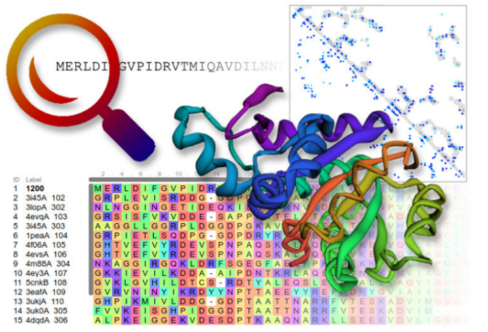

{ width="250", align="left" }
# **TP 12**. Modelado por Homología y AlphaFold2 { markdown data-toc-label = 'TP 12' }

<br>
<br>
<br>
<br>

## Slides mostrados en la clase

* :fontawesome-regular-file-pdf: [Slides](https://docs.google.com/presentation/d/1CW2CjNZyrl5cMM0W14ILZEhf-Q4GmVCs/edit?usp=sharing&ouid=101472650200585443790&rtpof=true&sd=true)

<!--
## Videos de la clase grabada
* :octicons-video-16: [Puesta en común del TP](https://youtu.be/l--R0Vs12Lo)
-->

<br>

[:fontawesome-solid-download: Materiales](https://drive.google.com/file/d/1JirqIvvMCxEkYdSEt5bYqPJLhrebnPAj/view?usp=sharing){ .md-button .md-button--primary }

<!--
## Ejercicio 1. Modelado mistery protein.
Luego de dos años y numerosos intentos fallidos, usted logra determinar por resonancia magnética nuclear una región de una proteína misteriosa y deposita la estructura en la base de datos de proteínas PDB (PDB: 1F46).
Años después ocurre una pandemia de una enfermedad respiratoria causada por *Actinobacillus pleuropneumoniae* que está causando un rápido aumento en la mortalidad de la población porcina, trayendo terribles consecuencias en la actividad económica mundial. Una vez que se logró aislar la cepa responsable, se cree que una proteína que comparte casi el 25 % de identidad con su proteína misteriosa es un posible blanco para el diseño de una droga. Sin embargo, se desconoce la estructura de la misma. Como usted es el único experto en esa proteína en el mundo, la Asociación del Centro Médico Epidemiológico (ACME) se pone en contacto con usted en busca de una solución. Para solucionar el problema, Ud. decide primero intentar un modelado por homología de la nueva proteína.

**1.** Ingrese la secuencia de la proteína misteriosa patogénica en [HHPred](https://toolkit.tuebingen.mpg.de/tools/hhpred)

```Bash
>Pathogenic Mistery Protein
MELHILFFILAGLLIAVLISFSLWSARREKSRIFSNTFSTRPPSTPINNIVSDVPPSLNPQSYAQT
TGQHGETEADNPVQIQQEVESSLREIKINLPGQDSAAYQSKVEETPIYSGQPVLPVQPQYQTQVQY
QTQPQHIEPAFTQAPQSPIAEATSVLEQSVEELERQAAQGDVDIYSDASVRVELAKNSMQADSVAE
QKPVAENNMLTLYVVAPEGQQFRGDYVVQSLEALGFQYGEYQIFHRHQHMGNSASPVIFSVANMMQ
PGIFDLTKIEHFSTVGLVLFMHLPSEGNDVVNFKLLLKTTENLAQALGGFVLNEHREIFDENSRQS
YLARVS
```

**2.** Haga click en **Submit** en la parte inferior de la página y seleccione el hit que le parezca más conveniente:

* ¿por qué es el más conveniente?
* ¿Cuál es el PDB ID y a qué cadena corresponde?
* ¿Que e-value tiene?
* ¿que porcentaje de identidad y qué porcentaje de similitud posee con su proteína misteriosa (en la parte inferior de la web está el alineamiento)?

Luego seleccione en la parte superior **Model using selection**. 

* ¿Qué se muestra en la nueva ventana? (Mueva la barra inferior para ver que hay en la ventana).

**3.** Haga click en **Forward to Modeller** y luego en **Submit**. (De ser necesario ingrese la siguiente key: **MODELIRANJE** en el recuadro que dice **Modeller key** y luego haga click en Submit).

* ¿Qué aparece en la nueva ventana?

**4.** Descargue el archivo PDB (**Download PDB File**)

**5.** La herramienta **Verify3D** permite determinar la compatibilidad de un modelo 3D de una proteína con su secuencia aminoacídica en base a cuál es el ambiente en el cual se encuentra cada residuo y la compatibilidad con la estructura secundaria en la que se encuentra.  

Vaya a la web de [UCLA-DOE LAB](https://saves.mbi.ucla.edu/), suba el
archivo PDB obtenido en el paso anterior y clickee en **Run programs**.

* Seleccione **Verify3D** y espere por los resultados.

El gráfico reporta la calidad del modelo por posición y en él se observan tres
regiones:  
**1. Posiciones con score menor a cero** están **mal** modeladas,  
**2. Posiciones con score entre cero y 0.2** están **pobremente** modeladas,  
**3. Posiciones con score mayor a 0.2** están modeladas con **buena calidad**.  

**Verify 3D** asigna como aceptado a un modelo con más del 80% de las posiciones posiciones con un score promedio en el área **bien modelada**.

* Observe el resultado obtenido (Si tarda haga click en el botón *Check status*) y responda:  
* ¿Cuál es el porcentaje de residuos con un score promedio en el **área de bien modelados**?
* ¿Qué región está **pobremente modelada** según **Verify 3D**?

**6.** La herramienta **Procheck** permite analizar la calidad de la geometría de los residuos en una estructura proteica dada en comparación a parámetros estereoquímicos derivados de estructuras tridimensionales de alta resolución ya conocidas.

* En la parte superior de la página de los resultados de **Verify 3D** vaya a **Control Panel**

* Seleccione **Procheck** y espere por los resultados.

**a.** Investigue el **Ramachandran Plot**. Reconozca las regiones a los distintos elementos de estructura secundaria y responda:

* ¿Cuántas estructuras se utilizaron para construir este Ramachandran?
* ¿Qué residuos no están en el área esperada?
* ¿Qué criterio se utiliza para considerar que el modelo es de buena calidad?
* ¿Qué porcentaje de residuos en la estructura modelada se encuentran en las regiones más favorecidas?
* ¿Qué residuo está representado como triángulos? ¿A qué creés que se debe?

**b.** Mirando el PDF en "All Ramachandrans", investigue los gráficos de ramachandran para todos los residuos.

* ¿Cuántas estructuras se utilizaron para construir este Ramachandran?
* ¿Qué residuos no están en el área esperada?
* Observe el ramachandran teórico de la Glicina ¿Qué diferencias observa respecto al resto? ¿y el de la prolina?

**c.** Investigue los gráficos de las longitudes de enlace en la cadena principal (M/c bond lengths) y los ángulos de unión de la cadena principal (M/c bond angles).

* ¿Existen aminoácidos que se alejen significativamente de los resultados esperados?

**7.** En base a los resultados obtenidos por **Verify 3D** y **ProCheck** responda: ¿Es bueno el modelo? ¿Por qué?

**8.** Abra chimera y busque el modelo que determinó usted años atrás:

  *File* → *Fetch by ID* → 1F46

  Si no funciona, el pdb se encuentra en su carpeta de datos y puede utilizar:

  *File → Open*

**9.** Luego, cargue en la misma ventana de Chimera la estructura de la proteína misteriosa patogénica

  *File → Open*

**10.** Para tener una noción de cuán similar es la estructura de dos proteínas, podemos realizar un **Alineamiento Estructural**, que consiste en superponer las estructuras de ambas proteínas en el espacio intentando alinear sus cadenas aminoacídicas. Para esto:  
  
Vaya a *Tools → Structure Comparison → MatchMaker*
    
Se abrirá una nueva ventana.

* En *Structure(s) to match* (el panel de la derecha) seleccione la estructura que será superpuesta y alineada con la que se eligió como referencia, es decir el modelo.

* En *Chain Pairing* elija: *Specific chain in reference structure with best aligning chain in match structure*

* En *Reference structure* (el panel de la izquierda) seleccione la cadena correcta de la estructura utilizada como molde.

!!! warning "Antes de seguir..."

    Piense y conteste:

    * ¿Porqué está utilizando el PDB:1F46?
    * ¿Qué cadena debe elegir?


* En *Matching* asegurése que *Iterate by pruning long atom pairs untilo no pair exceeds* está clickeado.


* Observe el resultado del alineamiento: ¿Son parecidas las estructuras? ¿En donde se observan las mayores diferencias?

      Vaya a *Favorites → Reply Log*

* ¿Cuál es el RMSD global reportado? ¿y con *pruned atoms*?

**11.** Para ver cómo se corresponde el grado de similitud estructural con el grado de similitud en secuencia podemos realizar un alineamiento de ambas secuencias guiado por el alineamiento estructural. Para esto, vaya a:

*Tools → Structure comparison → “Match->Align”*

Asegúrese que:

* Estén seleccionadas las cadenas correctas

* En *Residue-residue distance cutoff (angstroms)* diga 2.0

**Ahora, observando la estructura y el alineamiento responda:**  

**I.** ¿Qué son las regiones marcadas en rosa en el alineamiento?  

**II.** ¿Este alineamiento, identifica regiones que no alinean estructuralmente? ¿A qué se debe?

**III.** En la parte superior de la ventana del alineamiento de secuencia vaya a Headers y seleccione RMSD:*ca*

* ¿Qué regiones poseen mayor RMSD? ¿A qué elementos estructurales corresponden? Para responder esto, seleccione estas regiones con el mouse en el alineamiento y visualícelas en la estructura alineada.

**IV.** Para calcular el RMSD manualmente es necesario tener ambas moléculas en un mismo archivo y con un sistema de coordenadas relacionado.

Para guardar el archivo pdb incluyendo ambas moléculas vaya a *File* → *Save PDB...*

En la ventana que se abre:

* En la sección *Save models* asegúrese que ambos modelos estén seleccionados.
* Chequee que la única casilla tildada sea *Save relative to model:*
* Asegúrese que en *Save multiple models in* esté seleccionado *a single file*
* Elija la ubicación y nombre para el archivo.

Abra el archivo con el **Leafpad** o **block de notas**.

* ¿Se encuentran ambas moléculas en el archivo? (Pista, ¿cuantas cadenas ve y como se llaman?)

!!! info "Calculo de RMSD"

    $$
    \operatorname{RMSD(v,w)} = \sqrt{\frac{1}{n} \sum_{i=1}^{n} \, ((v_{ix} - w_{ix} )^2 + (v_{iy} - w_{iy} )^2 + (v_{iz} - w_{iz} )^2) \, }
    $$

* Calcule el RMSD entre los carbonos alpha del residuo serina 253 del modelo obtenido y la glicina 55 de del templado utilizado.

* En la fórmula de RMSD:

      * ¿Cuánto vale *n* en este caso?
      * ¿A qué corresponde *v* y a qué corresponde *w*?

* Verifique su resultado en chimera (en el alineamiento obtenido por match align debe seleccionar ambos residuos a la vez y el RMSD aparece en la parte inferior del recuadro) ¿Obtuvo el mismo resultado?

<!--
ATOM    402  CA  SER X 253      18.759  16.006  35.757  1.00114.95           C
ATOM   1479  CA  GLY B  55      19.585  14.558  34.795  1.00 21.07           C


**12.** Para cuantificar el alineamiento de secuencia obtenido, podemos calcular el % de identidad de secuencia. Para ello, en la ventana del alineamiento de secuencias vaya a:

*Info → Percent identity*.

Seleccione una estructura en *Compare* y la otra estructura en *with*. En *Divide by* seleccione *longer sequence length*. Presiona en Ok.  

* ¿Qué valor de identidad de secuencia obtiene? ¿Porque cree que difiere del reportado anteriormente?

* En la parte superior de la ventana del alineamiento de secuencia vaya a Headers y seleccione *Conservation* ¿Las sustituciones observadas en las secuencias son conservativas?  

* En base a los resultados obtenidos. ¿Intentaría obtener experimentalmente la estructura de la nueva proteína, o confiaría en el modelo?
-->  

## Ejercicio 1. Modelado por homología de una proteína de Rana.

Usted es un famoso ecólogo que desde siempre sintió un especial interés por las ranas. Durante un viaje de campaña se encontró con unas ranas muy inusuales que poseían una fascinante coloración azul. Luego de años de investigación y muchos subsidios invertidos, su becario descubrió que esta coloración se debe a la existencia de una proteína en la linfa de las ranas que es capaz de conjugar biliverdina. Luego de aislar la proteína, obtiene su secuencia:

```Bash
>Hypsiboas_punctatus_BP
MRVLLILGVVVLSTLAFAHHEEGHHDDEDLKDDHDPFLPEDHKKALFVYQKPALNNINFA
FKMYRQLARDHPTENIVISPVSISSALALLSLGAKGHTHSQIVERLGYNTSEIPEQQIHE
SFHKQLDVVDDKDRDLEFEHGNALFTCKEHKIHQTFLDDAKKFYHSEVIPTDFKNTEEAK
NQINSYVEKSTHGKITNILDSVDQDAMIALINFIYLRANWQHPFDEKLTKEGDFHVDKDT
TVKVPFMRRRGIYKMAYTDDIIMVTIPYNGSVEMFLAMTKMGKLSELEQNLNRERSLKWR
EIMQYQLIDLSLPKLSVSGILNLKETLSKLGIVDVFSNHADLSGITDESHLKVSKAIHKA
MMSFDEHGTEAAPATAAEADPLMLPPHFKFDYPFIFRVQDLKTKNPLLVGRIANPQK
```

Utilizando la secuencia, el becario busca en las bases de datos y descubre que su proteína es homóloga a una superfamilia de proteínas conocidas como *serpinas* compartiendo un 43% de identidad de secuencia con la proteína de humanos.  

Para entender las diferencias con la proteína de humanos, estuvo muy interesado en obtener la estructura tridimensional de la proteína de rana. Sin embargo, todos los intentos de cristalización fallaron rotundamente. Su subsidio se está terminando rápidamente pero afortunadamente, un becario muy interesado en bioinformática y el modelado por homología lo salva de su desesperación.  

**1.** Utilizando la herramienta **HHPred** modele la proteína.

**2.** Haga click en **Submit** en la parte inferior de la página y seleccione el hit que le parezca más conveniente:

* ¿por qué es el más conveniente?
* ¿Cuál es el PDB ID y a qué cadena corresponde?
* ¿Que e-value tiene?
* ¿que porcentaje de identidad y qué porcentaje de similitud posee con su proteína (en la parte inferior de la web está el alineamiento)?

Luego seleccione en la parte superior **Model using selection**. 

* ¿Qué se muestra en la nueva ventana? (Mueva la barra inferior para ver que hay en la ventana).

**3.** Haga click en **Forward to Modeller** y luego en **Submit**. (De ser necesario ingrese la siguiente key: **MODELIRANJE** en el recuadro que dice **Modeller key** y luego haga click en Submit).

* ¿Qué aparece en la nueva ventana?

**4.** Descargue el archivo PDB (**Download PDB File**)

**5.** La herramienta **Verify3D** permite determinar la compatibilidad de un modelo 3D de una proteína con su secuencia aminoacídica en base a cuál es el ambiente en el cual se encuentra cada residuo y la compatibilidad con la estructura secundaria en la que se encuentra.  

Vaya a la web de [UCLA-DOE LAB](https://saves.mbi.ucla.edu/), suba el
archivo PDB obtenido en el paso anterior y clickee en **Run programs**.

* Seleccione **Verify3D** y espere por los resultados.

El gráfico reporta la calidad del modelo por posición y en él se observan tres
regiones:  
**1. Posiciones con score menor a cero** están **mal** modeladas,  
**2. Posiciones con score entre cero y 0.2** están **pobremente** modeladas,  
**3. Posiciones con score mayor a 0.2** están modeladas con **buena calidad**.  

**Verify 3D** asigna como aceptado a un modelo con más del 80% de las posiciones posiciones con un score promedio en el área **bien modelada**.

* Observe el resultado obtenido (Si tarda haga click en el botón *Check status*) y responda:  
* ¿Cuál es el porcentaje de residuos con un score promedio en el **área de bien modelados**?
* ¿Qué región está **pobremente modelada** según **Verify 3D**?

**6.** La herramienta **Procheck** permite analizar la calidad de la geometría de los residuos en una estructura proteica dada en comparación a parámetros estereoquímicos derivados de estructuras tridimensionales de alta resolución ya conocidas.

* En la parte superior de la página de los resultados de **Verify 3D** vaya a **Control Panel**

* Seleccione **Procheck** y espere por los resultados.

**a.** Investigue el **Ramachandran Plot**. Reconozca las regiones a los distintos elementos de estructura secundaria y responda:

* ¿Cuántas estructuras se utilizaron para construir este Ramachandran?
* ¿Qué residuos no están en el área esperada?
* ¿Qué criterio se utiliza para considerar que el modelo es de buena calidad?
* ¿Qué porcentaje de residuos en la estructura modelada se encuentran en las regiones más favorecidas?
* ¿Qué residuo está representado como triángulos? ¿A qué creés que se debe?

**b.** Mirando el PDF en "All Ramachandrans", investigue los gráficos de ramachandran para todos los residuos.

* ¿Cuántas estructuras se utilizaron para construir este Ramachandran?
* ¿Qué residuos no están en el área esperada?
* Observe el ramachandran teórico de la Glicina ¿Qué diferencias observa respecto al resto? ¿y el de la prolina?

**c.** Investigue los gráficos de las longitudes de enlace en la cadena principal (M/c bond lengths) y los ángulos de unión de la cadena principal (M/c bond angles).

* ¿Existen aminoácidos que se alejen significativamente de los resultados esperados?

**7.** En base a los resultados obtenidos por **Verify 3D** y **ProCheck** responda: ¿Es bueno el modelo? ¿Por qué?

**8.** Abra chimera y busque el modelo que determinó usted años atrás:

  *File* → *Fetch by ID* → 7RBW

  Si no funciona, el pdb se encuentra en su carpeta de datos y puede utilizar:

  *File → Open*

**9.** Luego, cargue en la misma ventana de Chimera la estructura modelada

  *File → Open*

**10.** Para tener una noción de cuán similar es la estructura de dos proteínas, podemos realizar un **Alineamiento Estructural**, que consiste en superponer las estructuras de ambas proteínas en el espacio intentando alinear sus cadenas aminoacídicas. Para esto:  
  
Vaya a *Tools → Structure Comparison → MatchMaker*
    
Se abrirá una nueva ventana.

* En *Structure(s) to match* (el panel de la derecha) seleccione la estructura que será superpuesta y alineada con la que se eligió como referencia, es decir el modelo.

* En *Chain Pairing* elija: *Specific chain in reference structure with best aligning chain in match structure*

* En *Reference structure* (el panel de la izquierda) seleccione la cadena correcta de la estructura utilizada como molde.

!!! warning "Antes de seguir..."

    Piense y conteste:

    * ¿Porqué está utilizando el PDB:7RBW?
    * ¿Qué cadena debe elegir?


* En *Matching* asegurése que *Iterate by pruning long atom pairs untilo no pair exceeds* está clickeado.


* Observe el resultado del alineamiento: ¿Son parecidas las estructuras? ¿En donde se observan las mayores diferencias?

      Vaya a *Favorites → Reply Log*

* ¿Cuál es el RMSD global reportado? ¿y con *pruned atoms*?

**11.** Para ver cómo se corresponde el grado de similitud estructural con el grado de similitud en secuencia podemos realizar un alineamiento de ambas secuencias guiado por el alineamiento estructural. Para esto, vaya a:

*Tools → Structure comparison → “Match->Align”*

Asegúrese que:

* Estén seleccionadas las cadenas correctas

* En *Residue-residue distance cutoff (angstroms)* diga 2.0

**Ahora, observando la estructura y el alineamiento responda:**  

**I.** ¿Qué son las regiones marcadas en rosa en el alineamiento?  

**II.** ¿Este alineamiento, identifica regiones que no alinean estructuralmente? ¿A qué se debe?

**III.** En la parte superior de la ventana del alineamiento de secuencia vaya a Headers y seleccione RMSD:*ca*

* ¿Qué regiones poseen mayor RMSD? ¿A qué elementos estructurales corresponden? Para responder esto, seleccione estas regiones con el mouse en el alineamiento y visualícelas en la estructura alineada.

**IV.** Para calcular el RMSD manualmente es necesario tener ambas moléculas en un mismo archivo y con un sistema de coordenadas relacionado.

Para guardar el archivo pdb incluyendo ambas moléculas vaya a *File* → *Save PDB...*

En la ventana que se abre:

* En la sección *Save models* asegúrese que ambos modelos estén seleccionados.
* Chequee que la única casilla tildada sea *Save relative to model:*
* Asegúrese que en *Save multiple models in* esté seleccionado *a single file*
* Elija la ubicación y nombre para el archivo.

Abra el archivo con el **Leafpad** o **block de notas**.

* ¿Se encuentran ambas moléculas en el archivo? (Pista, ¿cuantas cadenas ve y como se llaman?)

!!! info "Calculo de RMSD"

    $$
    \operatorname{RMSD(v,w)} = \sqrt{\frac{1}{n} \sum_{i=1}^{n} \, ((v_{ix} - w_{ix} )^2 + (v_{iy} - w_{iy} )^2 + (v_{iz} - w_{iz} )^2) \, }
    $$

* Calcule el RMSD entre los carbonos alpha del residuo leucina 38 del modelo obtenido y la leucina 38 de la cadena A de del templado utilizado.

* En la fórmula de RMSD:

      * ¿Cuánto vale *n* en este caso?
      * ¿A qué corresponde *v* y a qué corresponde *w*?

* Verifique su resultado en chimera (en el alineamiento obtenido por match align debe seleccionar ambos residuos a la vez y el RMSD aparece en la parte inferior del recuadro) ¿Obtuvo el mismo resultado?

<!--
ATOM    402  CA  SER X 253      18.759  16.006  35.757  1.00114.95           C
ATOM   1479  CA  GLY B  55      19.585  14.558  34.795  1.00 21.07           C
-->

**12.** Para cuantificar el alineamiento de secuencia obtenido, podemos calcular el % de identidad de secuencia. Para ello, en la ventana del alineamiento de secuencias vaya a:

*Info → Percent identity*.

Seleccione una estructura en *Compare* y la otra estructura en *with*. En *Divide by* seleccione *longer sequence length*. Presiona en Ok.  

* ¿Qué valor de identidad de secuencia obtiene? ¿Porque cree que difiere del reportado anteriormente?

* En la parte superior de la ventana del alineamiento de secuencia vaya a Headers y seleccione *Conservation* ¿Las sustituciones observadas en las secuencias son conservativas?  

* En base a los resultados obtenidos. ¿Intentaría obtener experimentalmente la estructura de la nueva proteína, o confiaría en el modelo?


<!--
Desconfiando de los resultados de su becario, Ud. decide analizar la calidad del modelo obtenido. Para esto utiliza todas las herramientas que conoce:

**1.** Utilice el modelo creado por su becario (`Hypsiboas_punctatus_BP.pdb`) que se encuentra en los materiales. Utilice las herramientas aprendidas en el punto anterior ([Verify3D](https://saves.mbi.ucla.edu/)) e investigue los resultados obtenidos.

* ¿Le parece que su becario estaba en lo cierto, o equivocado?  

**2.** Para explicar las diferencias obtenidas analice las estructuras como se indica en los puntos siguientes (a, b y c) usando **Chimera** y **IUPred**:

**a.** Utilizando el modelo generado y el PDB (3NE4) utilizado como molde realice un alineamiento estructural en Chimera (*Tools → Structure Comparison → MatchMaker*).

* ¿Cuál es el RMSD global?
* ¿Qué diferencias observa en las estructuras alineadas?
* ¿Tiene relación con lo obtenido por **Verify3D**?

**b.** En Chimera observe el alineamiento de secuencia (*Tools → Structure Comparison Match -> Align*).

* Cuando se quiere obtener una estructura de una proteína a veces ocurre que hay regiones o residuos que no se pueden "resolver" y no se les puede asignar una estructura. Estos residuos se conocen como *Missing residues* y en el alineamiento de secuencia en chimera están resaltados de una manera especial. ¿Puede identificar como están destacados? ¿A qué región corresponde en la proteína modelada?
* ¿En qué regiones hay mayor número de Gaps?
* Observe el RMSD por posición utilizando el RMSD:ca. ¿En qué regiones se observan las mayores diferencias? ¿A qué estructura corresponde? ¿Por qué cree que ocurre esto?

**c**. Ingrese la secuencia de la rana en [IUPRed2A](https://iupred2a.elte.hu/). ¿Qué relación encuentra con lo obtenido por Verify3D?

**3.** En base a los resultados de su análisis, responda:

* ¿Pudo explicar todas las regiones de menor calidad reportadas por **Verify3D**?

* Ud. Se sacó un nuevo subsidio donde tiene plata para seguir haciendo estudios estructurales de esta proteína: le daría alguna indicación a su nuevo becario, para que tenga más suerte al intentar cristalizarla?
-->


<!--
## Ejercicio a informar

!!! Abstract "Fecha Límite de Entrega: Viernes, 21 de Octubre 2022, 23:59hs"

### Enunciado
Su jefe sigue interesado en la proteína N que forma la nucleocápside viral de SARS-CoV2 y empaqueta el genoma viral de ARN formando una ribonucleocápside. Usted ya comprobó que la estructura de la proteína N es altamente desordenada y posee dos dominios globulares pequeños en el N-terminal (Dominio N) y C terminal (Dominio C). Dada la importancia de la proteína en la replicación viral, consideran que es un blanco posible de drogas. Por lo tanto, decide realizar un modelado por homología del dominio N-terminal de la proteína N del **aislamiento** original utilizando las herramientas que conoce.

**1.** Diseñe por homología el dominio N-terminal. Evalúe si su modelo es bueno y recuerde incluir el molde que seleccionó para crearlo justificando la elección e indicando a qué virus pertenece.

**2.** Elija una estructura contra la cual comparará su modelo y justifique brevemente la elección. Recuerde reportar el RMSD global y que regiones alinean mejor.

**3.** Según este análisis, si desearía cristalizar el dominio N ¿Qué regiones no incluiría?

## Ejercicios Adicionales (No hay que informarlos)
### Ejercicio Adicional 1.
Después del exitoso resultado que obtuvo, ahora más relajado luego de haber salvado a la población porcina, decide rechequear los resultados obtenidos con la proteína misteriosa patogénica 1 utilizando otro programa que requiere más tiempo para modelar su proteína.

1. Ingrese la secuencia de la proteína en la web de [Phyre2](http://www.sbg.bio.ic.ac.uk/phyre2/html/page.cgi?id=index) Espere… Espere… Espere… (Puede llevar horas).

2. Observe los resultados obtenidos. ¿Cuál es el valor de *Confidence* del modelo?
¿Cuál es el coverage de la secuencia? ¿A qué se debe este valor?

3. Descargue el modelo (haciendo click sobre la representación) y trate de alinearlo en Chimera con los otros modelos, ¿es muy diferente? Investigue las regiones con mayor valor de RMSD ¿A qué estructuras corresponde? ¿Qué concluye sobre las regiones más difíciles de modelar?

4. En la web de Phyre, vaya a la sección Detailed template information. Haga click en *Run Investigator*.  
Explore en Quality las distintas opciones:  

    

    Al final de la página posee el alineamiento y puede ir estudiando estas
características posición por posición.
¿Son muy diferentes los resultados obtenidos en comparación a los anteriores?

# Estructura de Proteínas y Visualización de Estructuras con Chimera

## Introducción
### Chimera, software de visualización de estructuras.
Para poder visualizar estructuras macromoleculares tales como proteínas globulares y ácidos nucleicos, se usará el software UCSF Chimera. Existen otros software similares pero Chimera tiene la ventaja de ser mantenido actualmente por sus desarrolladores.  

Chimera es un programa disponible de manera gratuita, y está disponible para descargar
e instalar en tu propia computadora en http://www.cgl.ucsf.edu/chimera/  

Existen un alto número de guías y tutoriales disponibles online que pueden encontrarse
en: http://www.cgl.ucsf.edu/chimera/current/docs/UsersGuide/  

**Antes de empezar, pueden responder: ¿Porqué es importante visualizar estructuras
proteicas? ¿Qué información podríamos obtener de ellas? ¿Estas estructuras, son
un objeto real o un modelo?**

#### Bases de Datos Estructurales. ¿Dónde almacenan todas las
estructuras? ¿Cómo accedemos a ellas?
La base de datos de proteínas (Protein Data Bank, PDB) almacena actualmente más de
150000 estructuras. Puedes acceder a ella aquí: http://www.rcsb.org/pdb/home/home.do

Existe también una versión europea de esta base de datos (European Protein Data Bank,
PDBe). Puedes acceder a ella desde aquí: https://www.ebi.ac.uk/pdbe/  

Las estructuras poseen un identificador de 4 caracteres alfanuméricos. Por ejemplo:
**1GUX** es el identificador, o PDB ID, de la proteína retinoblastoma unida a un péptido de la
proteína E7 de papillomavirus.  

La búsqueda de estructuras puede realizarse utilizando palabras claves, por ejemplo, la palabra clave **retinoblastoma** devuelve un total de 173 estructuras, o por otras características como nombre de alguno de los autores que participó en el estudio de esa estructura, por ejemplo, **Rubin, S.M.** devuelve un total de 32 estructuras. Pueden explorar la base de datos RCSB PDB para familiarizarse con ella.

### El archivo PDB. ¿Cómo están codificadas las estructuras?
Las estructuras tridimensionales de las proteı́nas pueden generarse por diferentes métodos (cristalografía de rayos X o XRay, resonancia magnética nuclear o RMN, criomicroscopía electrónica o CryoEM) y están codificadas en archivos pdb. Un archivo pdb está compuesto por múltiples lı́neas de registros, cada uno identificado por una etiqueta determinada incluidos dentro de distintas secciones. En la figura se muestra un fragmento de la sección de coordenadas que describe la estructura de la proteına dando las coordenadas x, y y z (azul claro) de cada uno de los átomos identificados.


En cada lı́nea, además, se identifica si es un átomo (rojo) perteneciente a un aminoácido o nucleótido, o heteroátomo (azul oscuro), la numeración (verde), el nombre del átomo (naranja), el nombre del residuo en el que está incluido el átomo (violeta), la cadena a la que pertenece (negro), el número del residuo al que pertenece (verde). Este archivo puede incluir más columnas para cada átomo con datos relacionados con el espacio que ocupa el átomo, la movilidad del átomo (el factor de temperatura o B-factor), el sı́mbolo que representa al átomo y la carga del mismo (señaladas con “...” en la figura). El encabezado o header del archivo PDB puede tener muchísima información no relacionada directamente con la conformación tridimensional de la proteína, sino con cómo se hizo el experimento, las publicaciones relacionadas y otros. La descripción del resto del contenido de las secciones del archivo pdb puede obtenerse en la sección documentación de http://www.wwpdb.org/.  

**Ejercicio.** Busca, descarga y abre un archivo PDB.
* ¿Puedes identificar los distintos 
datos?
* ¿Puedes identificar qué otra información se encuentra? ¿Cómo está señalizada u organizada dicha información?**

Los archivos PDB, fueron utilizados por décadas para describir la estructura de una macromolécula. Sin embargo, tiene un número limitado de líneas y átomos que se pueden codificar y actualmente no puede manejar complejos macromoleculares muy grandes, partículas virales, etc.  
Recientemente, se desarrolló un nuevo formato de archivo, MMCIF, que puede codificar estructuras de complejos macromoleculares mucho más grandes. Sin embargo, no todos los programas utilizados para visualizar estructuras soportan este formato.  

**Ejercicio.** Busca, descarga y abre un archivo MMCIF.
* ¿Puedes identificar los distintos datos?
* ¿Puedes identificar qué otra información se encuentra? ¿Cómo
está señalizada u organizada dicha información?

## Guía de Ejercicios - Chimera
 Chimera es un programa con muchas potencialidades y herramientas de análisis. En la
siguiente guía, introduciremos el uso de las funciones más comunes de este programa, en
relación al análisis estructura-función de proteínas
El objetivo principal de estos ejercicios iniciales es:
* Aprender a visualizar estructuras 3D de proteínas o complejos proteicos,
incluyendo diferentes niveles de análisis
*  Identificar superficies de interacción.
* Identificar diferentes tipos de unión molecular tales como puentes de
hidrógeno o interacciones mediadas por carga y entender el rol de los
mismos.
* Identificar interacciones hidrofóbicas y entender el rol de las mismas.
* Aprender a superponer estructuras relacionadas y analizar los resultados.


#### I- Iniciando Chimera
1. Localiza chimera en tu computadora y abrelo.
2. Existen dos formas de cargar una estructura en Chimera:

**Opción 1:** Ve a File, selecciona Fetch by ID. Ingresa el identificador del PDB deseado. Por ejemplo: 2AZE. Se descargará de manera remota el PDB 2AZE de la base de datos PDB.

**Opción 2:** Ve a File, selecciona Open.
Busca el archivo PDB en la carpeta donde lo hayas descargado previamente y seleccionalo. Todos los archivos se encuentran además en la carpeta PDBs del TP de la materia.

Archivos PDBs con los que trabajaremos:  

PDB ID | Descripción
------ | -----------
**2AZE** | Complejo creado a partir del ensamblado de fragmentos proteicos provenientes de pRB/E2F1/DP1  
**1YCR** | Complejo de MDM2 y un péptido proveniente del dominio de transactivación de p53  
**2GDM** | Estructura de la LegHemoglobina
**3RGK** | Estructura de la Myoglobin humana  
**5LGY** | 4 Core Domain DE P53 unidos al BAX response element (DNA)

### Ejercicio 1. Algunas definiciones antes de empezar a visualizar
1. ¿Como se define una superficie de interacción?
2. ¿Como se definen interacciones puentes de hidrógeno, interacciones mediadas por
carga, hidrofóbicas?
3. ¿Por qué sería útil superponer estructuras relacionadas?

### Ejercicio 2. Familiarizándonos con Chimera
Existen diversas maneras de visualizar los complejos estructurales. Dependiendo cuál es
el objetivo del análisis a veces es mejor utilizar distintos métodos de visualización como
superficies, átomos o ribbons (cinta).

Chimera tiene un menú muy complejo. Pero solamente vamos a usar algunos comandos.

Primero carguemos la estructura correspondiente al **PDB 2AZE** y vayamos viendo como
cambia la representación de la estructura.

**MENU SELECT.**  
Este menú permite seleccionar y deseleccionar secciones de estructuras.

* Se pueden seleccionar cadenas (chain), o características estructurales (structure)
como estructuras secundarias (secondary structure), determinado tipo de
aminoácidos (residue) o aminoácidos agrupados por categorías (amino acid
category) como ser hidrofóbicos (hydrophobic), cargados (charged), etc.
* Para deseleccionar se utiliza la opción clear selection.

**MENU ACTIONS.**  
Permite realizar determinadas acciones en la molécula, relacionadas con:
* Representación de la molécula.
  * Superficie (*Surface → Show*)
  * Cintas (*Ribbon → Show*)
  * Átomos/Uniones (*Atoms/Bonds → Show*)
* Apariencia de la representación
  * Superficie en forma sólida, como una red o como puntos (*Surface → Solid/Mesh/Dot*).
  * Cintas más planas, redonas o gruesas (*Ribbon → Flat, rounded, edge*)
  * Átomos como palillos (sticks), líneas (*wire*), esferas, etc.
* Color deseado (*Color*)
* Centrar la molécula (*Focus*)

**Ejercicio para discutir. ¿Se te ocurre para qué puede ser útil cada forma de
visualización?**

### Ejercicio 3. Analizando estructuras
En este ejercicio trabajaremos con el complejo formado entre las proteínas E2F y DP1
(factores de transcripción) y la región C-terminal del regulador del ciclo celular
Retinoblastoma. El objetivo es familiarizarse con el uso de diferentes modos de
visualización y análisis de interacciones dentro de cada cadena y entre dominios

**Con el PDB 2AZE:**

**1.** Selecciona cada una de las cadenas y asignale a cada cadena un color diferente
para poder individualizårlas mejor.

**MENU TOOLS**  
Abarca un conjunto variado de opciones.


* *Depiction*. Contiene opciones para modificar colores, etiquetas, entre otras cosas
* *Structure analysis*. Contiene distintos tipos de análisis comúnmente realizados
sobre la estructura.
  * *FindHBond*. Permite encontrar los puentes de hidrógenos.

**2.** Selecciona la cadena A del PDB. Luego, ve a *Structure analysis*, *FindHBond*, y
selecciona *Only Find H-Bonds* with both ends selected.  
Asegúrate que la opción *Include Intra-molecule H-bonds* está seleccionada.  
¿Qué se observa? ¿Entre qué grupos se forman los puentes de hidrógeno? ¿De
qué tipo de estructura forman parte?  

  Para removerlos es necesario usar la línea de comandos que se encuentra en la
parte inferior de la pantalla. Si no puedes visualizarla, ve a *Favorites → Command Line.*

  En *Command*. Tipea: *~hbond*

**3.** Selecciona la cadena A del PDB. Luego, ve a *Structure analysis*, *FindHBond*, y
selecciona *Only Find H-Bonds with both ends selected*.  
Asegúrate que la opción *Include Intra-molecule H-bonds* **NO** está seleccionada.
¿Qué se observa? ¿Entre qué grupos se forman los puentes de hidrógeno? ¿De
qué tipo de estructura forman parte?

### Ejercicio 4. Estudiando interacciones intermoleculares
En este ejercicio vamos a trabajar con el complejo entre el dominio TAD de p53 y el
dominio globular de la E3 ligasa MDM2, e interpretaremos el tipo de interacciones que
estabilizan este complejo utilizando métodos para visualizar este tipo de interacción

1. Carga el pdb 1YCR.  
¿Cuántas cadenas observas? ¿Son dominios, y sino qué son?

2. En Favorites selecciona Model Panel. Allí podrás ver el identificador del pdb y
algunos accesos rápidos a algunas de las acciones. En *select chain(s)...*
Selecciona la **cadena A** y representala como superficie.  
¿Qué observas? ¿Se ve bien la superficie haciéndolo de esta manera?

3. En la ventana *Model Panel* verás que aparece ahora también el elemento
superficie (*MSMS main surface of 1ycr*)  
Esconde la superficie. Puedes hacerlo desde *Model Panel* eliminando el tick al lado
del elemento superficie en la columna S (o bien puedes hacerlo como antes:
  *Actions → Surface → Hide*).

  Para poder representar toda la superficie de la cadena es necesario dividir a la
estructura en elementos separados. Para eso:

  En **Command** ingresa *split*. Este comando permite que todas las cadenas sean
objetos individuales. En la ventana *Model Panel* aparecen ahora las dos cadenas
por separado.
Selecciona nuevamente la cadena A, puedes hacerlo haciendo click sobre 1ycr A
y presionando select. Represéntala como superficie. Observa la diferencia: ¿se ve
mejor?

Colorea la superficie por heteroátomos. Para esto: *Action → Color → by heteroatom*

**¿A qué residuos corresponden los colores? ¿porqué es útil este tipo de
representación? Pensar en las propiedades fisicoquímicas de los grupos que
componen a las proteína, y sus tipos de interacciones**

4. Selecciona ahora la **cadena **, represéntala como **ribbon**.
Muestra las cadenas laterales de los aminoácidos. Para esto:

  *Action → atoms/bonds → Show*

  Aparecerán automáticamente representados como Sticks. Puedes cambiarlos a *ball & stick*

  *Action → atoms/bonds → ball & stick*

  Para visualizar la secuencia del péptido ve a: *Tools → Sequence → Sequence*
y selecciona la **cadena B**.

 **¿Puedes correlacionar los residuos en la secuencia con la estructura?**

5. Ahora representaremos algunos aminoácidos de distinta manera. En la ventana de
la secuencia marca los residuos F19 y W23. Para seleccionar es necesario hacer
click y arrastrar levemente el mouse. Luego, manteniendo shift apretado selecciona
el segundo residuo. Representa estos residuos como esferas.
  1. ¿Qué observas? ¿Qué información da esta representación?
  2. ¿Qué puedes decir de estos residuos?
  3. ¿Qué relación estructural encuentras entre estos residuos y el alineamiento
realizado en la práctica de MSA? ¿De qué elemento se trata y qué
aprendemos de cómo se relacionan estructura y secuencia?

Por último, Chimera tiene algunas representaciones ya preconfiguradas en el Menú
Presets.

**MENU PRESETS**  
Abarca un conjunto de opciones preconfiguradas muy útiles.
En Presets selecciona Interactive 3 (*hydrophobicity surface*).

En *Model Panel* deselecciona la *MSMS main surface of 1ycr B*

**De acuerdo a la ‘hydrophobicity surface, y comparando con la representación
de heteroátomos: ¿qué significa la escala de color que se ve, y qué propiedad
fisicoquímica tiene el área (parche de unión) donde se unen los residuos F19 y
W23? ¿De qué tipo de interacciones se trata?**

### Ejercicio 5. Alineando estructuras de dos proteínas
En este ejercicio, compararemos dos estructuras de proteínas transportadoras de
oxígeno: Mioglobina humana y Leghemoglobina de plantas. Carga los PDBs
correspondientes: 3RGK y 2GDM utilizando la función “fetch”.

**Explora las estructuras y describe lo que observas. ¿Qué compuesto químico se
observa unido a las proteínas?**

Para tener una noción de cuán similar es la estructura de dos proteínas, podemos realizar
un **Alineamiento Estructural**, que consiste en superponer las estructuras de ambas
proteínas en el espacio intentando alinear sus cadenas aminoacídicas.
estructuras en chimera es muy fácil, sólo requiere un comando.

*Ve a Tools → Structure Comparison → MatchMaker*

Se abrirá una nueva ventana.  
En Reference structure (el panel de la izquierda) puedes seleccionar una de las
estructuras de referencia. Esta estructura es la que se mantendrá fija. (Ej. 2GDM)  
En Structure(s) to match (el panel de la derecha) selecciona la estructura que será
superpuesta y alineada con la que se eligió como referencia. (Ej. 3RGK)

Observar el resultado del alineamiento: ¿Son parecidas las estructuras? ¿En donde se
observan las mayores diferencias?

Para ver cómo se corresponde el grado de similitud estructural con el grado de similitud
en secuencia podemos realizar un alineamiento de ambas secuencias guiado por el
alineamiento estructural. Para esto, ve a:

*Tools → Structure comparison → “Match->Align”*

**Ahora, observando la estructura y el alineamiento responde:**
1. ¿Qué relación existe entre el alineamiento estructural y el alineamiento de
secuencia?
2. ¿Qué son las regiones marcadas en rosa en el alineamiento?
3. ¿Este alineamiento: identifica las regiones que no alinean estructuralmente?
4. ¿Qué elementos encuentra en el alineamiento de secuencia en las regiones que no
alinean? ¿A qué estructuras corresponden?

Para cuantificar el alineamiento de secuencia obtenido, podemos calcular el % identidad
de secuencia. Para ello, en la ventana del alineamiento de secuencias ve a: *Info →
Percent identity*

Selecciona una estructura en *Compare* y la otra estructura en *with*. Presiona en Ok.  
Prueba dividiendo por *longer, shorter and non-gap columns*.  
¿Qué valores de identidad de secuencia obtienes? ¿Las sustituciones observadas en las
secuencias son conservativas?

En la carpeta MSA del TP de la materia, pueden encontrar las secuencias FASTA de ambas proteínas. El archivo **P02240.fasta** corresponde a Leghemoglobina y el archivo **P02144.fasta** corresponde a la Mioglobina. Utilizando las herramientas ya aprendidas, realicen un alineamiento de a pares de las secuencias y respondan: Obtienen la misma identidad de secuencia que por el método usado recién en Chimera? Si hay diferencias, pueden interpretarlas?

**Entonces: ¿Qué se puede concluir de la divergencia estructural en comparación a la divergencia de secuencia en proteínas transportadoras de oxígeno? ¿Qué implica esto a nivel evolutivo?**

### Ejercicio 6. Visualizando ácidos nucleicos
Aquí analizaremos el dominio de unión a DNA de p53 estudiado previamente. Carga el pdb **1YCR**. Observa y responde:
* ¿Cuántas cadenas observas?
* ¿A qué corresponde cada cadena?
Colorea cada dominio proteico con un color diferente.

Ahora analizaremos los ácidos nucleicos:
Ve a *Actions → Atoms/Bonds → Nucleotide objects → off*  
Selecciona los ácidos nucleicos: *Select → Residue → Standard nucleic acids*  

Encuentra los puentes de hidrógeno.  
*Tools→ Structural Analysis → Find H Bonds*

Selecciona:  
*Only find H-Bonds → with both ends selected*  

Y asegurate que NO estén seleccionados:  
*Include intra-molecule H-bonds*  
*Include intra-residue H-bonds*

* Según los conocimientos que tienes de las uniones en el ADN ¿Se observa lo que
esperabas?
-->

## AlphaFold2 (AF2)
En los últimos años, hubo un crecimiento continuo en el número de estructuras de proteínas determinadas experimentalmente depositadas en el PDB (actualmente ~170.000). Esto, junto con la explosión de la secuenciación (millones de secuencias) y el desarrollo de técnicas de deep learning benefició el desarrollo de algoritmos de predicción de estructura tridimensional de proteínas. Hasta el 2021, los algoritmos de predicción de estructura tridimensional de proteínas se basan en dos aspectos complementarios: las interacciones físicas (o contactos) o la historia evolutiva de la proteína. Sin embargo, y a pesar de los avances, la mayoría de los algoritmos de predicción no son muy precisos si se carece de un homólogo cercano con una estructura tridimensional resuelta experimentalmente.
A partir de la secuencia primaria de una proteína (Fig 1), AlphaFold2 utiliza una red neuronal para la predicción estructural de alta precisión (en la mayoría de los casos), la cual aumenta con el uso de estructuras homólogas. AlphaFold2 puede incluso predecir con alta precisión las cadenas laterales si el backbone es preciso.


**Fig 1.** Algoritmo de predicción de estructuras AlphaFold2.

### Arquitectura
AlphaFold2 utiliza una arquitectura de red que utiliza como inputs el alineamiento de secuencias (MSAs) y una representación de todos los pares de residuos de la secuencia. Mediante un algoritmo iterativo que se basa en la arquitectura Evoformer, se procesan los inputs y en conjunto con un módulo estructural se genera una representación tridimensional de la proteína query. 

### Métricas de confianza
AlphaFold2 incorpora métricas de confianza de la predicción.

* La principal métrica de confianza es el test **pLDDT** (predicted local-distance difference test) el cual es un predictor confiable del test de diferencias en las distancias Cα (IDDT-Cα) y evalúa principalmente la correctitud del modelo a nivel local (estimando el error en distancias de un Cα con Cα vecinos en un rango de 15Å).

* La segunda métrica se denomina **PAE** (por Predicted Aligned error) y compara el error en la predicción de pares de residuos, esto es el error sobre el residuo y cuando las estructuras real y predicha son alineadas sobre el residuo x. Esta medida permite la identificación global de unidades de plegamiento (dominios) y permite predecir si dos dominios guardan relaciones espaciales definidas, o si tienen variabilidad (por ejemplo, si están conectadas por un linker flexible.

{ width="400" }

{ width="400" }

**Fig 2.** *Arriba.* Se pueden observar dos dominios globulares, pero se desconoce la disposición espacial relativa entre ellos. *Abajo.* Se puede observar que además de identificar los dominios globulares, se predien correctamente pares de residuos interdominios.


### Costo computacional
AlphaFold2 consume muchísimos recursos. Por lo tanto, muchas proteínas de organismos modelos están siendo modeladas y puestas a disposición de la comunidad científica en una base de datos: [https://alphafold.ebi.ac.uk/](https://alphafold.ebi.ac.uk/).

Afortunadamente, la comunidad científica rápidamente desarrolló distintas “colabs” o “notebooks” que permiten correr AlphaFold2 en una máquina remota. Una “desventaja” es que se debe contar con una cuenta de mail de gmail, **cada cuenta de gmail puede usar un colab a la vez**.

Otra desventaja es que en la versión gratuita de colab, debido al espacio en disco y capacidad de cómputo que se adjudica, sólo se pueden correr proteínas o complejos con menos de 1000 residuos y luego de estar corriendo unas cinco proteínas, hay que esperar a que se renueve el tiempo de cómputo de esa cuenta. 

Otra desventaja, es que no se pueden modificar muchos parámetros del modelado al usar un colab, en comparación con correr la simulación desde un script en una computadora o server propio. Sin embargo, los parámetros usados en el ColabFold de AlphaFold2 son los que fueron más ampliamente validados durante el desarrollo del método.

Existen distintos colabs que implementan AlphaFold2. En este curso utilizaremos uno en particular: [AlphaFold2 using MMseqs2](https://colab.research.google.com/github/sokrypton/ColabFold/blob/main/AlphaFold2.ipynb).


Todas las versiones de las distintas NoteBooks están disponibles en el github: [https://github.com/sokrypton/ColabFold](https://github.com/sokrypton/ColabFold)


## AlphaFold2 - Ejercicios

Los papilomavirus (PVs) son virus desnudos icosaédricos y poseen un genoma ADN doble cadena circular entre 5-8 Kb. Sus hospedadores incluyen una amplia variedad de vertebrados desde peces, reptiles, aves y mamíferos. Los PV infectan el epitelio mucoso y queratinizado y producen lesiones denominadas condilomas o papilomas y verrugas respectivamente y en humanos algunos PVs están asociados al cáncer cervical uterino, de la formación de tumores en el tracto urogenital y en las vı́as aéreas superiores.

La proteína E7 del papilomavirus comparte similitudes funcionales con la proteína E1A de adenovirus y el antígeno T del poliomavirus SV40. Las tres proteínas poseen actividades transformantes e interaccionan con la proteína retinoblastoma.

La interacción de la proteína E7 con Rb es responsable de la inducción de la síntesis de ADN y proliferación celular. La inmortalización y transformación de la célula infectada inducida por E7 es consecuencia de la interacción de E7 con Rb y numerosos blancos proteicos involucrados en crecimiento celular, transformación, transcripción, apoptosis y síntesis de ADN.

### Ejercicio 1. Modelado de un Monómero de E7
1. Ingrese al ColabFold que implementa MMseq2 [Aquí](https://colab.research.google.com/github/sokrypton/ColabFold/blob/main/AlphaFold2.ipynb).

    !!! info

            Si quiere que los cambios que realice sean guardados deberá agregar la notebook a su drive. Pero esto no es necesario.
  

2. En la parte superior, haga click en *Runtime* → *Change Runtime* y asegúrese que:

    * **Runtime type:** sea *Python 3*

    * **Hardware accelerator:** este seleccionado *T4 GPU*

3. **Preparando la corrida.**

    En el campo sequence query ingrese la secuencia (**sin** el encabezado indicado por el signo `>`) de la proteína E7 de HPV16.

    ```
    >sp|P03129|VE7_HPV16 Protein E7 OS=Human papillomavirus type 16 OX=333760 GN=E7 PE=1 SV=1
    MHGDTPTLHEYMLDLQPETTDLYCYEQLNDSSEEEDEIDGPAGQAEPDRAHYNIVTFCCKCDSTLRLCVQSTHVDIRTLEDLLMGTLGIVCPICSQKP
    ```

    * En el campo **jobname** ingrese: E7_MONOMERO.

    * En el campo **num_relax** elija: 1

    !!! info

        **num_relax** es el número de modelos a relajar con Amber. Esta notebook produce hasta 5 modelos máximo por proteína. 
        
         Amber permite mejorar la geometría de la unión peptídica y posición de rotámeros luego de la relajación de la estructura. Si bien no mejora la predicción, remueve violaciones estereoquímicas.
        

    * En template mode elija pdb100 ¿Qué le parece que es este campo?

    * Vaya a  *Runtime* →  *Run all*, o presione `Ctrl`+`F9`

    * Como por defecto este ColabFold crea 5 modelos hay que esperar (unos 20 minutos).
    
    !!! danger "IMPORTANTE"

        No cierre la ventana y tampoco cierre la laptop porque la corrida entonces se detiene (no pasa nada si entra en suspensión).
    


    Al finalizar la corrida, los resultados serán descargados automáticamente como un archivo zip. Si esto no llegara a suceder, puede acceder al mismo haciendo click en el icono con forma de carpeta que se encuentra a la izquierda.

4. Localice el archivo descargado y descomprímalo (el nombre del archivo comienza con `E7_MONOMERO`). Encontrará varios archivos, en particular:
    * `Cite.bibtex` Contiene todas las citas correspondientes a los papers relacionados.
    * `Config.json` Contiene todos los parámetros utilizados en la corrida.
    * `*.a3m` Alineamiento
    * `*_coverage.png` Gráfico de la cobertura del alineamiento
    * `*_PAE.png` Gráfico del PAE por pares de residuos para todos los modelos.
    * `*_plddt.png` Gráfico del plddt por posición
    * `*_predicted_aligned_error_v1.json` Tiene los valores de PAE para todos los pares de todos los modelos.
    * `*_relaxed_*_model_*.pdb` Son los modelos generados y relajados.
    * `*_unrelaxed_*_model_*.pdb` Son los 5 modelos generados sin relajar.
    * `*_model_*.json` Son el PAE y pLDDT de cada modelo que se pueden utilizar para graficar.
    * En la carpeta`*_env*` Tiene los templados utilizados por AlphaFold2 si es que se usaron.

5. Abra Chimera y cargue el modelo relajado (*relaxed*) (si no recuerda *File* → *Open …*).

6. Abra el pdb: 2b9d. (Puede descargalo realizando *File* → *Fetch by ID* o bien yendo a la web de la [rcsb]())
    * ¿Estaba esta estructura entre los templados?
    * ¿Por qué método fue determinada?
    * ¿A qué proteína corresponde? ¿De qué organismo?

7. Alinee las estructuras utilizando Matchmaker (si no recuerda, *Tools* → *Structure comparison* → *Matchmaker*)

    * ¿Cuál es el RMSD global?

    Si quieren ver el RMSD por posición sobre la estructura

    *Structure Comparison* → *Match align*
    
    Seleccione el par de modelos adecuado. *En residue-residue distance cutoff* seleccione el mismo umbral que utilizó en *Matchmaker* para *pruned atoms* (Por defecto es 2)
    
    Para colorear la estructura por RMSD para eso vaya a: *Tools* → *Depiction* → *Render by Attribute*
    
    En **attributes** of asegúrese que esté seleccionado residues
    
    En el **recuadro de Models** asegúrese que estén ambos modelos seleccionados.
    
    En la pestaña **Render** seleccione **mavRMSDca** y luego haga clic en `Ok`.

8. Cierre el modelo correspondiente al pdb 2b9d. Via terminal tiene que ingresar el comando close seguido del número del modelo, por ejemplo:

    ```
    close #0
    ```

    cierra el modelo 0.

    O bien, en el **model panel**, seleccione el modelo correspondiente y haga clic en *close*.

9. Ahora abra los 4 modelos restantes, para eso, *File* → *Open…* y con el mouse seleccione los modelos manteniendo la tecla ctrl presionada.

10. Alinee los modelos ranqueados de 2 a 5 contra el modelo 1, 
    * Explore el *Reply log* ¿cuál es el RMSD global de cada par alineado?

11. Utilice **Match Align** para ver el alineamiento. Recuerde utilizar el umbral adecuado!.
    * ¿Qué observa?
    * ¿Porque si las secuencias son todas iguales no aparece el n-terminal alineado?

12. Los valores de pLDDT están almacenados en la columna del pdb que corresponde a los b-factors.
Para colorear por b-factors, utilizaremos la *command line* que Chimera trae integrada. Para esto vaya a: *Favorites* → *Command line*. En la parte inferior de la pantalla se abrirá un renglón donde puede ingresar los comandos necesarios.

    Para colorear los modelos según el atributo b-factor donde está almacenado el plDDT ingrese en la *command line*:

    ```
    rangecolor bfactor min orange red mid white max dodger blue
    ```

    * ¿Qué observa?

    En el *reply log* se reportan los valores mínimo, medio y máximo encontrados en la columna de b-factors.

    * ¿Cuáles son el mínimo y el máximo?

    Ahora en lugar de que Chimera elija los valores observados como mínimo y máximo de la escala, los vamos a configurar con el siguiente comando:

    ```
    rangecolor bfactor 0 orange red 50 white 100 dodger blue
    ```
    
    Ahora cambie el valor mínimo a min (se elige el valor mínimo presente en la columna de b-factors) y el valor intermedio que antes era 50, a 70:

    ```
    rangecolor bfactor min orange red 70 white 100 dodger blue
    ```

    * ¿Observa diferencias con lo anterior? ¿Cuáles?
    
    Ahora corra:

    ```
    rangecolor bfactor 50 orange red 70 white 100 dodger blue
    ```
    
    * ¿Observa diferencias con lo anterior? ¿Cuáles?

    * ¿Porqué considera que elegimos 50 como valor mínimo?

    * ¿De qué posición a qué posición consideraría que el modelo es de confianza?

13. Investigue el gráfico de pLDDT que se descargó con el modelo.

    * ¿Qué observa?

    * ¿Puede identificar las regiones con un pLDDT mayor a 70?

    * ¿Puede identificar las regiones con un pLDDT entre 50 a 70?

14. Abra R Studio. Ahora graficaremos los pLDDT por posición para cada uno de los modelos.

    ```r
    install.packages("bio3d")
    install.packages("reshape2")
    library(bio3d)
    library(ggplot2)
    library(reshape2)

    setwd(*DIRECTORIO DE TRABAJO DESEADO*)

    directorio <- "/directorio/donde/estan/los/modelos/"

    archivos <- list.files(path = directorio,pattern = "_unrelaxed_",)

    miarchivo <- paste(directorio,archivos[1],sep="")
    mipdb <- read.pdb(miarchivo)

    datos <- data.frame(Residue = mipdb$atom[mipdb$calpha,"resno"],
                        Rank_1 = mipdb$atom[mipdb$calpha,"b"]
    )

    for(i in 2:length(archivos)){
        miarchivo2 <- paste(directorio,archivos[i],sep="")
        mipdb2 <- read.pdb(miarchivo2)
        nuevaColumna <- paste("Rank",i,sep="_")
        datos[nuevaColumna] <- mipdb2$atom[mipdb2$calpha,"b"]
    }

    fileOUT <- paste(directorio,"E7_Monomero.png",sep="")

    datos2 <- melt(datos, id="Residue")
    datos2$variable <- as.factor(datos2$variable)

    p1 <- ggplot(datos2, mapping=aes(x=Residue,y=value,color=variable)) + 
    geom_line() + theme_bw() +
    scale_x_continuous(name = "E7 Residue", breaks = seq(5,100,by=5),limits = c(0,100),expand=c(0,0)) +
    scale_y_continuous(name = "Predicted lDDT", breaks = seq(5,100,by=5),limits = c(0,101),expand=c(0,0)) +
    geom_hline(yintercept = 90,color="blue")+
    geom_hline(yintercept = 70,color="orange2")+
    geom_hline(yintercept = 50,color="red")
    p1

    ggsave(filename = fileOUT,plot = p1,device = "png",width = 20,height = 10,units = "cm",dpi = 300)
    ```

15. Encuentre el archivo corespondiente al gráfico del PAE.
    * ¿Qué interpreta?

16. En base a los resultados obtenidos, 
    * ¿Qué puede decir de la estructura de la proteína?
    * ¿Cuántos dominios posee? ¿ordenados o desordenados?
    * ¿Puede decir aproximadamente los límites?

17. Guarde la sesión (*Save Session As...* ) y cierre chimera.

## Ejercicios adicionales

### Ejercicio Adicional 1. Modelado de un dímero de E7

1. En la parte superior, haga click en **Runtime** → **Disconnect** and delete Runtime

2. Preparando la corrida.

    Para indicar que se quiere correr un multímero se debe ingresar las secuencias separadas por `:`.
    En el campo sequence query ingrese las secuencias de la proteína E7 de HPV16. 

    ```
    MHGDTPTLHEYMLDLQPETTDLYCYEQLNDSSEEEDEIDGPAGQAEPDRAHYNIVTFCCKCDSTLRLCVQSTHVDIRTLEDLLMGTLGIVCPICSQKP:MHGDTPTLHEYMLDLQPETTDLYCYEQLNDSSEEEDEIDGPAGQAEPDRAHYNIVTFCCKCDSTLRLCVQSTHVDIRTLEDLLMGTLGIVCPICSQKP
    ```

    * En el campo **jobname** ingrese: E7_DIMERO.

    * En **num_relax** elija 1

    * En **template mode** elija none

    * Vaya a *Runtime* → *Run all*, o presione `Ctrl`+`F9`

    * Vuelta a esperar ... unos 20 minutos.

    !!! warning "Atención"

        Antes de seguir adelante vaya al ejercicio 3 y ponga a correr el modelado siguiente!

3. Abra Chimera. Y abra el pdb: 2F8B.

    Para eso ingrese en el *command line*:

    ```
    open 2f8b
    ```

    * ¿Qué observa? ¿A qué se debe?

    * Investigue en el [rcsb](https://www.rcsb.org/) la técnica por la que se obtuvo esta estructura y a qué proteína pertenece.

    * ¿Este pdb es utilizado como templado para el modelado? ¿por qué?

4. Abra el model Panel: *Favorites* → *Model Panel*

    Para que sea más fácil las observaciones vamos a trabajar con un único submodelo de cada cadena. Para esto, ingrese en la línea de comando:

    ```
    close #0.2-15
    ```

    * ¿Cuál es el estado de oligomerización de E7?

5. Coloree el modelo de blanco y oculte todos los residuos utilizando los siguientes comandos

    ```
    color white #0
    ~display
    ```

6. La proteína E7 en el dominio de dimerización contiene un sitio de unión a Zinc. Ubique el zn en la estructura.

    ```
    display @ZN; color red @ZN
    ```

    Ahora vamos a seleccionar los residuos más cercanos al zinc:

    ```
    sel :@zn zr<3
    display sel; color red,a sel; color byhet sel;~sel
    delete element.H
    ```

    * ¿Qué residuos se encuentran coordinando la unión a zinc?

7. Ubique el archivo zip que se generó con ColabFold y descomprímalo en su computadora. 

8. Identifique el archivo que corresponde al pLDDT.
    * ¿Qué región está modelada con alta confianza y cual no?

9. Identifique el archivo que corresponde al PAE.

    * Interprete el gráfico.
    * ¿Cuál de los 4 gráficos muestra los valores correspondientes para los pares de residuos de la cadena A, cual para la cadena B y cual para los pares de residuos de de las cadenas A y B?
    * ¿Cuáles son los límites el dominio globular, aproximadamente?

10. Elija el modelo mejor mejor ranqueado y alineelo utilizando Matchmaker contra la estructura de 2F8B.

    * ¿Cuál es el RMSD global?

11. Abra en chimera los 5 modelos no relajados que se generaron. Luego, alinee utilizando matchmaker y seleccionaremos las cisteínas que coordinan la unión al zinc.

    ```
    sel #1-5:58,61,91,94; display sel; color blue,a sel; color byhet sel; ~sel
    ```

    Coloree las cadenas A y B de los modelos predichos de distinto color

    ```
    sel #1-5:.A; color orange,r sel; ~sel
    sel #1-5:.B; color purple,r sel; ~sel
    ```

    Observe de cerca la ubicación de las cisteínas y responda:

    * ¿Considera que la predicción del sitio de unión de zinc es buena aún cuando no se incluye el ión en el modelado?

12. Coloree las cadenas de los modelos predichos según los valores de pLDDT.:

    ```
    rangecolor bfactor 50 orange red 50 white 100 dodger blue
    ```

    * ¿Qué observa?

    En base a todas las características observadas: pLDDT, PAE, coordinación de zinc,

    * ¿Pudo AF2 predecir el estado de oligomerización?

    * ¿Pudo AF2 predecir la coordinación del zinc?

    * ¿Qué opina del modelo?

13. Guarde la sesión y cierre chimera.

### Ejercicio Adicional 2. Modelado de un motivo unido a un dominio globular en Alphafold2

La proteína retinoblastoma (Rb) regula el avance del ciclo celular de la fase G1 → S. La proteína Rb posee un dominio globular llamado Dominio pocket que está formado por dos subdominios A y B unidos por un loop.

Uno de los blancos celulares de Rb es la Histone desacetilasa 1 (HDAC) que posee el motivo lineal de interacción LxCxE. Sin embargo la afinidad de HDAC1 por Rb, es mucho menor (20µM) en comparación a la afinidad del motivo de la proteína viral E7 de papilomavirus (5nM).

Una estructura tridimensional permite entender desde el aspecto molecular las diferencias en las interacciones que podrían llevar a diferencias en afinidades. Sin embargo, hasta la fecha, no se posee una estructura del complejo Rb-HDAC1.

1. Modele el complejo utilizando el colab: [AlphaFold2](https://colab.research.google.com/github/sokrypton/ColabFold/blob/main/AlphaFold2.ipynb).

    Para tardar menos en el modelado vamos a realizar algunas modificaciones.

    En lugar de ingresar la secuencia completa de la proteína retinoblastoma, vamos a ingresar únicamente la correspondiente al dominio pocket de la proteína retinoblastoma, donde los loops se encuentran reemplazados por secuencias más cortas.

    Al final, indicaremos con el `:` el inicio de la cadena correspondiente al motivo HDAC (`DKRIACEEEFSD`).

    Obteniendo finalmente:

    ```
    NTIQQLMMILNSASDQPSENLISYFNNCTVNPKESILKRVKDIGYIFKEKFAKAVGQGCVEIGSQRYKLGVRLYYRVMESMLKSEEERLSIQNFSKLLNDNIFHMSLLACALEVVMATYSRSTSQNLDSGTDLSFPWILNVLNLKAFDFYKVIESFIKAEGNLTREMIKHLERCEHRIMESLAWLSDSPLFDLIKQSKLVPRGSKSTSLSLFYKKVYRLAYLRLNTLCERLLSEHPELEHIIWTLFQHTLQNEYELMRDRHLDQIMMCSMYGICKVKNIDLKFKIIVTAYKDLPHAVQETFKRVLIKEEEYDSIIVFYNSVFMQRLKTNILQYASTRPPTLSPIPHIPR:DKRIACEEEFSD
    ```

    * En *num_relax* elija 1.

    * En *template_mode* elija: **none**.

    Luego, corra todo con `ctrl+F9` o vaya a *Runtime → Runall*

2. Abra el modelo relajado obtenido por AlphaFold2 en chimera.
3. Abra el pdb 1GUX
4. Alinee ambos complejos utilizando matchmaker.

    Los siguientes pasos se hacen en la *command line* de Chimera:

5. Oculte las posiciones que se observan.

    ```
    ~display
    ```

6. Coloree por cadenas.

    ```
    rainbow chain
    ```

7. Seleccione cada motivo y pongale un nombre (ojo, preste atención a la numeración de los modelos y los nombres de las cadenas, este comando es un ejemplo de como debería ser)

    ```
    sel #0:.E; namesel E7
    sel #1:.B; namesel HDAC
    ```

8. Represente ambos motivos en licorice (recuerde seleccionar cada cadena correspondiente antes!)

    ```
    ribscale licorice E7
    ribscale licorice HDAC
    ```

9. Elimine las aguas e hidrógenos ya que no los utilizaremos para analizar.

    ```
    delete :HOH
    delete element.H
    ```

10. Muestre las cadenas laterales de los motivos coloreando por heteroatomos.

    ```
    display E7
    display HDAC
    color byhet E7
    color byhet HDAC
    ```

   * Observe el modo de interacción, ¿Se encuentran conservado?

   * ¿Por qué podría tener más baja afinidad HDAC1 que E7?

11. Coloree por b-factors el modelo obtenido por AlphaFold (Recuerde que contienen el plDDT y asegúrese que su modelo es el indicado en el comando #1)

    ```
    rangecolor bfactor 50 orange red 70 white 100 dodger blue #1
    ```

    * A ojo, ¿Cuál es la calidad del modelado del péptido que contiene el motivo (HDAC)?

12. Investigue el gráfico de PAE que se descarga con los modelos.

    * ¿Qué nivel de confianza observa en la ubicación relativa del péptido HDAC respecto del dominio Rb?
    
13. En base a las observaciones realizadas: ¿AlphaFold se puede utilizar para analizar la interacción de motivos con dominios globulares?