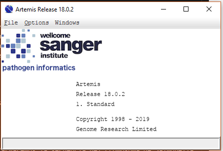
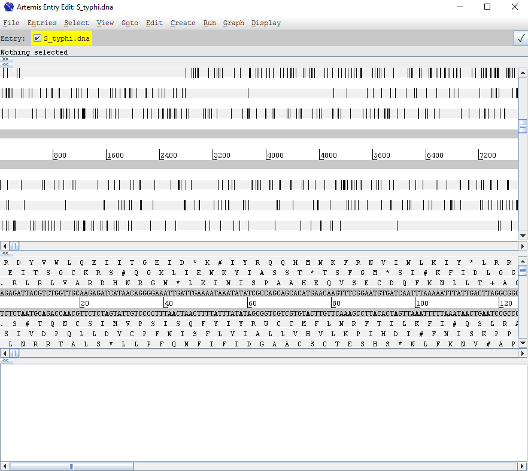
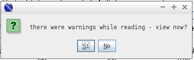
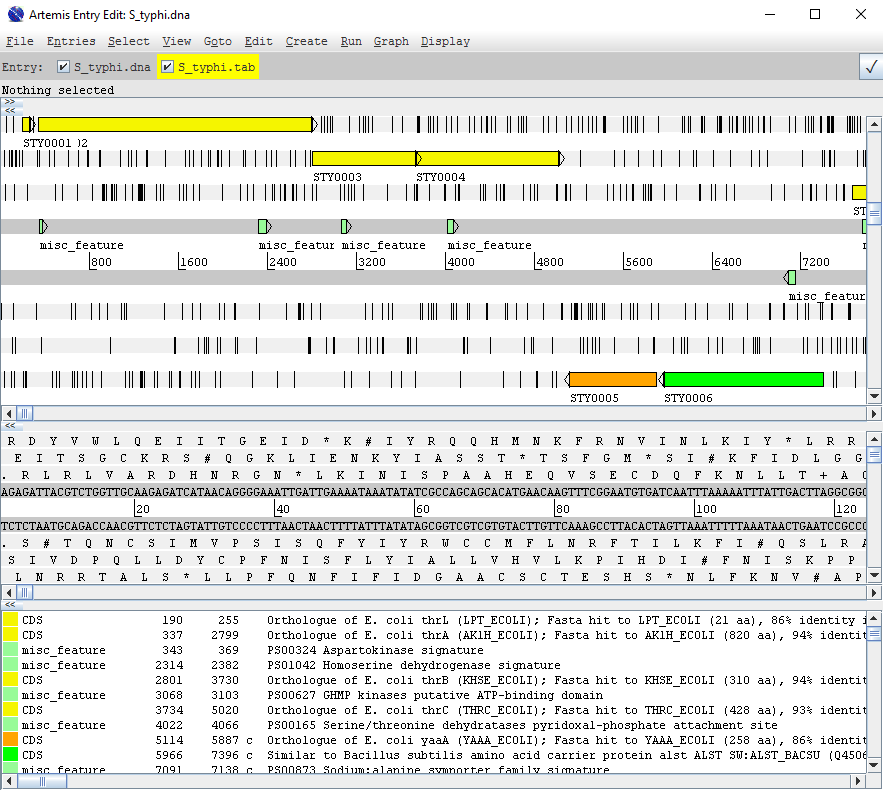
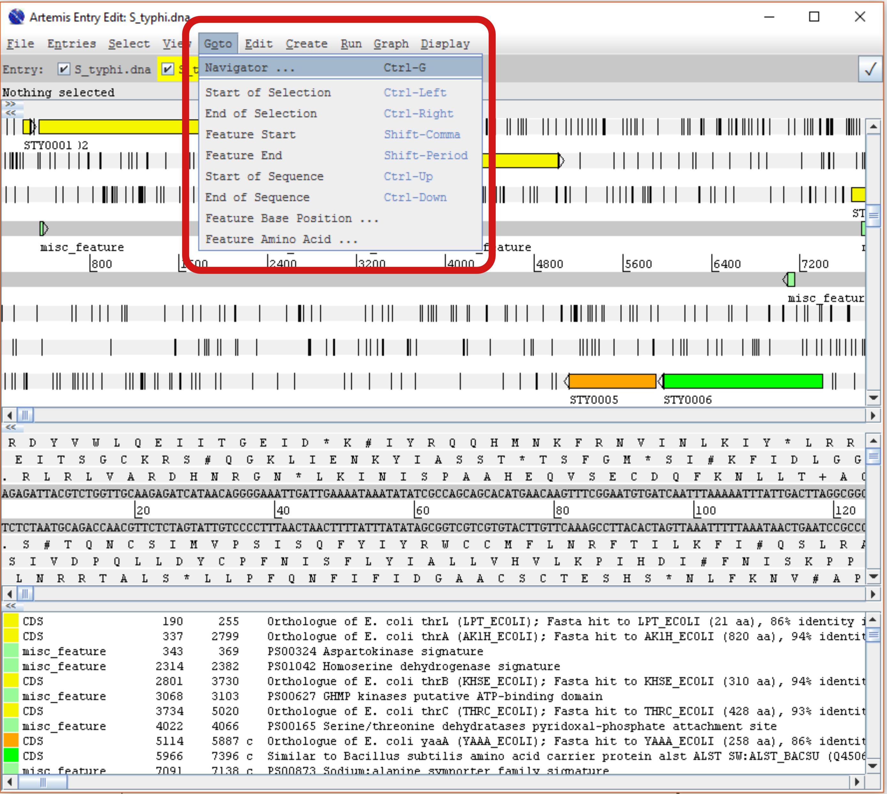
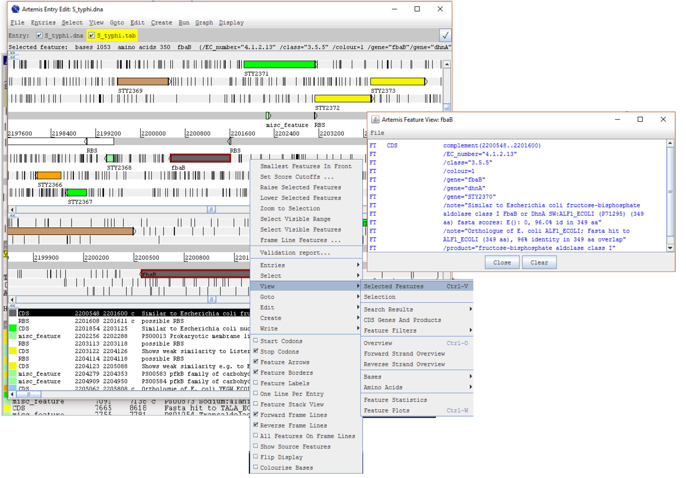
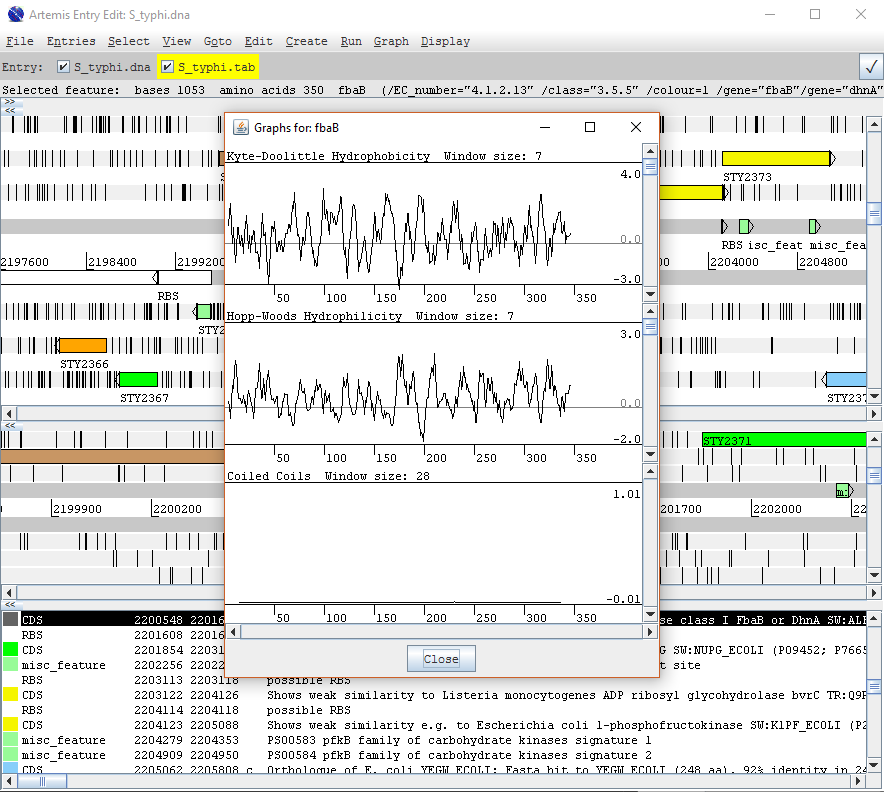
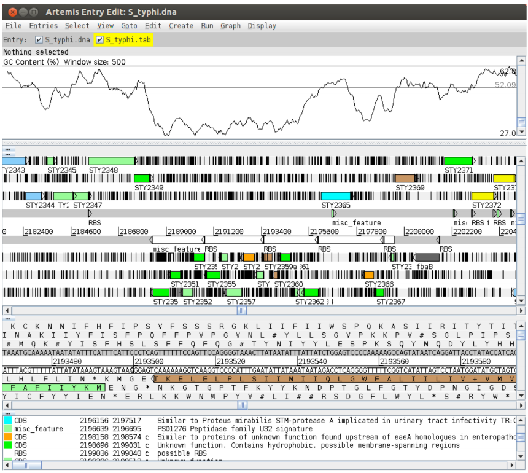
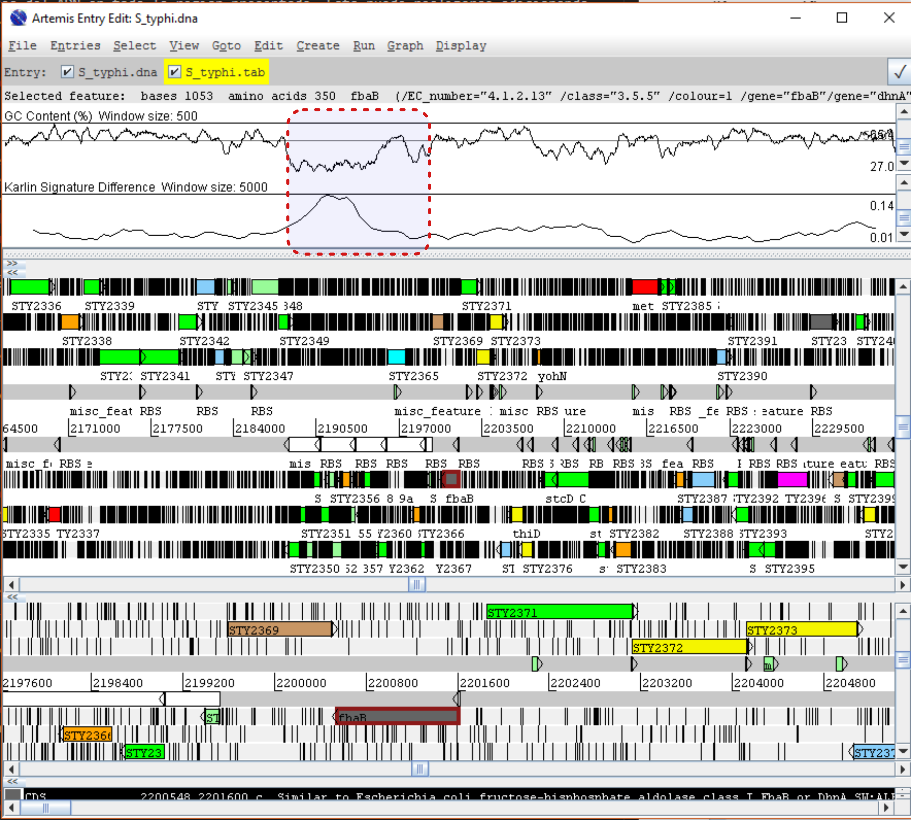
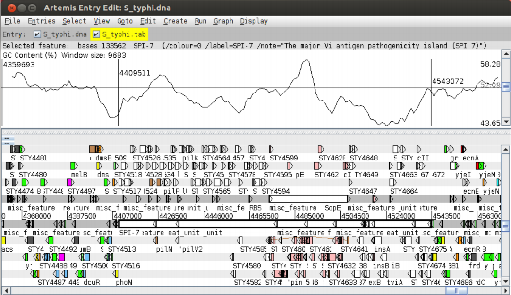

{ width="250", align="left" }
# **TP 13**. Visualizando genomas con Artemis { markdown data-toc-label = 'TP 13' }

<br>
<br>
<br>
<br>

<!--
## Videos de la clase grabada

* :octicons-video-16: [Introducción al TP](https://www.youtube.com/watch?v=mzzItpMc7ds)
* :octicons-video-16: [Resultados Verify y Procheck](https://www.youtube.com/watch?v=t6P6AprFvVg)
* :octicons-video-16: [Puesta en común del TP](https://www.youtube.com/watch?v=vAtKowbM4oo)
-->

[:fontawesome-solid-download: Materiales](https://drive.google.com/file/d/1E8YfobRpIbyluM_lqBi2HXyQzl6CKG1A/view?usp=sharing){ .md-button .md-button--primary }

## Introducción

Artemis es una herramienta de visualización y anotación de ADN gratuita desarrollada por Kim Rutherford (Rutherford et al.,2000). Es utilizado rutinariamente para la anotación y el análisis de genomas procariotas y eucariotas. Además, artemis puede ser utilizado para visualizar datos mapeados de secuenciación de segunda generación (NGS, next generation sequencing).

Artemis permite al usuario visualizar archivos de secuencias simples, archivos en formato EMBL/Genbank y los resultados de análisis de secuencias en un formato gráfico altamente interactivo e intuitivo. Artemis permite inspeccionar distintos tipos de información, por ejemplo, motivos de secuencia de ADN, arquitecturas génicas locales (e.g. operones), varias kilobases de un genoma o  cromosomas enteros en una única pantalla. Artemis también permite guardar el análisis realizado para continuar trabajando luego.

## 	Objetivos

* Familiarizarse con las funciones básicas de Artemis.

## Ejercicio 1. Conociendo Artemis

### 1. Iniciar el programa

Antes de iniciar el programa es necesario indicar la versión de java a utilizar para esto ingrese en la terminal:

```
sudo update-java-alternatives --set java-1.11.0-openjdk-i386
```

El output en la terminal puede ser similar, aunque no igual, a lo siguiente:

```
update-alternatives: error: no hay alternativas para appletviewer
```

Pueden repetirse varias lineas similares a esta o no haber ningún output. Pero sigan adelante y si lo siguiente no funciona nos llaman.


Para abrir el programa también se usa la terminal: 

```bash
cd ~/Tools/artemis/
./art
```

Aparecerá una pequeña ventana de inicio como la siguiente:



Cargaremos la secuencia del cromosoma de *Salmonella typhi*, para esto vayan a:

*File* → *Open*.

Vayan a la carpeta del TP y abran el archivo `S_typhi.dna` selecciónelo y clickee en `Open`. 

Si todo salió bien se les abrirá una ventana de Artemis como la siguiente (si no fue así, pidan asistencia).



### 2. Cargando archivos de anotación (*entries*) en Artemis
Para cargar el archivo de anotación del cromosoma de *Salmonella typhi* vaya a:

*File* → *Read An Entry*

seleccione el archivo `S_typhi.tab` y clickee en `Open`.

Puede ocurrir (o no) que aparezca una ventana como la siguiente:



So es así. haga click en `No`

Debería aparecer la siguiente información de la Entry:



### 3. Vista básica de Artemis

Las diferentes partes de Artemis son:


1. **Menúes desplegables.**

2. **Entradas activas.** En nuestro caso son `S_typhi.dna` y `S_typhi.tab`. 

    Entre 2 y 3 figura un renglón gris que dice: *Nothing selected*. Al hacer click en alguna parte de la sección 3 aparecen las características (o *features*) de la región seleccionada.

3. **Panel principal de visualización**. Las 2 líneas grises centrales representan la hebra de ADN positiva (arriba) y la negativa (abajo). Arriba y abajo de ellas se encuentran los 3 marcos de lectura en cada sentido, respectivamente.

    * Los codones *stop* en cada marco de lectura son señalados con barras negras verticales.

    * Los genes y otros *features* (por ejemplo, dominios Pfam o Prosite) se muestran como rectángulos coloreados.

    **Barras de desplazamiento y zoom:**
    
    * La barra inferior en este panel permite desplazar hacia diferentes posiciones del cromosoma. Es una barra de desplazamiento.

    * La barra derecha en este panel permite hacer *zoom in* (hacia arriba) o *zoom out* (hacia abajo).


4. **Panel de secuencia**. Permite observar la secuencia de nucleótidos y de aminoácidos. 

    Si hacen doble click sobre un gen en el *panel principal*, en el panel de secuencia ocurre un acercamiento del gen, es decir, se enfoca en la región en la cual se hizo doble click.
    
    **Barras de desplazamiento y zoom:**
    
    * La barra inferior en este panel permite desplazar hacia diferentes posiciones del cromosoma. Es una barra de desplazamiento.

    * La barra derecha en este panel permite hacer *zoom in* (hacia arriba) o *zoom out* (hacia abajo).

5. **Panel de características o *features***. Muestra las características correspondientes a la entry, en el orden de ocurrencia en el ADN. Si una *feature* se selecciona en el panel principal o en el panel de secuencia, aparece resaltada en negro.

    Se puede hacer doble click en una *feature* que será resaltada en el panel principal y en el de secuencia.


### 4. Utilizando Artemis

En Artemis, existen distintas maneras para ubicarnos en una región del cromosoma que nos interese.

El método a utilizar depende de lo que cada uno este tratando de realizar y conocer cual conviene se logra con práctica.

#### Método 1: El menú 'Goto'

Las funciones en este menú son atajos para dirigirse a sitios dentro de *features* seleccionados o para saltar al final o principio de la secuencia de DNA (con excepción del `Navigator`). 

Son muy intuitivos, asi que pruebenlos!



!!! idea "Tareas:"

        1. Hagan *zoom out* en el panel principal y marquen una región grande de secuencia clickeando el botón izquierdo del mouse y arrastrando el cursor. Vayan al principio y al final de la región seleccionada.

            *Goto* → *Start of selection*

            *Goto* → *End of selection*

        2. Seleccionen un CDS (*Nucleotide Coding Sequence*) en el panel de *features*, vayan al principio y al final del mismo.

            *Goto* → *Feature start*

            *Goto* → *Feature end*

        3. Vayan al principio y al final de la secuencia del cromosoma.

            *Goto* → *Start of sequence*

            *Goto* → *End of sequence*

        4. Seleccionen un CDS. Observe la posición inicial y final del mismo. Calcule su longitud como `posición final - posición incial + 1`
        
            Dentro de él, vayan a una base que quieran.

            *Goto* → *Feature base position*
        
            ¿Qué ocurre si elijen una posición por fuera del rango de posiciones indicadas?
            
            Pruebe elegir 1. ¿Qué ocurre?

            Como verán, la posición indicada es relativa al inicio del CDS y no absoluta al cromosoma.        
#### Método 2: Navigator

Vaya a: 

*Goto* → *Navigator*

Se abrirá una ventana como la siguiente:


!!! idea "Tareas:"

        1. **Goto Base:** Permite ir a una base determinada.

            Piensen un número entre 1 y 4809037 y vayan a esa base

        2. **Goto Feature With Gene Name:**  Permite ir a un gen según su nombre.
        
            Prueben 'fts'

        3. **Goto Feature With This Qualifier Value:**  Permite  buscar en todos los *qualifiers* por un término particular. 
        
            Pruebe usando la palabra `pseudogene` le llevará al próximo *feature* que contenga esa palabra en cualquiera de sus qualifiers. Noten que repitiendo el clic en el botón `Goto` los llevará a lo largo de los pseudogenes a medida que se presentan en el cromosoma.

            Para la anotación de los genomas se utiliza un esquema de clasificación funcional mediante números, similar a los términos GO (*Gene Ontology Terms*), denominados *class qualifiers*. A cada CDS se le asigna un *class qualifier* de acuerdo a su función. 
            
            Usando *Goto Feature With This Qualifier Value* busque CDS que pertenecen a las siguientes clases:
            
            * 0.0.1 (Conservados en Escherichia coli)
            * 1.4 (Respuestas protectivas)
                * 1.4.1 (Muerte celular)
                * 1.4.2 (Detoxificación)
                * 1.4.4 (Sensitividad a la radiación)
            * 3.1 (Biosintesis de aminoácidos)
                * 3.1.01 (Biosíntesis de alanina)
                * 3.1.09 (Biosíntesis de glicina)

        4. **Goto Feature With This Key:** Permite buscar por las palabras claves que definen el tipo de *feature* por ejemplo: CDS o misc_feature.
        
            * Pruebe buscar `tRNA`.

        5. **Find Base Pattern:** Permite buscar secuencias consenso de ADN. Pueden ser reales o inventadas.

            Permite utilizar valores de bases degeneradas. La letra `R` indica las purinas (`A` o la `G`) y la letra `Y` indica las pirimidina (`C` o la `T`).
            La letra `W` indica (`A` o la `T`) y la letra `S` indica (`C` o la `G`). 
            Por último, la letra `N` indica (`A`,`C`,`G` o la `T`).

            * Pruebe buscar `GATTACA`. ¿Aparece solo en la hebra positiva?

            * Pruebe buscar TATA box utilizando la secuencia: `TATAWAWR`

        6.  **Find Amino Acid Pattern:** Permite buscar secuencias consenso de aminoácidos (reales o inventadas). Pueden utilizar 'X' para indicar que cualquiera de los 20 aminoácidos es posible.
        
            !!! warning
            
                Noten que estas búsquedas se realizan en todos los marcos de lectura independientemente de si realmente codifican aminoácidos o no.

#### Método 3: Feature Selector

Vaya a: 

*Select* → *Feature Selector...*

Se abre una nueva ventana donde podemos elegir los criterios de selección. Cada una de las opciones tiene una checkbox a la izquierda que permite usar o ignorar cada criterio, y por ende combinar los mismos.

* **Key**. Desde el menú desplegable se puede elegir que tipo de elemento queremos seleccionar (CDS, tRNA, TMM, etc.). Se lista una gran variedad independientemente si están o no anotados en nuestra secuencia.

Pruebe seleccionar `tRNA`, haga click en select y luego elija `View`

- **Qualifier**. Nos permite refinar la búsqueda encontrando un texto determinado en el campo seleccionado (por ej. si elegimos EC_number podemos encontrar las regiones codificantes que pertenezcan a una categoría determinada como hicimos en *Navigator*). Debajo del campo para escribir el texto encontraran 3 cajas más que con opciones para la búsqueda del texto.

- **Up to/At least**. Aquí podemos restringir la búsqueda por cantidad de bases o exones que contiene la secuencia a seleccionar. No guarda mayores misterios.

- **Amino acid motif**. Por último, podemos buscar regiones que contengan ciertos patrones de aminoácidos y si su búsqueda debe llevarse a cabo en la hebra positiva, negativa o ambas.

Al finalizar la elección de criterios pueden apretar *Select* para seleccionar las regiones que cumplan con la búsqueda, o *View* para que nos dé una lista de los hits, con el mismo formato que la que encontramos bajo el panel principal.

* Marquen una región, luego desde el menu del click izquierdo, seleccionen *Zoom to selection*.

## Ejercicio 2: Análisis particulares y globales

### Analizando información específica

<!--


Una vez que estén ahí visualizaremos la información específica disponible como se indica en los siguientes puntos.
-->
#### Anotaciones

Si clickean en un *feature* en particular pueden ver la anotación asociada a él.

* Seleccionen un *CDS feature* ( o cualquier otro *feature*) y clickeen en el menú *View* → *Selected Features* o pueden hacer click derecho ir a *View* → *Selected Features*.

Aparecerá una ventana conteniendo toda la anotación asociada con este CDS. Similar a la que se muestra a continuación.

{width="500"}

Ahora haga click derecho y vaya a:

*Write* → *Codon Usage Of Selected Features*

* Guarde el archivo e investíguelo con el editor de texto.
* ¿Qué observa en el archivo?
* ¿Para qué considera que es útil esta información?

#### Visualizando secuencias de aminoácidos

Clickeen en el menú *View* y vayan o bien a *Bases* o bien *Amino Acids*. Hay dos opciones para visualizar los nucleótidos o aminoácidos (según si eligieron *Bases* o *Amino Acids*) del *CDS feature* que seleccionaron.

Se pueden visualizar en dos formatos, ```EMBL``` (*Aminoacids Of Selection*) o ```FASTA``` (*Aminoacids Of Selection As FASTA*).

Esto puede ser muy útil cuando se desea utilizar la secuencia en otros programas que no están integrados en Artemis.

{width="500"}

#### Gráficos

Para abrir gráficos de características de un *CDS feature*, vaya a:

*View* → *Feature Plots*

Se abre una ventana con gráficos para la región seleccionada de:

* Hidrofobicidad. Kyle-Doolittle Hydrophobicity.
* Solubilidad en agua del aminoácido según su ubicación en la proteína. Hopp-Woods Hydrophilicity.
* Probabilidad de formación de Coiled-Coils.

{ width="500" }

### Analizando información global

Además de visualizar información específica de *features* anotados también se pueden observar las características del ADN en toda la región presentada.

Esto puede realizarse adicionando diferentes gráficos mostrando distintas características del ADN.

<!--
En el directorio de este módulo encontrarán una tabla de uso de codones, ```S_typhi.cod```, que permite generar un gráfico de uso de codones. Vaya a:

*Graph* → *Add usage plots*
-->

Clickeen en el menú *Graph* para ver todos los gráficos disponibles.

* Prueben abrir el gráfico de 'GC content (%)'

Para ajustar la suavidad de los gráficos pueden cambiar el tamaño de la ventana sobre la cual los puntos del gráfico son calculados, utilizando el deslizador vertical a la derecha de los mismos.

{ width="500" }

!!! info "Nota"

    La información de los gráficos es generada dinámicamente por Artemis y aunque este es un ejercicio relativamente rápido para una pequeña región de ADN, en una vista de genoma completo esto puede demorar un rato o colgarse.

Vaya a la región localizada entre las bases 2188349 y 2199512 en la secuencia de ADN.

Esta región esta *upstream* al gen fbaB, el cual codifica la **fructosa bisfosfonato aldolasa**.

Pueden utilizar el *Navigator*, el *Feature Selector* o las funciones de *Goto* discutidas previamente para ir a esta localización.

Observen cómo los gráficos muestran una desviación marcada en la región que están visualizando (cerca del gen fbaB). Para apreciar mejor la anomalía de esta región, agranden un poco la región visualizada. **¿Qué les sugiere el contenido inusual de nucleótidos en esta región del ADN?**

{ width="500" }

Además de visualizar las características de regiones pequeñas del genoma, también se puede alejar la imagen y observar características del genoma como un todo. 

!!! warning "Posibilidad de cuelgue de Artemis"

    Alejar la imagen rápidamente con todos los *features* desplegados puede hacer que artemis se cuelgue. 

Para no correr riesgos:

1. Apaguen los indicadores de codones stop haciendo clic derecho sobre la ventana principal. Aparecerá un menú con la opción de deseleccionar los codones stop.
2. Eliminar temporariamente todo los "features" de anotación. Para realizarlo descliqueen la caja de "S_typhi.tab" en la barra de entrada debajo de la barra de menú.

    { width="500"}

3. Ajustar la escala de los gráficos desplegados antes de alejar la imagen. Esto aumenta el tamaño de ventana sobre el cual un punto en cada gráfico es calculado. Cliqueen con el botón derecho del mouse sobre la ventana de un gráfico en particular. Aparecerá un menú con una serie de valores para los tamaños máximos de ventana, seleccionen 500. Esto deben hacerlo para cada gráfico desplegado.

    { width="500"}

4. Ahora están listos para alejar la imagen haciendo clic sobre el deslizador de la ventana principal y arrastrando hacia abajo.


## Ejercicio 3: Anotando el genoma

Ahora vuelvan a seleccionar `S_typhi.tab` en las entradas activas para volver a visualizar las anotaciones. Vayan a la posición 4409511. Buscaremos aquí una región denominada *Salmonella pathogenicity island (SPI)*.

En el genoma con el que estamos trabajando la veremos como "*The major Vi antigen pathogenicity island (SPI 7)*"; una región de ~134 kb de largo que contiene un bacteriófago de ~30 kb. 

{ width="500" }

Esta región es un ejemplo clásico de SPI. La definición exacta de qué constituye una isla de patogénesis es, de hecho, bastante diversa; pero las carcterísticas fundamentales comunmente observadas en estas regiones son, según Hacker *et al*., 1997.

1. Normalmente insertas entre dos RNAs estables flanqueantes.
2. Contenidos de G+C atípicos.
3. Codifican, entre otras cosas, para factores de virulencia.
4. Codifican, además, para transposas o integrasas.
5. Se trata de un "cassette" inestable y auto-móvil. 
6. De distribución filogenética limitada.

Para corroborar que efectivamente esta región es un SPI, vamos a extraerla del genoma completo y realizar algunos análisis puntuales.

Vamos a apuntar a escribir y guardar un nuevo archivo EMBL, que incluirá nuestras anotaciones para esta región exclusivamente.

Para ello seleccionaremos nuestro presunto SPI y, en la barra de menús desplegables, iremos a `Edit` > `Subsequence (and Features)`. Esto abrirá una nueva ventana. A primera vista no parecerá muy distinta a la ventana anterior (la principal, en la que tenemos cargado nuestro genoma), pero si miran un poco mejor notarán que

- Los nombres de las `entries` han cambiado (*no name*)
- Se han re-numerado las bases y ahora todas se relativizan a nuestra selección
- La nueva ventana se extiende desde el principio y hasta el final del presunto SPI, pero no podemos ver nada del genoma completo por fuera de ésta. 

Nótese que en la barra de `entries` de esta nueva ventana, como en la original, también tenemos dos entradas. Si desmarcan una o la otra, notarán que de hecho son las mismas entradas que en la original (contienen la misma información y están en el mismo orden). No obstante, dado que la sub-secuencia ahora es una sesión nueva de Artemis, este comportamiento previene que los originales sean sobre-escritos.

Vamos a guardar estos nuevos archivos con nombres relevantes, para evitar confusiones. Vayan a:

*File* → *Save An Entry As* → *New File*.

Un nuevo menú nos preguntará cuál de nuestras entries vamos a guardar. 

En este punto ambas se llaman *no name*, lo cual puede resultar confuso. Lo único que nos ayudará a saber cuál es cuál es el orden. Por lo tanto: 
 
* Tomen el primero (desde arriba) y guárdenlo como `spi7.dna`.
* Repitan el proceso para el segundo y llámenlo `spi7.tab`.

Ahora que hemos guardado podemos empezar a jugar sin miedo a sobreescribir los originales ni a perder nuestro progreso. Lo primero que haremos será identificar los límites del bacteriofago que está inserto en SPI7. Hallar estos límites será equivalente a hallar los sitios de inserción del fago. 

Es importante notar que el `Feature Selector` puede usarse de muchas maneras. En el ejemplo del fago teníamos todo marcado y eso nos facilitó el trabajo, pero también podríamos seleccionar subsets de features de un genoma usando texto o secuencias de aminoácidos.

> Esto significa que, si sabemos qué fago es (o sabemos qué clase de integrasa está involucrada en la integración del mismo), y la secuencia flanqueante del mismo está caracterizada, podríamos buscar nosotros mismos la región sin la necesidad de tenerla pre-anotada. 

Afortunadamente para nosotros, estas regiones ya han sido previamente identificadas y coloreadas en rosa (código de color 12). Para buscarlas podríamos emplear los métodos que ya aprendimos más arriba, pero una búsqueda avanzada por `Feature selector` es más apropiada:


Todos los genes listados en (6) son aquellos cuyas anotaciones cumplen con los criterios seleccionados. Se pueden copiar/cortar/mover a una nueva entry para aislarlos del resto de la información contenida en `spi7.tab`. Para ello, primero vamos a crear una entry vacía: `Create` > `New Entry`. Veremos que aparece una nueva entrada que se llama, como habrán imaginado, `no name`.  

Ahora seleccionamos todos los CDSs mostrados en la lista haciendo click en `Select` > `All`. Todas las features deberían estar seleccionadas. Para copiarlas a otra entry (es decir, a otro archivo) hagah click en `Edit` > `Copy Selected Features To` > `no name` (nuestra entry vacía). Cierren las ventanas de selección y vuelvan a la ventana con la sesión del SPI-7. Podrían renombrar *no name* como *phage.tab*, por ejemplo. Ahora si desmarcan la cajita de spi7.tab en la barra de entries, deberían quedar solo las features asociadas al fago (provistas por el archivo *phage.tab* que acabamos de crear).

Si miran a la ventana con la sesión del SPI7 (y desmarcaron la entry de `spi7.tab`, dejando solo la `phage.tab` marcada), podemos intuir que el profago ocupa una porción discreta de todo el SPI-7. Usualmente, es útil crear una nueva feature de DNA para marcar el genoma a partir de estas observaciones. Para esto, apaguen los *stop codons* y luego usen el botón izquierdo del mouse para generar una selección, arrastrándolo de izquierda a derecha, de lo que consideren ustedes que define al profago. 


Ahora, con la región seleccionada hagan click en `Create` > `Create Feature from base range` y una ventana para editar la feature aparecerá en pantalla. Por defecto, Artemis asigna *CDS* a la *key* una nueva feature. Esto es incorrecto, ya que lo que buscamos marcar es una región del genoma que no es interesante por su caracter codificante/no-codificante; sino que tiene un fin más bien topográfico. Cambiemos esa key a *misc_feature*. También pueden agregar calificadores haciendo click en `Add Qualifier`. Usando calificadores podemos poner cosas como un `label`, que se usan para mostrar como *nombre* de una secuencia en el panel de visualización principal. 

Ahora que ya han creado nuestra feature, volvamos a encender el `spi7.tab` para ver qué tan bien lo hicieron :tada:. 

Lo último que harán con este ejercicio es escribir sus nuevas anotaciones (`spi7.dna/spi7.tab`) en un archivo tipo EMBL para *submission*; y crear un fichero combinado de anotaciones y secuencia, también en formato EMBL para *submission*. 

Para hacer esto, copien las anotaciones del .tab en el .dna y luego guarden esa entry como `EMBL format`. No se preocupen por los mensajes de error que aparecen. Estos errores tiene que ver con que no todas las features son aceptadas en la base de datos EMBL, y el programa nos advierte que éstas no se van a guardar. La siguiente figura muestra un paso a paso para generar el EMBL.


Si todo salió bien, pueden abrir ahora el EMBL que acaban de guardar y deberían ver algo así


Verán que los colores de la features han cambiado. Esto ocurre porque no todos los calificadores son válidos/acpetados por la base de datos de EMBL, así que éstos no han sido guardados. El qualifier '/colour', por ejemplo, es uno de ellos, por lo que al importar el archivo Artemis los muestra con los colores por defecto. 

Esto implica que cuando descarguen una secuencia en formato EMBL para poner en artemis, siempre tendrán los colores por defecto. No obstante, podrán editar los colores y agregar todos los calificadores que quieran para facilitar su trabajo dentro de Artemis, aunque luego no puedam volver a ser guardados como EMBL. 

### Ejercicio 4: Búsquedas en bases de datos

Este ejercicio los introducirá a las búsquedas en bases de datos a través de la interfaz de Artemis y cómo podemos usar esta función para anotar genes. 

Volvamos a la ventana de *S. typhi*. Vamos a trabajar con el gene *hpcC* (STY1136). Prueben llegar al gen de distintas maneras, así practican. Vamos a analizar el marco de lectura del gene *hpcC*, y para hacerlo vamos a encender todos los codones de *stop* y a cerrar todos los gráficos de %GC que abrimos antes. 

Como ven, nuestro gen esta lleno de codones de *stop*, lo que sugiere que estamos en presencia de *pseudo gen*. Para corregir esta anotación vamos a realizar una búsqueda en base de datos en tres simples pasos:

1. Seleccionamos nuestro **CDS**.
2. Clickeamos en **Run > NCBI Searches**
3. Y mandamos el **blastp**

Este proceso nos presentará una ventan con parámetros customizables para el blast y, haciendo click en *OK*, daremos comienzo al proceso. Demorará algunos segundos y culiminará enviando un *request* al NCBI usando.

Esto nos abrirá una ventana en el navegador en la que podremos seguir el estado del proceso y, eventualmente, visualizar los resultados. 


¿Pueden ver dónde está introducido el codón de stop en nuestro gen? Fíjense que el último aminoácido que comparte nuestra secuencia con el mejor hit en la base de datos, es una **K**. A partir de esa **K** vemos que las secuencias empiezan a diverger. Acá hay que ponerse meticulosos: Volvamos a la secuencia query y revisemos las secuencias de aminoácidos propuestas en los tres marcos abiertos de lectura. ¿Qué ven cuando lo ven? :3 


¡El marco de lectura está corrido! *¿Tienen alguna hipótesis de por qué puede pasar esto?*

Bien, ya descubrimos el error. Solo nos queda solucionarlo. Para hacerlo vamos a editar la secuencia codificante. Haremos click izquierdo en aminoácido que consideramos correcto después del último que sabemos que está bien (la K). Luego arrastramos hasta el final del gen para seleccionar toda la secuencia codificante. Con esta selección, crearemos una nueva *feature*: Create > Feature from base range > OK

Adicionalmente tendremos que editar la anotación anterior para acortarla. Para eso selecccionamos el *hpcC* original y clickeamos: Edit > Selected features in editor. En la nueva ventana que se abre vamos a cambiar las posiciones de finalización (en este caso sería la posición del último aminoácido que sabemos que está bien, K).

Finalmente vamos a *mergear* (si alguien sabe un sinónimo de ésto en castellano me avisa) ambas anotaciones como indica la figura:


1. Selecciono ambas anotaciones (usando shift)
2. Click en edit
3. Selected features > Merge
4. OK

El resultado va a ser algo así:


Si se fijan en sus resultados, van a ver que ambas anotaciones está conectadas por una linea; algo que veremos comunmente en genes con intrones... pero *S. tiphy*, como buena bacteria que es, no tiene intrones. 

¿Qué alternativa se les ocurre para arreglar este error?