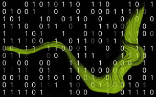
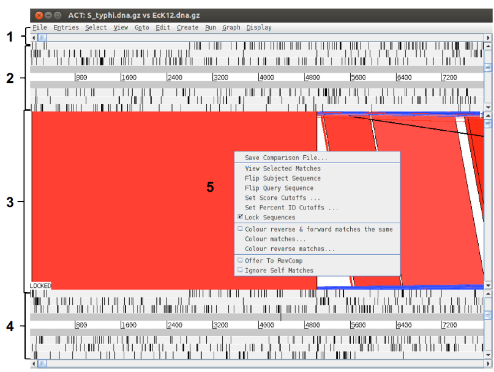

{ width="250", align="left" }
# **TP 14**. Genómica comparativa: ACT { markdown data-toc-label = 'TP 14' }

<br>
<br>
<br>
<br>

<!--
## Videos de la clase grabada

* :octicons-video-16: [Introducción al TP](https://www.youtube.com/watch?v=mzzItpMc7ds)
* :octicons-video-16: [Resultados Verify y Procheck](https://www.youtube.com/watch?v=t6P6AprFvVg)
* :octicons-video-16: [Puesta en común del TP](https://www.youtube.com/watch?v=vAtKowbM4oo)
-->

[:fontawesome-solid-download: Materiales](https://drive.google.com/file/d/1CylJG-hMV8Bx7pxNVLycKxvx3ibjL4kQ/view?usp=sharing){ .md-button .md-button--primary }

### Videos de la clase grabada

* :octicons-video-16: [Cierre TP](https://www.youtube.com/watch?v=JCBzg9Dt_A0)

## Objetivos

* Familiarizarse con las funciones básicas de ACT a través de varios casos de uso.
* Entender conceptos básicos de genómica comparativa.

## Introducción

ACT (*Artemis Comparision Tool*), también creada - entre otros - por Kim Rutherford, fue diseñada para extraer información adicional que solo puede ser obtenida a través de la comparación entre dos secuencias (Carver et al. 2005). 

Para trabajar con ACT es necesario proveerle al programa de tres archivos: dos de secuencias (las que voy a comparar entre sí), y uno de comparación. El archivo de comparación no es otra cosa que un **blastn** (o un tblastx) entre ambas secuencias. ACT puede leer varios formatos de archivo de comparación, pero por practicidad, nosotros usaremos BLAST para generarlo. En cuanto a los archivos de secuencia, ACT puede leer el mismo tipo de archivos de secuencia de Artemis (ej. multi-fasta, genbank, embl, etc.). 


??? info "tblastx"

	Se realiza una traducción de las secuencias nucleotídicas en los seis marcos abiertos de lectura (ORFs)	y se compara la secuencia aminoacídica.

## Primera Parte: preparación de los archivos de entrada

En esta primera parte, vamos a trabajar con dos genomas bacterianos (*E. coli* y *S. tiphy*).

ACT necesita, además de las secuencias, un archivo que contenga una comparación entre ellas. Pero dado que vamos a estar intentando comparar secuencias grandes, este archivo no puede ser simplemente un alineamiento continuo de las dos secuencias. La idea es poder visualizar rearreglos (inversiones, deleciones/inserciones, transposiciones) y para ello es necesario contar con una serie de alineamientos locales delimitados, con scores definidos (por ejemplo tal como los que produce BLAST).

<!--
Ver [ACT:Running a comparison](https://www.sanger.ac.uk/science/tools/artemis-comparison-tool-act).
-->

Para hacer la comparación, pueden usar bl2seq (BLAST 2 Sequences) en la linea de comando

```
bl2seq -m T -i EcK12.dna -j S_typhi.dna -p blastn -D 1 > EcK12vsStiphy.blastn
```

donde `-m T` (Mega BLAST = True) indica a BLAST que debe usar el algoritmo ​**Mega BLAST** para hacer el alineamiento y `-D 1` le indica que el formato de output sea tabular, que es el formato que requiere ACT.


??? "Si no funciona"

	En su directorio de trabajo, tienen el archivo pre-calculado con el nombre `EcK12vsStiphy.blastn.pre`.


### Iniciar ACT

Para abrir el programa podemos usar la terminal: 

```bash
cd ~/Tools/artemis/
./act
```

> Nota: Aunque lo parece, no es el mismo programa que el TP13!

Vaya a:

*File* → *Open*

Cuando se abre un proyecto, el programa pide como entrada los tres archivos con los que estaban trabajando:

- **Sequence File 1:** ``EcK12.dna``
- **Comparison File:** ``EcK12vsStiphy.blastn``
- **Sequence File 2:** ``S_tiphy.dna``

### Navengando en ACT

ACT está basado en Artemis, por lo que ya estarán familiarizados con muchas de sus funciones generales; y está compuesto esencialmente de tres capas o ventanas.

* **La ventana superior e inferior** son mini-ventanas de Artemis (con sus funcionalidades heredadas), mostrando la representación lineal de la secuencia de ADN con sus "*features*" asociados.

* **La ventana del medio,** muestra bloques rojos y azules, que se extienden y conectan regiones conservadas entre las dos secuencias.
	* Los bloques rojos son en el sentido directo
	* Los bloques azules son en el sentido inverso

Por lo tanto, 

* Si estuviéramos comparando dos secuencias idénticas en la misma orientación veríamos, en la capa central, un bloque rojo que se extiende a lo largo de la longitud de las dos secuencias. Como se muestra en la figura siguiente en la parte superior.

* Si una de las secuencias estuviera invertida se observaría un bloque azul entre las dos secuencias. Como se muestra en la figura siguiente en la parte inferior para la región central de los genomas.

* Regiones únicas en cualquiera de las secuencias, como deleciones o inserciones, se visualizarán como espacios blancos entre los bloques rojos o azules.


Veamos cómo se organizan estas ventanas y cómo podemos hacer para navegar a través de ellas:

{ width="500" }

1. **Menúes desplegables.** Son similares a los que vimos para Artemis, pero acá estamos trabajando con dos secuencias y no una, por lo tanto, salvo el menú `File`, lo primero es seleccionar una de las dos secuencias en la comparación en el menú.
2. **Panel de la secuencia 1.** La primera que ingresaron al comenzar la sesión de ACT. Es una mini-ventana de Artemis.
3. **Panel de comparación.** Muestra las regiones de similitud (rojo), diferencia (blanco) e inversiones (azul) entre las dos secuencias.
4. **Panel de la secuencia 2.** La segunda secuencia que ingresaron al comenzar la sesión.
5. Menú desplegable que se abre al hacer click derecho sobre el panel de comparación. 

Arriba y abajo de las secuencias 1 y 2, respectivamente, verán una barra de desplazamiento horizontal; y a los dos lados de ambas, una barra de desplazamiento vertical. Las primeras se usan para desplazarnos rio arriba o rio abajo en el genoma, mientras que las segundas se usan para acercar o alejar el foco.

* Pruebe alejar el foco de ambas secuencias hasta que pueda ver ambos cromosomas completos en pantalla.

Deberíamos ver algo así (o similar):

{ width="500" }

Cuando nos desplazamos horizontalmente en una secuencia, la otra se desplaza acompañando el movimiento.

Este es el comportamiento por defecto y ocurre porque las secuencias están "bloqueadas" o `LOCKED`. Se se fijan en la imagen anterior, verán que a la izquierda aparece "LOCKED" indicando que esa opción está activada.

Generalmente es el comportamiento más conveniente, pero si quisiéramos desactivarlo podemos hacerlo con click derecho sobre el panel de comparación y desmarcando la opción `Lock Sequences`.

Se pueden cambiar los umbrales (*cutoff*) que usa ACT para decidir si dibuja una línea o no conectando a los cromosomas. Esto podría ser útil para visualizar patrones o arreglos genómicos.

{ width="500" }

Hallarán estos *cuttoffs* haciendo click derecho en el panel de comparación:

{ width="500" }

* ¿Qué patrones o arreglos ven en la comparación de estos cromosomas? 

Agreguen ahora, a *S. tiphy* las anotaciones con el nombre ``SPIs.tab``. Este archivo contiene todas las islas de patogenicidad de esta *Salmonella* (incluyendo la SPI-7, con la que trabajamos anteriormente)

Para incluir las anotaciones que se encuentran en el archivo `.tab` vaya a:

`File` → `Secuencia` → `Read an entry` 

{ width="500" }

* Las islas de patogenicidad ¿Están presentes en *E. coli* K12? Para verlo más fácilmente haga zoom en la secuencia y recórrala de principio a fin.

#### Algunas cositas más para probar

1. Pueden hacer doble click en las líneas rojas o azules para centrarlas en pantalla
2. Inviertan alguna de las secuencias (``click derecho`` > ``Flip subject/query sequence``)
3. Para refinar la visualización la barra de desplazamiento vertical del panel de comparación, moviéndola hacia arriba o hacia abajo, permite filtrar la aparición de líneas de comparación en función de la longitud del match (más largas o más cortas, respectivamente).

Cuando ya se hayan aburrido, cierren **todo** para arrancar una nueva sesión con el próximo ejercicio.

## Segunda Parte:

Esta segunda parte la haremos con dos genomas de patógenos eucariotas, emparentados taxonómicamente: *P. falciparum* y *P. knowlesi*. Ambos son agentes etiológicos de la malaria o paludismo.

*P. falciparum* ya ha sido secuenciado parcial y completamente y es el de mayor prevalencia como causante de la enfermedad en humanos.

*P. knowlesi* está menos estudiado ya que está más asociado a paludismo en primates no-humanos

Basándonos en la abundancia de información del primero y la cercanía evolutiva entre ambos, utilizaremos genómica comparativa para extraer información sobre *P. knowlesi*. 

El objetivo de esta segunda parte es comparar un fragmento genómico (contig) del cromosoma 13 de *P. knowlesi* con el cromosoma 13 completo de *P. falciparum*.

Esta comparación nos permitirá:

* Estudiar el grado de conservación del orden génico (sintenia)
* Identificar/anotar genes de *P. knowlesi*. 
* Identificar regiones únicas en las dos secuencias
* Verificar una serie de anotaciones automáticas realizadas para *P. knowlesi*.

Vamos a necesitar los siguientes archivos

- ``Pfal_chr13.embl`` - Archivo combinado con secuencia y anotaciones de *P. falciparum* 
- ``Pknowlesi_contig.seq`` - Archivo de secuencia *P. knowlesi* (sin anotaciones)
- ``Pknowlesi_contig.embl`` - Archivo de anotaciones automáticas *P. knowlesi* 
- ``Plasmodium_comp.crunch`` - Comparación entre ambos cromosomas

### Sintenia o conservación del orden de los genes

Comencemos por cargar nuestros archivos en el ACT.

* **Sequence File 1:** ``Pfal_chr13.embl``
* **Comparison File:** ``Plasmodium_comp.crunch``
* **Sequence File 2:** ``Pknowlesi_contig.seq``

Deberían ver algo así:

{ width="500" }

!!! idea "NOTA"

	*P. falciparum* tienen un archivo combinado que incluye secuencia y anotaciones (``*.embl``).

	*P. knowlesi* tienen un archivo de secuencia (``*.seq``) y un archivo de anotaciones (``*.embl``) que luego deberan cargar.


* Incluya las anotaciones de *P. knowlesi* (``Pknowlesi_contig.embl``)

* Utilicen las barras de desplazamiento horizontal para ubicar el contig de *P. knowlesi* en el cromosoma 13 de *P. falciparum*.

> Sugerencia: apaguen los codones de stop para ver mejor las regiones codificantes. Haga click derecho sobre la secuencia y desclickeé *codones stop*.

- ¿Qué ven? 
- ¿Qué hay de diferente entre los arreglos genéticos que vimos para bacterias y los que vemos para estos parásitos?
- ¿Hay regiones conservadas entre ambos parásitos?
- ¿Qué pasa con el orden de los genes?
- ¿Pueden ver alguna región en la que similitud esté "rota"?
- Hagan zoom a alguno de los genes anotados en *P. falciparum*. ¿Qué pasa con los genes predichos en *P. knowlesi*?
- ¿Pueden identificar genes conservados anotados en *P. falciparum* que no hayan sido debidamente anotados/predichos en *P. knowlesi*?

Ahora concentrémonos en una región particular. Diríjanse a la región delimitada por las coordenadas 815823..829969 en el cromosoma de *P. falciparum*. Hay una región codificante.

* ¿De qué gen se trata? (`Click derecho` → `View` → `Selected Features`)
* ¿Está presente en *P. knowlesi*?
* ¿Qué opinión les merece, en términos de relevancia biológica, esta observación?

<!--
Si ya llegaron hasta acá, avísenle al instructor para que podamos hacer una puesta en común respecto a esta parte. Mientras esperan al resto de sus compañeros, intenten encontrar más genes que estén presentes en uno y ausentes en el otro para sumar a la discusión.

> Para visualizar las anotaciones, pueden probar algunas opciones adicionales como:
> -	Prender/Apagar `One line per entry`
> - Prender/Apagar `Feature stack view`
> - Prender/Apagar `All features on frame lines`
> - Prender/Apagar `Feature labels`

> Todas las opciones están disponibles haciendo click derecho en la secuencia (como la opción de apagar codones de stop).
-->

### Predicción de modelos de genes

Por último, evaluaremos la capacidad de anotación automática utilizada para crear las anotaciones de *P. knowlesi*.

El archivo de anotaciones de *P. knowlesi* se construyó con un anotador automático: PHAT (_**P**retty **H**andy **A**nnotation **T**ool_, Mol. Biochem. Parasitol. 2001 Dec;118(2):167-74). Existen otros algoritmos con la misma función pero ninguno es perfecto al 100% y en general es necesario curar o refinar las predicciones.

Diríjanse, en el genoma de *P. falciparum*, al gen anotado como PFM1010w (o MAL13P1.103) usando el **Navigator**.

* ¿Pueden encontrar este gen en ambos parásitos? ¿Qué exon/es está/n conservado/s? Pueden usar el deslizador vertical del panel de comparación para incluir *hits* más cortos.
* ¿Pueden encontrar a todos los exones en el contig de *P. knowlesi* (ignoren por ahora el *Phat4_alternative* en rojo)?

<!--
Abran, para cada secuencia, los gráficos de %GC. ¿Qué características tiene la gráfica en *P. falciparum*? ¿Dirían que esa característica está conservada en *P. knowlesi* para el gen *Phat4*?

-->

Evalúen las siguientes regiones en el cromosoma 13 de *P. falciparum* en Artemis. 

- 789034..793351, 
- 657638..660023, 
- 672361..673753

Pueden abrir una sesión de Artemis directamente desde ACT:


* Revisen las regiones intrones (regiones entre exones) observen las dos bases del inicio del intrón y las dos bases nucleotídicas del final del intrón ¿Pueden hallar algún patrón? (Revise la hebra correcta del ADN)
* ¿Con qué proceso piensa que este patrón puede estar relacionado?
* A simple vista, ¿observa enriquecimiento en algún par de nucleótidos en los intrones?

<!--
The 5′ and 3′ splice site motifs for P. falciparum introns (GU and AG dinucleotides) follow the general eukaryotic pattern 
P. falciparum introns are comparatively short and extremely AT rich, averaging 179 nucleotides (nt) and 86.5% A+T (11). Some are located at the end of an open reading frame, adding a single amino acid (22), or in an untranslated region (UTR) (33, 34). 
-->

### Sintenias camufladas

Por último, vamos a buscar regiones sinténicas entre dos nuevos parásitos, *Trypanosoma brucei* y *Leishmania major*. Ambos son organismos eucariotas taxonómicamente emparentados por familia (*Trypanosomatidae*). 

*Trypanosoma brucei* es el causante de la enfermedad del sueño, y *Leishmania major* de la leishmaniasis. En este ejercicio evaluaremos la arquitectura de ambos genomas y la existencia de regiones de sintenia entre éstos.

Los archivos que usaremos son:

- ``Tbrucei.dna`` - secuencia *T. brucei*
- ``Tbrucei.embl`` - anotaciones *T. brucei* 
- ``Leish_vs_Tbrucei.tblastx`` - archivo de comparación
- ``Leish.dna`` - secuencia *L. major* 
- ``Leish.embl`` - anotaciones *L. major* 

Comiencen cargando las secuencias, apagando codones de stop y agregando las anotaciones.

- ¿Qué pasa con la conservación de la arquitectura genómica entre estos dos cromosomas? ¿Dirían que hay o que no hay sintenia?

<!--
- ¿Hay regiones conservadas entre los organismos? ¿Cuáles son los productos predichos para los genes en esas regiones?
-->