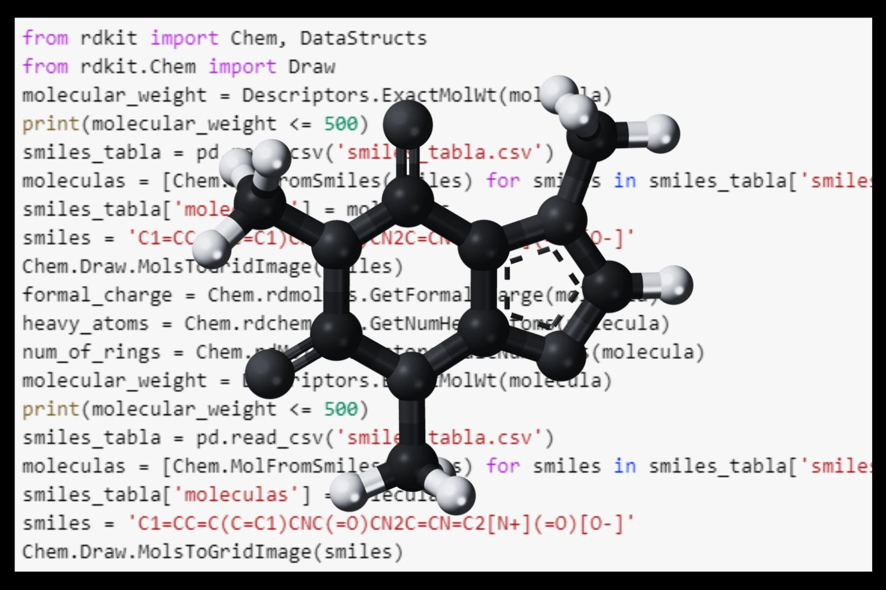
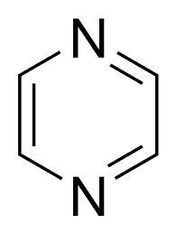

{ width="250", align="left" }

# **TP 14**. Quimioinformática { markdown data-toc-label = 'TP 14' }

<br>
<br>
<br>

<!--
[:fontawesome-solid-download: Materiales](https://drive.google.com/file/d/1AH55g4Fq7J8rHC5NCURW56d8KHzjeYfg/view?usp=sharing){ .md-button .md-button--primary }


### Slides mostrados en la clase

* :fontawesome-regular-file-pdf: [Slides TP](https://docs.google.com/presentation/d/1HtQb1Flv8BUBiSt9WaKAr09wrQimp7OOfHVsVwVN9uA/edit?usp=sharing)

### Videos de la clase grabada

* :octicons-video-16: [Cierre TP](https://youtu.be/sVNfC4hKA6c)
-->


### Software a usar
* [Google Colab](https://colab.research.google.com/)
* [RDKit](https://www.rdkit.org/docs/GettingStartedInPython.html)

<!--
### Recursos Online
* [Curso online de R de Coursera](https://www.coursera.org/learn/r-programming) (se puede hacer gratis) (en ese caso no da certificado)
* Data Tables: [Introducción oficial](https://cran.r-project.org/web/packages/data.table/vignettes/datatable-intro.html) y [otra página con más info](https://bookdown.org/paradinas_iosu/CursoR/data-table.html)
* ggplot2: [Vistazo rápido](https://bookdown.org/paradinas_iosu/CursoR/ggplot2.html), [detalles sobre los tipos de plots](http://sthda.com/english/wiki/ggplot2-essentials), [cheatsheet](https://raw.githubusercontent.com/rstudio/cheatsheets/main/data-visualization.pdf) e [información sobre colores y daltonismo](https://jfly.uni-koeln.de/color/)
* dendextend: [Detalle del paquete](https://cran.r-project.org/web/packages/dendextend/vignettes/dendextend.html)
-->


## Objetivos

* Conocer las bases de datos de compuestos químicos: PubChem, ChEMBL, SureChEMBL
* Familiarizarse con la representación de estructuras químicas (SMILES, SDF/Mol, InchI)
* Aprender a caracterizar fisicoquímicamente compuestos químicos

## Bases de datos

### PubChem
La primera que vamos a ver es PubChem, que es una base de datos químicos abierta del National Institutes of Health (NIH).

<br>

{ width="250", align="center" }

<br>

En esa base de datos se pueden cargar datos generados por nosotros o podemos usar los datos cargados por otras personas.
Recopila información sobre estructuras químicas, identificadores, propiedades químicas y físicas, actividades biológicas, patentes, salud, seguridad, datos de toxicidad y muchos otros.

Ahora vamos a ingresar y a recorrerla. Pueden acceder ingresando a este link: [PubChem](https://pubchem.ncbi.nlm.nih.gov/). En la página principal podemos ver que tenemos la opción de cargar una molécula en el recuadro blanco, de dibujar una estructura, de subir una lista de datos, de recorrer los datos disponibles y de acceder a una tabla periódica. En el práctico de hoy vamos a trabajar ingresando una sóla molécula, pero ustedes pueden explorar el resto de las opciones más tarde.

#### Actividad usando Pubchem
1.   Dentro del recuadro blanco pegar esta molécula:
`C1=CC=C(C=C1)CNC(=O)CN2C=CN=C2[N+](=O)[O-]` y usar la lupa para buscarlo dentro de la base de datos
2.   Verán que aparece un sólo resultado, una molécula llamada "BENZNIDAZOLE". Vamos a hacer click en el nombre para ingresar a ver la información que tiene cargada.
3.   A la derecha encontrarán la tabla de "CONTENTS" donde hay una lista de toda la información disponible para este compuesto. Recorran las diferentes secciones.
4.  Bajen hasta la sección "Names and Identifiers" ¿Que ven ahí?

En esta sección podemos ver que un compuesto químico puede escribirse de muchas maneras:
- The International Chemical Identifier (InChI)
- A 27-character hash code derived from an InChI (InChIKey)
- The Simplified Molecular-Input Line-Entry System (SMILES)

Cada una de estas notaciones tiene sus ventajas y desventajas.

Para cualquier trabajo quimioinformático, la notación que usemos para las moléculas va a ser clave. A continuación encontrarán un breve ilustración de la sintaxis de cada notación:

<br>

{ width="600", align="Center" }

<br>

En el caso de que quieran profundizar sobre los diferentes tipos de notación, en la publicación de dicha imagen pueden encontrar más información al respecto. Pueden acceder ingresando a este link: [https://doi.org/10.1186/s13321-020-00466-z](https://jcheminf.biomedcentral.com/articles/10.1186/s13321-020-00466-z)

### ChEMBL
La segunda base de datos que vamos a ver es ChEMBL, es una base de datos curada manualmente de moléculas bioactivas del Laboratorio Europeo de Biología Molecular (EMBL).

<br>

{ width="250", align="center" }

<br>

Es una base de datos de moléculas pequeñas similares a fármacos bioactivos, contiene estructuras bidimensionales, propiedades calculadas (p. ej., logP, peso molecular, parámetros de Lipinski, etc.) y bioactividades resumidas (p. ej., constantes de unión, farmacología y datos ADMET).

Ahora vamos a ingresar y a recorrerla. Pueden acceder ingresando a este link: [ChEMBL](https://www.ebi.ac.uk/chembl/). En la página principal podemos ver que tenemos la opción de cargar una molécula en el recuadro blanco o de recorrer los datos disponibles. Vamos a volver a ingresar la misma molécula que usamos antes.

#### Actividad N° 1 usando ChEMBL
1.   En el recuadro de búsqueda pegar esta molécula:
"(2S)-2-amino-3-(1H-indol-3-yl)propanoic acid". (Es importante que le pongan las comillas!)
2.   Apretar en la lupa para buscar
3.   Ingresar al compuesto "CHEMBL54976".
4.   A la derecha encontrarán una lista de toda la información disponible para este compuesto. Recorrer las diferentes secciones.

#### Actividad N°2 usando ChEMBL
1.   Debajo del recuadro blanco, ingresar a "Advanced Search".
2.   En la pestaña de "Chemical Structure" pegar esta molécula:
`C1=CC=C(C=C1)CNC(=O)CN2C=CN=C2[N+](=O)[O-]`
3.   Subir la "Similarity" al 100%
4.   Apretar el recuadro de "Similarity"
5.   Ingresar al compuesto "CHEMBL110".
6.   A la derecha encontrarán una lista de toda la información disponible para este compuesto. Recorrer las diferentes secciones.
7.  ¿Que diferencias encuentran con la información en PubChem?

### Base de Datos 3: SureChEMBL

SureChEMBL es una base de datos química que proporciona acceso a información valiosa sobre patentes relacionadas con compuestos químicos. Es una herramienta poderosa y ampliamente utilizada en el campo de la química y la investigación farmacéutica.

Lo que distingue a SureChEMBL es su enfoque en el análisis y la extracción de datos de patentes químicas de manera eficiente y estructurada. La base de datos recopila y organiza millones de patentes de todo el mundo, permitiendo a los investigadores explorar una gran cantidad de información en busca de nuevos compuestos, reacciones químicas y avances tecnológicos.

En 2013 la empresa Digital Science (dueña de SureChem) transfirió esta base de datos al EMBL-EBI, poniendola en el dominio público. Es la primera vez que una colección de estructuras químicas de patentes mundiales de este tamaño se pone a disposición del público y de forma gratuita, lo que lo convierte en un avance significativo en el descubrimiento de fármacos. ([Ver noticia](https://www.ebi.ac.uk/about/news/technology-and-innovation/SureChEMBL/))

<br>

{ width="600", align="center" }

<br>

Ahora vamos a ingresar y a recorrerla. Pueden acceder ingresando a este link: [SureChEMBL](https://www.surechembl.org/search/). En la página principal podemos ver que tenemos la opción de cargar una molécula en el recuadro blanco o de cargarla usando Marvin Js.

#### Actividad N°1 usando SureChEMBL
1.   Dentro del recuadro de Marvin Js, pegar este smiles
`CC(C)(C)C1=CC(=C(C=C1NC(=O)C2=CNC3=CC=CC=C3C2=O)O)C(C)(C)C`
2.   Seleccionar la búsqueda según Identical
3.   Apretar el recuadro de "Search"
4.   Apretar en el símbolo + y luego "View chemical page"

#### Actividad N°2 usando SureChEMBL
1.   Dentro del recuadro de Marvin Js, pegar este smiles
`O=C1C=CNC2=CC=CC=C12`
2.   Seleccionar la búsqueda según Substructure
3.   Apretar el recuadro de "Search"

¿Que encontramos haciendo este tipo de búsqueda?

## **Introducción a Google Colab**

### ¿Qué es Google Colab?
Colab, o Colaboratory, permite escribir y ejecutar Python en nuestro navegador. Nos da acceso a una máquina de manera remota.Las ventajas son:

*  No es necesaria ninguna configuración

*  Es fácil de compartir

*  Podemos utilizar fácilmente procesadores GPU (Graphics Processing Unit) que se diferencia del procesador “común”, el CPU (Central Processing Unit) porque tiene más núcleos, más especializados y por lo tanto permite realizar cómputos más complejos de manera más rápida.

Una característica no muy amigable es que no se pueden editar al mismo tiempo los documentos de Google Colab (que a partir de ahora llamaremos Notebooks)

Vayan a [https://colab.research.google.com/](https://colab.research.google.com/)

Y se les abre una ventana. En la parte inferior elijan: New Notebook

Y ahora sí! Manos a la obra!

### Preparación del notebook

En la celda que se encuentra a continuación vamos a importar e instalar todas las librerías que se van a usar.

Primero vamos a instalar todo el software RDKit y otras librerias que vamos a usar con el comando `!pip install`. Este comando permite que las librerias estén descargadas e instaladas en Google Colab.

Luego le vamos a pedir que "tenga a mano" las librerías que vamos a usar con el comando `import`. De esta manera las tiene abiertas dentro de Google Colab para que estén disponibles para usar.

Si compararáramos las librerías de Python con libros físicos, podríamos decir que `!pip install` es el equivalente a comprar el libro y tenerlo en nuestra estantería y que `import` es el equivalente a agarrarlo de la estanteria y a abrirlo en nuestro escritorio.

```Python
# Instalar las librerias
!pip install pandas rdkit tqdm chembl_downloader chembl_webresource_client seaborn
```

Ahora vamos a importar las librerias que vamos a usar

```Python
# Importar librerias para guardar trabajar con tablas y grandes cantidades de datos
import pandas as pd
import numpy as np

# Importar libreria de RDKit
from rdkit import Chem
from rdkit.Chem import AllChem
from rdkit.Chem import Draw
from rdkit.Chem import PandasTools
from rdkit.Chem.Draw import rdMolDraw2D

# Importar libreria de ChEMBL
from chembl_webresource_client.new_client import new_client

# Importar las librerias para graficar
import seaborn as sns
```

A lo largo de este práctico vamos a estar explorando las bases de datos quimioinformáticos y trabajando con los comandos básicos de RDKit para trabajar con moléculas.

## Análisis de datos quimioinformáticos
RDKit es un software quimioinformático de código abierto.


Fue desarrollado por Greg Landrum con numerosas contribuciones adicionales de la comunidad de código abierto RDKit. Tiene una interfaz de programación de aplicaciones para Python, Java, C++ y C#

- Homepage: http://www.rdkit.org Documentation, links
- Github (https://github.com/rdkit) Downloads, bug tracker, git repository
- Sourceforge (http://sourceforge.net/projects/rdkit) Mailing lists
- Blog (https://greglandrum.github.io/rdkit-blog/) Tips, tricks, random stuff
- Tutorials (https://github.com/rdkit/rdkit-tutorials) Jupyter-based tutorials for using the RDKit
- KNIME integration (https://github.com/rdkit/knime-rdkit) RDKit nodes for KNIME

### Generar una molécula a partir de SMILES
Para comenzar a trabajar necesitamos ingresar a la computadora el compuesto con el que vamos a trabajar, para eso vamos a generar una variable con la notación del compuesto. En este caso, vamos a usar la notación en smiles.

En programación se llama "variable" a la asignación de una palabra para identificar un objeto. En este caso, la palabra "smiles" la vamos a usar como variable para identificar la secuencia en smiles del Benznidazol.


```Python
# Generar la variable "smiles" que corresponde al smiles del Benznidazol
smiles_benznidazol = 'C1=CC=C(C=C1)CNC(=O)CN2C=CN=C2[N+](=O)[O-]'
```

Al generar la variable llamada smiles, guardamos la estructura en una palabra que podemos usar en el resto del código.

Vamos a ver que pasa si imprimimos la variable usando el comando print():


```Python
# Imprimir la variable
print(smiles_benznidazol)
```

RDKit cuenta con un módulo llamado `Chem()`

Usando la analogía del comienzo, un módulo es un cápitulo del libro de RDKit.

Este módulo se escribe continuado por la acción que queremos que haga.
Vamos a usarla mucho, a medida que la usemos vamos a ver que se puede hacer con ella.

En este link encontrarán todas las opciones posibles: https://www.rdkit.org/docs/source/rdkit.Chem.html

En este caso, el módulo va a estar seguido de la función `MolFromSmiles()`, porque queremos que transforme el <i>string</i> que generamos a una <i>molécula</i>.

Vamos a generar la variable <b>molecula</b> para guardar la molécula de Benznidazol generada.

```Python
# Generar una molécula a partir del smiles del Benznidazol
molecula_benznidazol = Chem.MolFromSmiles(smiles_benznidazol)
```

#### Actividad:

💭 ¿Qué pasa si ahora imprimimos la variable?
```Python
#Escribí el código acá
```

Ahora vamos a visualizarla!

Para hacerlo, sólo tienen que ejecutar el nombre de la variabl

```Python
# Visualizar la molécula
molecula_benznidazol
```

#### Actividad:

💭 ¿Lo que observas en la celda anterior corresponde con lo que viste en PubChem y en ChEMBL?

### Obtener moléculas de las bases de datos

Tanto PubChem como ChEMBL tienen herramientas informáticas para obtener moléculas de sus bases de datos. En este práctico vamos a usar ChEMBL.

Para trabajar con esta base de datos
vamos a usar la libreria `chembl_webresource_client`. Esta libreria nos permite acceder a la información disponible en la base de datos. De esa librería la importamos `new_client` y le indicamos que queremos buscar en la base de datos. Podemos ver los recursos disponibles usando el comando que se encuentra a continuación:

```Python
#Mostrar los recursos disponibles de la libreria chembl_webresource_client.new_client
available_resources = [resource for resource in dir(new_client) if not resource.startswith('_')]
print(available_resources)
```

En este práctico vamos a usarlo para traer todas las moléculas que contengan una pirazina. Este es un  es un compuesto orgánico aromático heterocíclico con la siguiente estructura:

<br>

{ width="250", align="center" }

<br>

Además, le vamos a pedir que nos traiga la información de aquellas moléculas que estén aprobadas por la FDA (max_phase=4) y que solo nos devuelva la información relacionada a su estructura:

```Python
pirazina = "C1CNCCN1"
moleculas_con_pirazina = new_client.substructure.filter(smiles=pirazina, max_phase=4).only([ 'molecule_structures'])
len(moleculas_con_pirazina)
```

#### Actividad:

💭 ¿Que hay en la variable `moleculas_con_pirazina`?
```Python
#Escribí el código acá
```

La librería `chembl_webresource_client` descarga los datos en forma de diccionario. Vamos a procesar esos datos en formato dataframe para poder trabajar con ellos. Además, vamos generar las moléculas de RDKit usando PandasTools

```Python
#Generar un DataFrame vacío
df_moleculas_con_pirazina = pd.DataFrame()
smiles_list = []

#Recolectar los SMILES del diccionario obtenido de ChEMBL
for i in range(len(moleculas_con_pirazina)):
    estructura = moleculas_con_pirazina[i]["molecule_structures"]
    smiles = estructura['canonical_smiles']
    smiles_list.append(smiles)

#Agregar una columna con los SMILES al DataFrame
df_moleculas_con_pirazina["smiles"]=smiles_list

#Generar las moléculas con RDKit a partir de la columna con los SMILES
PandasTools.AddMoleculeColumnToFrame(df_moleculas_con_pirazina, smilesCol='smiles')

#Visualizar el DataFrame
print(df_moleculas_con_pirazina)
```

💭 ¿Que información tenemos en el DataFrame?


## Propiedades fisicoquímicas

Ahora vamos a calcular los predictores de la clase. 

Para hacerlo, vamos a usar la función `Descriptors` y `Chem` de RDKit.

Esta función permite indicar que tipo de descriptor queremos calcular para una molécula.

Vamos a calcular:
* El número de donodores de enlaces de hidrógeno en la molécula 
* El número de aceptores de enlaces de hidrógeno en la molécula
* El peso molecular de la molécula
* El logP (coeficiente de partición octanol-agua) de la molécula
* El número de enlaces rotativos en la molécula

RDKit permite calcular más descriptores, pero estos son los más usados. Si quieren saber más sobre esto pueden acceder al [manual de RDKit](https://www.rdkit.org/docs/source/rdkit.Chem.rdMolDescriptors.html)

Para calcular las propiedades podemos usar este código reemplazando **molecula** por el nombre de la molecula que quieran usar:
```Python
# Calcular el peso molecular exacto de la molécula
molecular_weight = Descriptors.ExactMolWt(molecula)

# Calcular el logP (coeficiente de partición octanol-agua) de la molécula
logp = Descriptors.MolLogP(molecula)

# Calcular el número de donodores de enlaces de hidrógeno en la molécula
h_bond_donor = Descriptors.NumHDonors(molecula)

# Calcular el número de aceptores de enlaces de hidrógeno en la molécula
h_bond_acceptors = Descriptors.NumHAcceptors(molecula)

# Calcular el número de enlaces rotativos en la molécula
rotatable_bonds = Descriptors.NumRotatableBonds(molecula)
```

#### Actividad:

💭 Calculen las propiedades para `molecula_benznidazol`
```Python
#Escribí el código acá
```

Para calcular todas las propiedades en un sólo paso podemos definir una función que haga todos los pasos:

```Python
def drug_likness_decriptors(df):
    # Desactivar las advertencias de asignación encadenada en pandas
    pd.options.mode.chained_assignment = None

    # Crear listas vacías para almacenar los descriptores
    NumHDonors_list = []
    NumHAcceptors_list = []
    MW_list = []
    LogP_list = []
    rotatable_bonds_list = []

    # Calcular los descriptores para cada molécula en la columna 'ROMol'
    for element in df['ROMol']:
        try:
            # Calcular el número de donadores de enlaces de hidrógeno
            NumHDonors = Descriptors.NumHDonors(element)
            NumHDonors_list.append(NumHDonors)
        except:
            NumHDonors_list.append('N/A')  # Si ocurre una excepción, agregar 'N/A' a la lista
            pass

        try:
            # Calcular el número de aceptores de enlaces de hidrógeno
            NumHAcceptors = Descriptors.NumHAcceptors(element)
            NumHAcceptors_list.append(NumHAcceptors)
        except:
            NumHAcceptors_list.append('N/A')  # Si ocurre una excepción, agregar 'N/A' a la lista
            pass

        try:
            # Calcular el peso molecular exacto
            MW = Descriptors.ExactMolWt(element)
            MW_list.append(MW)
        except:
            MW_list.append('N/A')  # Si ocurre una excepción, agregar 'N/A' a la lista
            pass

        try:
            # Calcular el logP
            LogP = Descriptors.MolLogP(element)
            LogP_list.append(LogP)
        except:
            LogP_list.append('N/A')  # Si ocurre una excepción, agregar 'N/A' a la lista
            pass

        try:
            # Calcular el número de enlaces rotativos
            rotatable_bonds = Descriptors.NumRotatableBonds(element)
            rotatable_bonds_list.append(rotatable_bonds)
        except:
            rotatable_bonds_list.append('N/A')  # Si ocurre una excepción, agregar 'N/A' a la lista
            pass

    # Agregar las listas de descriptores al DataFrame
    df['HBD'] = NumHDonors_list
    df['HBA'] = NumHAcceptors_list
    df['MW'] = MW_list
    df['logP'] = LogP_list
    df['nRotB'] = rotatable_bonds_list

    return df
```

Y ahora usamos esa función en el `df_moleculas_con_pirazina`

```Python
df_moleculas_con_pirazina = drug_likness_decriptors(df_moleculas_con_pirazina)
```

#### Actividad:

💭 ¿Que información tenemos ahora en el DataFrame?
```Python
#Escribí el código acá
```

Es dificil visualizar la información en una tabla, entonces vamos a realizar histogramas de las propiedades que calculamos.

Existen dos librerías para graficar en python:

* [Matplotlib](https://matplotlib.org/)
* [Seaborn](https://seaborn.pydata.org/)

¡Vamos a probar como se ve el grafico de tipo hisograma en Seaborn!

```Python
sns.histplot(df_moleculas_con_pirazina['nRotB'])
```

#### Actividad:

💭 Realizá el gráfico de peso molecular
```Python
#Escribí el código acá
```

También pueden graficar todos los parámetros juntos usando el siguiente comando:

```Python
# Crear una figura con un arreglo de subplots de 2 filas y 2 columnas, con un tamaño de 8x8 pulgadas
# Definir los anchos deseados para cada subplot
fig, axs = plt.subplots(2, 2, figsize=(8, 8), sharey=True)

# Crear un histograma de la columna 'MW' de la tabla_CHEMBL674637 y asignarlo al subplot en la posición [0, 0]
sns.histplot(df_moleculas_con_pirazina['MW'], ax=axs[0, 0])

# Crear un histograma de la columna 'HBD' de la tabla_CHEMBL674637 y asignarlo al subplot en la posición [0, 1]
sns.histplot(df_moleculas_con_pirazina['HBD'], ax=axs[0, 1])

# Crear un histograma de la columna 'HBA' de la tabla_CHEMBL674637 y asignarlo al subplot en la posición [1, 0]
sns.histplot(df_moleculas_con_pirazina['HBA'], ax=axs[1, 0])

# Crear un histograma de la columna 'logP' de la tabla_CHEMBL674637 y asignarlo al subplot en la posición [1, 1]
sns.histplot(df_moleculas_con_pirazina['logP'], ax=axs[1, 1])

# Ajustar el diseño de los subplots para evitar superposiciones
fig.tight_layout()

# Guardar la figura como un archivo PNG
plt.savefig('sns_histogramas.png')
```

#### Actividad:

💭 Editá el comando para agregar el gráfico de número de enlaces rotativos en la molécula.
```Python
#Escribí el código acá
```

Si quieren leer más al respecto de histogramas en Seaborn pueden ingresar al siguiente [link](https://seaborn.pydata.org/generated/seaborn.histplot.html#seaborn.histplot)

## Ejercicio integrador

La Piperidina es un grupo funcional con el siguiente SMILES: `C1CCNCC1`. Teniendo en cuenta esto, realizar las siguientes actitivades:
1. Buscar la información disponible en PubChem y en ChEMBL

2. Recolectar las moléculas de ChEMBL que tengan esta subestructura y que estén aprobadas por la FDA

3. Generar un DataFrame con los smiles de las moléculas obtenidas de ChEMBL

4. Calcular las propiedades fisicoquímicas de las moléculas obtenidas de ChEMBL

5. Graficar las propiedades en histogramas

## Material de lectura y consulta

   * :paperclip: O'Boyle NM, Banck M, James CA, Morley C, Vandermeersch T, Hutchison GR. Open Babel: An open chemical toolbox. J Cheminform. 2011 Oct 7;3:33. [DOI:10.1186/1758-2946-3-33](https://doi.org/10.1186/1758-2946-3-33). [PMID:21982300](https://pmid.us/21982300).
  * :octicons-link-16: [A beginner's guide for understanding Extended-Connectivity Fingerprints(ECFPs). Manish Kumar (2021).](https://chemicbook.com/2021/03/25/a-beginners-guide-for-understanding-extended-connectivity-fingerprints.html) 

  * :paperclip: Hu Y, Stumpfe D, Bajorath J. Recent Advances in Scaffold Hopping. J Med Chem. 2017 Feb 23;60(4):1238-1246. [DOI:10.1021/acs.jmedchem.6b01437](https://doi.org/10.1021/acs.jmedchem.6b01437). Epub 2016 Dec 21. [PMID:28001064](https://pmid.us/28001064).
  * :paperclip: Mitternacht S. FreeSASA: An open source C library for solvent accessible surface area calculations. F1000Res. 2016 Feb 18;5:189. [DOI:10.12688/f1000research.7931.1](https://doi.org/10.12688/f1000research.7931.1). [PMID:26973785](https://pmid.us/26973785).
  * :paperclip: Bolcato G, Heid E, Boström J. On the Value of Using 3D Shape and Electrostatic Similarities in Deep Generative Methods. J Chem Inf Model. 2022 Mar 28;62(6):1388-1398. [DOI:10.1021/acs.jcim.1c01535](https://doi.org/10.1021/acs.jcim.1c01535). Epub 2022 Mar 10. [PMID:35271260](https://pmid.us/35271260).
  * :paperclip: Ertl P, Rohde B, Selzer P. Fast calculation of molecular polar surface area as a sum of fragment-based contributions and its application to the prediction of drug transport properties. J Med Chem. 2000 Oct 5;43(20):3714-7. [DOI:10.1021/jm000942e](https://doi.org/10.1021/jm000942e). [PMID:11020286](https://pmid.us/11020286).
  * :material-book-education: [ChEBI User Guide](https://docs.google.com/document/d/1_w-DwBdCCOh1gMeeP6yqGzcnkpbHYOa3AGSODe5epcg/edit) 