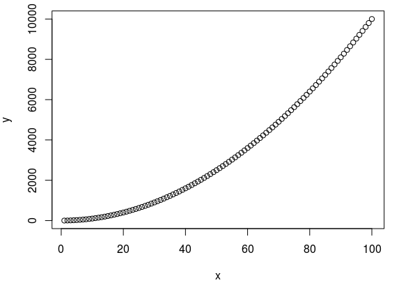
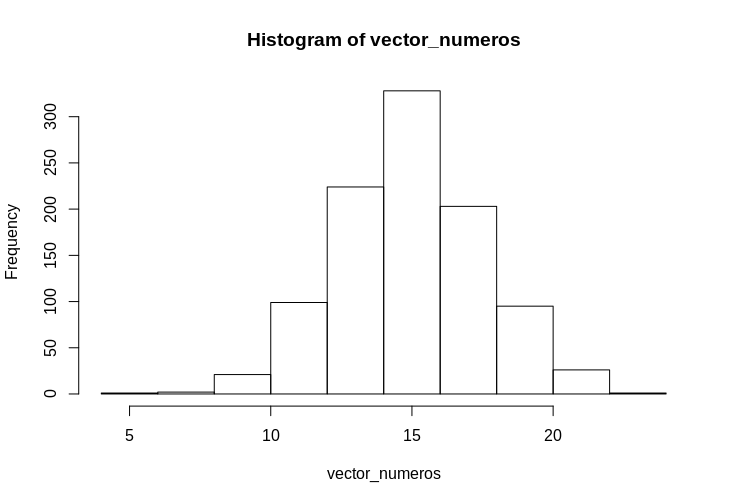

{ width="250", align="left" }

# **TPP**. Python - Programando en biología - Parte 1 { markdown data-toc-label = 'TPP' }

<br>
<br>
<br>
<br>
<br>
<br>

[:fontawesome-solid-file-powerpoint: Slides](){ .md-button .md-button--primary } 


<!--
[:fontawesome-solid-download: Materiales](#){ .md-button .md-button--primary }
Este es el botón para decargar materiales, en (#) hay que agregar el link correspondiente


### Video de la clase grabada
* :octicons-video-16: [Cierre de tp](https://youtu.be/Xa7Yq9BHczU)
-->

!!! abstract "Atención: Este TP NO tiene informe."

### Software a usar
* Python (Google Colab)

### Recursos Online
* [Google Colab - Guía de inicio](https://colab.research.google.com/notebooks/intro.ipynb#scrollTo=GJBs_flRovLc)
* [Python Tutorial (Documentación oficial)](https://docs.python.org/3/tutorial/)
* [Pandas - User Guide](https://pandas.pydata.org/docs/user_guide/index.html)
* [Pandas Cheat Sheet](https://pandas.pydata.org/Pandas_Cheat_Sheet.pdf)
* [Curso Kaggle Learn - Python](https://www.kaggle.com/learn/python)
* [Curso Kaggle Learn - Pandas](https://www.kaggle.com/learn/pandas)


### Objetivos

* Familiarizarse en el lenguaje de programación **Python**.
* Ver como los mismos conceptos de programación se transladan de un lenguaje a otro.
* Utilizar herramientas de programación para resolver problemas biológicos.

## **Introduccion a Python**

Python es actualmente uno de los lenguajes más utilizados en bioinformática, ciencia de datos e inteligencia artificial. Su popularidad se debe a su sintaxis clara y sencilla, así como a la gran cantidad de bibliotecas especializadas que ofrece para el procesamiento, análisis y visualización de datos.

## **Google Colab - Empezamos con el TP**

**Google Colab** es un entorno de desarrollo basado en la nube que permite escribir y ejecutar código en *Python* directamente desde el navegador, sin necesidad de instalar programas en la computadora. Al igual que otros **IDEs** (Integrated Development Environments), ofrece un espacio para escribir código, ejecutarlo, detectar errores (debuguear) y visualizar los resultados en un mismo lugar.

Una de las principales ventajas de **Google Colab** es que ya incluye instaladas muchas de las bibliotecas más utilizadas para el análisis de datos, como *NumPy, Pandas, Matplotlib y Seaborn*, además de permitir el uso gratuito de recursos de cómputo como GPU y TPU cuando es necesario. Asimismo, los cuadernos (notebooks) pueden compartirse fácilmente mediante un enlace, facilitando el trabajo colaborativo y la reproducción de análisis por parte de otros usuarios.

**1)** Abran Google Colab desde el navegador ( https://colab.research.google.com/) 

**2)** Creen un nuevo *notebook* haciendo click en Nuevo notebook en la parte superior

Ahora sí, deberían ver lo siguiente:

<figure markdown>

</figure>

**3)** Verificar que estemos utilizando Python. Para ejecutar código, Google Colab debe estar conectado a un entorno de ejecución. Para comprobar el lenguaje seleccionado, vayan a **Entorno de ejecución** :material-arrow-right: **Cambiar tipo de entorno de ejecución**. En la ventana que se abre, en **Tipo de entorno de ejecución** debería aparecer Python 3. Google Colab también permite ejecutar código en otros lenguajes, como por ejemplo, R. Si el entorno aún no está iniciado, hagan clic en Conectar (esquina superior derecha) para iniciar la sesión.


* **Elementos principales de Google Colab**

??? important "Celdas de código" (zona central del notebook)

    Las celdas de código contienen instrucciones en **Python**. Para ejecutarlas pueden hacer clic en el botón **▶** ubicado a la izquierda de la celda o presionar ++shift+enter++, lo que además ejecuta la celda y selecciona la siguiente.

??? important "Celdas de texto" (zona central del notebook)

    Las celdas de texto permiten escribir explicaciones, títulos o consignas usando **Markdown**. En este trabajo práctico las utilizaremos para organizar el contenido y describir los ejercicios.

??? important "Panel de variables" (zona inferior del notebook)

    En el panel **Variables** pueden ver las variables que fueron creadas durante la ejecución del notebook. Esto resulta útil para inspeccionar datos y comprobar que el código está funcionando como esperan. A veces, este panel puede no actualizarse correctamente o no mostrar todas las variables creadas. Si esto ocurre, prueben a actualizar la página (f5). Sino pueden ejecutar el siguiente comando para listar todas las variables definidas en la sesión:

    ```python
    %whos
    ```

??? important "Archivos" (barra lateral izquierda)

    En la pestaña **Archivos** pueden explorar los archivos disponibles en la sesión de Colab y subir nuevos archivos desde su computadora. Más adelante utilizaremos esta pestaña para cargar los datos que analizaremos.

??? important "Terminal" (zona inferior del notebook)

    Google Colab también dispone de una **terminal** (Bash), desde la cual es posible ejecutar comandos del sistema operativo, de forma similar a la terminal que utilizamos en los trabajos prácticos anteriores. En este trabajo práctico utilizaremoslas **celdas de código** para ejecutar programas en **Python**.

!!! tip "Guardar el notebook"

    Si modifican el notebook y desean conservar los cambios, pueden guardarlo en su cuenta de Google Drive usando **Archivo → Guardar una copia en Drive**.    

!!! tip "Reiniciar el entorno"

    Las variables creadas en una sesión permanecen en memoria hasta que el entorno se reinicia. Si obtienen resultados inesperados, una buena práctica es ejecutar **Entorno de ejecución → Reiniciar sesión** y volver a correr las celdas desde el comienzo.


### Programando en Python

Ahora que tenemos una idea de la interfaz de **Google Colab** vamos a ver como se crean los programas.


**4)** En la primera **celda de código** escriban lo siguiente y ejecútenla presionando ++shift+enter++ o haciendo clic en el botón **▶**.

```python
print("Hello World!")
```

`print` es equivalente al `echo` de **bash** y cuando lo usamos decimos que *imprimimos* a la variable. Puede ser que usemos las frases *"imprimir por terminal"*, *"imprimir por consola"*, o *"imprimir por por pantalla"* de forma intercambiable.

Como muestra el código anterior, los argumentos de una función en **Python** se escriben entre paréntesis y, si hay más de uno, se separan con comas.

Al ejecutar la celda deberían ver:

```text
Hello World!
```

**5)** Modifiquen ahora la misma celda para que imprima:

```python
print("Hola Bioinformática!")
```

Vuelvan a ejecutarla usando ++shift+enter++.

Cada vez que modifiquen una celda deberán volver a ejecutarla para que los cambios tengan efecto.

**5)** Si desean conservar los cambios realizados en el notebook, guárdenlo en su cuenta de Google Drive mediante **Archivo** :material-arrow-right: **Guardar una copia en Drive**.

A diferencia de un *script* tradicional de **Python** (archivos con extensión **.py**), un notebook de **Google Colab** guarda tanto el código como el texto explicativo, las figuras y los resultados obtenidos durante la ejecución.


## **Python: Variables**

Como dijimos cuando vimos **Bash**, diferentes lenguajes tienen elementos similares, pero se usan ligeramente diferente. Vamos a entonces a aprender como se usan las variables en **Python**.

**1)** Escriban en una celda de código la siguiente línea y ejecútenla:

```python
saludo = "Hola Mundo!"
```

En **Python**, las variables se asignan utilizando el símbolo `=`. Una vez creada una variable, podemos utilizarla simplemente escribiendo su nombre.

¿Se acuerdan del panel **Variables** que vimos al comienzo del TP? Si lo abren ahora, deberían ver la variable **saludo** junto con su valor.


**2)** En una nueva celda escriban:

```python
print(saludo)
```

La función `print()` muestra el valor de una variable por pantalla.

Al ejecutar la celda deberían obtener:

```text
Hola Mundo!
```

Al igual que en otros lenguajes, las variables permanecen almacenadas en memoria y pueden reutilizarse en las celdas siguientes sin necesidad de volver a definirlas. Esto es una gran ventaja, ya que nos permite trabajar sin tener que ejecutar todo el notebook desde el principio cada vez que hacemos un cambio.

Sin embargo, un gran poder conlleva una gran responsabilidad. Como las variables permanecen en memoria, es posible estar utilizando un valor "viejo" si modificamos el código pero no volvemos a ejecutar la celda correspondiente. Esto puede generar resultados inesperados y hacer más difícil encontrar errores.

Por esta razón, una buena práctica es ejecutar las celdas del notebook en orden, de arriba hacia abajo, para asegurarse de que todas las variables tengan el valor esperado.

También es buena práctica comentar las instrucciones más importantes para que el código pueda ser entendido y reutilizado por otras personas. Es algo así como el **cuaderno de laboratorio bioinformático**.

En un notebook también es posible mostrar el contenido de una variable escribiendo únicamente su nombre:

```python
saludo
```

Ambas celdas mostrarán el contenido de la variable. Sin embargo, cuando escribimos programas es recomendable utilizar `print()` para dejar explícito que queremos mostrar ese resultado.

La función `print()` también puede recibir varios argumentos, separados por comas. En ese caso, **Python** los imprime uno a continuación del otro, separados por un espacio.

Por ejemplo:

```python
numero = 42

print(numero, "es un número")

### Comentarios

Los comentarios en **Python** se hacen de la misma forma que en **Bash**, ignorando todo lo que está después de un `#`.

```python
saludo = "Hola Mundo!"
# saludo = "Esto no va a hacer nada"

print(saludo)  # print("Esto tampoco")
```

Los comentarios son muy útiles para explicar qué hace una parte del código o dejar notas para uno mismo o para otras personas que vayan a reutilizar el programa.

!!! tip "Tip - Comentar en masa"

    Es posible comentar o descomentar varias líneas de código al mismo tiempo. Para ello, seleccionen las líneas que desean comentar y presionen ++ctrl+/++.

### Números

En **Python** existen dos tipos principales de variables numéricas: los números enteros (**int**) y los números reales (**float**).

**3)** Ejecuten el siguiente código celda por celda y observen cómo se va modificando el valor de la variable **n**.

```python
n = 2  # n es una variable de tipo int

# Podemos realizar diferentes operaciones matemáticas
n = ((n + 2) * 2) ** 2

n = ((n - 2) / 2) ** (1/2)

print(n)
```

Observen que el valor final de **n** ya no es un número entero sino un número real.

!!! tip "Tip - Averiguar el tipo de una variable"

    Si no saben de qué tipo es una variable, pueden utilizar la función `type()`, la cual devuelve el tipo de la variable. Por ejemplo:

    ```python
    print(type(n))
    ```

### Cadenas de caracteres o *Strings* { markdown data-toc-label='Cadenas de caracteres' }  

En **Python** las cadenas de caracteres, comúnmente llamadas *strings*, tienen el tipo de variable **str**.
En Python, las cadenas de caracteres (strings) se representan mediante texto encerrado entre comillas. Pueden utilizarse tanto comillas simples ('...') como comillas dobles ("..."), y ambas son equivalentes. La elección suele depender del estilo o de si la cadena contiene comillas del otro tipo.

**4)** Ejecuten las siguientes celdas, lean los comentarios y observen cómo se va modificando el valor de la variable **frase**.

=== "Código"

    ```python
    frase = "Había"

    frase = frase + " una"

    frase = frase + " vez"

    frase = frase + "..."

    print(frase)
    ```

=== "Código con comentarios"

    ```python
    frase = "Había"   # frase es una variable de tipo str

    # Podemos concatenar strings utilizando el operador +
    frase = frase + " una"

    # Agregamos otra palabra, incluyendo un espacio al comienzo
    frase = frase + " vez"

    # Agregamos tres puntos, sin espacio entre "vez" y los puntos
    frase = frase + "..."

    print(frase)
    ```

En **Python**, muchas operaciones sobre *strings* se realizan mediante **métodos**, es decir, funciones asociadas al propio *string*. Que se invocan escribiendo un punto (.) después del nombre de la variable. Por ejemplo, podemos convertir un texto a mayúsculas, reemplazar caracteres o contar cuántas veces aparece una palabra.

```python
frase.upper()

frase.replace("Había", "Existe")

frase.count("a")
```

Se pueden hacer muchas más cosas con *strings*, como extraer partes del texto (*substrings*), buscar si una palabra aparece dentro de otro texto o dividir un *string* en varias partes. Iremos aprendiendo estas herramientas a medida que las necesitemos.

## ✏️**Ejercicio 1 - Variables simples** { markdown data-toc-label='Ejercicio 1 - Variables' }

En este ejercicio vamos a practicar el uso de variables numéricas y *strings* en **Python**.

1. Creen dos variables numéricas, asígnenles un valor e impriman el resultado de realizar su suma. Luego hagan lo mismo pero con resta y multiplicación.

2. Asignen el valor `0` a una nueva variable e intenten dividir uno de los números anteriores por ella.
    * ¿Qué ocurre? ¿Cómo informa Python este error?

3. Creen una variable de tipo *string* que represente una secuencia de ADN. Luego:

* Impriman la longitud de la secuencia utilizando la función `len()`.
* Cuenten cuántas veces aparece la base `"A"` utilizando el método `count()`.
* Generen la secuencia de ARN reemplazando todas las `T` por `U` utilizando el método `replace()`.

## **Listas**

En **Python**, una de las estructuras de datos más utilizadas es la **lista** (*list*). Una lista es una colección ordenada de elementos, que se escriben entre corchetes (`[]`) y cuyos elementos se separan con comas.

Las listas pueden contener elementos de distintos tipos, aunque en bioinformática es habitual trabajar con listas cuyos elementos son todos del mismo tipo.

```python
# Lista con strings
lista_frase = ["Había", "una", "vez..."]

# Lista con números
lista_numeros = [1,2,3,4,5,6,7,8,9,10]

# También podemos crear una lista usando range()
lista_rango = list(range(1,11))

# Es posible combinar listas
lista_hueco = list(range(1,4)) + list(range(7,11))
```

**1)** Ejecuten el código anterior y luego prueben las siguientes instrucciones.

```python
print(lista_frase)

print(lista_numeros)

print(lista_frase[1])

print(lista_numeros + [11, 12])
```

Como pueden ver, es posible acceder a un elemento individual de la lista utilizando corchetes.

!!! info "Índices"

    En **Python**, el primer elemento de una lista tiene índice **0**. Por ejemplo, `lista_frase[0]` devuelve `"Había"`, mientras que `lista_frase[1]` devuelve `"una"`.

    Si ya programaron en otros lenguajes, tengan presente que no todos utilizan la misma convención para numerar los elementos de una colección.

Las listas de **Python** pueden contener elementos de distintos tipos:

```python
lista_mixta = [1, 2, "asd"]

print(lista_mixta)

print(type(lista_mixta[0]))
print(type(lista_mixta[2]))
```

Cada elemento conserva su tipo original. Sin embargo, si intentamos realizar operaciones incompatibles obtendremos un error. Por ejemplo, no tiene sentido sumar un número con un *string*.

```python
print(lista_mixta[0] + lista_mixta[1])  # válido

print(lista_mixta[0] + lista_mixta[2])  # error

print(lista_mixta[2] + 3)               # error
```

## **Diccionarios**

Otra estructura de datos muy utilizada en **Python** es el **diccionario** (*dictionary*). Un diccionario almacena pares **clave-valor** (*key-value*), donde cada clave identifica un valor asociado.

Se crean utilizando llaves (`{}`) y cada par clave-valor se separa con dos puntos (`:`).

```python
gen = {
    "nombre": "TP53",
    "esencial": True,
    "expresion": 5234
}
```

Podemos acceder a un valor indicando su clave entre corchetes:

```python
print(gen["nombre"])

print(gen["expresion"])
```

```text
TP53
5234
```

Los diccionarios son muy útiles para representar información de un único objeto. Por ejemplo, los datos de un gen, una proteína o un paciente, donde cada característica tiene un nombre asociado.

## **R: Estructuras lógicas**

### Condicionales y Booleanos

De igual forma que en **Bash**, en **R** también existen los condicionales *ifs*, pero se escriben ligeramente diferente:

=== "Código"

    ```R
    numero <- 42

    print(paste(numero, "es un numero"))

    if (numero > 10) {
        print(paste(numero, "es mayor a 10"))    
    } else {
        print(paste(numero, "es menor o igual a 10"))
    }
    ```

=== "Código con comentarios"

    ```R
    numero <- 42

    print(paste(numero, "es un numero"))

    # *if* es la estructura más usada para condicionales.
    # Adentro de los paréntesis va la condición.
    # > es el comparador, o sea, estamos preguntando si la variable *numero* es mayor que 10
    if (numero > 10) {
        # El codigo entre *{* y el primer *}* solo si ejecuta si la condición es verdad, de otra forma se saltea
        # Este codigo esta más a la derecha, o *indentado*. Esto se hace con tab y en la mayoría de los lenguajes
        # es solo para entender más fácil el código (RStudio lo va a hacer automáticamente de pegar código)
        print(paste(numero, "es mayor a 10"))    
    } else {
        # El código entre *else {* y *}* se ejecuta solo cuando la condición no es verdad
        print(paste(numero, "es menor o igual a 10"))
    }
    # Este *}* indica donde termina el condicional
    ```

Es bastante similar a lo que conocían, pero acá no esta *then* ni *fi* y los diferentes bloques lógicos se marcan con llaves (en **R** esto también va a pasar en *fors* y en muchas otras estructuras).

Las condiciones del *if* existen más alla de los condicionales y de hecho la comparación `numero > 10` es una variable en sí misma. A estas variables las vamos a llamar **booleanos** y pueden tener 1 de 2 valores: o **TRUE** (verdadero) o **FALSE** (falso).

Hay 3 formas principales de generar variables booleanas:

```R
# Dándoles el valor TRUE o FALSE a mano
booleano1 <- TRUE

# Usando un comparador, en este caso el *>*
numero1 <- 5
booleano2 <- numero1 > 10

# Combinando booleanos con operadores lógicos, en este caso con *and*
booleano3 <- booleano1 & booleano2
```

Como mostramos en la tercer forma de generar variables booleanas, se pueden hacer operaciones entre los booleanos usando la llamada **algebra booleana**. Esto es un mundo en sí mismo, pero por suerte al momento de programar solo nos van a importar las tres operaciones básicas de la algebra booleana: el **AND**, el **OR** y el **NOT**.

El **AND** y el **OR** son operaciones entre dos booleanos, mientras que **NOT** es una operación que se le aplica a un solo booleano.

* El **AND** es el **"Y"**, devolviendo **TRUE**{ .green_text } solo cuando ambos booleanos eran **TRUE**{ .green_text }. Se escribe en **R** con **&**
* El **OR** es el **"O"**, devolviendo **TRUE**{ .green_text } cuando por lo menos uno de ambos booleanos era **TRUE**{ .green_text }. Se escribe en **R** con **|** (*pipe*)
* El **NOT** es el **"NO"**, invirtiendo el valor del booleano (o sea, devuelve **TRUE**{ .green_text } solo si el booleano era **FALSE**{ .red_text }). Se escribe en **R** con **!**

??? tip "Detalles de **AND**, **OR** y **NOT**"

    | Booleano1 { data-sort-method='none' } | Booleano2 { data-sort-method='none' } | AND (Booleano1 & Booleano2) { data-sort-method='none' } | OR (Booleano1 \| Booleano2) { data-sort-method='none' } |
    | :---: | :---: | :---: | :---: |
    | **TRUE**{ .green_text } | **TRUE**{ .green_text } | **TRUE**{ .green_text } | **TRUE**{ .green_text } |
    | **TRUE**{ .green_text } | **FALSE**{ .red_text } | **FALSE**{ .red_text } | **TRUE**{ .green_text } |
    | **FALSE**{ .red_text } | **TRUE**{ .green_text } | **FALSE**{ .red_text } | **TRUE**{ .green_text } |
    | **FALSE**{ .red_text } | **FALSE**{ .red_text } | **FALSE**{ .red_text } | **FALSE**{ .red_text } |

    | Booleano1 { data-sort-method='none' } | NOT (!Booleano1) { data-sort-method='none' } |
    | :---: | :---: |    
    | **TRUE**{ .green_text } | **FALSE**{ .red_text } |
    | **FALSE**{ .red_text } | **TRUE**{ .green_text } |

Las variables booleanas se pueden usar directamente en las condiciones de los *ifs*. Si bien se pueden comparar contra **TRUE**{ .green_text } y **FALSE**{ .red_text }, de poner solo la variable en la condición del *if*, es equivalente a preguntar si esa variable es **TRUE**{ .green_text }. Vean las siguientes tres pestañas para entenderlo mejor:

=== "Código"

    ```python
    llueve = True
    tengo_paraguas = True

    if llueve and not tengo_paraguas:
        print("Me mojo")
    else:
        print("No me mojo")
    ```

=== "Código con comentarios"

    ```python
    llueve = True
    tengo_paraguas = True

    # Solo entra si llueve y NO tengo paraguas
    if llueve and not tengo_paraguas:
        print("Me mojo")
    else:
        print("No me mojo")
    ```

### Ciclos

#### Ciclo *For*

En **Python**, los ciclos `for` permiten recorrer los elementos de una colección (como una lista) o una secuencia de números. Se escriben de la siguiente forma:

=== "Código"

    ```python
    for i in range(1, 11):
        print(i)
    ```

=== "Código con comentarios"

    ```python
    # for es una de las estructuras más usadas para hacer ciclos.

    # i es el nombre de la variable que va cambiando en cada iteración.
    # Podríamos llamarla de cualquier otra forma, por ejemplo numero,
    # pero por convención suele llamarse i.

    # range(1, 11) genera una secuencia con los números del 1 al 10.
    # El segundo número (11) no está incluido.
    for i in range(1, 11):
        # Todo el código indentado se ejecuta una vez por cada valor de i.
        print(i)
    ```

En este caso, el `for` recorre una secuencia de números del **1** al **10** e imprime el valor de `i` en cada iteración.

También podemos recorrer directamente los elementos de una lista previamente declarada:

=== "Código"

    ```python
    lista_colores = ["rojo", "amarillo", "verde"]

    for color in lista_colores:
        print(color)
    ```

=== "Código con comentarios"

    ```python
    lista_colores = ["rojo", "amarillo", "verde"]

    for color in lista_colores:
        # color es la variable que va cambiando en cada iteración del for
        # En este caso va tomando los valores de los diferentes elementos
        # de la lista lista_colores.
        print(color)
    ```

!!! tip "La función `range()`"

    La función `range(inicio, fin)` genera una secuencia de números que comienza en `inicio` y termina en `fin - 1`. Es decir, el segundo valor **no está incluido**.

    Por ejemplo:

    * `range(1, 6)` genera los números **1, 2, 3, 4 y 5**.
    * `range(5)` genera los números **0, 1, 2, 3 y 4**.
    
#### Ciclo *While*

El ciclo `for` es muy útil, pero tiene la limitación de que generalmente conocemos de antemano cuántas iteraciones va a realizar. Sin embargo, esto no siempre es posible. Para esos casos existe el ciclo `while`, que repite un bloque de código **mientras** se cumpla una determinada condición.

=== "Código"

    ```python
    contador = 1

    while contador <= 10:
        print(contador)

        contador = contador + 1
    ```

=== "Código con comentarios"

    ```python
    # Declaramos una variable contador con el valor 1
    contador = 1

    # Todo el código indentado debajo del while se ejecutará
    # mientras la condición contador <= 10 sea True.
    while contador <= 10:
        # Imprimimos el valor de contador
        print(contador)

        # Aumentamos el valor de contador en una unidad
        contador = contador + 1
    ```

Tal vez no se den cuenta, pero este programa hace exactamente lo mismo que el `for` del ejemplo anterior. La variable `contador` comienza valiendo **1** y al finalizar cada iteración aumenta en una unidad. Cuando `contador` llega a **11**, la condición `contador <= 10` deja de cumplirse, el ciclo termina y el número **11** nunca llega a imprimirse.

En este caso no tendría mucho sentido utilizar un ciclo `while`, ya que el mismo problema puede resolverse fácilmente con un `for`. Sin embargo, el `while` resulta muy útil cuando no sabemos de antemano cuántas iteraciones serán necesarias.

Por ejemplo, si queremos imprimir las potencias de 2 menores que **1000**:

=== "Código"

    ```python
    numero = 1

    while numero < 1000:
        print(numero)

        numero = numero * 2
    ```

=== "Código con comentarios"

    ```python
    # Declaramos una variable numero con el valor 1 (2⁰)
    numero = 1

    # El ciclo continuará mientras numero sea menor que 1000
    while numero < 1000:
        # Imprimimos el valor actual
        print(numero)

        # Multiplicamos numero por 2 para obtener
        # la siguiente potencia de 2
        # 2¹ = 2
        # 2² = 4
        # 2³ = 8
        # 2⁴ = 16
        # etc.
        numero = numero * 2
    ```

Si bien también existen formas de resolver este último ejemplo utilizando un `for`, el objetivo es mostrar que un ciclo `while` permite repetir una acción una cantidad **indeterminada** de veces, dependiendo del resultado de una condición.

!!! danger "Loops infinitos"

    Al utilizar un ciclo `while` hay que tener cuidado de no escribir un programa que genere un **loop infinito**, es decir, un ciclo cuya condición nunca deje de ser **True**.

    Si esto ocurre, el programa continuará ejecutándose indefinidamente hasta que lo interrumpamos manualmente. En el ejemplo anterior esto sucedería si olvidáramos actualizar el valor de `numero` dentro del ciclo.

## ✏️**Ejercicio 2 - Estructuras lógicas** { markdown data-toc-label='Ejercicio 3 - Estructuras lógicas' }

El objetivo de este ejercicio es escribir un programa en **Python** que:

* Cree una variable llamada `resultado` y le asigne el valor `0`.
* Cree un ciclo `for` que recorra los números del **1** al **50**.
* En cada iteración, sume o reste el valor de `i` a `resultado` según corresponda:
    * Para todo `i` menor que **5** o mayor que **47** :material-arrow-right: Restarle `i` a `resultado`.
    * Para todo `i` mayor que **20** y menor que **30** :material-arrow-right: Sumarle `i` a `resultado`.
* Imprima el valor final de `resultado`.

!!! tip "Tip"

    Para resolver este ejercicio van a necesitar combinar un ciclo `for` con una o más estructuras `if`, utilizando los operadores lógicos `and` y `or`.

## ✏️**Ejercicio 3 - Estructuras lógicas** { markdown data-toc-label='Ejercicio 3 - Contenido GC' }

El contenido GC es la proporción de bases **G** y **C** presentes en una secuencia de ADN.

Creen una variable llamada `secuencia` que contenga la siguiente secuencia:

```text
ATGCGATCGGATTAACGCGCTT
```

Luego escriban un programa que:

* Cree una variable llamada `gc` con valor `0`.
* Recorra la secuencia utilizando un ciclo `for`.
* Si la base es `"G"` o `"C"`, aumente `gc` en `1`.
* Imprima la cantidad total de bases **G** o **C** presentes en la secuencia.

!!! tip "Tip"

    Van a necesitar combinar un ciclo `for` con una estructura `if` utilizando el operador lógico `or`.
-->

<!--
Resolucion Ejercicio 3 contenido GC 
secuencia = "ATGCGATCGGATTAACGCGCTT"

gc = 0

for base in secuencia:
    if base == "G" or base == "C":
        gc = gc + 1

print(gc)
-->


## **Python: Funciones**

Como ya mencionamos cuando hablamos de los ciclos, es común en programación querer realizar una tarea muchas veces con datos ligeramente diferentes. Para evitar repetir código existen las **funciones**, que además de formar parte de **Python** y de las distintas librerías, también pueden ser creadas por nosotros.

Supongamos que por alguna razón es frecuente calcular la función $y = 2x + x^2$. Podemos definir una función de la siguiente forma:

```python
def my_function(x):
    output = 2 * x + x ** 2

    return output

x1 = 5
x2 = 7

y1 = my_function(x1)
y2 = my_function(x2)

print(y1)
print(y2)
```

En este ejemplo:

* `def` indica que estamos definiendo una función.
* `my_function` es el nombre de la función.
* `x` es el parámetro de entrada.
* `return` indica cuál será el valor que devolverá la función.

Si bien en este caso puede no parecer muy útil, las funciones permiten reutilizar código y evitar escribir varias veces las mismas instrucciones. Imaginen que el cálculo ocupara 20 o 30 líneas de código: con una función solo habría que escribirlo una vez.

También es posible definir funciones con más de un parámetro. Incluso algunos parámetros pueden tener un **valor por defecto**, que será utilizado si no indicamos otro valor.

```python
def my_function(x, exp=2):
    output = 2 * x + x ** exp

    return output

x1 = 5
x2 = 7

# El parámetro exp tiene por defecto el valor 2.
# Estas dos líneas devuelven el mismo resultado.

y1 = my_function(x1)
y2 = my_function(x1, exp=2)

print(y1)
print(y2)

y3 = my_function(x2, exp=4)

print(y3)
```

Como pueden ver, si no especificamos el parámetro `exp`, **Python** utiliza automáticamente su valor por defecto (`2`). Sin embargo, podemos modificarlo cuando llamamos a la función.


## **Librerías**

Hasta ahora trabajamos únicamente con funciones y estructuras que forman parte de **Python**. Sin embargo, una de las mayores fortalezas del lenguaje es la enorme cantidad de **librerías** desarrolladas por la comunidad.

Una **librería** es un conjunto de funciones y herramientas escritas por otras personas que podemos reutilizar en nuestros programas. En lugar de escribir todo desde cero, simplemente cargamos la librería y utilizamos sus funciones.

Por ejemplo:

* **pandas** permite trabajar con tablas de datos.
* **numpy** agrega herramientas para realizar cálculos numéricos de forma eficiente.
* **matplotlib** permite crear gráficos.
* **scikit-learn** proporciona algoritmos y herramientas para *Machine Learning*.
* **BioPython** incluye funciones específicas para bioinformática.

### Instalar librerías

Las librerías pueden instalarse utilizando el gestor de paquetes **pip**. Por ejemplo, para instalar **pandas** desde una terminal se utiliza:

```bash
pip install pandas
```

Esta instalación solo es necesaria una vez por computadora.

!!! tip "Google Colab"

    Google Colab ya incluye instaladas muchas de las librerías más utilizadas para ciencia de datos y bioinformática, entre ellas **pandas**, **numpy**, **matplotlib** y **scikit-learn**. Por lo tanto, en este curso normalmente no será necesario instalarlas.

### Importar librerías

Aunque una librería ya esté instalada, es necesario **importarla** en cada notebook donde vayamos a utilizarla.

La forma más común de hacerlo es mediante la instrucción `import`. Por ejemplo:

```python
import pandas
```

A partir de ese momento podremos utilizar todas las funciones y herramientas de esa librería escribiendo su nombre seguido de un punto (`.`). Por ejemplo:

```python
pandas.DataFrame(...)
```

Como escribir el nombre completo de la librería muchas veces puede resultar incómodo, **Python** permite asignarle un **alias**, es decir, un nombre más corto que utilizaremos durante el resto del programa.

Esto se hace con la palabra `as`:

```python
import pandas as pd
```

En este ejemplo, `pd` es simplemente un alias de `pandas`. Por lo tanto, las siguientes instrucciones son equivalentes:

```python
pandas.DataFrame(...)
```

```python
pd.DataFrame(...)
```

El uso de alias es muy común en **Python** y facilita la escritura del código. Algunas convenciones ampliamente utilizadas son:

```python
import pandas as pd
import numpy as np
import matplotlib.pyplot as plt
```

## **NumPy: Arrays**

Hasta ahora trabajamos con **listas**, que son una de las estructuras de datos más utilizadas en **Python**. Sin embargo, cuando queremos realizar cálculos numéricos sobre grandes cantidades de datos (como suele ocurrir en bioinformática), las listas no son la herramienta más eficiente.

Para este tipo de tareas existe la librería **NumPy**, que proporciona un tipo de dato llamado **array**. Un array es similar a una lista, pero está optimizado para almacenar grandes cantidades de datos del mismo tipo y realizar operaciones matemáticas de forma muy eficiente.

### Crear arrays

Los arrays pueden crearse de distintas maneras. Una de las más comunes es utilizando la función `array()`.

```python
import numpy as np

vector = np.array([1, 2, 3, 4, 5])

print(vector)
```

También podemos crear secuencias de números utilizando `arange()`:

```python
vector = np.arange(1, 11)

print(vector)
```

```text
[ 1  2  3  4  5  6  7  8  9 10]
```

### Operaciones matemáticas

Una de las principales ventajas de los arrays es que las operaciones matemáticas se realizan **elemento a elemento**.

```python
vector = np.arange(1, 6)

print(vector + 2)

print(vector * 3)

print(vector ** 2)
```

```text
[3 4 5 6 7]

[ 3  6  9 12 15]

[ 1  4  9 16 25]
```

Este comportamiento es muy similar al de los vectores de **R**.

### Funciones sobre arrays

NumPy también incluye muchas funciones matemáticas que trabajan directamente sobre arrays.

```python
print(np.mean(vector))

print(np.max(vector))

print(np.min(vector))
```

```text
3.0

5

1
```

Muchas funciones de **NumPy** aceptan arrays como entrada y devuelven otro array como resultado, lo que permite escribir programas muy compactos y eficientes.

!!! info "Listas vs Arrays"

    Las listas son estructuras generales de **Python** que pueden contener elementos de distintos tipos. Los arrays de **NumPy**, en cambio, están pensados para trabajar con datos numéricos y suelen ser mucho más rápidos al realizar cálculos matemáticos

## **Python: Tablas**

Hasta ahora vimos variables simples (como números y *strings*) y listas. Sin embargo, en bioinformática es muy común trabajar con **tablas**.

En **Python**, la librería más utilizada para trabajar con tablas es **pandas**. Las tablas de pandas reciben el nombre de **DataFrames**.

### Crear un DataFrame

```python
import pandas as pd # Esto carga la librería pandas para trabajar con las tablas

genes = ["ERT2", "TTR4", "REC1"]
esencial = [False, False, True]
expresion = [100, 1000, 10000]

df = pd.DataFrame({
    "gen": genes,
    "esencial": esencial,
    "expresion": expresion
})
```

Aca estamos creando un DataFrame llamado df que contiene 3 columnas, **gen**, **esencial** y **expresion**, cada una conteniendo una lista de valores. Es importante notar que todas las listas deben tener la misma longitud, ya que el primer elemento de cada una corresponde a la primera fila de la tabla, el segundo elemento a la segunda fila y así sucesivamente.

!!! tip "Tip"

    Observen que el contenido del `DataFrame()` está distribuido en varias líneas. En Python esto es completamente válido siempre que el código permanezca dentro de los paréntesis. Es una práctica muy recomendable cuando una función tiene muchos argumentos, ya que facilita la lectura del código.

Podemos visualizar el contenido del DataFrame escribiendo simplemente:

```python
print(df)
```

```python
   gen esencial expresion
0 ERT2    FALSE       100
1 TTR4    FALSE      1000
2 REC1     TRUE     10000
```

### Acceder a columnas

Podemos acceder a una columna indicando su nombre entre corchetes:

```python
print(df["gen"])
```

```text
0    ERT2
1    TTR4
2    REC1
Name: gen, dtype: object
```
df["gen"] ya no es un DataFrame sino una Serie (Series), que representa una única columna de la tabla.

### Acceder a filas

Para acceder a una fila utilizaremos `iloc` (*integer location*). `iloc` permite acceder a las filas y columnas utilizando su **posición numérica**.

```python
print(df.iloc[0])
```

```text
gen            ERT2
esencial      False
expresion      100
Name: 0, dtype: object
```

Por ejemplo, `df.iloc[0]` devuelve la primera fila. Y `df.iloc[2]` devuelve la tercera fila del DataFrame.

!!! info "iloc y loc"

    En este TP utilizaremos `iloc`, que accede a las filas mediante su posición (0, 1, 2, ...).

    También existe `loc`, que permite acceder a las filas utilizando sus etiquetas o índices.

### Resumen de la tabla

Otra función muy útil es `info()`, que devuelve información general sobre la tabla:

```python
df.info()
```

Entre otras cosas, muestra:

* La cantidad de filas y columnas.
* El nombre de cada columna.
* El tipo de dato de cada columna.

También podemos utilizar `describe()`, que calcula distintos estadísticos para las columnas numéricas:

```python
df.describe()
```

Esta función devuelve información como el mínimo, máximo, promedio, desvío estándar y distintos percentiles.

### Escribir tablas

Para guardar un DataFrame utilizaremos la función `to_csv()`. Por ejemplo:

```python
df.to_csv("genes.tsv", sep="\t", index=False)
```

Los parámetros utilizados son:

* `df` es el DataFrame que queremos guardar.
* `"genes.tsv"` es el nombre del archivo de salida. Generalmente tendrá extensión **.tsv** si las columnas están separadas por tabulaciones o **.csv** si están separadas por comas.
* `sep="\t"` indica que las columnas estarán separadas por tabulaciones.
* `index=False` evita guardar la numeración de las filas como una columna adicional.

**1)** Guarden el DataFrame creado anteriormente con el nombre **genes.tsv**.

Confirmen que el archivo fue creado correctamente desde la pestaña **Archivos** de Google Colab.

### Leer tablas

Para leer una tabla utilizaremos la función `read_csv()`. Por ejemplo:

```python
nuevo_df = pd.read_csv("genes.tsv", sep="\t")
```

Los parámetros utilizados son:

* `"genes.tsv"` es el nombre del archivo a leer. Si se trata de un *path* absoluto se leerá desde esa ubicación; si es un *path* relativo, será relativo al directorio actual.
* `sep="\t"` indica cuál es el separador utilizado entre las columnas del archivo.

**2)** Creen una variable llamada **nuevo_df** y carguen la tabla creada en el punto anterior. Utilicen `print()` para confirmar que el archivo se leyó correctamente.

## ✏️**Ejercicio 4 - Tablas** { markdown data-toc-label='Ejercicio 4 - Tablas' }

1. Creen una lista con los nombres de 5 genes (por ejemplo: "TP53", "BRCA1", "ACTB", "GAPDH", "MYC") y otra lista con sus niveles de expresión (pueden ser números entre 1 y 100).
2. Utilicen esas listas para crear un DataFrame con dos columnas llamadas gen y expresion.
    1. La columna **gen** deberá contener los nombres de los genes (*strings*).
    2. La columna **expresion** deberá contener los niveles de expresión (*numeros*).
3. mpriman por pantalla todos los valores de la columna **gen**.
4. Impriman por pantalla la tercera fila de la tabla.
5. Impriman por pantalla el valor de expresion correspondiente a la cuarta fila.


## **Visualización de datos con matplotlib**

Una de las librerías más utilizadas para crear gráficos en **Python** es **matplotlib**. En particular, utilizaremos el módulo `pyplot`, que suele importarse con el alias `plt`:

```python
import matplotlib.pyplot as plt
```

### Scatter plot

**1)** Escriban y ejecuten el siguiente código:

```python
import numpy as np
import matplotlib.pyplot as plt

x = np.arange(1, 101)
y = x ** 2

plt.scatter(x, y)
plt.show()
```

Si todo funcionó correctamente debería aparecer un gráfico donde cada punto representa un par de valores `(x, y)`. Este tipo de gráfico se conoce como **scatter plot** o **gráfico de dispersión**.

<figure markdown>

</figure>

En este ejemplo:

* `plt.scatter()` crea el gráfico.
* `x` contiene los valores del eje horizontal.
* `y` contiene los valores del eje vertical.
* `plt.show()` muestra el gráfico en pantalla.

### Histograma

**2)** Ejecuten ahora el siguiente código:

```python
import numpy as np

vector_numeros = np.random.normal(
    loc=15,
    scale=2.5,
    size=1000
)

plt.hist(vector_numeros)
plt.show()
```

La función `np.random.normal()` genera números aleatorios que siguen una distribución normal. En este ejemplo crea 1000 valores con media 15 y desvío estándar 2.5.

La función `plt.hist()` construye un **histograma**, mostrando la frecuencia con la que aparecen los distintos valores.

<figure markdown>

</figure>

### Personalizar un gráfico

Podemos modificar distintos aspectos del gráfico utilizando otras funciones de `matplotlib`.

Por ejemplo:

```python
plt.scatter(x, y)

plt.title("x²")
plt.xlabel("x")
plt.ylabel("y")

plt.show()
```

También podemos cambiar el color de los puntos:

```python
plt.scatter(x, y, color="red")

plt.show()
```

### Guardar un gráfico

Una vez creado el gráfico, podemos guardarlo directamente desde el código utilizando:

```python
plt.savefig("grafico.png")
```

También es posible cambiar el formato del archivo:

```python
plt.savefig("grafico.svg")

plt.savefig("grafico.pdf")
```

!!! tip "Tip"

    Es recomendable llamar a `plt.savefig()` **antes** de `plt.show()`, ya que algunas versiones de **matplotlib** limpian la figura luego de mostrarla.

    ### Graficar datos de una tabla

Muchas veces los datos que queremos visualizar se encuentran en un **DataFrame**.

Por ejemplo:

```python
import pandas as pd
import matplotlib.pyplot as plt

df = pd.read_csv(
    "https://raw.githubusercontent.com/mwaskom/seaborn-data/master/iris.csv"
)

plt.scatter(
    df["sepal_length"],
    df["petal_length"]
)

plt.xlabel("Sepal Length")
plt.ylabel("Petal Length")
plt.title("Sepal vs Petal Length")

plt.show()
```

## ✏️**Ejercicio 5 - Plots** { markdown data-toc-label='Ejercicio 5 - Plots' }

Para valores enteros de `x` entre **1** y **200**, calculen el `y` correspondiente a una recta con pendiente **3** y ordenada al origen **5**.

1. Grafiquen los puntos utilizando `plt.scatter()`.
2. Agreguen un título y etiquetas a ambos ejes.
3. Guarden el gráfico en formato **SVG**.

<div style="border-bottom: 3px solid black;">

</div>

## ✏️**Ejercicio Adicional 1** { markdown data-toc-label='Ejercicio Adicional 1' }

En este ejercicio vamos a comprobar si los números aleatorios de **Python** se comportan como esperamos. Para ello escriban un programa que:

* Tire una moneda.
* Anote si salió **Cara** o **Seca**.
* Repita los pasos anteriores hasta obtener **100 caras** o **100 secas** (es decir, repita el proceso **mientras** no haya alcanzado alguna de esas dos cantidades).
* Imprima por pantalla cuántas caras y cuántas secas obtuvo.

Para simular el lanzamiento de una moneda pueden utilizar la función `choice()` de la librería `random`:

```python
import random

moneda = random.choice(["Cara", "Seca"])
```

Cada vez que ejecuten esa línea, la variable `moneda` tomará aleatoriamente el valor `"Cara"` o `"Seca"`.

Ejecuten el programa varias veces y observen si los resultados parecen razonables.

<!--
###Solución
```python
import random

# Contadores de caras y secas
caras = 0
secas = 0

# Repetimos el proceso mientras no hayamos obtenido
# 100 caras ni 100 secas
while caras < 100 and secas < 100:

    # Tiramos la moneda al azar
    moneda = random.choice(["Cara", "Seca"])

    # Actualizamos el contador correspondiente
    if moneda == "Cara":
        caras = caras + 1
    else:
        secas = secas + 1

# Mostramos el resultado final
print("Caras:", caras)
print("Secas:", secas)
```
-->

## ✏️**Ejercicio Adicional 2** { markdown data-toc-label='Ejercicio Adicional 2' }

En este ejercicio vamos a crear una función que describa un protocolo sencillo de **PCR**.

Escriban un programa que:

* Defina una función.
* Reciba como parámetros:
    * La temperatura de alineamiento (*annealing*).
    * La cantidad de ciclos de PCR.
* Imprima por pantalla un protocolo simplificado indicando:
    * Desnaturalización a **95 °C**.
    * Alineamiento a la temperatura indicada.
    * Extensión a **72 °C**.
    * La cantidad total de ciclos.

Prueben llamar a la función utilizando distintas temperaturas de alineamiento y diferentes cantidades de ciclos.

## **Bibliografía**

<!--
### :material-bookshelf: Libros
* Libro 1
* Libro 2
-->

<!--
### :material-web: Online
* Documentación oficial de Python: https://docs.python.org/3/
* Tutorial oficial de Python: https://docs.python.org/3/tutorial/
-->

### :material-console-line: Consola de Python
* Comando `help()`

